# SpringMVC 核心原理详解

## 一、概述

### 1.1 什么是 SpringMVC

SpringMVC 是 Spring 框架的核心 Web 模块，基于经典的 **MVC（Model-View-Controller）设计模式**，通过**前端控制器模式**统一处理 HTTP 请求。

**MVC 设计模式的职责划分：**
- **Model（模型）**：封装业务数据与核心业务逻辑（由 Service、Repository 等组成）
- **View（视图）**：负责页面渲染（如 JSP、Thymeleaf、HTML），展示 Model 中的数据
- **Controller（控制器）**：接收 HTTP 请求，调用 Model 处理业务，选择 View 返回响应

### 1.2 核心设计思想

SpringMVC 采用**前端控制器模式**，核心思想是：

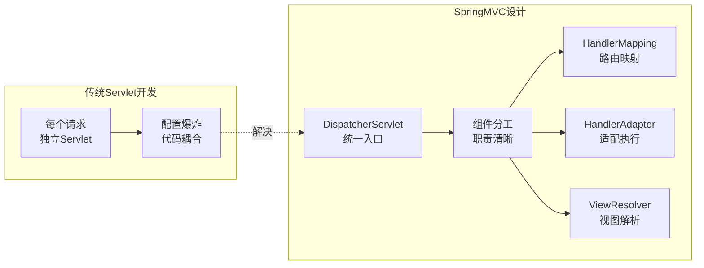

**前端控制器模式的优势：**
- **集中式调度**：DispatcherServlet 作为统一入口，避免每个请求单独配置 Servlet
- **组件化分工**：各组件各司其职，符合"高内聚、低耦合"原则
- **灵活可扩展**：组件通过接口定义，支持自定义实现替换

---

## 二、SpringMVC 两种工作模式

SpringMVC 支持两种工作模式，分别适用于不同的应用场景。

### 2.1 传统 MVC 模式（服务端渲染）

**特点：** 后端负责渲染完整的 HTML 页面，每次操作刷新整个页面。

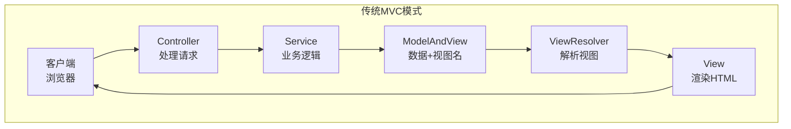

**工作流程：**
1. Controller 处理请求，调用 Service 执行业务逻辑
2. 返回 ModelAndView（包含业务数据 + 逻辑视图名，如 "userList"）
3. ViewResolver 将逻辑视图名解析为实际视图（如 `/WEB-INF/views/userList.jsp`）
4. View 渲染 HTML，将 Model 数据填充到页面模板
5. 返回完整 HTML 页面给浏览器

**适用场景：**
- 传统 Web 应用（如管理系统、企业内部系统）
- 需要服务端渲染 SEO 优化的页面
- 技术栈：JSP、Thymeleaf、FreeMarker 等模板引擎

### 2.2 前后端分离模式（RESTful API）

**特点：** 后端仅提供 RESTful API，返回 JSON/XML 数据，前端负责渲染和交互。

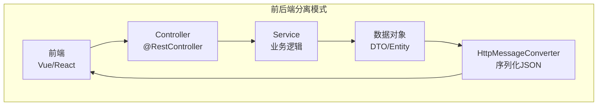

**工作流程：**
1. Controller 处理请求（使用 `@RestController` 或 `@ResponseBody`）
2. 返回数据对象（DTO、Entity 等）
3. HttpMessageConverter 将对象序列化为 JSON/XML
4. 直接返回数据给前端，跳过视图解析和渲染

**适用场景：**
- SPA（单页应用）、移动端 App、小程序
- 微服务架构中的 API 服务
- 前后端并行开发，提高开发效率

### 2.3 两种模式对比

| 对比维度 | 传统 MVC 模式 | 前后端分离模式 |
|----------|---------------|----------------|
| **职责划分** | 后端处理业务 + 渲染页面 | 后端仅提供 API，前端负责渲染 |
| **返回内容** | 完整 HTML 页面 | JSON/XML 数据 |
| **视图解析** | 需要 ViewResolver | 跳过，无需 ViewResolver |
| **消息转换** | 无需 HttpMessageConverter | 需要 HttpMessageConverter 序列化 |
| **技术栈** | JSP、Thymeleaf 模板引擎 | Vue、React、Angular |
| **开发模式** | 前后端耦合，串行开发 | 前后端解耦，并行开发 |
| **适用场景** | 管理系统、SEO 需求页面 | SPA、移动端、微服务 API |

---

## 三、核心组件详解

### 3.1 组件协作关系图

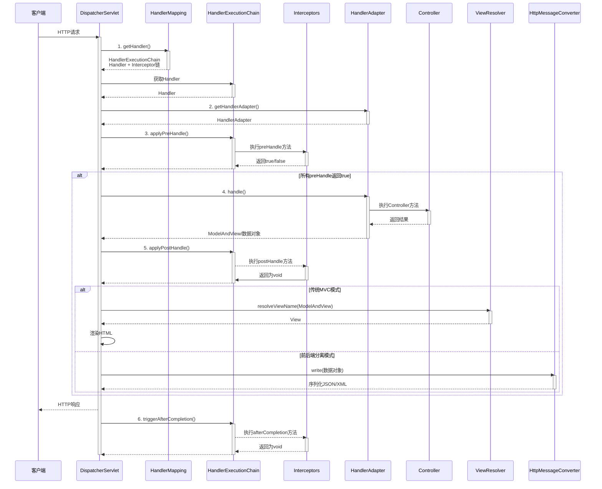

### 3.2 核心组件职责

| 组件 | 职责 | 默认实现 |
|------|------|----------|
| **DispatcherServlet** | 前端控制器，统一接收请求并协调各组件完成处理 | - |
| **HandlerMapping** | 根据请求的 URL、HTTP 方法等信息匹配 Handler，返回 HandlerExecutionChain（含 Handler 和拦截器链） | RequestMappingHandlerMapping |
| **HandlerAdapter** | 适配不同类型 Handler，执行参数绑定、方法调用、返回值处理 | RequestMappingHandlerAdapter |
| **HandlerExecutionChain** | 封装 Handler 和拦截器链，控制拦截器执行顺序 | - |
| **ViewResolver** | 将逻辑视图名解析为 View 对象<br/>（仅传统 MVC 模式） | InternalResourceViewResolver |
| **HttpMessageConverter** | 反序列化请求体/序列化响应体<br/>（仅前后端分离模式） | MappingJackson2HttpMessageConverter |

### 3.3 DispatcherServlet（前端控制器）

DispatcherServlet 是整个 SpringMVC 的**核心入口**，本质是一个 Servlet。

**核心职责：**

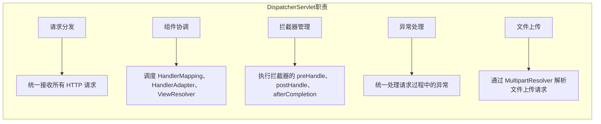

**为什么说"降低组件耦合"？**

传统 Servlet 开发中，每个 Servlet 需要自己处理：
- 请求参数解析
- 业务逻辑调用
- 视图渲染/响应生成
- 异常处理

这导致 Servlet 职责过重，代码耦合严重。DispatcherServlet 通过**组件分工**解决此问题：
- HandlerMapping 专注路由映射
- HandlerAdapter 专注参数绑定、方法执行和返回值处理
- ViewResolver 专注视图解析
- 各组件通过接口定义，可独立替换，互不影响

### 3.4 HandlerMapping（处理器映射器）

**职责：** 根据请求的 URL、HTTP 方法等信息，找到对应的 Handler（Controller 方法），并返回 HandlerExecutionChain（包含 Handler 和拦截器链）。

**主要实现类：**

| 实现类 | 映射方式 | 使用场景 |
|--------|----------|----------|
| **RequestMappingHandlerMapping** | 解析 `@RequestMapping` 注解 | 主流方式，注解驱动开发 |
| **BeanNameUrlHandlerMapping** | Bean 名称以 `/` 开头时自动映射 | 传统 XML 配置方式 |
| **SimpleUrlHandlerMapping** | 显式配置 URL 模式与 Handler 映射 | 需要精确控制映射关系 |

**BeanNameUrlHandlerMapping 说明：**

当 Bean 的名称以 `/` 开头时，Spring 会自动将其注册为 Handler。Handler 需要实现特定接口才能被正确调用：

**方式一：实现 Controller 接口**

```java
// XML 配置
<bean name="/hello" class="com.example.HelloController"/>

// Handler 实现 Controller 接口
public class HelloController implements Controller {
    @Override
    public ModelAndView handleRequest(HttpServletRequest request, 
                                       HttpServletResponse response) throws Exception {
        ModelAndView mv = new ModelAndView("hello");  // 逻辑视图名
        mv.addObject("message", "Hello World");
        return mv;  // 返回 ModelAndView
    }
}
```

**方式二：实现 HttpRequestHandler 接口**

```java
// XML 配置
<bean name="/api/data" class="com.example.ApiHandler"/>

// Handler 实现 HttpRequestHandler 接口
public class ApiHandler implements HttpRequestHandler {
    @Override
    public void handleRequest(HttpServletRequest request, 
                               HttpServletResponse response) throws Exception {
        response.setContentType("application/json");
        response.getWriter().write("{\"status\":\"ok\"}");
        // 无返回值，直接写入响应
    }
}
```

**对应的 HandlerAdapter：**

| Handler 类型 | 对应的 HandlerAdapter | 调用方式 |
|--------------|----------------------|----------|
| 实现 `Controller` 接口 | SimpleControllerHandlerAdapter | 调用 `handleRequest()` 返回 ModelAndView |
| 实现 `HttpRequestHandler` 接口 | HttpRequestHandlerAdapter | 调用 `handleRequest()` 无返回值 |

这种方式是早期 SpringMVC 的配置方式，现已较少使用，主流使用 `@RequestMapping` 注解。

### 3.5 HandlerAdapter（处理器适配器）

**职责：** 适配不同类型的 Handler，统一调用处理器方法。

**为什么需要适配器？**

不同类型的 Handler 执行方式不同：
- 注解式 Controller（`@RequestMapping`）：需要解析注解、绑定参数
- 实现 Controller 接口的类：调用 `handleRequest()` 方法
- 实现 HttpRequestHandler 接口的类：调用 `handleRequest()` 方法

HandlerAdapter 统一了调用逻辑，DispatcherServlet 无需关心 Handler 的具体类型。

**主要实现类：**

| 实现类 | 适配的 Handler 类型 |
|--------|---------------------|
| **RequestMappingHandlerAdapter** | `@RequestMapping` 注解的 Controller 方法 |
| **SimpleControllerHandlerAdapter** | 实现 `Controller` 接口的处理器 |
| **HttpRequestHandlerAdapter** | 实现 `HttpRequestHandler` 接口的处理器 |

**核心能力：**
- **参数绑定**：将 HTTP 请求参数转换为方法参数（`@RequestParam`、`@PathVariable`、`@RequestBody`）
- **类型转换**：字符串转日期、数字等
- **数据验证**：通过 Validator 校验参数合法性
- **返回值处理**：将方法返回值转换为响应（ModelAndView 或 JSON）

### 3.6 ViewResolver（视图解析器）

**职责：** 将逻辑视图名（如 "userList"）解析为实际的 View 对象（如 `/WEB-INF/views/userList.jsp`）。

**仅用于传统 MVC 模式**，前后端分离模式跳过此步骤。

**配置示例：**

```java
@Bean
public ViewResolver viewResolver() {
    InternalResourceViewResolver resolver = new InternalResourceViewResolver();
    resolver.setPrefix("/WEB-INF/views/");  // 前缀
    resolver.setSuffix(".jsp");              // 后缀
    return resolver;
}

// 逻辑视图名 "userList" → 实际路径 "/WEB-INF/views/userList.jsp"
```

### 3.7 HttpMessageConverter（消息转换器）

**职责：** 将 Java 对象序列化为 JSON/XML 等格式写入响应体，或将请求体中的 JSON/XML 反序列化为 Java 对象。

**仅用于前后端分离模式**，传统 MVC 模式无需此组件。

**常用实现：**

| 实现类 | 支持格式 |
|--------|----------|
| MappingJackson2HttpMessageConverter | JSON |
| StringHttpMessageConverter | String |
| ByteArrayHttpMessageConverter | byte[] |
| Jaxb2RootElementHttpMessageConverter | XML |

**工作原理：**

```java
@PostMapping("/user")
public User createUser(@RequestBody User user) {
    // HttpMessageConverter 将请求体 JSON 反序列化为 User 对象
    return userService.save(user);
    // HttpMessageConverter 将 User 对象序列化为 JSON 写入响应体
}
```

---

## 四、请求处理流程

### 4.1 传统 MVC 模式流程

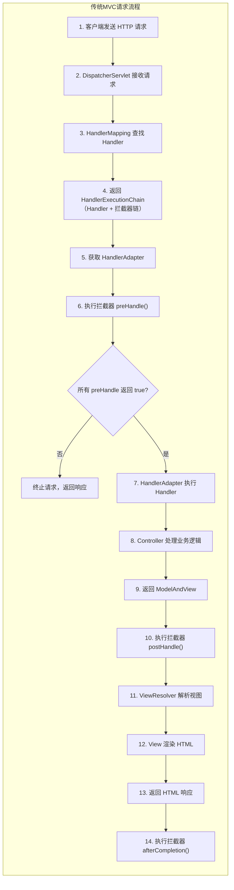

**详细步骤说明：**

| 步骤 | 操作 | 说明 |
|------|------|------|
| 1 | 客户端发送请求 | 浏览器发送 HTTP 请求（如 `GET /user/list`） |
| 2 | DispatcherServlet 接收请求 | 前端控制器作为统一入口拦截请求 |
| 3 | HandlerMapping 查找 Handler | 根据请求的 URL、HTTP 方法等信息匹配对应的 Controller 方法 |
| 4 | 返回 HandlerExecutionChain | 包含 Handler 和拦截器链 |
| 5 | 获取 HandlerAdapter | 根据 Handler 类型获取对应的适配器（在 preHandle 之前） |
| 6 | 执行拦截器 preHandle() | 顺序执行所有拦截器的 preHandle，任一返回 false 则终止 |
| 7 | HandlerAdapter 执行 Handler | 适配器调用 Controller 方法 |
| 8 | Controller 处理业务逻辑 | 调用 Service 层，处理业务 |
| 9 | 返回 ModelAndView | 包含业务数据（Model）和逻辑视图名（ViewName） |
| 10 | 执行拦截器 postHandle() | 倒序执行所有拦截器的 postHandle，可修改 ModelAndView |
| 11 | ViewResolver 解析视图 | 将逻辑视图名解析为实际 View 对象 |
| 12 | View 渲染 HTML | 将 Model 数据填充到视图模板，生成 HTML |
| 13 | 返回 HTML 响应 | 将 HTML 写入响应返回客户端 |
| 14 | 执行拦截器 afterCompletion() | 倒序执行所有拦截器的 afterCompletion（无论成功或异常） |

### 4.2 前后端分离模式流程

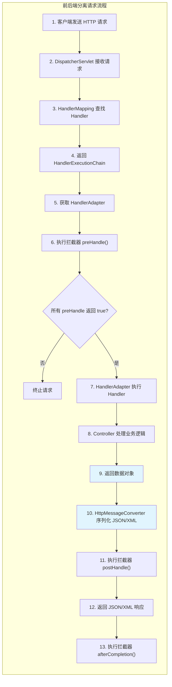

**与传统 MVC 的差异：**

| 步骤 | 传统 MVC | 前后端分离 |
|------|----------|------------|
| 9 | 返回 ModelAndView | 返回数据对象（DTO/Entity） |
| 10 | ViewResolver 解析视图 | **跳过**，无需视图解析 |
| 11 | View 渲染 HTML | HttpMessageConverter 序列化 JSON/XML |
| 12 | 返回 HTML 响应 | 返回 JSON/XML 响应 |

### 4.3 doDispatch() 源码核心逻辑

```java
protected void doDispatch(HttpServletRequest request, HttpServletResponse response) {
    HttpServletRequest processedRequest = request;
    HandlerExecutionChain mappedHandler = null;
    ModelAndView mv = null;
    Exception dispatchException = null;
    
    try {
        // 1. 检查文件上传请求
        processedRequest = checkMultipart(request);
        multipartRequestParsed = (processedRequest != request);
        
        // 2. 获取 HandlerExecutionChain（Handler + 拦截器链）
        mappedHandler = getHandler(processedRequest);
        if (mappedHandler == null) {
            noHandlerFound(processedRequest, response);  // 404
            return;
        }
        
        // 3. 获取 HandlerAdapter
        HandlerAdapter ha = getHandlerAdapter(mappedHandler.getHandler());
        
        // 4. 执行拦截器 preHandle（按顺序执行）
        if (!mappedHandler.applyPreHandle(processedRequest, response)) {
            return;  // 任一拦截器返回 false，终止请求
        }
        
        // 5. 执行 Handler（Controller 方法）
        mv = ha.handle(processedRequest, response, mappedHandler.getHandler());
        
        // 6. 执行拦截器 postHandle（倒序执行）
        mappedHandler.applyPostHandle(processedRequest, response, mv);
        
    } catch (Exception ex) {
        dispatchException = ex;
    }
    
    // 7. 处理结果：渲染视图 + 执行 afterCompletion
    processDispatchResult(processedRequest, response, mappedHandler, mv, dispatchException);
}
```

---

## 五、拦截器机制

### 5.1 拦截器接口定义

```java
public interface HandlerInterceptor {
    
    // 前置处理：在 Handler 执行前调用
    // 返回 true 继续执行，返回 false 终止请求
    default boolean preHandle(HttpServletRequest request, HttpServletResponse response, 
                              Object handler) throws Exception {
        return true;
    }
    
    // 后置处理：在 Handler 执行后、视图渲染前调用
    // 可修改 ModelAndView（传统 MVC 模式）
    default void postHandle(HttpServletRequest request, HttpServletResponse response, 
                            Object handler, ModelAndView modelAndView) throws Exception {
    }
    
    // 收尾处理：在请求完成后调用（无论成功或异常）
    // 可用于资源清理、日志记录
    default void afterCompletion(HttpServletRequest request, HttpServletResponse response, 
                                  Object handler, Exception ex) throws Exception {
    }
}
```

### 5.2 执行时机详解

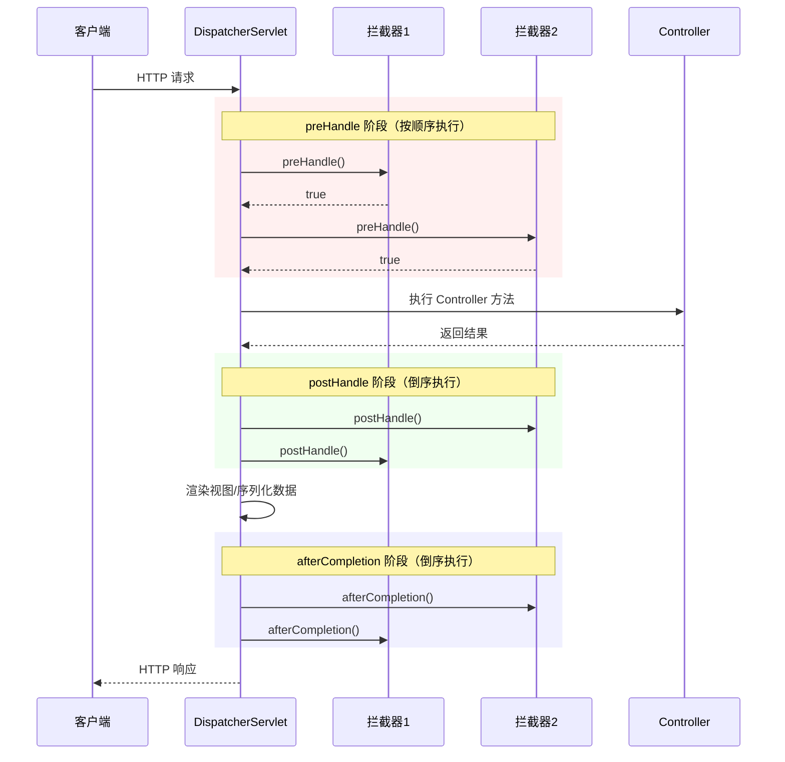

**三个方法的执行特点：**

| 方法 | 执行时机 | 执行顺序 | 返回值影响 | 典型用途 |
|------|----------|----------|------------|----------|
| **preHandle** | Handler 执行前 | 正序（1→2→3） | 返回 false 终止请求 | 权限校验、登录验证 |
| **postHandle** | Handler 执行后、视图渲染前 | 倒序（3→2→1） | 无返回值 | 修改 ModelAndView、数据脱敏 |
| **afterCompletion** | 请求完成后（无论成功或异常） | 倒序（3→2→1） | 无返回值 | 资源清理、日志记录、异常处理 |

### 5.3 拦截器配置

```java
@Configuration
public class WebConfig implements WebMvcConfigurer {
    
    @Override
    public void addInterceptors(InterceptorRegistry registry) {
        registry.addInterceptor(new LoginInterceptor())
                .addPathPatterns("/**")           // 拦截所有路径
                .excludePathPatterns("/login", "/static/**");  // 排除登录和静态资源
        
        registry.addInterceptor(new LogInterceptor())
                .addPathPatterns("/api/**");      // 仅拦截 API 路径
    }
}
```

### 5.4 拦截器 vs 过滤器

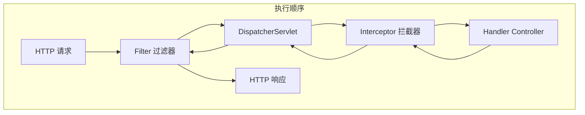

| 对比项 | 拦截器 (Interceptor) | 过滤器 (Filter) |
|--------|----------------------|-----------------|
| **所属框架** | Spring 框架 | Servlet 规范（Tomcat 等 Web 容器） |
| **拦截范围** | 只拦截 Controller 请求 | 拦截所有请求（包括静态资源、Servlet） |
| **执行时机** | 在 DispatcherServlet 内，Handler 执行前后 | 在 DispatcherServlet 之前 |
| **访问能力** | 可访问 Spring 容器中的 Bean | 无法直接访问 Spring 容器 |
| **实现方式** | 实现 HandlerInterceptor 接口 | 实现 Filter 接口 + web.xml 配置 |
| **典型用途** | 权限校验、日志记录、数据脱敏 | 编码转换、跨域处理、请求过滤 |

---

## 六、常用注解详解

### 6.1 控制器注解

| 注解 | 作用 | 使用场景 |
|------|------|----------|
| **@Controller** | 标记类为 Spring MVC 控制器 | 传统 MVC 模式，返回视图 |
| **@RestController** | 组合注解 = @Controller + @ResponseBody | 前后端分离模式，返回 JSON/XML |
| **@RequestMapping** | 映射请求 URL 到处理方法 | 通用映射，可指定 HTTP 方法 |

### 6.2 HTTP 方法映射注解

Spring 4.3+ 提供了语义化的快捷注解，等价于 `@RequestMapping` 指定特定 HTTP 方法：

| 注解 | 等价写法 | 适用场景 |
|------|----------|----------|
| **@GetMapping** | `@RequestMapping(method = GET)` | 查询数据 |
| **@PostMapping** | `@RequestMapping(method = POST)` | 新增数据 |
| **@PutMapping** | `@RequestMapping(method = PUT)` | 全量更新数据 |
| **@PatchMapping** | `@RequestMapping(method = PATCH)` | 部分更新数据 |
| **@DeleteMapping** | `@RequestMapping(method = DELETE)` | 删除数据 |

### 6.3 @RequestMapping 属性详解

```java
@RequestMapping(
    value = "/users",           // 路径映射，支持多个路径 {"", "/"}
    method = RequestMethod.GET, // HTTP 方法限定
    params = "admin",           // 必须包含参数 admin
    headers = "X-Token",        // 必须包含请求头 X-Token
    consumes = "application/json",  // 接收的请求体格式
    produces = "application/json"   // 返回的响应体格式
)
```

| 属性 | 说明 | 示例 |
|------|------|------|
| **value / path** | 指定请求路径 | `value = "/user"` |
| **method** | 限定 HTTP 方法 | `method = RequestMethod.GET` |
| **params** | 限定请求参数 | `params = "name"` 表示必须带 name 参数 |
| **headers** | 限定请求头 | `headers = "Content-Type=json"` |
| **consumes** | 限定请求体 Content-Type | `consumes = "application/json"` |
| **produces** | 限定响应体 Content-Type | `produces = "application/json"` |

### 6.4 参数绑定注解

| 注解 | 数据来源 | 示例 | 说明 |
|------|----------|------|------|
| **@RequestParam** | URL 查询参数 | `?name=张三` → `@RequestParam("name")` | 绑定查询参数到方法参数 |
| **@PathVariable** | URL 路径变量 | `/user/123` → `@PathVariable("id")` | 从 RESTful URL 中提取参数 |
| **@RequestBody** | 请求体（JSON） | `{ "name": "张三" }` → `@RequestBody User` | 自动反序列化为对象 |
| **@RequestHeader** | 请求头 | `Token: abc` → `@RequestHeader("Token")` | 获取请求头值 |
| **@CookieValue** | Cookie | `sessionId: xyz` → `@CookieValue("sessionId")` | 获取 Cookie 值 |
| **@ModelAttribute** | 表单数据 | 表单字段 → 对象属性 | 自动绑定表单到对象 |

### 6.5 @RequestParam 详解

```java
@GetMapping("/search")
public List<User> search(
    @RequestParam(value = "keyword", required = false, defaultValue = "") String keyword,
    @RequestParam(value = "page", defaultValue = "1") int page,
    @RequestParam(value = "size", defaultValue = "10") int size
) {
    // ...
}
```

| 属性 | 说明 |
|------|------|
| **value** | 参数名称 |
| **required** | 是否必须（默认 true），设为 false 时参数可缺失 |
| **defaultValue** | 默认值，设置后 required 自动变为 false |

### 6.6 @PathVariable 详解

```java
@GetMapping("/user/{id}")
public User getUser(@PathVariable Long id) {
    // URL: /user/123 → id = 123
}

@GetMapping("/user/{id}/order/{orderId}")
public Order getOrder(
    @PathVariable Long id,
    @PathVariable Long orderId
) {
    // URL: /user/123/order/456 → id = 123, orderId = 456
}

@GetMapping("/user/{id:\\d+}")  // 正则限定：只匹配数字
public User getUserById(@PathVariable Long id) {
    // ...
}
```

### 6.7 @RequestBody 详解

```java
@PostMapping("/user")
public User createUser(@RequestBody User user) {
    // 请求体: { "name": "张三", "age": 25 }
    // HttpMessageConverter 自动将 JSON 反序列化为 User 对象
    return userService.save(user);
}

@PostMapping("/users/batch")
public List<User> createUsers(@RequestBody List<User> users) {
    // 请求体: [{ "name": "张三" }, { "name": "李四" }]
    return userService.saveAll(users);
}
```

### 6.8 @ResponseBody 详解

```java
@Controller
public class UserController {
    
    @GetMapping("/user/{id}")
    @ResponseBody  // 将返回值直接写入响应体（序列化为 JSON）
    public User getUser(@PathVariable Long id) {
        return userService.findById(id);
    }
}

// @RestController 等价于 @Controller + @ResponseBody（类级别）
@RestController
@RequestMapping("/api")
public class UserApiController {
    
    @GetMapping("/user/{id}")  // 无需再加 @ResponseBody
    public User getUser(@PathVariable Long id) {
        return userService.findById(id);
    }
}
```

---

## 七、异常处理

### 7.1 全局异常处理器

```java
@RestControllerAdvice  // 组合 @ControllerAdvice + @ResponseBody
public class GlobalExceptionHandler {
    
    // 处理所有异常
    @ExceptionHandler(Exception.class)
    public Result<Void> handleException(Exception e) {
        return Result.error(500, "系统内部错误");
    }
    
    // 处理业务异常
    @ExceptionHandler(BusinessException.class)
    public Result<Void> handleBusinessException(BusinessException e) {
        return Result.error(e.getCode(), e.getMessage());
    }
    
    // 处理参数验证异常
    @ExceptionHandler(MethodArgumentNotValidException.class)
    public Result<Void> handleValidationException(MethodArgumentNotValidException e) {
        String message = e.getBindingResult().getFieldError().getDefaultMessage();
        return Result.error(400, message);
    }
}
```

### 7.2 异常处理流程

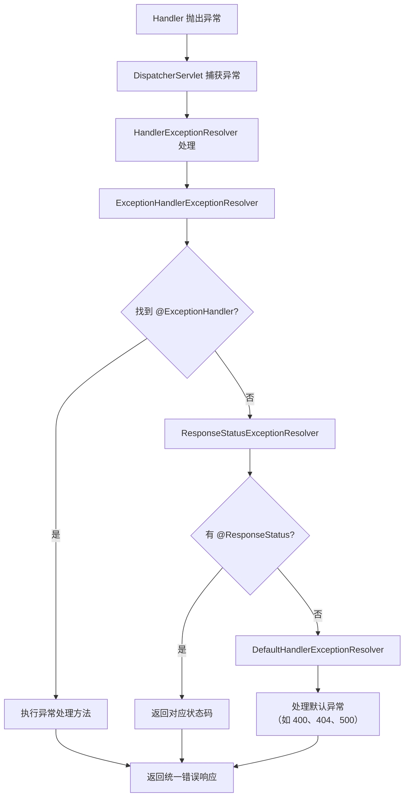

---

## 八、数据绑定与验证

### 8.1 数据绑定流程

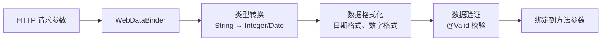

### 8.2 参数验证示例

```java
@Data
public class UserDTO {
    @NotBlank(message = "用户名不能为空")
    private String username;
    
    @Email(message = "邮箱格式不正确")
    private String email;
    
    @Size(min = 6, max = 20, message = "密码长度 6-20 位")
    private String password;
    
    @Min(value = 18, message = "年龄不能小于 18 岁")
    private Integer age;
}

@PostMapping("/user")
public Result<Void> createUser(@Valid @RequestBody UserDTO userDTO) {
    // 参数验证失败会抛出 MethodArgumentNotValidException
    userService.create(userDTO);
    return Result.success();
}
```

---

## 九、文件上传

### 9.1 配置文件上传解析器

```java
@Bean
public MultipartResolver multipartResolver() {
    CommonsMultipartResolver resolver = new CommonsMultipartResolver();
    resolver.setMaxUploadSize(10 * 1024 * 1024);  // 最大 10MB
    resolver.setDefaultEncoding("UTF-8");
    return resolver;
}
```

### 9.2 文件上传处理

```java
@PostMapping("/upload")
public String upload(@RequestParam("file") MultipartFile file) {
    if (file.isEmpty()) {
        return "文件为空";
    }
    
    String fileName = file.getOriginalFilename();
    String filePath = "/upload/" + fileName;
    
    file.transferTo(new File(filePath));
    return "上传成功: " + fileName;
}
```

---

## 十、总结

### 10.1 核心要点

1. **前端控制器模式**：DispatcherServlet 作为统一入口，协调各组件分工，降低耦合
2. **两种工作模式**：传统 MVC（服务端渲染 HTML）和前后端分离（RESTful API 返回 JSON/XML）
3. **组件化设计**：HandlerMapping、HandlerAdapter、ViewResolver、HttpMessageConverter 各司其职
4. **拦截器机制**：preHandle、postHandle、afterCompletion 实现横切关注点
5. **注解驱动开发**：@RequestMapping、@RequestParam、@PathVariable、@RequestBody 简化配置

### 10.2 面试要点

1. SpringMVC 的两种工作模式是什么？有什么区别？
2. SpringMVC 的请求处理流程是什么？
3. DispatcherServlet 的作用是什么？为什么说它降低了组件耦合？
4. HandlerMapping 和 HandlerAdapter 的区别是什么？
5. 拦截器和过滤器的区别是什么？
6. @RequestParam 和 @PathVariable 的区别是什么？
7. @Controller 和 @RestController 的区别是什么？
8. 如何实现全局异常处理？
9. 传统 MVC 模式和前后端分离模式的请求流程有什么差异？