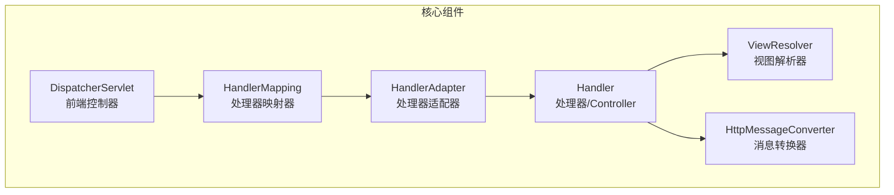
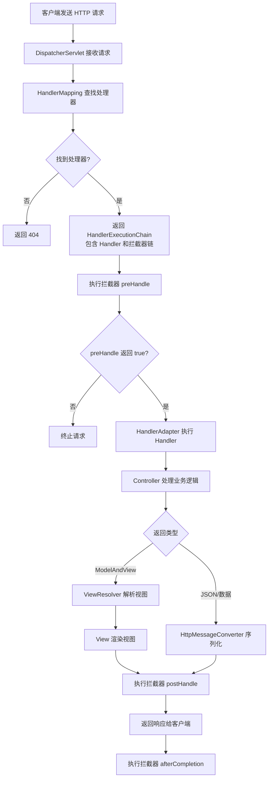
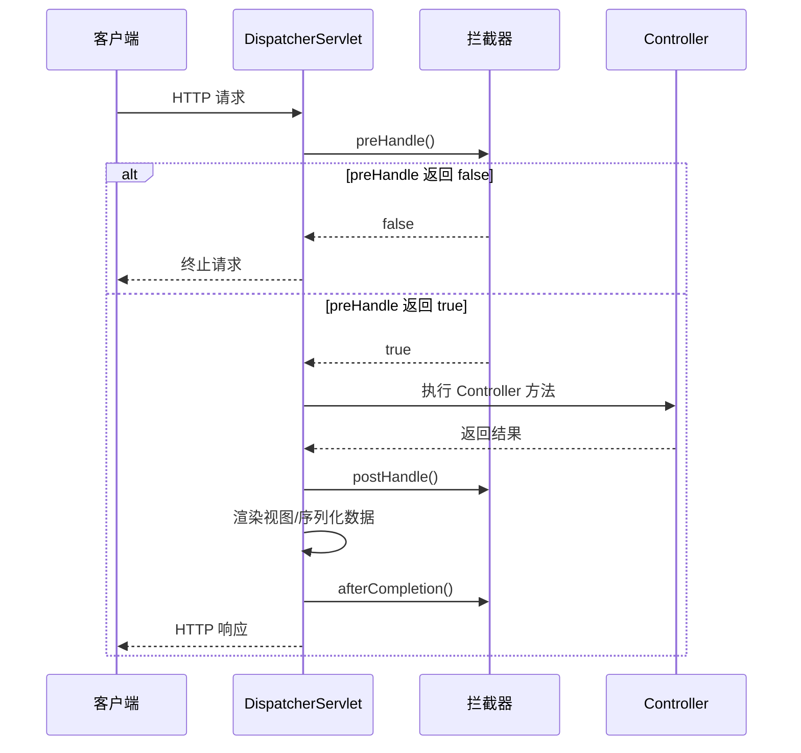
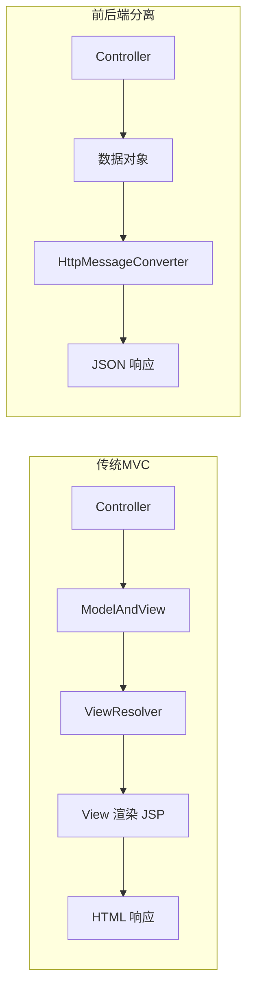
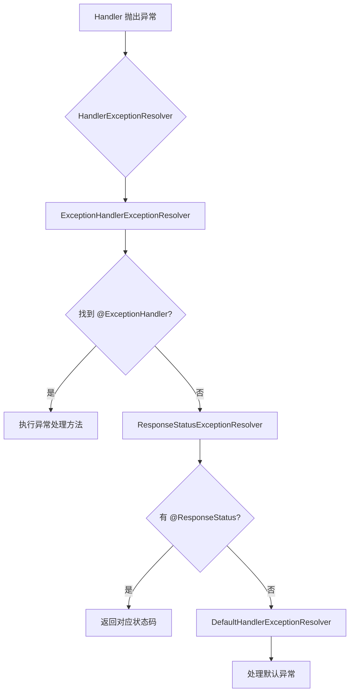
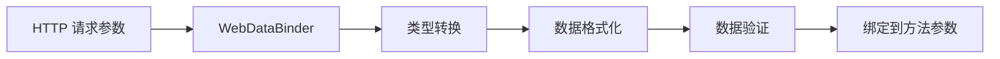

# SpringMVC 核心原理详解

## 一、概述

SpringMVC 是 Spring 框架的核心 Web 模块，基于经典的 MVC（Model-View-Controller）设计模式，通过**前端控制器模式**统一处理请求，提供灵活的请求处理机制。

**核心设计思想：**
- DispatcherServlet 作为前端控制器，统一调度请求
- 各组件通过接口定义，支持灵活替换
- 拦截器链实现横切关注点

---

## 二、核心组件

### 2.1 组件概览



### 2.2 组件职责

| 组件 | 职责 | 默认实现 |
|------|------|----------|
| DispatcherServlet | 前端控制器，统一分发请求与响应 | - |
| HandlerMapping | 将请求 URL 映射到处理器方法 | RequestMappingHandlerMapping |
| HandlerAdapter | 适配并执行处理器，处理参数绑定 | RequestMappingHandlerAdapter |
| ViewResolver | 将逻辑视图名解析为实际视图 | InternalResourceViewResolver |
| HandlerInterceptor | 拦截请求生命周期，实现前置/后置逻辑 | 自定义实现 |
| HttpMessageConverter | 序列化/反序列化请求与响应体 | MappingJackson2HttpMessageConverter |

### 2.3 组件详解

#### 2.3.1 DispatcherServlet（前端控制器）

DispatcherServlet 是整个 SpringMVC 的核心入口，主要职责：

1. **请求分发**：统一接收所有 HTTP 请求
2. **组件协调**：协调 HandlerMapping、HandlerAdapter、ViewResolver 等组件
3. **异常处理**：统一处理请求过程中的异常
4. **文件上传**：通过 MultipartResolver 解析文件上传请求

#### 2.3.2 HandlerMapping（处理器映射器）

根据请求 URL、HTTP 方法等信息匹配对应的处理器：

| 实现类 | 说明 |
|--------|------|
| RequestMappingHandlerMapping | 处理 @RequestMapping 注解（主流） |
| BeanNameUrlHandlerMapping | 基于 Bean 名称匹配 URL |
| SimpleUrlHandlerMapping | 通过显式配置 URL 模式与处理器映射 |

#### 2.3.3 HandlerAdapter（处理器适配器）

适配不同类型的 Handler，统一调用处理器方法：

| 实现类 | 说明 |
|--------|------|
| RequestMappingHandlerAdapter | 适配 @RequestMapping 注解的控制器方法 |
| HttpRequestHandlerAdapter | 适配实现 HttpRequestHandler 接口的处理器 |
| SimpleControllerHandlerAdapter | 适配实现 Controller 接口的处理器 |

**核心能力：**
- 参数绑定：将 HTTP 请求参数转换为方法参数
- 数据转换：如字符串转日期、数字类型
- 数据验证：通过 Validator 校验参数合法性
- 返回值处理：将方法返回值转换为响应

#### 2.3.4 ViewResolver（视图解析器）

将逻辑视图名解析为具体的视图对象：

```java
// 配置示例
@Bean
public ViewResolver viewResolver() {
    InternalResourceViewResolver resolver = new InternalResourceViewResolver();
    resolver.setPrefix("/WEB-INF/views/");
    resolver.setSuffix(".jsp");
    return resolver;
}
```

---

## 三、请求处理流程

### 3.1 完整流程图



### 3.2 详细步骤说明

| 步骤 | 说明 |
|------|------|
| 1 | 客户端发送 HTTP 请求至服务器 |
| 2 | DispatcherServlet 接收请求，调用 doDispatch() |
| 3 | HandlerMapping 根据请求 URL 查找对应的 Handler |
| 4 | 返回 HandlerExecutionChain（包含 Handler 和拦截器链） |
| 5 | 执行拦截器的 preHandle() 方法 |
| 6 | HandlerAdapter 执行 Handler（Controller 方法） |
| 7 | Controller 处理业务逻辑，返回结果 |
| 8 | 执行拦截器的 postHandle() 方法 |
| 9 | ViewResolver 解析视图（传统 MVC）或序列化数据（前后端分离） |
| 10 | 返回响应给客户端 |
| 11 | 执行拦截器的 afterCompletion() 方法 |

### 3.3 源码核心逻辑

```java
protected void doDispatch(HttpServletRequest request, HttpServletResponse response) {
    try {
        // 1. 检查文件上传请求
        processedRequest = checkMultipart(request);
        
        // 2. 获取 Handler（包含拦截器链）
        mappedHandler = getHandler(processedRequest);
        if (mappedHandler == null) {
            noHandlerFound(processedRequest, response); // 404
            return;
        }
        
        // 3. 获取 HandlerAdapter
        HandlerAdapter ha = getHandlerAdapter(mappedHandler.getHandler());
        
        // 4. 执行拦截器 preHandle
        if (!mappedHandler.applyPreHandle(processedRequest, response)) {
            return; // 拦截器返回 false，终止请求
        }
        
        // 5. 执行 Handler
        mv = ha.handle(processedRequest, response, mappedHandler.getHandler());
        
        // 6. 执行拦截器 postHandle
        mappedHandler.applyPostHandle(processedRequest, response, mv);
        
    } catch (Exception ex) {
        // 异常处理
    }
    
    // 7. 处理结果（渲染视图或序列化数据）
    processDispatchResult(processedRequest, response, mappedHandler, mv, ex);
}
```

---

## 四、拦截器机制

### 4.1 拦截器接口

```java
public interface HandlerInterceptor {
    
    // 前置处理：在 Handler 执行前调用
    // 返回 true 继续执行，返回 false 终止请求
    default boolean preHandle(HttpServletRequest request, HttpServletResponse response, 
                              Object handler) throws Exception {
        return true;
    }
    
    // 后置处理：在 Handler 执行后、视图渲染前调用
    default void postHandle(HttpServletRequest request, HttpServletResponse response, 
                            Object handler, ModelAndView modelAndView) throws Exception {
    }
    
    // 收尾处理：在请求完成后调用（无论成功或异常）
    default void afterCompletion(HttpServletRequest request, HttpServletResponse response, 
                                  Object handler, Exception ex) throws Exception {
    }
}
```

### 4.2 执行时机



### 4.3 拦截器配置

```java
@Configuration
public class WebConfig implements WebMvcConfigurer {
    
    @Override
    public void addInterceptors(InterceptorRegistry registry) {
        registry.addInterceptor(new LoginInterceptor())
                .addPathPatterns("/**")           // 拦截所有路径
                .excludePathPatterns("/login");   // 排除登录路径
    }
}
```

### 4.4 拦截器 vs 过滤器

| 对比项 | 拦截器 (Interceptor) | 过滤器 (Filter) |
|--------|----------------------|-----------------|
| 所属 | Spring 框架 | Servlet 规范 |
| 拦截范围 | 只拦截 Controller 请求 | 拦截所有请求（包括静态资源） |
| 执行时机 | 在 DispatcherServlet 内 | 在 DispatcherServlet 前 |
| 访问能力 | 可访问 Spring 容器 Bean | 无法直接访问 Spring 容器 |

---

## 五、常用注解

### 5.1 控制器注解

| 注解 | 说明 |
|------|------|
| @Controller | 标记类为控制器 |
| @RestController | @Controller + @ResponseBody |
| @RequestMapping | 映射请求 URL |
| @GetMapping | 映射 GET 请求 |
| @PostMapping | 映射 POST 请求 |
| @PutMapping | 映射 PUT 请求 |
| @DeleteMapping | 映射 DELETE 请求 |

### 5.2 参数绑定注解

| 注解 | 说明 | 示例 |
|------|------|------|
| @RequestParam | 绑定请求参数 | `@RequestParam("name") String name` |
| @PathVariable | 绑定路径变量 | `@PathVariable("id") Long id` |
| @RequestBody | 绑定请求体（JSON） | `@RequestBody User user` |
| @RequestHeader | 绑定请求头 | `@RequestHeader("Token") String token` |
| @CookieValue | 绑定 Cookie 值 | `@CookieValue("sessionId") String sessionId` |
| @ModelAttribute | 绑定模型属性 | `@ModelAttribute User user` |

### 5.3 注解详解

#### @RequestMapping

```java
@Controller
@RequestMapping("/user")  // 类级别路径
public class UserController {
    
    @RequestMapping(
        value = "/list",
        method = RequestMethod.GET,
        params = "type=admin",
        headers = "X-Request-Id",
        consumes = "application/json",
        produces = "application/json"
    )
    public String list() {
        return "user/list";
    }
    
    // 简化写法
    @GetMapping("/detail/{id}")
    public String detail(@PathVariable Long id) {
        return "user/detail";
    }
}
```

#### @RequestParam

```java
@GetMapping("/search")
public String search(
    @RequestParam(value = "keyword", required = false, defaultValue = "") String keyword,
    @RequestParam(value = "page", defaultValue = "1") int page,
    @RequestParam(value = "size", defaultValue = "10") int size
) {
    // ...
}
```

#### @PathVariable

```java
@GetMapping("/user/{id}")
public String getUser(@PathVariable Long id) {
    // ...
}

@GetMapping("/user/{id}/order/{orderId}")
public String getOrder(
    @PathVariable Long id,
    @PathVariable Long orderId
) {
    // ...
}
```

#### @RequestBody

```java
@PostMapping("/user")
public User createUser(@RequestBody User user) {
    // 自动将 JSON 请求体反序列化为 User 对象
    return userService.save(user);
}
```

#### @ResponseBody

```java
@GetMapping("/user/{id}")
@ResponseBody  // 将返回值直接写入响应体
public User getUser(@PathVariable Long id) {
    return userService.findById(id);
}
```

---

## 六、前后端分离 vs 传统 MVC

### 6.1 流程对比



### 6.2 差异对比

| 对比项 | 传统 MVC | 前后端分离 |
|--------|----------|------------|
| 处理器返回 | ModelAndView | 数据对象（DTO） |
| 视图解析 | 需要 ViewResolver | 跳过 |
| 响应格式 | HTML 页面 | JSON/XML |
| 消息转换 | 无需 | HttpMessageConverter |
| 适用场景 | 服务端渲染 | SPA、移动端 API |

---

## 七、异常处理

### 7.1 全局异常处理

```java
@RestControllerAdvice
public class GlobalExceptionHandler {
    
    @ExceptionHandler(Exception.class)
    public Result<Void> handleException(Exception e) {
        return Result.error(500, e.getMessage());
    }
    
    @ExceptionHandler(BusinessException.class)
    public Result<Void> handleBusinessException(BusinessException e) {
        return Result.error(e.getCode(), e.getMessage());
    }
    
    @ExceptionHandler(MethodArgumentNotValidException.class)
    public Result<Void> handleValidationException(MethodArgumentNotValidException e) {
        String message = e.getBindingResult().getFieldError().getDefaultMessage();
        return Result.error(400, message);
    }
}
```

### 7.2 异常处理流程



---

## 八、数据绑定与验证

### 8.1 数据绑定流程



### 8.2 参数验证

```java
@Data
public class UserDTO {
    @NotBlank(message = "用户名不能为空")
    private String username;
    
    @Email(message = "邮箱格式不正确")
    private String email;
    
    @Size(min = 6, max = 20, message = "密码长度 6-20 位")
    private String password;
    
    @Min(value = 18, message = "年龄不能小于 18 岁")
    private Integer age;
}

@PostMapping("/user")
public Result<Void> createUser(@Valid @RequestBody UserDTO userDTO) {
    // 参数验证失败会抛出 MethodArgumentNotValidException
    userService.create(userDTO);
    return Result.success();
}
```

---

## 九、文件上传

### 9.1 配置

```java
@Bean
public MultipartResolver multipartResolver() {
    CommonsMultipartResolver resolver = new CommonsMultipartResolver();
    resolver.setMaxUploadSize(10 * 1024 * 1024); // 10MB
    resolver.setDefaultEncoding("UTF-8");
    return resolver;
}
```

### 9.2 上传处理

```java
@PostMapping("/upload")
public String upload(@RequestParam("file") MultipartFile file) {
    if (file.isEmpty()) {
        return "文件为空";
    }
    
    String fileName = file.getOriginalFilename();
    String filePath = "/upload/" + fileName;
    
    file.transferTo(new File(filePath));
    return "上传成功";
}
```

---

## 十、总结

### 10.1 核心要点

1. **前端控制器模式**：DispatcherServlet 统一调度，降低组件耦合
2. **组件可插拔**：各组件通过接口定义，支持灵活替换
3. **拦截器机制**：实现横切关注点，如权限验证、日志记录
4. **注解驱动**：简化配置，提高开发效率
5. **前后端分离**：通过 HttpMessageConverter 支持 RESTful API

### 10.2 面试要点

1. SpringMVC 的工作流程是什么？
2. DispatcherServlet 的作用是什么？
3. HandlerMapping 和 HandlerAdapter 的区别？
4. 拦截器和过滤器的区别？
5. @RequestMapping 注解的属性有哪些？
6. 如何实现全局异常处理？
7. SpringMVC 如何处理文件上传？
