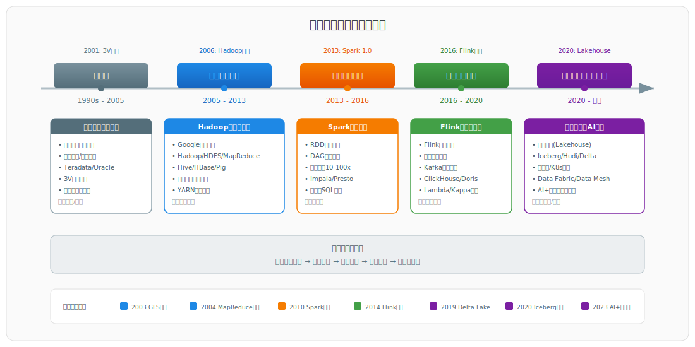
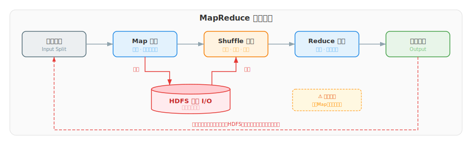
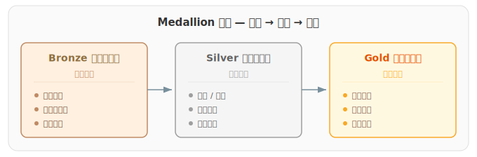
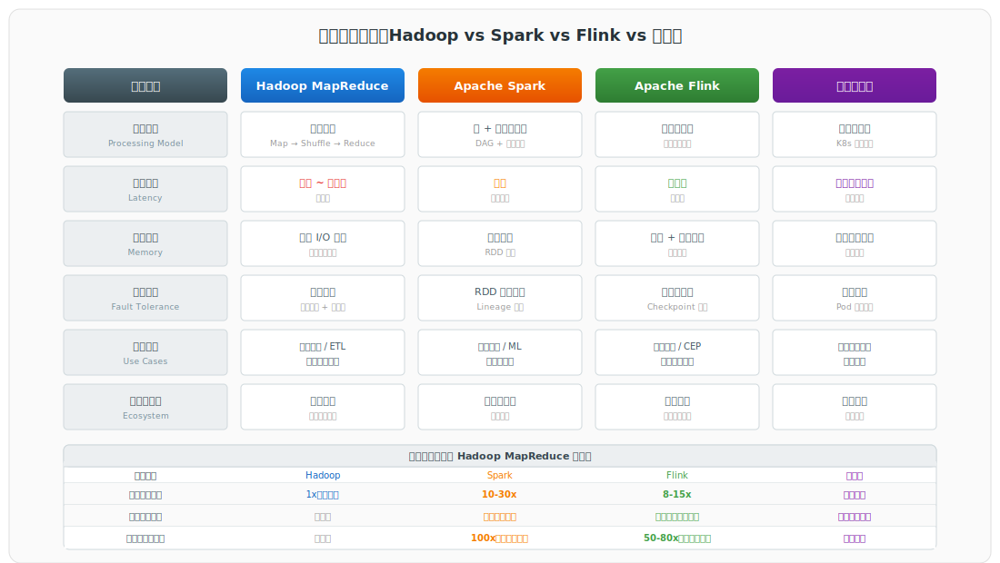
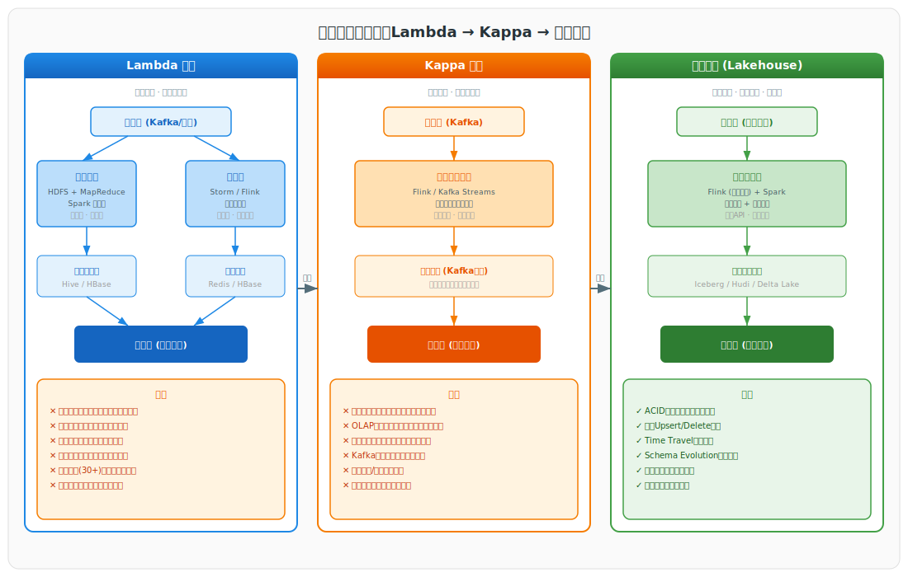
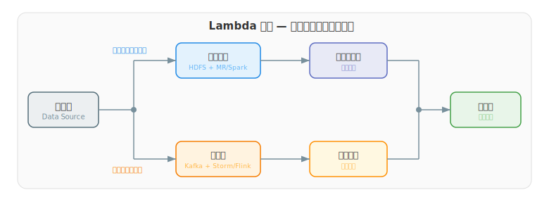
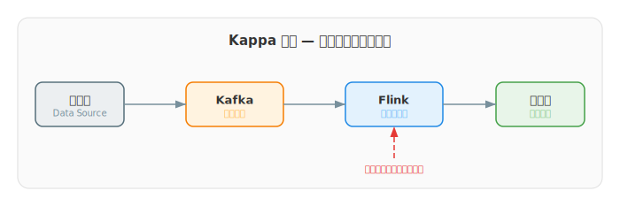
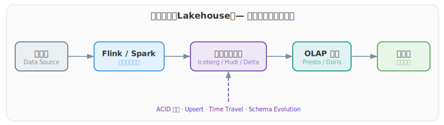
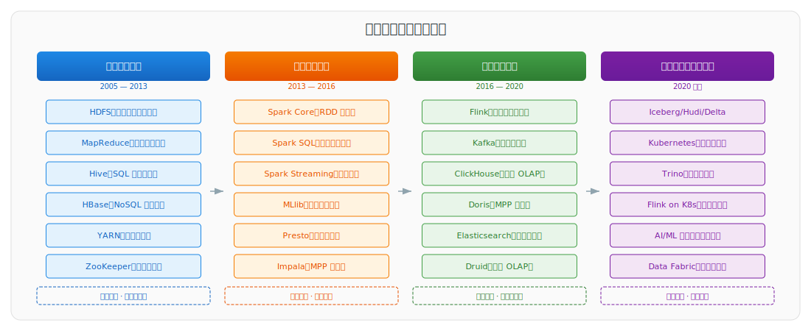

# 大数据开发技术发展历程

> 本文系统梳理了大数据开发技术从萌芽到智能化的完整发展脉络，涵盖关键技术演进、架构变迁与未来趋势。文档分为五个部分：一、概述；二、技术发展时代（按时间线展开）；三、架构演进（跨时代的架构范式变迁）；四、技术栈全景；五、未来展望。

---

## 一、概述

### 1.1 大数据的定义

大数据（Big Data）是指无法在合理时间范围内用常规软件工具进行捕捉、管理和处理的数据集合，需要新的处理模式才能具备更强的决策力、洞察发现力和流程优化能力。2001年，Gartner 分析师 Doug Laney 提出了"3V"模型，后逐步扩展为"5V"特征模型：

| 特征 | 英文 | 含义 |
|------|------|------|
| 体量 | Volume | 数据规模从 TB 跃升至 PB、EB 乃至 ZB 级别 |
| 速度 | Velocity | 数据产生和处理的速度极快，需实时或准实时响应 |
| 多样性 | Variety | 数据类型涵盖结构化、半结构化和非结构化数据 |
| 价值 | Value | 数据价值密度低，需通过算法提取有价值信息 |
| 真实性 | Veracity | 数据质量和可信度的保障 |

### 1.2 时代背景

根据 IDC 预测，2025 年全球数据圈规模将达到 175 ZB，到 2030 年有望突破 1 YB。数据量的指数级增长源于多重因素叠加：移动互联网的普及、物联网设备的广泛部署、云计算降低存储与处理门槛、AI 深度学习对海量标注数据的刚性需求。2020 年，中国首次将数据纳入与土地、劳动力、资本、技术并列的第五大生产要素，标志着大数据从辅助决策工具上升为国家战略资源。

> **纵向扩展（Scale-up）与横向扩展（Scale-out）对比：**
>
> | 维度 | Scale-up（纵向扩展） | Scale-out（横向扩展） |
> |------|----------------------|----------------------|
> | 方式 | 升级单机硬件配置（加 CPU、扩内存、换存储） | 增加更多普通服务器节点 |
> | 上限 | 单机硬件存在物理上限 | 可无限水平扩展 |
> | 成本 | 高端服务器价格随配置呈指数增长 | 利用廉价商用硬件，线性增长 |
> | 典型代表 | 传统数据库（Oracle、Teradata） | 大数据架构（Hadoop、Spark） |

---

## 二、技术发展时代

大数据技术经历了五个主要发展阶段，每一阶段都以前一阶段的瓶颈为驱动力，在延迟、吞吐、扩展性上实现代际跨越。

### 2.1 萌芽期（1990s—2005）：传统数据仓库时代

#### 2.1.1 时代背景与技术特征

这一阶段，关系型数据库（RDBMS）是数据处理的主流工具。企业依靠数据仓库、并行数据库及专用硬件（如 Teradata、Oracle Exadata）应对大规模数据挑战。数据挖掘技术开始兴起，但受限于算力与存储成本，仅少数大型企业有能力部署。

核心技术特征为：**批处理 ETL 为主，数据延迟在天/周级别**，处理对象以结构化数据为主。

#### 2.1.2 核心技术栈

| 类别 | 组件 | 说明 |
|------|------|------|
| 数据库 | Oracle、Teradata、DB2、SQL Server | 商业关系型数据库，价格昂贵 |
| 数据仓库 | Teradata DW、Oracle DW | 专用硬件一体机，纵向扩展 |
| 数据处理 | ETL（Informatica、DataStage） | 数据抽取、转换、加载 |
| 分析工具 | SAS、SPSS | 统计分析，数据挖掘 |

#### 2.1.3 局限性与挑战

| 局限 | 说明 |
|------|------|
| 扩展性差 | 采用纵向扩展（Scale-up），单机硬件存在物理上限，成本随配置呈指数增长 |
| 处理延迟高 | 大规模批处理需数小时至数天，无法满足实时需求 |
| 数据类型单一 | 主要处理结构化数据，对非结构化数据（日志、图像、文本）支持有限 |
| 成本极高 | 商业数据库许可证与专用硬件采购费用高昂 |

> **纵向扩展（Scale-up）与横向扩展（Scale-out）对比：**
>
> | 维度 | Scale-up（纵向扩展） | Scale-out（横向扩展） |
> |------|----------------------|----------------------|
> | 方式 | 升级单机硬件配置（加CPU、扩内存、换存储） | 增加更多普通服务器节点 |
> | 上限 | 单机硬件存在物理上限 | 可无限水平扩展 |
> | 成本 | 高端服务器价格随配置呈指数增长 | 利用廉价商用硬件，线性增长 |
> | 典型代表 | 传统数据库（Oracle、Teradata） | 大数据架构（Hadoop、Spark） |

#### 2.1.4 关键里程碑

- **2001 年**：Doug Laney 提出"3V"模型，奠定大数据概念基础
- **2003 年**：Google 发表 GFS（Google File System）论文
- **2004 年**：Google 发表 MapReduce 论文
- **2006 年**：Google 发表 Bigtable 论文

> Google 的三篇经典论文（被称为"三驾马车"）奠定了分布式存储与计算的理论基础，成为后续 Hadoop 生态的理论源泉。

### 2.2 磁盘计算时代（2005—2013）：Hadoop 批处理时代

#### 2.2.1 时代背景与技术特征

2006 年，Doug Cutting 基于 Google 的 GFS 与 MapReduce 论文思想，在 Apache 基金会下创建了 Hadoop 项目。Hadoop 的核心贡献在于：**将分布式计算从 Google 的内部设施变为开源社区的公共基础设施**，使任何企业都能以廉价的商用硬件构建大规模数据处理集群。

核心技术特征为：**批处理为主，延迟在分钟至小时级**，以 HDFS 为分布式存储基础，MapReduce 为计算引擎，实现了"数据本地化"计算——将计算任务移动到数据所在节点，避免网络传输瓶颈。

#### 2.2.2 核心技术栈

| 组件 | 功能 | 说明 |
|------|------|------|
| HDFS | 分布式文件系统 | 支撑 TB/PB 级数据的分布式存储，多副本保证可靠性 |
| MapReduce | 分布式计算框架 | 分而治之，Map 映射 + Shuffle 洗牌 + Reduce 归约 |
| YARN | 资源管理器 | 将资源管理和作业调度分离（2013 年引入） |
| Hive | 数据仓库 | 将 SQL 转译为 MapReduce 任务，降低使用门槛 |
| HBase | NoSQL 数据库 | 基于 HDFS 的列式存储，支持随机读写 |
| Pig | 数据流脚本 | 类 SQL 脚本语言，适用复杂逻辑编排 |
| ZooKeeper | 协调服务 | 分布式系统的配置管理、命名、同步 |

#### 2.2.3 关键技术：MapReduce

MapReduce 的核心设计思想是"分而治之"：将大规模任务拆分为 Map 和 Reduce 两个阶段并行处理。数据存储在 HDFS 上，计算过程中大量依赖磁盘 I/O，通过 Shuffle 阶段实现数据按 Key 重分布。

处理流程为：输入数据 → Map 阶段（映射为键值对）→ Shuffle 阶段（分区、排序、合并）→ Reduce 阶段（归约聚合）→ 输出结果。中间结果在 Shuffle 阶段必须写入 HDFS 磁盘，这是 MapReduce 最主要的性能瓶颈。

#### 2.2.4 局限性与性能优化

MapReduce 的局限：

1. **中间结果必须落盘**：每个 Map 阶段完成后，数据必须写入 HDFS，产生大量磁盘 I/O
2. **任务调度开销大**：每个作业（MapReduce Job）都需要重新启动任务，资源初始化耗时
3. **多作业串联效率低**：复杂任务需要多个作业串联，延迟叠加
4. **编程模型受限**：仅支持 Map 和 Reduce 两个操作，表达力有限
5. **延迟高**：典型作业延迟在分钟至小时级

性能优化尝试：

- **YARN**：将资源管理和作业调度分离，提升集群利用率
- **Tez**：通过 DAG 执行模型优化任务计划，减少中间数据落盘
- 典型 ETL 作业执行时间从 60 分钟缩短至约 40 分钟，内存使用效率提升约 30%

> DAG（Directed Acyclic Graph，有向无环图）执行模型是 MapReduce 之后的重要计算范式改进。与 MapReduce 的固定两阶段（Map → Reduce）不同，DAG 模型将作业拆解为多个存在依赖关系的计算节点，每个节点代表一个计算步骤，节点间的有向边表示数据依赖关系。 
> 
> **核心优势**：
> 
> | 对比维度 | MapReduce | DAG 模型 |
> |----------|-----------|----------|
> | 阶段数 | 固定两阶段（Map → Reduce） | 多阶段任意拓扑 |
> | 中间结果 | 必须写入 HDFS 磁盘 | 内存管道传递，减少磁盘 I/O |
> | 任务调度 | 每个阶段独立调度，串行执行 | 统一调度，智能并行 |
> | 表达能力 | 仅 Map/Reduce 两个算子 | 任意算子组合 |
> | 典型实现 | Hadoop MapReduce | Tez、Spark DAGScheduler |
> 
> DAG 模型在 MapReduce 时代的代表性实现是 **Apache Tez**，它将 Hive/Pig 的查询计划编译为 DAG，大幅减少了中间结果的磁盘 I/O。这一思想后>来在 Spark 的 DAGScheduler 中得到进一步发展，成为内存计算的核心调度引擎。

### 2.3 内存计算时代（2013—2016）：Spark 革命时代

#### 2.3.1 时代背景与技术特征

2010 年，UC Berkeley AMPLab 开始开发 Spark 项目；2013 年，Spark 1.0 正式发布并成为 Apache 顶级项目。Spark 的出现标志着大数据计算从"磁盘计算时代"迈入"内存计算时代"。

核心技术特征为：**内存优先，延迟在秒级（微批处理 1-5 秒）**，通过 RDD 内存驻留减少 90% 以上的磁盘 I/O，DAG 执行引擎优化任务调度。

#### 2.3.2 核心技术栈

| 创新点 | 说明 |
|--------|------|
| RDD（弹性分布式数据集） | 实现数据的内存驻留，减少 90% 以上的磁盘 I/O |
| DAG 执行引擎 | 智能优化任务执行顺序，避免多阶段串联 |
| 统一编程模型 | 批处理、流处理、机器学习、图计算使用相同 API |
| 多语言支持 | Scala、Java、Python、R 等 |

**性能对比**：

| 场景 | MapReduce | Spark | 提升倍数 |
|------|-----------|-------|----------|
| 迭代算法（如 PageRank） | 基准 | 100x | 100 倍 |
| 交互式查询 | 基准 | 10-100x | 10-100 倍 |
| 批处理作业 | 基准 | 10-30x | 10-30 倍 |

**Spark 生态体系**：

- Spark Core：核心计算引擎，提供 RDD 抽象
- Spark SQL：结构化数据处理，支持 SQL 查询和 DataFrame/Dataset API
- Spark Streaming：微批流处理，将数据流划分为小批量（1-5 秒）处理
- Spark MLlib：机器学习算法库
- Spark GraphX：图计算框架

#### 2.3.3 交互式 SQL 引擎

企业对交互式分析的需求催生了专门的 SQL 查询引擎：

| 引擎 | 发布时间 | 特点 |
|------|----------|------|
| Cloudera Impala | 2013 | 首个开源 MPP SQL 引擎 |
| Facebook Presto | 2013 | 分布式 SQL 查询引擎，支持多数据源 |
| Apache Drill | 2014 | 支持嵌套数据的 SQL 查询 |

> **MPP（Massively Parallel Processing，大规模并行处理）** 是一种将查询任务拆分为多个子任务，由多个计算节点并行执行并汇聚结果的架构范式。其核心特点是"Shared-Nothing"（无共享架构）：每个节点拥有独立的 CPU、内存和磁盘，节点间通过网络互连。MPP 引擎（如 Impala）在 Spark 的 DAG 调度之上进一步优化了 SQL 查询的 MPP 执行计划，使交互式分析达到秒级甚至亚秒级响应。MPP 思想在后来的 ClickHouse、Doris 等 OLAP 引擎中得到延续和发展。

#### 2.3.4 局限性与挑战

- Spark Streaming 的微批处理模型不适合毫秒级延迟场景
- 内存消耗大，对集群内存配置要求高
- 状态管理能力有限，长时间运行的有状态流处理不够稳定
- 与 Hadoop 生态的兼容性虽好，但引入新组件增加了系统复杂度

### 2.4 实时计算时代（2016—2020）：Flink 流处理时代

#### 2.4.1 时代背景与技术特征

随着业务从"事后分析"向"实时响应"转变，企业对数据时效性的要求从"每日报表"升级为"秒级/毫秒级反馈"。Apache Flink 采用"流处理优先"架构，将批处理视为有界流的特例，实现了真正的流批一体。

核心技术特征为：**事件驱动处理，延迟在毫秒级**，支持事件时间语义、有状态计算和 Exactly-Once 语义。

#### 2.4.2 核心技术栈

| 特性 | 说明 |
|------|------|
| 事件驱动处理 | 基于事件时间（Event Time）而非处理时间，支持乱序事件处理 |
| 有状态计算 | 内置状态管理，支持 CEP 和窗口操作 |
| 流批一体 API | DataStream API 统一处理无界流和有界数据 |
| 低延迟高吞吐 | 毫秒级延迟，每秒可处理数百万事件 |
| Exactly-Once 语义 | 通过分布式快照（Checkpoint）保证精确一次处理 |
| 容错机制 | 基于 Chandy-Lamport 算法的异步屏障快照 |

> **CEP（Complex Event Processing，复杂事件处理）** 是一种在流数据中检测和分析事件模式的技术。CEP 引擎允许用户定义多事件之间的时序关系（如"在 10 秒内连续触发 A 事件和 B 事件"），当输入流满足预定义的模式规则时产生告警或触发后续动作。Flink 的 CEP 库基于其精确的时间语义和有状态计算能力，在实时风控、异常检测、实时营销等场景中有广泛应用。
>
> **Exactly-Once 语义** 是流处理系统中最高的数据处理保证级别。它确保每条记录在流处理过程中无论发生何种故障（进程崩溃、网络中断、机器宕机），最终都能且仅能被处理一次，不会重复也不会丢失。Flink 通过 **分布式快照（Checkpoint）** 机制实现 Exactly-Once：基于 Chandy-Lamport 算法的异步屏障快照，定期记录算子状态和数据管道的偏移量。故障发生时从最近的 Checkpoint 恢复，回滚到一致状态并重放未完成的数据。与之对比，At-Least-Once 语义保证数据不会丢失但可能重复，At-Most-Once 语义保证数据不重复但可能丢失。

#### 2.4.3 流处理引擎对比

| 对比维度 | Spark Streaming | Apache Flink |
|----------|----------------|--------------|
| 处理模型 | 微批处理（Micro-batch） | 逐事件流处理 |
| 延迟 | 秒级（1-5 秒） | 毫秒级 |
| 时间语义 | 主要为处理时间 | 事件时间 + 处理时间 |
| 状态管理 | 有限 | 丰富的托管状态 |
| 容错 | RDD 血缘追溯 | 分布式快照（Checkpoint） |
| 窗口操作 | 有限支持 | 丰富灵活的窗口 API |

> **血缘追溯（Lineage）** 是 Spark RDD 的容错机制。RDD 在 worker 节点上存储实际的分区数据，与此同时 Driver 进程会记录每个 RDD 分区从数据源经过哪些转换操作（如 map、filter、join）才得到当前状态的完整元数据链，即 Lineage Graph（血统图）。当 worker 节点故障导致某 RDD 分区数据丢失时，Driver 根据其内存中的 Lineage Graph 定位丢失分区的数据来源（HDFS/S3 等可靠存储），在幸存 worker 上重新提交任务，从数据源开始逐级重放转换操作来重建该分区。这种容错方式无需像 Flink 那样定期备份状态快照，纯靠元数据推导恢复路径。缺点是在长转换链场景下需要逐级重放，恢复时间随链路长度线性增长。Spark 提供了 `RDD.checkpoint()` 机制，将中间结果写入可靠存储以截断 Lineage，避免全链重算。

#### 2.4.4 上游数据管道：Kafka

Kafka 作为 Flink 的上游数据管道，是实时计算生态的核心枢纽。Flink 从 Kafka 实时消费数据流，处理完成后将结果写回 Kafka 或直接输出到下游存储。两者在技术特性上高度互补：

- Kafka 提供高吞吐的消息持久化，Flink 提供低延迟的流式计算
- Kafka 的持久化日志支持数据回溯，使得 Flink 既能处理实时流也能回溯历史数据
- Kafka 的生产者/消费者解耦模型，使 Flink 可与任意数据源无缝对接

Kafka 的生态组件进一步扩展了这一管道能力：

- Kafka Connect：提供多种数据源（RDBMS、HDFS）的标准化接入，替代传统 Sqoop
- Kafka Streams：轻量级流处理库，适合简单转换场景，与 Flink 形成互补

#### 2.4.5 下游数据分析：OLAP 引擎

Flink 处理后的实时数据需要高效的查询层来消费。OLAP 引擎作为 Flink 的下游查询层，承接流处理结果表的即席查询与多维分析。这一需求催生了多个专用 OLAP 引擎，它们在 MPP 架构和列式存储的基础上针对不同场景优化：

| 引擎 | 特点 | 与 Flink 的典型集成场景 |
|------|------|------------------------|
| ClickHouse | 列式存储、向量化执行、极致查询性能 | Flink 写入 ClickHouse，支撑实时日志分析大屏 |
| Apache Doris | MySQL 协议兼容、MPP 架构 | Flink 实时写入，提供实时多维分析与统一数仓 |
| StarRocks | Doris 分支、向量化引擎、CBO 优化器 | Flink 写入，支持高并发实时查询 |
| Apache Druid | 时序数据、实时摄入 | Flink 写入，用于实时 OLAP 与时序分析 |
| Apache Kylin | 预计算 Cube | 适合固定维度的大规模离线分析，与 Flink 集成较少 |

#### 2.4.6 局限性与挑战

- 流处理引擎的 Exactly-Once 语义实现复杂，对运维要求高
- 大规模状态作业的稳定性仍需持续优化
- Kafka 全量存储成本高，不适合长期历史数据
- OLAP 查询能力弱于专用批处理系统

### 2.5 云原生与智能化时代（2020 至今）

#### 2.5.1 时代背景与技术特征

进入 2020 年代，大数据技术呈现出三个核心趋势：**云原生化**（容器化部署、弹性调度）、**湖仓融合**（数据湖与数据仓库的边界消解）、**AI 深度融合**（AI 辅助数据治理与分析）。

核心技术特征为：**延迟依赖底层计算框架，关键突破在于存储与计算的范式统一**。

#### 2.5.2 核心技术栈

**（1）湖仓一体（Lakehouse）**

湖仓一体架构融合了数据湖（Data Lake）与数据仓库（Data Warehouse）的优势：

- **数据湖（Data Lake）**：以原始格式存储全量数据（结构化、半结构化、非结构化），采用 Schema-on-Read 模式，读时解析结构。优势在于存储成本低、灵活性高，缺点是缺乏事务支持、查询性能差。
- **数据仓库（Data Warehouse）**：以结构化模式存储经过 ETL 处理的数据，采用 Schema-on-Write 模式，写入时定义结构。优势在于查询性能高、数据质量好，缺点是灵活性低、存储成本高。
- **湖仓一体（Lakehouse）**：在数据湖的廉价存储之上，通过开放表格式（Iceberg/Hudi/Delta Lake）增加 ACID 事务、Schema Evolution、Time Travel 等数据仓库级能力，实现"一份数据、多种引擎、统一管理"。

**三大开放表格式对比**：

| 特性 | Apache Iceberg | Apache Hudi | Delta Lake |
|------|---------------|-------------|------------|
| 发起方 | Netflix → Apache | Uber → Apache | Databricks |
| 核心优势 | 元数据管理、Schema Evolution | 增量更新、流式写入 | Spark 生态深度集成 |
| 事务支持 | ACID | ACID | ACID |
| 更新策略 | Copy-on-Write / Merge-on-Read | Merge-on-Read / Copy-on-Write | Copy-on-Write |
| Time Travel | 支持 | 支持 | 支持 |
| 社区活跃度 | 高（当前主流） | 高 | 高 |

**（2）存算分离架构**

传统大数据架构中，存储和计算耦合在同一集群，导致资源浪费。存算分离架构将存储层（对象存储 / 数据湖）与计算层（计算引擎）解耦：

- 存储层：基于 S3/OSS 等对象存储或数据湖格式，低成本、高可靠
- 计算层：按需启动计算集群，弹性伸缩，用完即释放
- 优势：成本降低 40-60%，资源利用率提升，运维简化

**（3）云原生部署**

| 特征 | 说明 |
|------|------|
| 容器化部署 | 将 Spark、Flink 等框架打包为容器，通过 Kubernetes 实现弹性调度 |
| 动态资源编排 | 根据负载自动扩缩容，资源利用率提升 30-50% |
| Serverless 化 | 按需付费的计算服务，如 Serverless Spark、Flink on K8s |
| 多租户隔离 | 资源隔离与配额管理，支持多团队协作 |

代表性云原生大数据平台：阿里云 MaxCompute、腾讯云 EMR、AWS EMR、Google Dataproc、Databricks。

**（4）AI 与大数据深度融合**

| 融合方向 | 说明 |
|----------|------|
| AI 辅助数据治理 | 自动数据分类、质量检测、血缘分析 |
| AI 增强数据分析 | 自然语言查询（Text-to-SQL）、智能推荐 |
| 特征工程平台 | 统一特征存储（Feature Store），支撑 ML 模型训练 |
| 合成数据 | 生成式 AI 产生高质量合成数据，解决数据稀缺问题 |
| RAG 与数据平台 | 大模型检索增强生成，结合企业数据知识库 |

**（5）Data Fabric 与 Data Mesh**

- **Data Fabric（数据织物）**：跨越不同数据源、平台、环境的统一数据管理架构，通过主动元数据、知识图谱和 AI 实现数据的自动发现、连接和治理，实现"数据在哪里，分析就在哪里"。
- **Data Mesh（数据网格）**：从集中式数据平台转向去中心化的领域数据所有权下发，每个业务领域拥有和管理自己的数据产品。核心特点为领域所有权、数据即产品、自助式数据平台、联邦治理。

**（6）Medallion 架构**

由 Databricks 提出，正在快速普及的数据处理分层架构，将数据按质量递进分为三层：

- **Bronze 层（铜牌）**：原始数据，全量摄入，仅追加写入，保留数据原始形态
- **Silver 层（银牌）**：清洗数据，经过去重、过滤、结构优化，数据质量提升
- **Gold 层（金牌）**：聚合数据，面向业务指标，可直接消费

#### 2.5.3 局限性与挑战

- 湖仓一体架构的开放表格式仍在快速演进中，各格式间兼容性未完全统一
- 云原生架构对运维团队的技术栈要求较高
- Data Fabric 与 Data Mesh 的实现需要组织层面的治理变革，落地周期长
- AI 与大数据融合仍处于早期阶段，工程化落地存在挑战

---

## 三、架构演进

在大数据技术发展的同时，数据处理架构也经历了从复杂到简化、从割裂到统一的演进过程。本章从架构范式的视角，梳理 Lambda → Kappa → 湖仓一体三代架构的核心理念与对比

### 3.1 概述

大数据处理架构的演进，核心驱动力是**在延迟、吞吐、一致性、开发成本之间寻找更优平衡点**。第一代 Lambda 架构以"流批分离"在一致性上妥协，第二代 Kappa 架构以"流批一体"在运维复杂度上改进，第三代湖仓一体架构以"存储统一"在架构简化上实现升维。

### 3.2 Lambda 架构

**命名由来**：Lambda 架构由 Nathan Marz 于 2011 年在 Storm 项目的实践基础上提出，后在其著作《Big Data: Principles and best practices of scalable realtime data systems》中系统阐述。名称借用了希腊字母 λ（Lambda），寓意该架构对批处理和流处理两路数据通道的函数式抽象——数据流经不同的变换函数（批处理函数和流处理函数），最终在服务层合并汇聚。

**核心理念**：流批分离，双链路并行

Lambda 架构将数据处理分为三个层次：
- **批处理层（Batch Layer）** 负责全量数据的离线计算
- **速度层（Speed Layer）** 负责增量数据的实时处理
- **服务层（Serving Layer）** 合并两路结果提供统一查询

| 维度 | 优势 | 痛点 |
|------|------|------|
| 开发成本 | — | 两套代码、两套运维，成本翻倍 |
| 数据一致性 | 批处理层可全量重算，保证最终一致性 | 流批结果不一致，数据核对困难 |
| 实时性 | 速度层提供毫秒级实时响应 | 批处理层延迟高（小时/天级） |
| 历史数据处理 | 原生支持全量批处理，吞吐量大 | — |
| 查询分析能力 | 批处理层适合复杂 OLAP 分析 | — |
| 资源效率 | — | 资源冗余，存储计算双重消耗 |
| 运维复杂度 | 生态成熟，社区支持丰富 | 组件繁多（30+），升级维护困难 |

### 3.3 Kappa 架构

**命名由来**：Kappa 架构由 Kafka 联合创始人 Jay Kreps 于 2014 年在博文《Questioning the Lambda Architecture》中提出。Kreps 认为 Lambda 架构的流批双链路导致"同样逻辑需要实现两遍"的维护噩梦，因此主张用统一的流处理层替代 Lambda 中的批处理层。名称借用了希腊字母 κ（Kappa），延续了 Lambda 的命名风格，寓意在 Lambda 基础上的"瘦身"——去掉批处理支路，只保留一条流处理主链路。

**核心理念**：全部数据通过流处理，历史数据通过回溯日志重算

Kappa 架构将 Lambda 架构的批处理层和速度层合并为**统一流处理层**，数据源（Kafka）同时作为消息队列和持久化存储，流处理引擎（Flink）同时承担实时计算和历史回溯。

| 维度 | 优势 | 痛点 |
|------|------|------|
| 开发成本 | 一套代码、一套系统，简化维护 | — |
| 数据一致性 | 流批逻辑统一，数据口径一致 | 依赖流处理引擎准确性，Exactly-Once 实现复杂 |
| 实时性 | 纯流式处理，端到端毫秒级延迟 | — |
| 历史数据处理 | 通过日志回溯实现批量计算 | 回溯成本高，需长期保存全量日志 |
| 查询分析能力 | — | 架构级局限：Kafka 顺序日志无法直接支持 OLAP 查询；需额外集成 OLAP 引擎（ClickHouse/Doris），增加系统复杂度与管道维护成本 |
| 资源效率 | 按需回溯，避免持续批处理消耗 | Kafka 存储全量数据成本极高 |
| 运维复杂度 | 仅维护一套流处理系统，组件少 | 强依赖消息队列的稳定性和顺序性 |

### 3.4 湖仓一体架构

**核心理念**：存储层统一，流批一体计算，ACID 事务保障

湖仓一体架构在数据湖的廉价存储之上，通过开放表格式增加数据仓库级能力，使多种计算引擎（Spark、Flink、Trino）可直接在同一份数据上工作。

**关键特性**：

| 特性 | 说明 |
|------|------|
| ACID 事务 | 保证数据一致性和完整性 |
| Upsert/Delete | 支持数据更新和删除操作 |
| Time Travel | 支持数据版本回溯和时间旅行查询 |
| Schema Evolution | 灵活应对业务变化，支持模式演进 |
| 统一元数据 | 简化数据治理和管理 |
| 存算分离 | 存储和计算独立伸缩，提升资源利用率 |

**数据组织模式：**

**Medallion 架构（奖牌架构）** 是湖仓一体架构中的数据组织模式，由 Databricks 提出，将数据按质量递进分为 Bronze（原始）、Silver（清洗）、Gold（聚合）三个层级。每一层的数据质量逐步提升，面向不同的消费场景。

### 3.5 三代架构对比

| 对比维度 | Lambda 架构 | Kappa 架构 | 湖仓一体架构 |
|----------|------------|-----------|-------------|
| 存储层 | HDFS + Kafka | Kafka（统一存储） | 数据湖格式（Iceberg/Hudi/Delta） |
| 计算层 | 批处理 + 流处理（两套） | 统一流处理（一套） | 多引擎（Spark/Flink/Trino） |
| 数据一致性 | 最终一致（流批需核对） | 逻辑一致（依赖引擎） | ACID 事务保证 |
| 实时性 | 流处理毫秒级 / 批处理小时级 | 端到端毫秒级 | 依赖底层引擎（Flink 毫秒级） |
| 存储成本 | 中等（双份存储） | 高（Kafka 全量存储） | 低（对象存储，存算分离） |
| 运维复杂度 | 高（30+ 组件） | 中（10 个以内组件） | 中（10 个以内组件） |
| 适用场景 | 存量系统过渡 | 实时场景为主 | 现代数据平台首选 |

---

## 四、大数据技术栈全景

### 4.1 技术栈代际全景

大数据技术栈并非一成不变，而是随着每个发展时代逐步叠加和演进的。以下按四个主要发展时代梳理各阶段的核心技术栈，展示从磁盘计算到云原生智能化的技术演进脉络。

| 发展时代 | 时间范围 | 核心存储 | 核心计算引擎 | 关键生态组件 |
|----------|----------|---------|-------------|-------------|
| 磁盘计算时代 | 2005—2013 | HDFS | MapReduce | Hive（SQL 转译）、HBase（NoSQL）、Pig（数据流）、ZooKeeper（协调）、YARN（调度） |
| 内存计算时代 | 2013—2016 | HDFS + 内存 | Spark Core（RDD） | Spark SQL（结构化）、Spark Streaming（微批）、MLlib（ML）、Presto/Impala（交互查询） |
| 实时计算时代 | 2016—2020 | Kafka + HDFS | Flink + Spark | Kafka（消息管道）、ClickHouse/Doris（实时 OLAP）、ES（检索）、Druid（时序） |
| 云原生与智能化时代 | 2020 至今 | 数据湖格式（Iceberg/Hudi/Delta） | Flink + Spark + Trino | K8s（编排）、AI/ML 平台、Data Fabric（数据编织）、Feature Store（特征平台） |

### 4.2 核心技术选型参考

以下按典型业务场景组织推荐技术栈，选型依据综合考虑延迟需求、数据规模、运维成本和生态成熟度。

| 场景 | 推荐技术栈 | 选型说明 |
|------|-----------|---------|
| 离线数仓 | HDFS + Spark + Hive + Iceberg | 经典批处理架构，适合每日/每小时 ETL 作业。Iceberg 提供 ACID 事务和 Time Travel，解决传统 Hive 表不可更新的痛点；Spark 内存计算替代 MapReduce 将批处理延迟从小时级降至分钟级 |
| 实时数仓 | Kafka + Flink + Iceberg/Hudi + Doris | 流批一体架构，Flink 毫秒级流处理写入湖格式（Iceberg/Hudi），Doris 承接高并发 OLAP 查询。Hudi 适合 UPSERT 密集型场景（如 CDC 同步），Iceberg 适合元数据管理和多引擎互操作 |
| 湖仓一体 | Iceberg/Delta + Spark + Flink + Trino | 统一存储、多引擎计算的现代化架构。Iceberg 当前社区活跃度最高，Delta Lake 与 Databricks 生态深度绑定。Trino 作为联邦查询引擎可跨多个数据源（Hive、Iceberg、MySQL）进行即席查询 |
| 实时 OLAP | ClickHouse / StarRocks / Doris | 亚秒级交互式分析。ClickHouse 单表查询性能极致，适合日志分析和时序场景；Doris/StarRocks 兼容 MySQL 协议，适合多表关联和高并发场景。三者均基于 MPP + 列式存储架构 |
| 日志分析 | Kafka + Flink + ClickHouse + ES | 实时采集→处理→分析全链路。Kafka 缓冲日志流，Flink 实时清洗聚合，ClickHouse 支撑大屏分析，ES 提供全文检索和日志搜索能力 |
| 云原生平台 | K8s + Spark/Flink on K8s + 对象存储（S3/OSS） | 弹性伸缩、按需付费。存算分离架构将数据存储在对象存储，计算集群按需启停，资源利用率提升 30-50%。适合波峰波谷明显的业务场景 |
| 实时风控/CEP | Kafka + Flink CEP + Redis + 决策引擎 | Flink CEP 定义复杂事件模式（如"10 秒内连续 3 次异常登录"），毫秒级触发告警。Redis 缓存用户画像和规则配置，决策引擎执行处置动作 |

---

## 五、未来展望

### 5.1 五大趋势

| 趋势 | 说明 |
|------|------|
| AI 原生数据平台 | 数据平台从展示工具转向决策系统，AI Agent 自动执行数据任务 |
| 流存储与湖存储分层融合 | 热数据（流存储）与温冷数据（湖存储）统一管理，端到端延迟优化 |
| Serverless 化 | 计算资源完全按需分配，无需关注底层基础设施 |
| 多模态数据统一处理 | 支持结构化、半结构化、非结构化数据的统一实时处理 |
| 数据编织（Data Fabric） | 从"数"到"智"，AI 驱动的自动化数据集成与治理 |

### 5.2 技术演进规律总结

回顾大数据技术二十年的发展历程，可总结出以下演进规律：

1. **延迟驱动的代际跃迁**：从"能算"（天级）→"快算"（小时级）→"实时"（毫秒级）→"智能"，每一代技术的核心驱动力都是对上一代性能瓶颈的突破
2. **架构从复杂到简化**：从 Lambda 架构 30+ 组件到湖仓一体 10 个以内组件，运维负担持续降低
3. **从割裂到统一**：流批统一、湖仓统一、元数据统一、API 统一，消除数据孤岛
4. **从人工到自动**：数据治理、运维管理逐步 AI 化、自动化
5. **从中心化到去中心化**：数据网格等理念推动数据所有权下放，每个业务领域自治其数据产品

> 大数据的每一次演进，都是对上一代系统性的超越。Hadoop 被 Spark 取代是因为磁盘 I/O 瓶颈，Spark 被 Flink 挑战是因为微批模型不实时，Flink 拼装的平台被湖仓一体取代是因为存储与治理割裂。当数据从 TB 级增长到 ZB 级，数据处理架构正在从"管道系统"演进为"神经系统"。

---

## 参考资料

- Google GFS 论文（2003）、MapReduce 论文（2004）、Bigtable 论文（2006）
- Apache Hadoop、Spark、Flink、Iceberg、Hudi、Delta Lake 官方文档
- IDC 全球数据圈预测报告
- 《促进大数据发展行动纲要》《"十四五"大数据产业发展规划》
- Databricks Lakehouse 架构白皮书
- Martin Kleppmann《Designing Data-Intensive Applications》