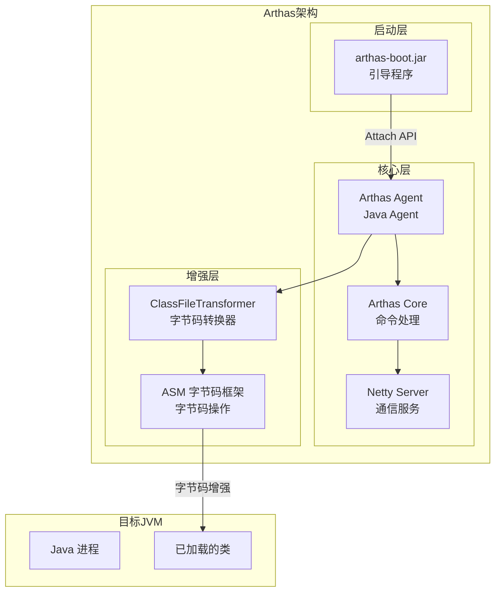
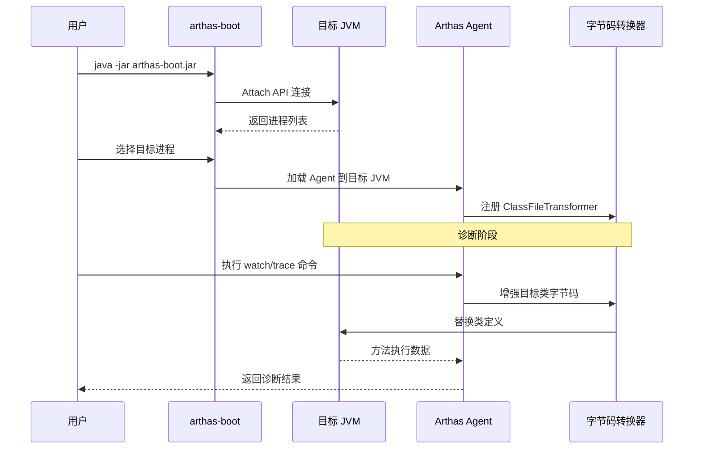

# Arthas Java 诊断工具详解

## 一、概述

### 1.1 什么是 Arthas？

Arthas 是阿里巴巴开源的 Java 应用诊断工具，能够在**不修改代码、不重启应用**的情况下，对线上问题进行快速诊断和定位。

| 属性 | 说明 |
|------|------|
| **开源方** | 阿里巴巴 |
| **发布时间** | 2018 年 |
| **支持 JDK** | JDK 6+（推荐 JDK 11+） |
| **支持平台** | Linux / Mac / Windows |
| **兼容框架** | Spring Boot、Dubbo、Tomcat 等主流框架 |

### 1.2 解决的核心痛点

| 痛点 | 传统方式 | Arthas 方式 |
|------|----------|-------------|
| **CPU 飙高** | top + jstack 手动抓栈 | `thread -n 3` 一键定位 |
| **接口响应慢** | 加日志 → 重新发布 | `trace` 追踪耗时代码 |
| **代码未生效** | 怀疑人生 | `jad` 反编译确认 |
| **异常信息不全** | 日志缺失 | `watch` 实时观测 |
| **紧急修复** | 重启服务 | `redefine` 热加载 |

### 1.3 核心特性

| 特性 | 说明 |
|------|------|
| **无侵入** | 无需修改代码、无需重启应用 |
| **实时诊断** | 直接 attach 到运行中的 JVM 进程 |
| **功能全面** | 覆盖类查询、方法监控、性能分析、热更新等 |
| **易用性强** | 命令行交互，支持 Tab 自动补全 |
| **可扩展** | 支持自定义命令插件 |

---

## 二、核心原理

### 2.1 技术架构

Arthas 基于 **Java Instrumentation API** 和 **ASM 字节码框架** 实现运行时诊断能力。



### 2.2 工作原理

**核心机制**：

| 机制 | 说明 |
|------|------|
| **Attach API** | 动态连接到运行中的 JVM 进程，加载 Agent |
| **Instrumentation** | JVM 提供的字节码操作接口，支持运行时类增强 |
| **ClassFileTransformer** | 类文件转换器，在类加载时修改字节码 |
| **ASM** | 高性能字节码操作框架，实现方法插桩 |

**工作流程**：



### 2.3 字节码增强原理

当执行 `watch`、`trace` 等命令时，Arthas 通过字节码增强技术在目标方法前后插入监控代码：

```
原始方法：
void getUser() {
    // 业务逻辑
}

增强后方法：
void getUser() {
    // 记录开始时间、入参
    long start = System.currentTimeMillis();
    // 原始业务逻辑
    // ...
    // 记录结束时间、返回值、耗时
    long cost = System.currentTimeMillis() - start;
}
```

---

## 三、安装与启动

### 3.1 快速安装

```bash
# 下载 arthas-boot.jar
curl -O https://arthas.aliyun.com/arthas-boot.jar

# 启动并选择目标进程
java -jar arthas-boot.jar
```

### 3.2 启动流程

```bash
$ java -jar arthas-boot.jar
[INFO] arthas-boot version: 3.7.6
[INFO] Found existing java process, please choose one.
* [1]: 12345 com.example.Application
  [2]: 67890 org.apache.catalina.startup.Bootstrap

# 输入序号选择进程
1

[INFO] Attach process 12345 success.
[INFO] arthas server started on port 3658
```

### 3.3 常用启动参数

| 参数 | 说明 |
|------|------|
| `--target-ip` | 指定监听 IP |
| `--telnet-port` | 指定 Telnet 端口（默认 3658） |
| `--http-port` | 指定 HTTP 端口（默认 8563） |
| `--pid` | 直接指定进程 ID |

### 3.4 退出方式

| 命令 | 说明 |
|------|------|
| `quit` 或 `exit` | 退出当前客户端（不影响目标进程） |
| `stop` | 完全关闭 Arthas（detach 目标进程） |

---

## 四、常用命令详解

### 4.1 命令概览

| 命令 | 功能 | 典型场景 |
|------|------|----------|
| `dashboard` | 系统实时面板 | 快速了解 JVM 整体状态 |
| `thread` | 线程分析 | CPU 飙高、死锁排查 |
| `trace` | 方法耗时追踪 | 接口慢、性能瓶颈定位 |
| `watch` | 方法观测 | 查看入参、返回值、异常 |
| `stack` | 方法调用链 | 查看方法被谁调用 |
| `jad` | 反编译 | 确认线上代码版本 |
| `sc` | 查找类 | 类冲突排查 |
| `sm` | 查找方法 | 查看方法签名 |
| `monitor` | 方法统计 | 调用量、成功率监控 |
| `tt` | 时光隧道 | 请求记录与回放 |
| `profiler` | 火焰图 | CPU 性能分析 |
| `heapdump` | 堆转储 | 内存泄漏分析 |
| `redefine` | 热更新 | 紧急修复线上 Bug |

### 4.2 dashboard - 系统实时面板

**功能**：综合显示线程、内存、GC、运行时信息。

```bash
# 实时刷新面板
dashboard

# 指定刷新间隔和次数
dashboard -i 2000 -n 5
```

**面板内容**：

| 区域 | 信息 |
|------|------|
| **线程区** | ID、名称、状态、CPU 使用率 |
| **内存区** | 堆内存、非堆内存各区域使用情况 |
| **GC 区** | GC 次数、GC 时间 |
| **运行时** | JDK 版本、操作系统、类加载信息 |

### 4.3 thread - 线程分析

**功能**：查看线程信息，排查 CPU 飙高和死锁问题。

```bash
# 列出所有线程
thread

# 查看 CPU 占用最高的 3 个线程
thread -n 3

# 查看指定线程堆栈
thread <线程ID>

# 检测死锁
thread -b

# 查看阻塞线程
thread --state BLOCKED
```

**线程状态说明**：

| 状态 | 说明 |
|------|------|
| **RUNNABLE** | 运行中或等待 CPU |
| **BLOCKED** | 等待获取锁 |
| **WAITING** | 无限期等待 |
| **TIMED_WAITING** | 有限期等待 |
| **TERMINATED** | 已终止 |

### 4.4 trace - 方法耗时追踪

**功能**：追踪方法内部调用路径及各节点耗时，定位性能瓶颈。

```bash
# 追踪方法耗时
trace com.example.UserService getUserById

# 追踪耗时超过 100ms 的调用
trace com.example.UserService getUserById '#cost > 100'

# 追踪多层调用
trace com.example.UserService * '#cost > 50' -n 5

# 排除特定类
trace com.example.UserService getUserById --exclude-class-pattern com.example.filter.*
```

**输出示例**：

```
`---[15.23ms] com.example.UserService:getUserById()
    +---[10.15ms] com.example.dao.UserDao:findById()
    |   `---[8.32ms] com.example.mapper.UserMapper:selectById()
    `---[3.21ms] com.example.cache.RedisCache:get()
```

### 4.5 watch - 方法观测

**功能**：观察方法执行的入参、返回值、异常等信息。

```bash
# 观察入参和返回值
watch com.example.UserService getUserById "{params, returnObj}" -x 2

# 观察异常（仅在抛异常时触发）
watch com.example.UserService getUserById "{params, throwExp}" -e -x 2

# 观察执行耗时
watch com.example.UserService getUserById "{params, returnObj, #cost}" -x 2

# 条件过滤：只观察第一个参数等于 100 的调用
watch com.example.UserService getUserById "{params, returnObj}" "params[0]==100" -x 2

# 观察方法执行前后的对象变化
watch com.example.UserService getUserById "{target, params, returnObj}" -x 2 -b -s
```

**OGNL 表达式变量**：

| 变量 | 说明 |
|------|------|
| `params` | 方法入参数组 |
| `returnObj` | 方法返回值 |
| `throwExp` | 抛出的异常 |
| `target` | 当前对象 |
| `#cost` | 方法执行耗时（ms） |

**常用参数**：

| 参数 | 说明 |
|------|------|
| `-x 2` | 对象遍历深度（默认 1，建议 2-3） |
| `-n 5` | 捕获次数限制 |
| `-e` | 仅捕获异常情况 |
| `-b` | 方法执行前观察 |
| `-s` | 方法执行后观察 |

### 4.6 stack - 方法调用链

**功能**：查看方法被调用的完整链路。

```bash
# 查看方法调用链
stack com.example.UserService getUserById

# 条件过滤
stack com.example.UserService getUserById "params[0]==100"

# 限制次数
stack com.example.UserService getUserById -n 3
```

### 4.7 jad - 反编译

**功能**：反编译 JVM 中已加载的类，确认线上代码版本。

```bash
# 反编译整个类
jad com.example.UserService

# 仅反编译指定方法
jad com.example.UserService getUserById

# 仅输出源码（不含行号等信息）
jad --source-only com.example.UserService
```

### 4.8 sc / sm - 类与方法查找

**sc（Search Class）**：

```bash
# 模糊搜索类
sc *UserService

# 查看类详细信息
sc -d com.example.UserService

# 查看类加载器信息
sc -c <classLoaderHash> com.example.UserService
```

**sm（Search Method）**：

```bash
# 查看类的方法列表
sm com.example.UserService

# 查看方法详细信息
sm -d com.example.UserService getUserById
```

### 4.9 monitor - 方法统计

**功能**：统计方法调用量、成功率、平均耗时等。

```bash
# 每 60 秒统计一次
monitor -c 60 com.example.UserService getUserById
```

**统计指标**：

| 指标 | 说明 |
|------|------|
| **timestamp** | 时间戳 |
| **class** | 类名 |
| **method** | 方法名 |
| **total** | 调用次数 |
| **success** | 成功次数 |
| **fail** | 失败次数 |
| **avg-rt(ms)** | 平均响应时间 |
| **fail-rate** | 失败率 |

### 4.10 tt - 时光隧道

**功能**：记录方法调用，支持后续回放。

```bash
# 记录方法调用
tt -t com.example.UserService getUserById

# 查看记录列表
tt -l

# 查看指定记录详情
tt -i 1000

# 回放指定记录
tt -i 1000 -p

# 删除记录
tt -d 1000
```

### 4.11 profiler - 火焰图

**功能**：生成 CPU 火焰图，分析性能热点。

```bash
# 开始采样
profiler start

# 查看状态
profiler status

# 停止采样并生成火焰图
profiler stop

# 指定输出格式
profiler stop --format html

# 采样指定包
profiler start --include "com.example.*"
```

### 4.12 heapdump - 堆转储

**功能**：导出堆内存快照，分析内存泄漏。

```bash
# 导出堆转储文件
heapdump /tmp/dump.hprof

# 仅导出存活对象
heapdump --live /tmp/dump-live.hprof
```

### 4.13 redefine - 热更新

**功能**：热更新类定义，紧急修复线上 Bug。

```bash
# 1. 反编译源码
jad --source-only com.example.UserService > /tmp/UserService.java

# 2. 修改代码后编译
mc /tmp/UserService.java -d /tmp

# 3. 热加载
redefine /tmp/com/example/UserService.class
```

> **注意**：热更新有风险，限制较多（不能修改方法签名、不能增删字段等），仅用于紧急修复。

---

## 五、实战案例

### 5.1 案例 1：CPU 飙高排查

**问题**：线上服务 CPU 使用率突然飙升到 100%。

```bash
# 1. 查看系统面板
dashboard

# 2. 查看 CPU 占用最高的线程
thread -n 3

# 输出示例：
# "pool-1-thread-5" Id=25 RUNNABLE
#     at com.example.service.OrderService.calculate(OrderService.java:45)

# 3. 查看线程详细堆栈
thread 25

# 4. 反编译问题方法
jad com.example.service.OrderService calculate

# 5. 分析代码逻辑，定位问题
```

### 5.2 案例 2：接口响应慢

**问题**：用户反馈接口响应时间超过 5 秒。

```bash
# 1. 追踪接口方法耗时
trace com.example.controller.UserController getProfile '#cost > 1000'

# 输出示例：
# `---[3521ms] com.example.controller.UserController:getProfile()
#     +---[2800ms] com.example.service.UserService:getUserInfo()
#     `---[500ms] com.example.service.OrderService:getOrders()

# 2. 继续追踪慢方法
trace com.example.service.UserService getUserInfo '#cost > 500'

# 3. 定位到数据库查询慢
# 4. 使用 watch 查看参数
watch com.example.service.UserService getUserInfo "{params, returnObj}" -x 2
```

### 5.3 案例 3：代码未生效

**问题**：发布后代码逻辑似乎没有变化。

```bash
# 1. 反编译线上代码
jad com.example.service.UserService processOrder

# 2. 对比本地代码确认差异
# 3. 检查类加载器
sc -d com.example.service.UserService

# 4. 确认是否加载了正确的 jar 包
```

### 5.4 案例 4：异常排查

**问题**：接口偶发异常，日志信息不足。

```bash
# 1. 监控方法异常
watch com.example.service.PaymentService pay "{params, throwExp}" -e -x 3

# 2. 查看完整调用链
stack com.example.service.PaymentService pay -n 5

# 3. 记录问题请求
tt -t com.example.service.PaymentService pay

# 4. 分析记录详情
tt -i 1000
```

### 5.5 案例 5：死锁排查

**问题**：应用出现线程阻塞，疑似死锁。

```bash
# 1. 检测死锁
thread -b

# 输出示例：
# Found one Java-level deadlock:
# =============================
# "thread-A" waiting to lock object 0x00000000 which is held by "thread-B"
# "thread-B" waiting to lock object 0x00000000 which is held by "thread-A"

# 2. 查看相关线程堆栈
thread <thread-A-id>
thread <thread-B-id>
```

---

## 六、最佳实践与注意事项

### 6.1 最佳实践

| 实践 | 说明 |
|------|------|
| **限制捕获次数** | 使用 `-n` 参数避免刷屏和性能影响 |
| **及时清理** | 排查完成后执行 `reset` 或 `stop` 清理增强代码 |
| **权限控制** | 生产环境限制使用权限，避免误操作 |
| **先看面板** | 先用 `dashboard` 了解整体状态，再针对性排查 |
| **分层追踪** | 从入口方法开始，逐层深入追踪 |

### 6.2 注意事项

| 注意点 | 说明 |
|------|------|
| **性能影响** | `watch`、`trace` 会增强字节码，排查后及时关闭 |
| **安全风险** | 禁止将 Arthas 暴露在公网，建议通过隧道访问 |
| **命令冲突** | `redefine` 与 `watch`/`trace` 冲突，使用前需 `reset` |
| **权限要求** | 执行用户需与目标进程用户一致或为 root |
| **热更新风险** | 仅限紧急修复，有限制条件，不建议常规使用 |

### 6.3 常见问题

| 问题 | 解决方案 |
|------|----------|
| **Attach 失败** | 检查用户权限，确保与目标进程用户一致 |
| **找不到类** | 使用 `sc -d` 检查类加载器，确认类是否加载 |
| **命令无输出** | 检查类名/方法名是否正确，确认方法有被调用 |
| **输出过多** | 使用 `-n` 限制次数，使用条件过滤 |

---

## 七、命令速查表

```
┌─────────────────────────────────────────────────────────────┐
│                    Arthas 常用命令速查                        │
├─────────────────────────────────────────────────────────────┤
│  dashboard    → 系统实时面板                                  │
│  thread -n 3  → CPU 占用最高的 3 个线程                       │
│  thread -b    → 检测死锁                                     │
│  trace        → 方法耗时追踪                                  │
│  watch        → 观测入参/返回值/异常                          │
│  stack        → 方法调用链                                    │
│  jad          → 反编译类                                      │
│  sc -d        → 查看类详情                                    │
│  sm -d        → 查看方法详情                                  │
│  monitor      → 方法调用统计                                  │
│  tt           → 时光隧道（记录与回放）                         │
│  profiler     → 生成火焰图                                    │
│  heapdump     → 导出堆转储                                    │
│  redefine     → 热更新类                                      │
│  reset        → 重置增强的类                                  │
│  stop         → 完全关闭 Arthas                               │
└─────────────────────────────────────────────────────────────┘
```

---

## 参考资料

- [Arthas 官方文档](https://arthas.aliyun.com/doc/)
- [Arthas GitHub 仓库](https://github.com/alibaba/arthas)
- [Arthas 用户问题汇总](https://arthas.aliyun.com/doc/expert/user-question-history.html)
