# Nacos 注册配置中心详解

## 一、概述

### 1.1 什么是 Nacos

**Nacos（Dynamic Naming and Configuration Service）** 是阿里巴巴开源的服务治理中间件，致力于注册与发现、配置和管理微服务。Nacos 提供了一组简单易用的特性集，帮助开发者快速实现动态服务注册与发现、服务配置、服务元数据及流量管理。

**核心定位：** 一站式服务治理平台，提供服务注册与发现和配置管理能力。

### 1.2 Nacos 核心功能

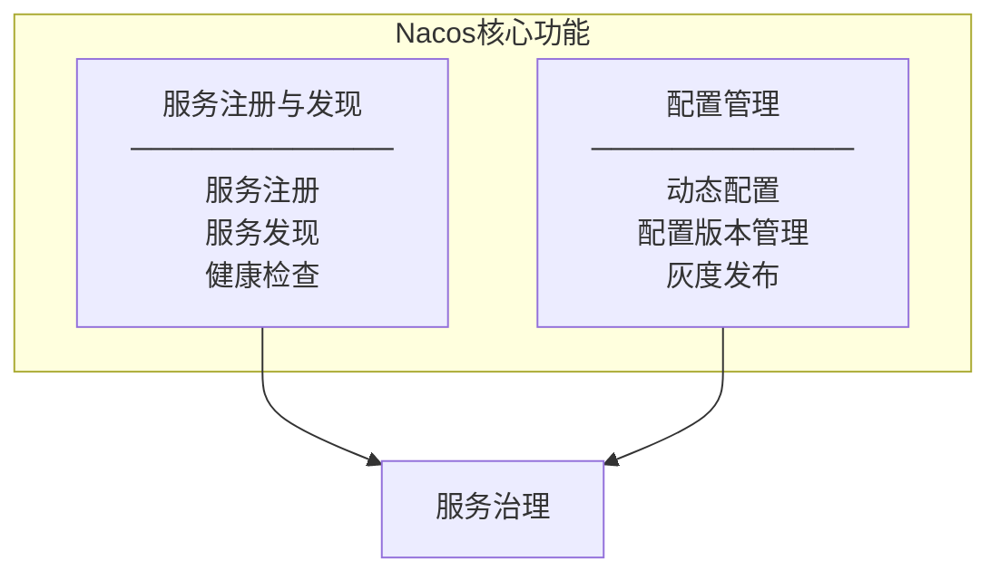

| 功能模块 | 核心能力 | 说明 |
|----------|----------|------|
| **服务注册与发现** | 服务注册、服务发现、健康检查（主动探测 + 心跳） | 支持基于 DNS 和 RPC 的服务注册与发现 |
| **配置管理** | 动态配置、版本管理、灰度发布 | 配置变更实时推送，无需重启 |

### 1.3 Nacos vs 其他注册中心

| 对比维度 | Nacos | Eureka | Consul | ZooKeeper |
|----------|-------|--------|--------|-----------|
| **一致性协议** | AP/CP 可切换 | AP | CP | CP |
| **健康检查** | 主动探测 + 心跳 | 心跳 | TCP/HTTP | 心跳 |
| **配置中心** | 内置支持 | 无 | 支持 | 无 |
| **负载均衡** | 权重配置 | Ribbon | Fabio | 无 |
| **多数据中心** | 支持 | 支持 | 支持 | 支持 |
| **管理界面** | 完善 | 简单 | 完善 | 无 |

---

## 二、核心概念

### 2.1 数据模型

Nacos 采用三层隔离模型：Namespace → Group → Data ID / Service Name

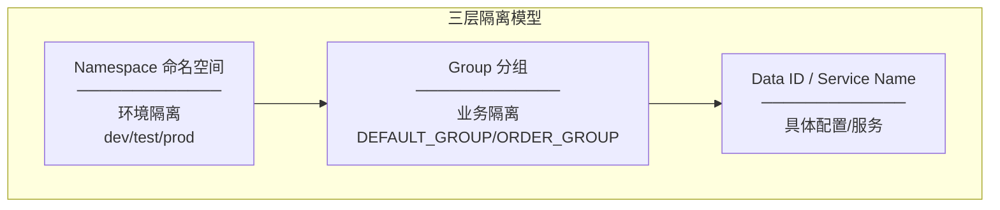

### 2.2 Namespace（命名空间）

**作用：** 最顶层的隔离维度，用于实现不同环境、不同租户之间的完全隔离。

| 特性 | 说明 |
|------|------|
| **隔离级别** | 物理隔离，不同 Namespace 之间数据完全隔离 |
| **默认值** | `public`（保留空间） |
| **典型用途** | 环境隔离（dev/test/prod）、租户隔离 |

**使用示例：**

```yaml
spring:
  cloud:
    nacos:
      config:
        namespace: dev-namespace-id  # 开发环境
      discovery:
        namespace: dev-namespace-id
```

### 2.3 Group（分组）

**作用：** 在同一 Namespace 内，对服务或配置进行逻辑分类。

| 特性 | 说明 |
|------|------|
| **隔离级别** | 逻辑隔离，同一 Namespace 内的二级隔离 |
| **默认值** | `DEFAULT_GROUP` |
| **典型用途** | 业务线隔离、项目隔离 |

**使用示例：**

```yaml
spring:
  cloud:
    nacos:
      config:
        group: ORDER_GROUP  # 订单业务组
```

### 2.4 Data ID（配置 ID）

**作用：** 配置的唯一标识，用于定位具体的配置文件。

**命名规则：**

```
${prefix}-${spring.profiles.active}.${file-extension}
```

| 组成部分 | 说明 |
|----------|------|
| `prefix` | 默认为 `spring.application.name` |
| `spring.profiles.active` | 环境标识（可选） |
| `file-extension` | 配置文件格式（properties/yaml） |

**示例：**

| Data ID | 说明 |
|---------|------|
| `order-service.yaml` | 订单服务默认配置 |
| `order-service-dev.yaml` | 订单服务开发环境配置 |
| `order-service-prod.yaml` | 订单服务生产环境配置 |

---

## 三、服务注册与发现

### 3.1 服务注册流程

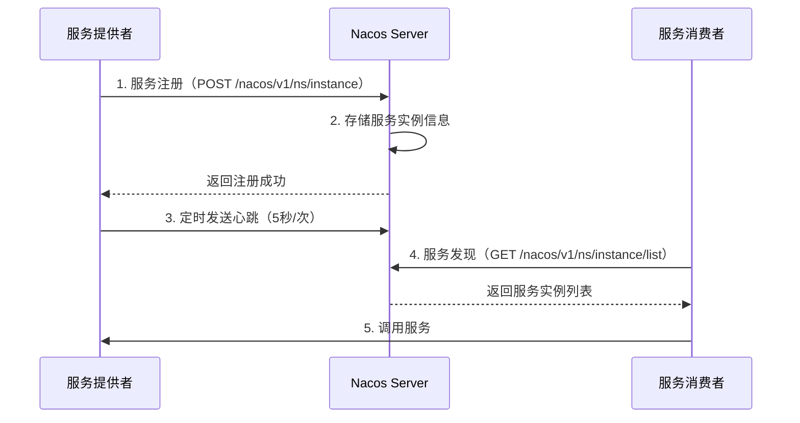

### 3.2 健康检查机制

Nacos 支持两种服务实例类型，对应不同的健康检查机制：

| 实例类型 | 健康检查机制 | 特点 | 适用场景 |
|----------|--------------|------|----------|
| **临时实例（Ephemeral）** | 客户端心跳 | 实例下线后自动剔除 | 微服务场景（默认） |
| **持久化实例（Persistent）** | 服务端主动探测 | 实例下线后标记不健康，不剔除 | 基础设施服务 |

#### 3.2.1 临时实例健康检查

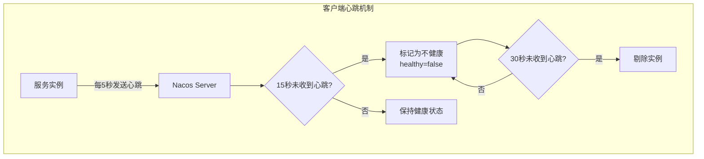

**心跳参数配置：**

```yaml
spring:
  cloud:
    nacos:
      discovery:
        heart-beat-interval: 5000    # 心跳间隔（毫秒）
        heart-beat-timeout: 15000    # 心跳超时（毫秒）
        ip-delete-timeout: 30000     # 实例剔除超时（毫秒）
```

#### 3.2.2 持久化实例健康检查

持久化实例由 Nacos Server 主动发起健康检查：

| 检查方式 | 说明 |
|----------|------|
| **TCP 检查** | 尝试建立 TCP 连接，成功则健康 |
| **HTTP 检查** | 发送 HTTP 请求，返回 200 则健康 |

### 3.3 服务发现流程

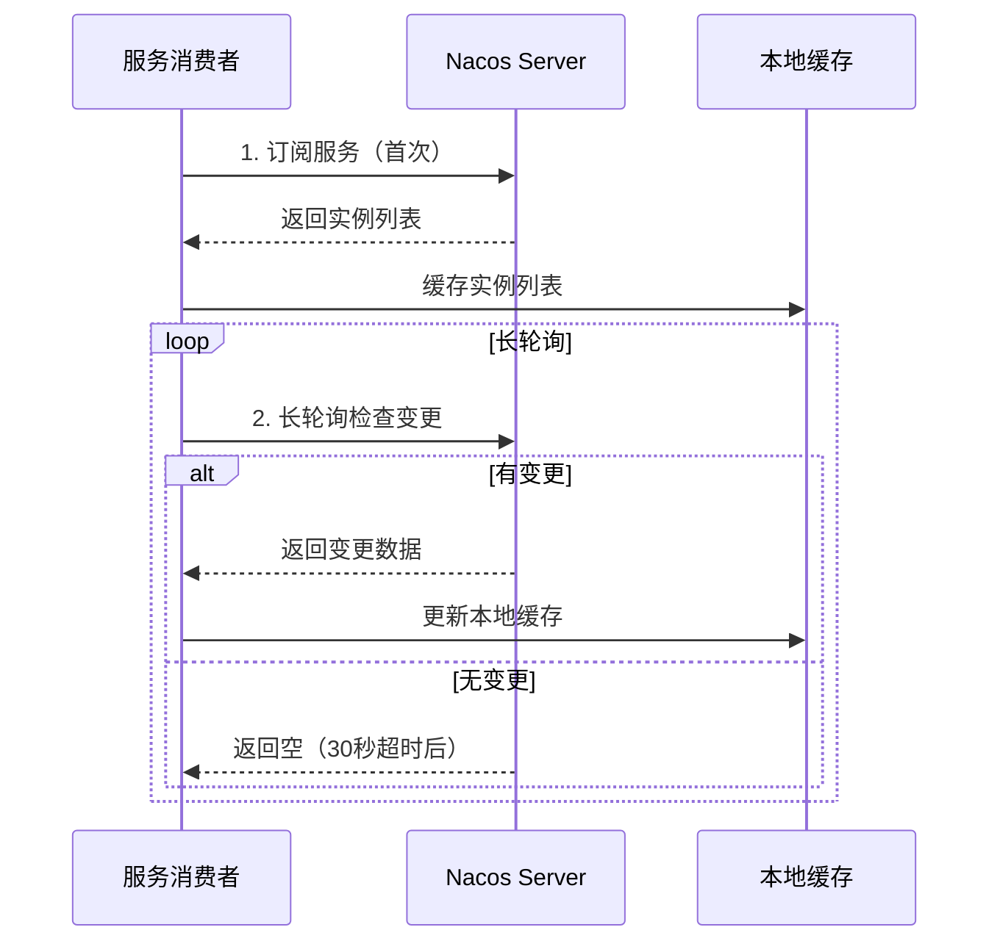

**服务发现特点：**

| 特点 | 说明 |
|------|------|
| **本地缓存** | 消费者缓存服务实例列表，提高性能 |
| **长轮询机制** | 默认 30 秒超时，有变更立即返回，无变更等待超时后返回空响应 |
| **推送变更** | 服务实例变更时主动推送给订阅者 |

---

## 四、配置管理

### 4.1 配置管理架构

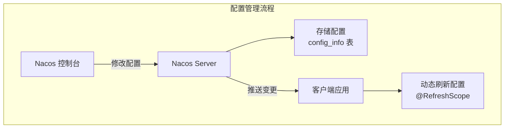

### 4.2 配置加载流程

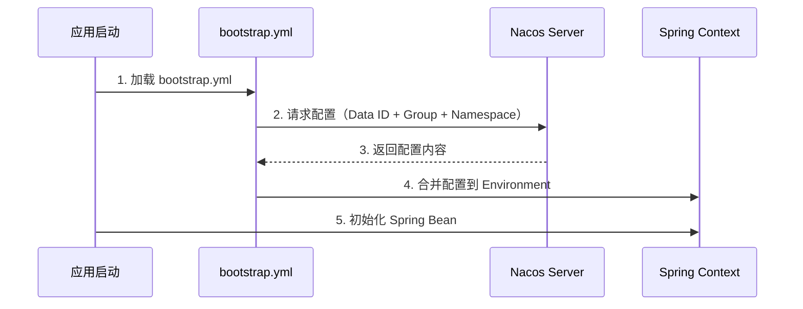

**关键点：** bootstrap.yml 在 application.yml 之前加载，用于初始化配置中心连接。

### 4.3 动态配置刷新

Nacos 支持配置变更后自动推送到客户端，实现配置热更新：

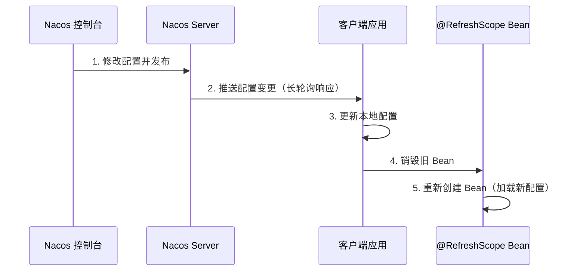

**使用 @RefreshScope 实现动态刷新：**

```java
@RestController
@RefreshScope
public class ConfigController {
    
    @Value("${app.config.timeout:3000}")
    private int timeout;
    
    @GetMapping("/config")
    public String getConfig() {
        return "timeout: " + timeout;
    }
}
```

### 4.4 配置版本管理

Nacos 提供配置版本管理能力：

| 功能 | 说明 |
|------|------|
| **历史版本** | 保存配置的历史修改记录（默认保留 30 天） |
| **回滚** | 支持一键回滚到指定历史版本 |
| **变更对比** | 可视化对比不同版本的配置差异 |

### 4.5 灰度发布

Nacos 支持配置的灰度发布：

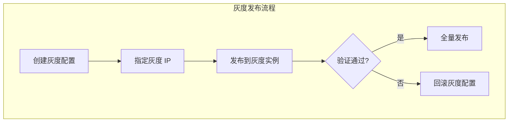

**灰度发布步骤：**

1. 在 Nacos 控制台选择配置 → 高级选项 → 灰度发布
2. 输入目标实例 IP
3. 发布配置，仅指定实例生效
4. 验证通过后全量发布

---

## 五、架构设计

### 5.1 整体架构

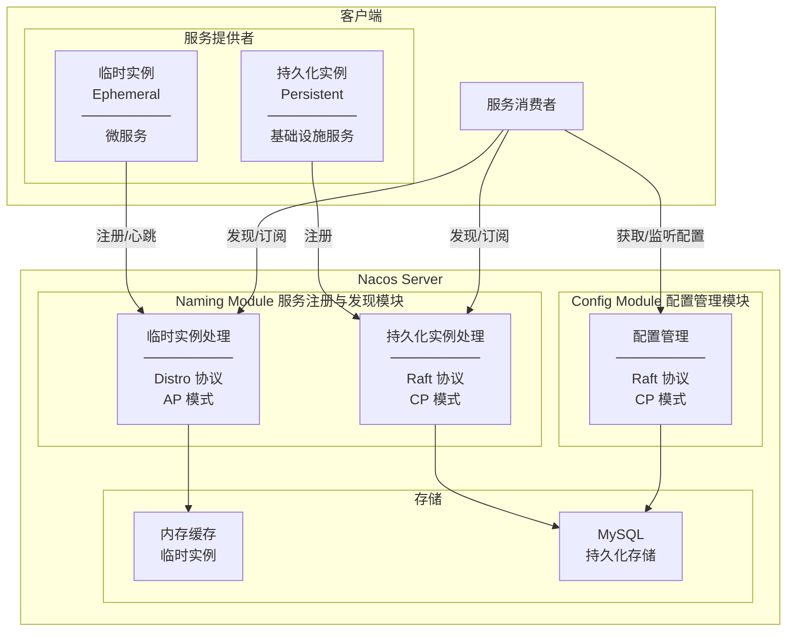

**架构说明：**

| 模块 | 实例类型 | 一致性协议 | 存储位置 | 特点 |
|------|----------|------------|----------|------|
| **Naming Module** | 临时实例 | Distro（AP） | 内存缓存 | 高可用、最终一致、自动剔除 |
| **Naming Module** | 持久化实例 | Raft（CP） | MySQL | 强一致、不自动剔除 |
| **Config Module** | - | Raft（CP） | MySQL | 强一致、配置版本管理 |

### 5.2 AP/CP 模式切换

Nacos 的 AP/CP 模式是**按模块独立工作**的，不存在全局切换：

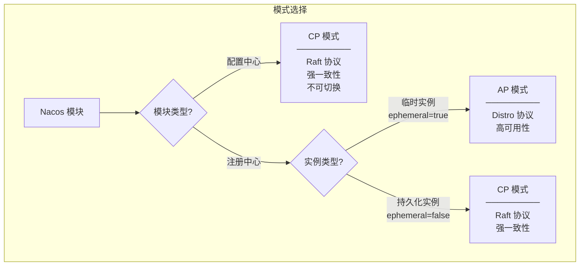

| 模块 | 实例类型 | 一致性协议 | 模式 | 可否切换 |
|------|----------|------------|------|----------|
| **配置中心** | - | Raft | CP | 不可切换，始终 CP |
| **注册中心** | 临时实例（默认） | Distro | AP | 通过 `ephemeral` 参数切换 |
| **注册中心** | 持久化实例 | Raft | CP | 通过 `ephemeral` 参数切换 |

**关键结论：**

1. **配置中心始终使用 CP 模式**：配置数据需要强一致性保证，不可切换
2. **注册中心的模式由实例类型决定**：
   - `ephemeral=true`（默认）：临时实例，使用 AP 模式
   - `ephemeral=false`：持久化实例，使用 CP 模式
3. **两者独立工作**：注册中心可以 AP/CP 模式运行，同时配置中心以 CP 模式运行

**实例类型配置：**

```yaml
spring:
  cloud:
    nacos:
      discovery:
        ephemeral: true   # true=AP模式（临时实例），false=CP模式（持久化实例）
```

**serverMode API 说明：**

```bash
# 此 API 主要用于集群运维，切换注册中心的默认行为
# 注意：不影响配置中心，配置中心始终使用 CP/Raft
curl -X PUT "localhost:8848/nacos/v1/ns/operator/switches?entry=serverMode&value=CP"
```

> **注意**：`serverMode` API 切换的是注册中心的全局默认行为，但配置中心不受影响。推荐通过客户端 `ephemeral` 参数控制实例类型，而非使用全局 API。

### 5.3 Distro 协议（AP 模式）

Distro 是阿里巴巴自研的最终一致性协议，用于服务注册与发现：

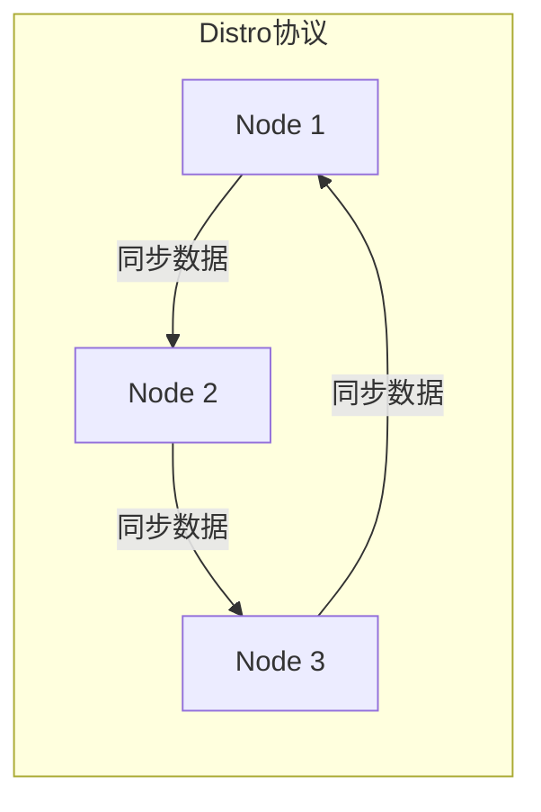

**Distro 协议特点：**

| 特点 | 说明 |
|------|------|
| **去中心化** | 所有节点平等，无 Leader |
| **最终一致** | 数据异步同步，最终达到一致 |
| **高可用** | 任一节点宕机不影响服务 |
| **数据分片** | 每个节点负责部分数据 |

### 5.4 Raft 协议（CP 模式）

Raft 协议用于配置中心，保证强一致性：

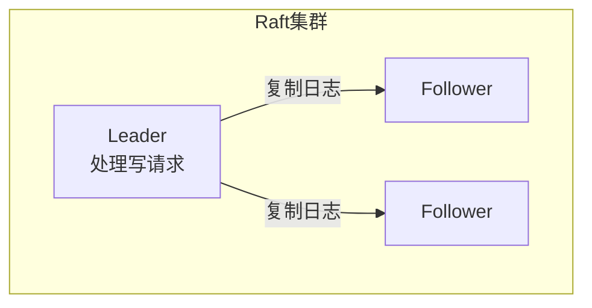

**Raft 协议特点：**

| 特点 | 说明 |
|------|------|
| **强一致性** | 写操作需多数节点确认 |
| **Leader 选举** | 自动选举 Leader 处理写请求 |
| **日志复制** | Leader 将操作日志复制到 Follower |

---

## 六、Spring Cloud Alibaba 集成

### 6.1 版本兼容性

Spring Cloud Alibaba 与 Spring Boot、Spring Cloud 版本强耦合：

| Spring Boot | Spring Cloud | Spring Cloud Alibaba | Nacos Server |
|-------------|--------------|---------------------|--------------|
| 2.6.x ~ 2.7.x | 2021.0.x | 2021.0.5.0 ~ 2021.0.7.0 | ≥ 2.0.0 |
| 3.0.x ~ 3.2.x | 2022.0.x | 2022.0.0.0 ~ 2022.0.2.0 | ≥ 2.2.0 |

### 6.2 Maven 依赖

```xml
<properties>
    <spring-boot.version>2.7.18</spring-boot.version>
    <spring-cloud.version>2021.0.7</spring-cloud.version>
    <spring-cloud-alibaba.version>2021.0.5.0</spring-cloud-alibaba.version>
</properties>

<dependencyManagement>
    <dependencies>
        <dependency>
            <groupId>org.springframework.boot</groupId>
            <artifactId>spring-boot-dependencies</artifactId>
            <version>${spring-boot.version}</version>
            <type>pom</type>
            <scope>import</scope>
        </dependency>
        <dependency>
            <groupId>org.springframework.cloud</groupId>
            <artifactId>spring-cloud-dependencies</artifactId>
            <version>${spring-cloud.version}</version>
            <type>pom</type>
            <scope>import</scope>
        </dependency>
        <dependency>
            <groupId>com.alibaba.cloud</groupId>
            <artifactId>spring-cloud-alibaba-dependencies</artifactId>
            <version>${spring-cloud-alibaba.version}</version>
            <type>pom</type>
            <scope>import</scope>
        </dependency>
    </dependencies>
</dependencyManagement>

<dependencies>
    <!-- 服务注册与发现 -->
    <dependency>
        <groupId>com.alibaba.cloud</groupId>
        <artifactId>spring-cloud-starter-alibaba-nacos-discovery</artifactId>
    </dependency>
    
    <!-- 配置中心 -->
    <dependency>
        <groupId>com.alibaba.cloud</groupId>
        <artifactId>spring-cloud-starter-alibaba-nacos-config</artifactId>
    </dependency>
</dependencies>
```

### 6.3 完整配置示例

**Spring Boot 2.4+ 推荐使用 spring.config.import：**

```yaml
# application.yml
spring:
  application:
    name: order-service
  cloud:
    nacos:
      # 公共配置（discovery 和 config 共享）
      server-addr: 127.0.0.1:8848
      username: nacos
      password: nacos
      
      # 服务注册与发现配置
      discovery:
        namespace: dev-namespace-id
        group: DEFAULT_GROUP
        service: ${spring.application.name}
        weight: 1
        enabled: true
        ephemeral: true  # 临时实例
      
      # 配置中心配置
      config:
        namespace: dev-namespace-id
        group: ORDER_GROUP
        file-extension: yaml
        refresh-enabled: true
  
  # 配置导入（从 Nacos 加载配置）
  config:
    import:
      - nacos:order-service.yaml?refreshEnabled=true
      - nacos:order-service-db.yaml?refreshEnabled=true
```

### 6.4 配置项详解

#### 6.4.1 公共配置

| 配置项 | 说明 | 默认值 |
|--------|------|--------|
| `spring.cloud.nacos.server-addr` | Nacos Server 地址 | `127.0.0.1:8848` |
| `spring.cloud.nacos.username` | 用户名 | `nacos` |
| `spring.cloud.nacos.password` | 密码 | `nacos` |

#### 6.4.2 注册中心配置（服务注册与发现）

| 配置项 | 说明 | 默认值 |
|--------|------|--------|
| `spring.cloud.nacos.discovery.namespace` | 命名空间 ID | `public` |
| `spring.cloud.nacos.discovery.group` | 分组 | `DEFAULT_GROUP` |
| `spring.cloud.nacos.discovery.service` | 服务名称 | `${spring.application.name}` |
| `spring.cloud.nacos.discovery.weight` | 权重（1-100） | `1` |
| `spring.cloud.nacos.discovery.enabled` | 是否启用服务注册 | `true` |
| `spring.cloud.nacos.discovery.ephemeral` | 是否为临时实例 | `true` |
| `spring.cloud.nacos.discovery.heart-beat-interval` | 心跳间隔（毫秒） | `5000` |
| `spring.cloud.nacos.discovery.heart-beat-timeout` | 心跳超时（毫秒） | `15000` |
| `spring.cloud.nacos.discovery.ip-delete-timeout` | 实例剔除超时（毫秒） | `30000` |

#### 6.4.3 配置中心配置（配置管理）

| 配置项 | 说明 | 默认值 |
|--------|------|--------|
| `spring.cloud.nacos.config.namespace` | 命名空间 ID | `public` |
| `spring.cloud.nacos.config.group` | 分组 | `DEFAULT_GROUP` |
| `spring.cloud.nacos.config.file-extension` | 配置文件格式 | `properties` |
| `spring.cloud.nacos.config.refresh-enabled` | 是否启用动态刷新 | `true` |
| `spring.cloud.nacos.config.shared-configs` | 共享配置 | - |
| `spring.cloud.nacos.config.extension-configs` | 扩展配置 | - |

### 6.5 配置导入说明

Spring Boot 2.4+ 使用 `spring.config.import` 从 Nacos 加载配置：

```yaml
spring:
  config:
    import:
      # 格式：nacos:${dataId}?group=${group}&refreshEnabled=${refresh}
      - nacos:order-service.yaml?group=ORDER_GROUP&refreshEnabled=true
      - nacos:order-service-db.yaml?refreshEnabled=true
```

**参数说明：**

| 参数 | 说明 |
|------|------|
| `dataId` | 配置 ID（必填） |
| `group` | 分组（可选，默认 DEFAULT_GROUP） |
| `refreshEnabled` | 是否启用动态刷新（可选，默认 true） |

---

## 七、集群部署

### 7.1 集群架构

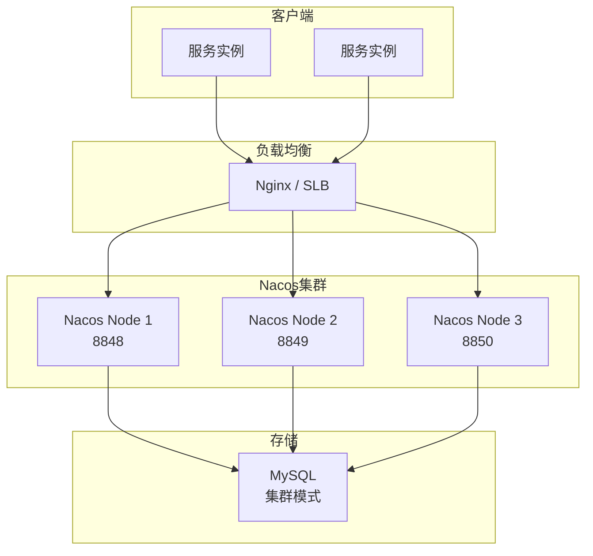

### 7.2 集群配置

#### 7.2.1 配置文件说明

Nacos 集群需要配置以下核心文件：

| 配置文件 | 位置 | 说明 |
|----------|------|------|
| `application.properties` | `conf/` | 主配置文件，数据库连接、集群节点等 |
| `cluster.conf` | `conf/` | 集群节点列表（Nacos 2.x） |
| `nacos-mysql.sql` | `mysql/` | 数据库初始化脚本 |

#### 7.2.2 数据库初始化

**1. 创建数据库：**

```sql
CREATE DATABASE nacos_config;
USE nacos_config;
```

**2. 执行初始化脚本：**

Nacos 提供了数据库初始化脚本，位于 `conf/mysql-schema.sql`（Nacos 2.x）或 `conf/nacos-mysql.sql`（Nacos 1.x）：

```bash
# 执行初始化脚本
mysql -u root -p nacos_config < conf/mysql-schema.sql
```

**初始化脚本会创建以下核心表：**

| 表名 | 说明 |
|------|------|
| `config_info` | 配置信息主表 |
| `config_info_aggr` | 配置聚合表 |
| `config_info_beta` | Beta 配置表 |
| `config_info_tag` | 配置标签表 |
| `config_tags_relation` | 配置标签关系表 |
| `group_capacity` | 分组容量表 |
| `his_config_info` | 配置历史表 |
| `tenant_capacity` | 租户容量表 |
| `tenant_info` | 租户信息表 |
| `users` | 用户表 |
| `roles` | 角色表 |
| `permissions` | 权限表 |

#### 7.2.3 集群节点配置

**cluster.conf 配置（Nacos 2.x）：**

```conf
# cluster.conf
# 格式：IP:端口
192.168.1.101:8848
192.168.1.102:8848
192.168.1.103:8848
```

**注意：** 
- 端口必须一致（默认 8848）
- 不能使用 `localhost` 或 `127.0.0.1`，必须使用实际 IP 地址

#### 7.2.4 application.properties 配置

```properties
# application.properties

# 数据库配置（必须配置，集群模式不支持内嵌数据库）
spring.datasource.platform=mysql
db.num=1
db.url.0=jdbc:mysql://192.168.1.100:3306/nacos_config?characterEncoding=utf8&connectTimeout=1000&socketTimeout=3000&autoReconnect=true&useUnicode=true&useSSL=false&serverTimezone=Asia/Shanghai
db.user.0=nacos
db.password.0=nacos

# 服务端口
server.port=8848

# 集群节点配置（Nacos 1.x 使用，2.x 推荐使用 cluster.conf）
# nacos.member.list=192.168.1.101:8848,192.168.1.102:8848,192.168.1.103:8848
```

**配置说明：**

| 配置项 | 说明 | 必填 |
|--------|------|------|
| `spring.datasource.platform` | 数据库类型 | 是 |
| `db.num` | 数据库实例数量 | 是 |
| `db.url.0` | 数据库连接 URL | 是 |
| `db.user.0` | 数据库用户名 | 是 |
| `db.password.0` | 数据库密码 | 是 |
| `server.port` | Nacos 服务端口 | 否（默认 8848） |

#### 7.2.5 启动集群节点

**启动命令：**

```bash
# Linux/Mac
sh startup.sh

# Windows
cmd startup.cmd
```

**验证集群状态：**

```bash
# 访问任意节点的控制台
http://192.168.1.101:8848/nacos

# 查看集群节点列表
# 集群管理 → 节点列表
```

#### 7.2.6 客户端连接配置

客户端连接 Nacos 集群时，配置所有节点地址或使用负载均衡：

**方式一：配置所有节点地址**

```yaml
spring:
  cloud:
    nacos:
      # 多个节点用逗号分隔
      server-addr: 192.168.1.101:8848,192.168.1.102:8848,192.168.1.103:8848
```

**方式二：通过负载均衡（推荐）**

```yaml
spring:
  cloud:
    nacos:
      # 配置 Nginx/SLB 地址
      server-addr: nacos.example.com:8848
```

**Nginx 负载均衡配置示例：**

```nginx
upstream nacos-cluster {
    server 192.168.1.101:8848;
    server 192.168.1.102:8848;
    server 192.168.1.103:8848;
}

server {
    listen 8848;
    
    location / {
        proxy_pass http://nacos-cluster;
    }
}
```

### 7.3 生产环境建议

| 建议 | 说明 |
|------|------|
| **节点数量** | 至少 3 节点，保证多数派 |
| **数据库** | 使用 MySQL 主从集群 |
| **负载均衡** | 使用 Nginx 或 SLB |
| **监控告警** | 监控集群状态、配置变更 |
| **备份策略** | 定期备份数据库 |

---

## 八、最佳实践

### 8.1 命名空间规划

| Namespace | 用途 | 说明 |
|-----------|------|------|
| `dev` | 开发环境 | 开发人员使用 |
| `test` | 测试环境 | 测试团队使用 |
| `prod` | 生产环境 | 生产部署使用 |

### 8.2 分组规划

| Group | 用途 | 说明 |
|-------|------|------|
| `DEFAULT_GROUP` | 默认分组 | 通用配置 |
| `ORDER_GROUP` | 订单业务 | 订单相关配置 |
| `PAYMENT_GROUP` | 支付业务 | 支付相关配置 |
| `MIDDLEWARE_GROUP` | 中间件配置 | Redis、MySQL 等配置 |

### 8.3 配置管理规范

1. **配置拆分**：按业务模块拆分配置文件
2. **敏感信息**：使用加密配置或密钥管理服务
3. **版本管理**：配置变更需经过审批流程
4. **灰度发布**：生产配置变更先灰度验证

### 8.4 常见问题

| 问题 | 原因 | 解决方案 |
|------|------|----------|
| **服务未注册** | 网络不通或配置错误 | 检查 server-addr 和 namespace |
| **配置无法刷新** | 未添加 @RefreshScope | 添加注解或使用 @ConfigurationProperties |
| **集群脑裂** | 网络分区导致节点无法通信 | 1. 部署奇数节点（3/5/7）保证多数派；<br/>2. 确保节点间网络稳定，避免跨机房部署；<br/>3. 监控 Raft 选主状态，发现脑裂后重启少数派节点 |
| **配置丢失** | 数据库故障 | 使用数据库主从集群 |

---

## 九、总结

### 9.1 核心要点

1. **一站式服务治理**：同时提供服务注册与发现和配置管理能力
2. **三层隔离模型**：Namespace → Group → Data ID / Service Name 实现多维度隔离
3. **AP/CP 可切换**：服务注册使用 AP 模式，配置中心使用 CP 模式
4. **动态配置刷新**：配置变更实时推送，无需重启应用
5. **高可用集群**：支持集群部署，保证服务可用性

### 9.2 面试要点

1. Nacos 的核心功能有哪些？
2. Nacos 的三层隔离模型是什么？
3. Nacos 的 AP 和 CP 模式有什么区别？分别适用于什么场景？
4. Nacos 的健康检查机制是什么？
5. Nacos 如何实现配置的动态刷新？
6. Nacos 和 Eureka 有什么区别？
7. Nacos 集群如何保证数据一致性？
8. 如何在 Spring Cloud Alibaba 中集成 Nacos？