# Seata 分布式事务详解

## 一、分布式事务基础

### 1.1 什么是分布式事务

#### 1.1.1 本地事务

**本地事务** 是指单个数据库实例上的事务，由数据库自身保证 ACID 特性。在单体应用中，所有业务操作都在同一个数据库中完成，使用本地事务即可保证数据一致性。

```java
@Transactional
public void createOrder(Order order) {
    // 所有操作在同一数据库中
    orderMapper.insert(order);                                      // 操作1：插入订单
    stockMapper.deduct(order.getProductId(), order.getQuantity());  // 操作2：扣减库存
    accountMapper.deduct(order.getUserId(), order.getAmount());     // 操作3：扣减余额
    // 本地事务保证：要么全部成功，要么全部回滚
}
```

#### 1.1.2 微服务架构下的问题

在微服务架构中，业务被拆分为多个独立服务，每个服务拥有自己的数据库：

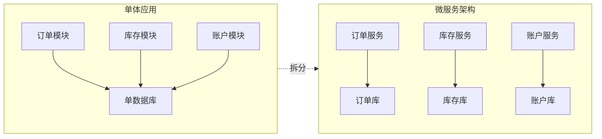
```mermaid
flowchart LR
    subgraph 单体应用
        A["订单模块"] --> DB["单数据库"]
        B["库存模块"] --> DB
        C["账户模块"] --> DB
    end
    
    subgraph 微服务架构
        D["订单服务"] --> DB1["订单库"]
        E["库存服务"] --> DB2["库存库"]
        F["账户服务"] --> DB3["账户库"]
    end
    
    单体应用 -.->|"拆分"| 微服务架构
```

**问题：** 当订单服务调用库存服务和账户服务时，每个服务操作的是不同的数据库，本地事务无法跨数据库生效。

```java
// 订单服务
public void createOrder(Order order) {
    // 订单库操作
    orderMapper.insert(order);
    
    // 远程调用库存服务（库存库操作）
    stockService.deductStock(order.getProductId(), order.getQuantity());
    
    // 远程调用账户服务（账户库操作）
    accountService.deductBalance(order.getUserId(), order.getAmount());
    
    // 问题：如果账户服务调用失败，订单和库存如何回滚？
}
```

#### 1.1.3 分布式事务定义

**分布式事务** 是指跨越多个网络节点（多个数据库、多个服务）的事务操作，需要保证所有节点上的操作要么全部成功，要么全部回滚，从而保证跨服务、跨数据库的数据一致性。

**核心特点：**

| 特点 | 说明 |
|------|------|
| **跨节点** | 事务操作分布在不同的服务器/数据库上 |
| **跨服务** | 涉及多个微服务的协同操作 |
| **跨数据库** | 每个服务可能使用独立的数据库 |
| **一致性保证** | 需要分布式事务框架协调，保证最终一致性 |

### 1.2 事务的 ACID 特性

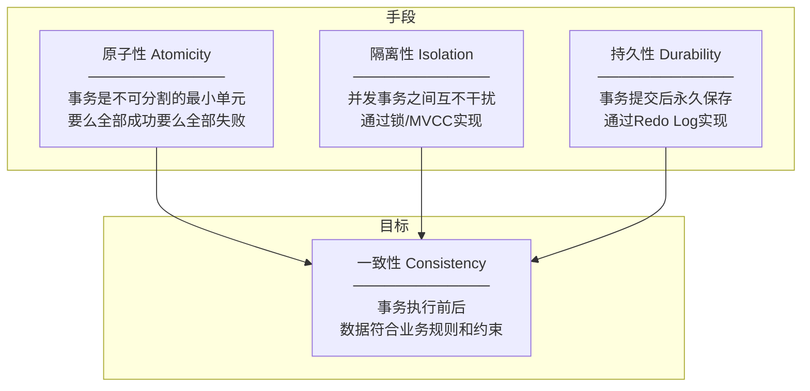
```mermaid
flowchart TB
    subgraph 手段
        A["原子性 Atomicity<br/>─────────────<br/>事务是不可分割的最小单元<br/>要么全部成功要么全部失败"]
        I["隔离性 Isolation<br/>─────────────<br/>并发事务之间互不干扰<br/>通过锁/MVCC实现"]
        D["持久性 Durability<br/>─────────────<br/>事务提交后永久保存<br/>通过Redo Log实现"]
    end
    
    subgraph 目标
        C["一致性 Consistency<br/>─────────────<br/>事务执行前后<br/>数据符合业务规则和约束"]
    end
    
    A --> C
    I --> C
    D --> C
```

**ACID 特性之间的关系：**

| 特性 | 说明 | 定位 |
|------|------|------|
| **原子性（A）** | 事务中的操作要么全部成功要么全部失败回滚 | 手段 |
| **隔离性（I）** | 并发事务之间互不干扰，避免脏读、不可重复读、幻读 | 手段 |
| **持久性（D）** | 事务提交后，数据永久保存，即使系统崩溃也不丢失 | 手段 |
| **一致性（C）** | 事务执行前后，数据从一个合法状态转变为另一个合法状态 | **目的** |

**关键理解：** 一致性（C）是事务的最终目标，原子性（A）、隔离性（I）、持久性（D）是实现一致性的手段。

### 1.3 分布式事务理论

#### 1.3.1 CAP 定理

CAP 定理指出，分布式系统不可能同时满足以下三个特性：

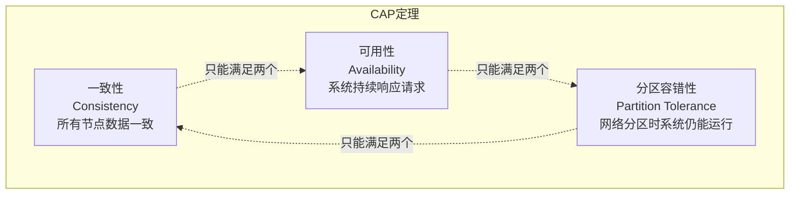
```mermaid
flowchart TB
    subgraph CAP定理
        C["一致性<br/>Consistency<br/>所有节点数据一致"]
        A["可用性<br/>Availability<br/>系统持续响应请求"]
        P["分区容错性<br/>Partition Tolerance<br/>网络分区时系统仍能运行"]
    end
    
    C -.->|"只能满足两个"| A
    A -.->|"只能满足两个"| P
    P -.->|"只能满足两个"| C
```

| 组合 | 说明 | 典型场景 |
|------|------|----------|
| **CP** | 放弃可用性，保证一致性和分区容错 | ZooKeeper、HBase |
| **AP** | 放弃强一致性，保证可用性和分区容错 | Cassandra、DynamoDB |
| **CA** | 放弃分区容错，单机数据库 | MySQL 单机版 |

#### 1.3.2 BASE 理论

BASE 理论是对 CAP 定理的补充，适用于大型分布式系统：

| 特性 | 说明 |
|------|------|
| **Basically Available（基本可用）** | 系统出现故障时，允许损失部分可用性（如响应时间延长） |
| **Soft State（软状态）** | 允许系统存在中间状态，该状态不影响系统整体可用性 |
| **Eventually Consistent（最终一致）** | 经过一段时间后，所有副本最终达到一致状态 |

**BASE 理论与 ACID 的关系：** ACID 追求强一致性，BASE 追求最终一致性。分布式事务通常采用 BASE 理论，牺牲强一致性换取可用性。

### 1.4 分布式事务实现方案

#### 1.4.1 二阶段提交（2PC）

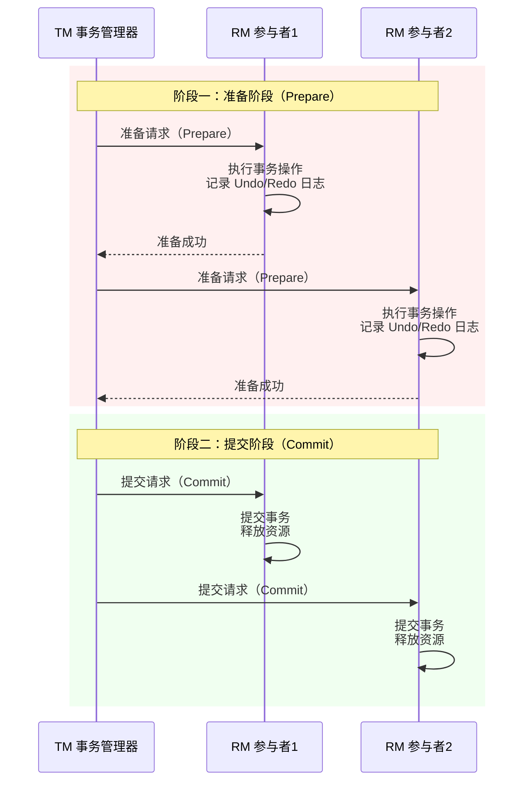
```mermaid
sequenceDiagram
    participant TM as TM 事务管理器
    participant RM1 as RM 参与者1
    participant RM2 as RM 参与者2
    
    rect rgb(255, 240, 240)
        Note over TM, RM2: 阶段一：准备阶段（Prepare）
        TM->>RM1: 准备请求（Prepare）
        RM1->>RM1: 执行事务操作<br/>记录 Undo/Redo 日志
        RM1-->>TM: 准备成功
        TM->>RM2: 准备请求（Prepare）
        RM2->>RM2: 执行事务操作<br/>记录 Undo/Redo 日志
        RM2-->>TM: 准备成功
    end
    
    rect rgb(240, 255, 240)
        Note over TM, RM2: 阶段二：提交阶段（Commit）
        TM->>RM1: 提交请求（Commit）
        RM1->>RM1: 提交事务<br/>释放资源
        TM->>RM2: 提交请求（Commit）
        RM2->>RM2: 提交事务<br/>释放资源
    end
```

**二阶段提交流程：**

| 阶段 | 操作 | 说明 |
|------|------|------|
| **阶段一（Prepare）** | TM 向所有参与者发送准备请求 | 参与者执行事务操作，记录日志，但不提交 |
| **阶段二（Commit/Rollback）** | TM 根据参与者反馈决定提交或回滚 | 全部成功则提交，任一失败则回滚 |

**二阶段提交的问题：**

| 问题 | 说明 |
|------|------|
| **同步阻塞** | 参与者在等待 TM 指令期间，一直持有数据库锁 |
| **单点故障** | TM 故障会导致所有参与者处于阻塞状态 |
| **数据不一致** | 阶段二 TM 发送提交指令后部分参与者收到，部分未收到 |

#### 1.4.2 三阶段提交（3PC）

三阶段提交在二阶段提交基础上增加了 **CanCommit 阶段** 和 **超时机制**：

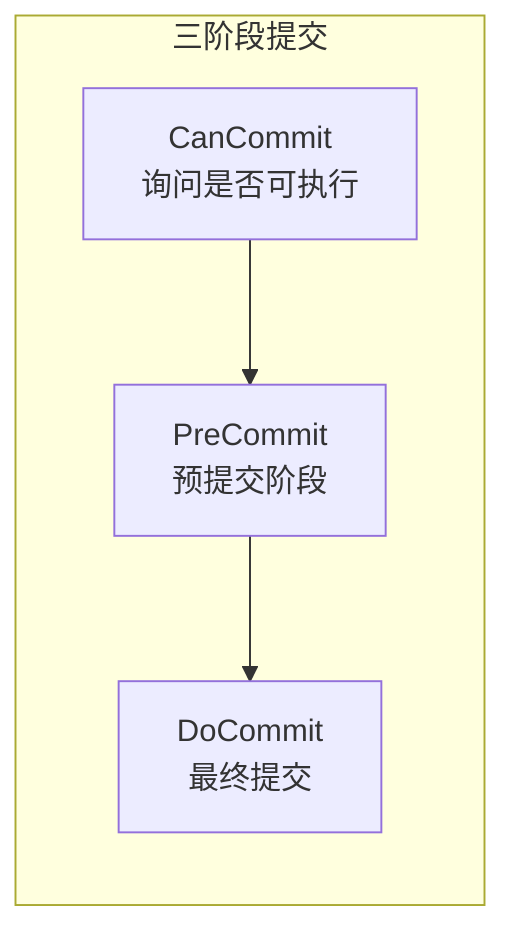
```mermaid
flowchart LR
    subgraph 三阶段提交
        C["CanCommit<br/>询问是否可执行"] --> P["PreCommit<br/>预提交阶段"]
        P --> D["DoCommit<br/>最终提交"]
    end
```

| 阶段 | 说明 |
|------|------|
| **CanCommit** | TM 询问参与者是否有条件执行事务，不锁定资源 |
| **PreCommit** | 参与者执行事务操作，记录日志，进入准备状态 |
| **DoCommit** | TM 发送最终提交或回滚指令 |

**3PC vs 2PC：**

| 对比维度 | 2PC | 3PC |
|----------|-----|-----|
| **阶段数** | 2 个 | 3 个 |
| **超时机制** | 无 | 有（参与者和协调者都有） |
| **阻塞程度** | 高 | 低 |
| **数据一致性** | 较好 | 可能不一致（网络分区时） |

#### 1.4.3 分布式事务方案对比

| 方案 | 一致性 | 性能 | 实现复杂度 | 适用场景 |
|------|--------|------|------------|----------|
| **2PC/XA** | 强一致 | 低 | 低 | 传统数据库、金融核心 |
| **TCC** | 最终一致 | 高 | 高 | 资金交易、库存扣减 |
| **SAGA** | 最终一致 | 中 | 中 | 长流程业务、跨多服务 |
| **AT** | 最终一致 | 高 | 低 | 电商下单、普通业务 |

---

## 二、Seata 概述

### 2.1 什么是 Seata

**Seata（Simple Extensible Autonomous Transaction Architecture）** 是一款开源的分布式事务解决方案，致力于提供高性能和简单易用的分布式事务服务。Seata 由阿里开源，目前是 Apache 顶级项目。

**核心定位：** 解决微服务架构下的分布式事务问题，保证跨服务、跨数据库的数据一致性。

### 2.2 Seata 与传统 2PC 的区别

| 对比维度 | 传统 2PC | Seata AT 模式 |
|----------|----------|---------------|
| **一阶段** | 准备阶段，持有数据库锁 | 执行业务 SQL + 记录 undo_log，**立即提交本地事务** |
| **二阶段提交** | 同步提交，释放锁 | 异步删除 undo_log，无需同步等待 |
| **二阶段回滚** | 同步回滚 | 通过 undo_log 反向补偿 |
| **锁持有时间** | 整个事务期间 | 仅本地事务执行期间 |
| **性能** | 低（长锁） | 高（短锁） |

---

## 三、Seata 核心架构

### 3.1 三大核心角色

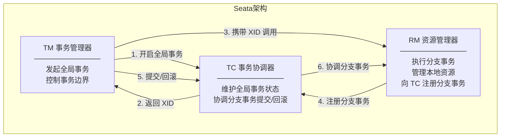
```mermaid
flowchart TB
    subgraph Seata架构
        TM["TM 事务管理器<br/>─────────────<br/>发起全局事务<br/>控制事务边界"]
        TC["TC 事务协调器<br/>─────────────<br/>维护全局事务状态<br/>协调分支事务提交/回滚"]
        RM["RM 资源管理器<br/>─────────────<br/>执行分支事务<br/>管理本地资源<br/>向 TC 注册分支事务"]
    end
    
    TM -->|"1. 开启全局事务"| TC
    TC -->|"2. 返回 XID"| TM
    TM -->|"3. 携带 XID 调用"| RM
    RM -->|"4. 注册分支事务"| TC
    TM -->|"5. 提交/回滚"| TC
    TC -->|"6. 协调分支事务"| RM
```

**角色职责详解：**

| 角色 | 全称 | 职责 | 部署方式 |
|------|------|------|----------|
| **TC** | Transaction Coordinator（事务协调器） | 维护全局事务状态，协调分支事务提交/回滚 | 独立部署（Seata Server） |
| **TM** | Transaction Manager（事务管理器） | 发起全局事务，控制事务边界（全局事务的开始、提交、回滚） | 嵌入业务微服务中 |
| **RM** | Resource Manager（资源管理器） | 执行分支事务，管理本地资源，向 TC 注册分支事务 | 嵌入业务微服务中 |

### 3.2 事务执行流程

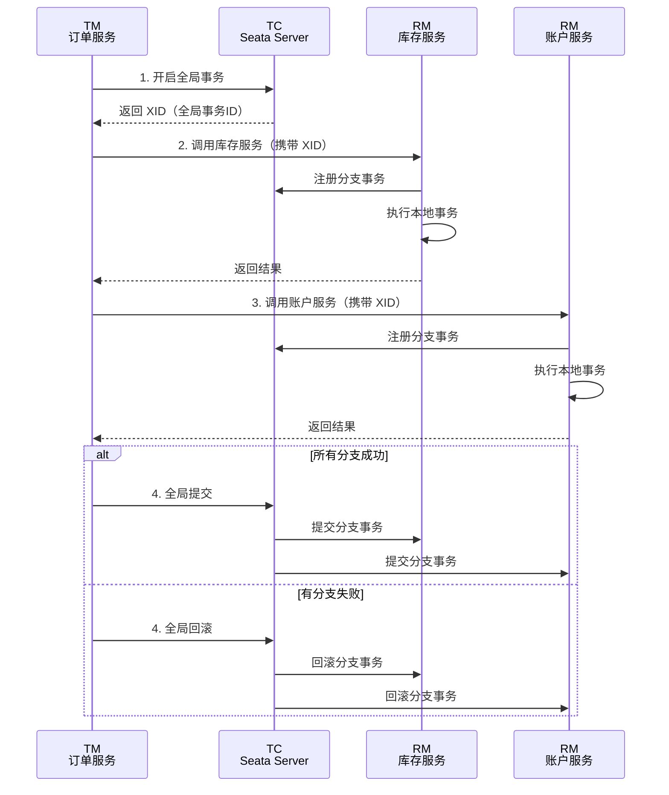
```mermaid
sequenceDiagram
    participant TM as TM<br/>订单服务
    participant TC as TC<br/>Seata Server
    participant RM1 as RM<br/>库存服务
    participant RM2 as RM<br/>账户服务
    
    TM->>TC: 1. 开启全局事务
    TC-->>TM: 返回 XID（全局事务ID）
    
    TM->>RM1: 2. 调用库存服务（携带 XID）
    RM1->>TC: 注册分支事务
    RM1->>RM1: 执行本地事务
    RM1-->>TM: 返回结果
    
    TM->>RM2: 3. 调用账户服务（携带 XID）
    RM2->>TC: 注册分支事务
    RM2->>RM2: 执行本地事务
    RM2-->>TM: 返回结果
    
    alt 所有分支成功
        TM->>TC: 4. 全局提交
        TC->>RM1: 提交分支事务
        TC->>RM2: 提交分支事务
    else 有分支失败
        TM->>TC: 4. 全局回滚
        TC->>RM1: 回滚分支事务
        TC->>RM2: 回滚分支事务
    end
```

**核心概念：**

| 概念 | 说明 |
|------|------|
| **XID** | 全局事务 ID，唯一标识一个全局事务，在服务间传递 |
| **分支事务** | 全局事务中的每个本地事务 |

---

## 四、AT 模式详解

### 4.1 AT 模式原理

AT（Automatic Transaction）模式是 Seata 最常用的模式，**无侵入、高性能**，适合大多数业务场景。

**核心思想：** 通过 SQL 解析，自动生成前后镜像（Before Image / After Image），记录到 `undo_log` 表，回滚时通过反向 SQL 恢复数据。

#### 4.1.1 一阶段处理

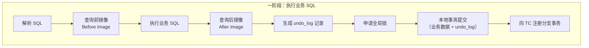
```mermaid
flowchart TB
    subgraph 一阶段["一阶段：执行业务 SQL"]
        A["解析 SQL"] --> B["查询前镜像<br/>Before Image"]
        B --> C["执行业务 SQL"]
        C --> D["查询后镜像<br/>After Image"]
        D --> E["生成 undo_log 记录"]
        E --> F["申请全局锁"]
        F --> G["本地事务提交<br/>（业务数据 + undo_log）"]
        G --> H["向 TC 注册分支事务"]
    end
```

**一阶段详细流程：**

| 步骤 | 操作 | 说明 |
|------|------|------|
| 1 | 解析 SQL | 解析业务 SQL 类型（INSERT/UPDATE/DELETE） |
| 2 | 查询前镜像 | 执行业务 SQL 前，查询数据当前状态 |
| 3 | 执行业务 SQL | 执行实际的业务 SQL |
| 4 | 查询后镜像 | 执行业务 SQL 后，查询数据修改后状态 |
| 5 | 生成 undo_log | 将前后镜像组装成 undo_log 记录 |
| 6 | 申请全局锁 | 向 TC 申请全局锁（防止其他全局事务修改同一数据） |
| 7 | 提交本地事务 | 提交本地事务，释放本地锁（**注意：全局锁未释放**） |
| 8 | 注册分支事务 | 向 TC 注册分支事务，报告执行状态 |

#### 4.1.2 二阶段处理

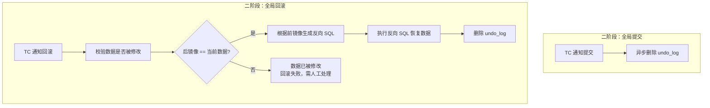
```mermaid
flowchart TB
    subgraph 二阶段提交["二阶段：全局提交"]
        H["TC 通知提交"] --> I["异步删除 undo_log"]
    end
    
    subgraph 二阶段回滚["二阶段：全局回滚"]
        J["TC 通知回滚"] --> K["校验数据是否被修改"]
        K --> L{"后镜像 == 当前数据?"}
        L -->|是| M["根据前镜像生成反向 SQL"]
        L -->|否| N["数据已被修改<br/>回滚失败，需人工处理"]
        M --> O["执行反向 SQL 恢复数据"]
        O --> P["删除 undo_log"]
    end
```

**二阶段提交：** 异步删除 undo_log，非常快速。

**二阶段回滚详细说明：**

| 步骤 | 操作 | 原因 |
|------|------|------|
| 1 | 校验后镜像与当前数据 | 确保数据未被其他事务修改，保证回滚安全 |
| 2 | 根据前镜像生成反向 SQL | 前镜像记录了修改前的数据，用于恢复 |
| 3 | 执行反向 SQL | 恢复数据到事务执行前的状态 |
| 4 | 删除 undo_log | 清理回滚日志，释放存储空间 |

**为什么需要校验后镜像？**

如果数据在全局事务期间被其他事务修改，直接回滚会覆盖其他事务的修改，导致数据不一致。校验失败说明数据已被修改，需要人工介入处理。

#### 4.1.3 undo_log 表结构

```sql
CREATE TABLE `undo_log` (
    `id`            BIGINT(20)   NOT NULL AUTO_INCREMENT,
    `branch_id`     BIGINT(20)   NOT NULL COMMENT '分支事务ID',
    `xid`           VARCHAR(100) NOT NULL COMMENT '全局事务ID',
    `context`       VARCHAR(128) NOT NULL COMMENT '上下文',
    `rollback_info` LONGBLOB     NOT NULL COMMENT '回滚信息（前后镜像）',
    `log_status`    INT(11)      NOT NULL COMMENT '日志状态',
    `log_created`   DATETIME(6)  NOT NULL COMMENT '创建时间',
    `log_modified`  DATETIME(6)  NOT NULL COMMENT '修改时间',
    PRIMARY KEY (`id`),
    UNIQUE KEY `ux_undo_log` (`xid`, `branch_id`)
) ENGINE=InnoDB DEFAULT CHARSET=utf8 COMMENT='AT模式回滚日志表';
```

### 4.2 全局锁机制

#### 4.2.1 什么是全局锁

**全局锁** 是 Seata 维护的分布式锁，存储在 TC 的 `lock_table` 表中，用于协调不同全局事务对同一数据的并发修改。

| 锁类型 | 维护者 | 粒度 | 作用范围 |
|--------|--------|------|----------|
| **本地锁** | 数据库 | 行锁/表锁 | 单数据库内 |
| **全局锁** | Seata TC | 行锁（主键） | 跨服务的全局事务 |

#### 4.2.2 全局锁与本地锁的区别

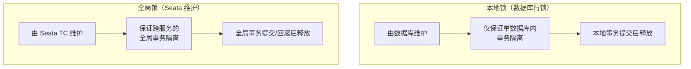
```mermaid
flowchart TB
    subgraph 本地锁["本地锁（数据库行锁）"]
        L1["由数据库维护"] --> L2["仅保证单数据库内<br/>事务隔离"]
        L2 --> L3["本地事务提交后释放"]
    end
    
    subgraph 全局锁["全局锁（Seata 维护）"]
        G1["由 Seata TC 维护"] --> G2["保证跨服务的<br/>全局事务隔离"]
        G2 --> G3["全局事务提交/回滚后释放"]
    end
```

**关键区别：**

| 对比维度 | 本地锁 | 全局锁 |
|----------|--------|--------|
| **维护者** | 数据库 | Seata TC |
| **粒度** | 行锁/表锁 | 行锁（基于主键） |
| **获取时机** | 执行 SQL 时 | 本地事务提交前 |
| **释放时机** | 本地事务提交后 | 全局事务完成后 |
| **作用** | 防止单库并发冲突 | 防止跨服务并发冲突 |

#### 4.2.3 全局锁获取流程

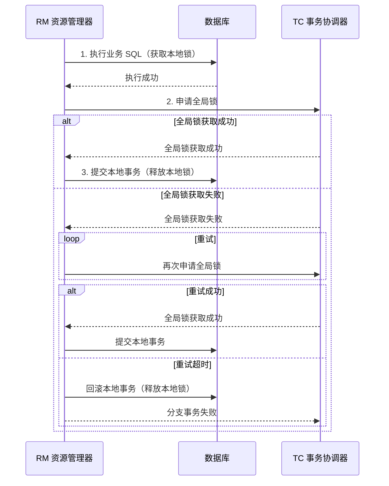
```mermaid
sequenceDiagram
    participant RM as RM 资源管理器
    participant DB as 数据库
    participant TC as TC 事务协调器
    
    RM->>DB: 1. 执行业务 SQL（获取本地锁）
    DB-->>RM: 执行成功
    RM->>TC: 2. 申请全局锁
    alt 全局锁获取成功
        TC-->>RM: 全局锁获取成功
        RM->>DB: 3. 提交本地事务（释放本地锁）
    else 全局锁获取失败
        TC-->>RM: 全局锁获取失败
        loop 重试
            RM->>TC: 再次申请全局锁
        end
        alt 重试成功
            TC-->>RM: 全局锁获取成功
            RM->>DB: 提交本地事务
        else 重试超时
            RM->>DB: 回滚本地事务（释放本地锁）
            RM-->>TC: 分支事务失败
        end
    end
```

**为什么本地事务提交前要获取全局锁？**

如果本地事务提交后再获取全局锁，可能出现以下问题：
1. 本地事务已提交，数据已修改
2. 此时获取全局锁失败
3. 需要回滚本地事务，但本地事务已提交无法回滚

因此，**必须在本地事务提交前获取全局锁**，确保获取成功后再提交本地事务。

#### 4.2.4 全局锁冲突示例

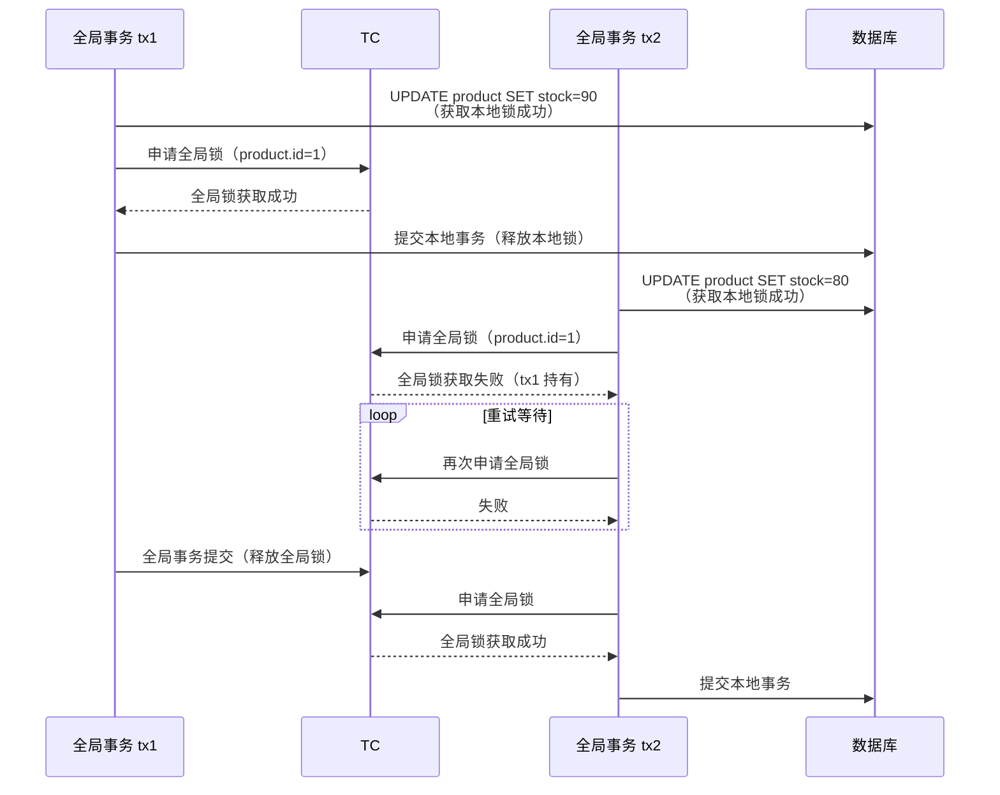
```mermaid
sequenceDiagram
    participant tx1 as 全局事务 tx1
    participant TC as TC
    participant tx2 as 全局事务 tx2
    participant DB as 数据库
    
    tx1->>DB: UPDATE product SET stock=90<br/>（获取本地锁成功）
    tx1->>TC: 申请全局锁（product.id=1）
    TC-->>tx1: 全局锁获取成功
    tx1->>DB: 提交本地事务（释放本地锁）
    
    tx2->>DB: UPDATE product SET stock=80<br/>（获取本地锁成功）
    tx2->>TC: 申请全局锁（product.id=1）
    TC-->>tx2: 全局锁获取失败（tx1 持有）
    
    loop 重试等待
        tx2->>TC: 再次申请全局锁
        TC-->>tx2: 失败
    end
    
    tx1->>TC: 全局事务提交（释放全局锁）
    
    tx2->>TC: 申请全局锁
    TC-->>tx2: 全局锁获取成功
    tx2->>DB: 提交本地事务
```

---

## 五、TCC 模式详解

### 5.1 TCC 模式原理

TCC（Try-Confirm-Cancel）模式是业务侵入式的柔性事务模式，将事务拆分为三个阶段，完全由业务代码控制。

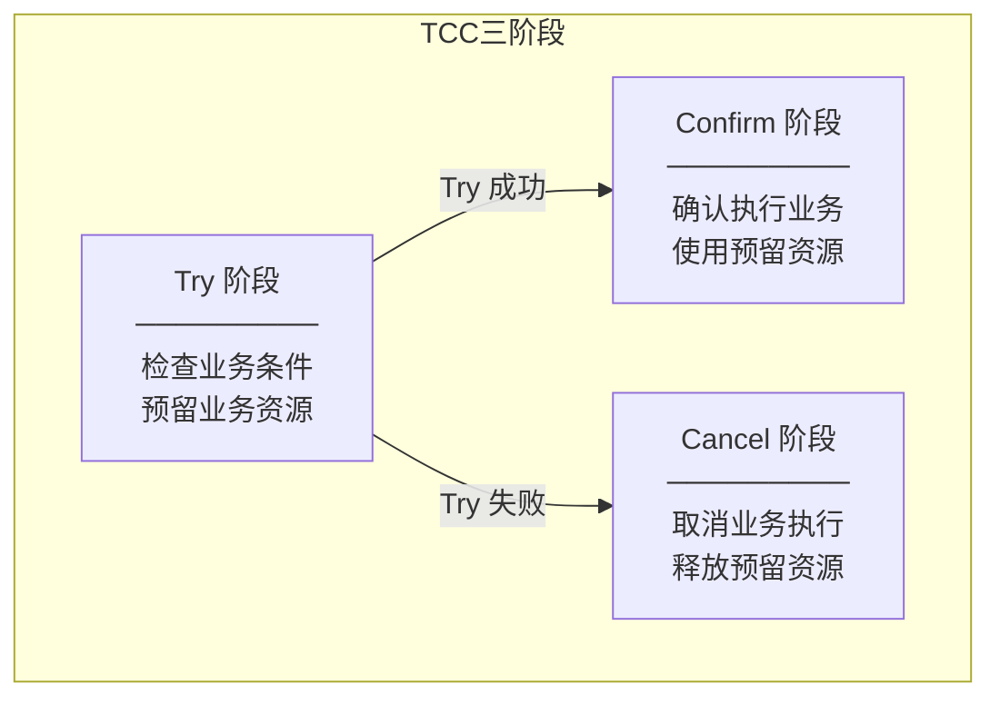
```mermaid
flowchart TB
    subgraph TCC三阶段
        T["Try 阶段<br/>─────────<br/>检查业务条件<br/>预留业务资源"]
        C["Confirm 阶段<br/>─────────<br/>确认执行业务<br/>使用预留资源"]
        X["Cancel 阶段<br/>─────────<br/>取消业务执行<br/>释放预留资源"]
    end
    
    T -->|"Try 成功"| C
    T -->|"Try 失败"| X
```

**三阶段职责：**

| 阶段 | 职责 | 核心操作 |
|------|------|----------|
| **Try** | 检查业务条件，预留业务资源 | 冻结余额、锁定库存、创建待确认订单 |
| **Confirm** | 确认执行业务，使用预留资源 | 扣减冻结余额、扣减锁定库存、确认订单 |
| **Cancel** | 取消业务执行，释放预留资源 | 解冻余额、释放锁定库存、取消订单 |

**示例：账户余额转账**

| 阶段 | 操作 | 账户状态 |
|------|------|----------|
| **初始** | 账户余额 1000 元 | 可用余额：1000，冻结余额：0 |
| **Try** | 冻结 100 元 | 可用余额：900，冻结余额：100 |
| **Confirm** | 扣减冻结余额 | 可用余额：900，冻结余额：0 |
| **Cancel** | 解冻 100 元 | 可用余额：1000，冻结余额：0 |

### 5.3 TCC 接口定义

```java
public interface AccountTccService {
    
    // Try：冻结余额
    @TwoPhaseBusinessAction(name = "prepareDeduct", 
                            commitMethod = "commit", 
                            rollbackMethod = "rollback")
    void prepareDeduct(@BusinessActionContextParameter(paramName = "userId") Long userId,
                       @BusinessActionContextParameter(paramName = "amount") BigDecimal amount);
    
    // Confirm：确认扣减
    boolean commit(BusinessActionContext context);
    
    // Cancel：取消冻结
    boolean rollback(BusinessActionContext context);
}
```

### 5.4 TCC 三大问题

#### 5.4.1 空回滚

**问题发生场景：**

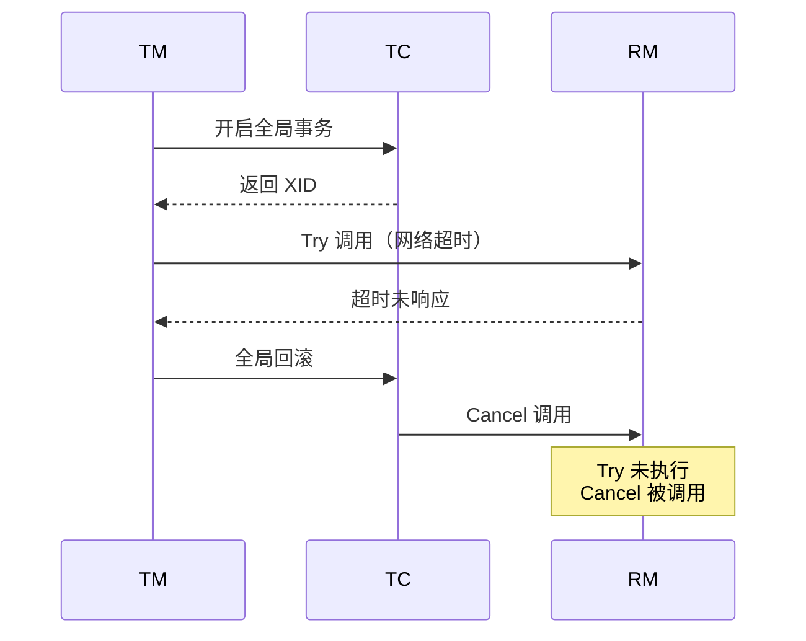
```mermaid
sequenceDiagram
    participant TM as TM
    participant TC as TC
    participant RM as RM
    
    TM->>TC: 开启全局事务
    TC-->>TM: 返回 XID
    TM->>RM: Try 调用（网络超时）
    RM-->>TM: 超时未响应
    TM->>TC: 全局回滚
    TC->>RM: Cancel 调用
    Note over RM: Try 未执行<br/>Cancel 被调用
```

**问题说明：** Try 阶段因网络超时未执行，但 TC 认为分支事务失败，调用 Cancel 进行回滚。

**解决方案：** 在 RM 本地的事务控制表中记录 Try 执行状态，Cancel 执行前检查，若无 Try 记录则直接返回成功。

#### 5.4.2 悬挂

**问题发生场景：**

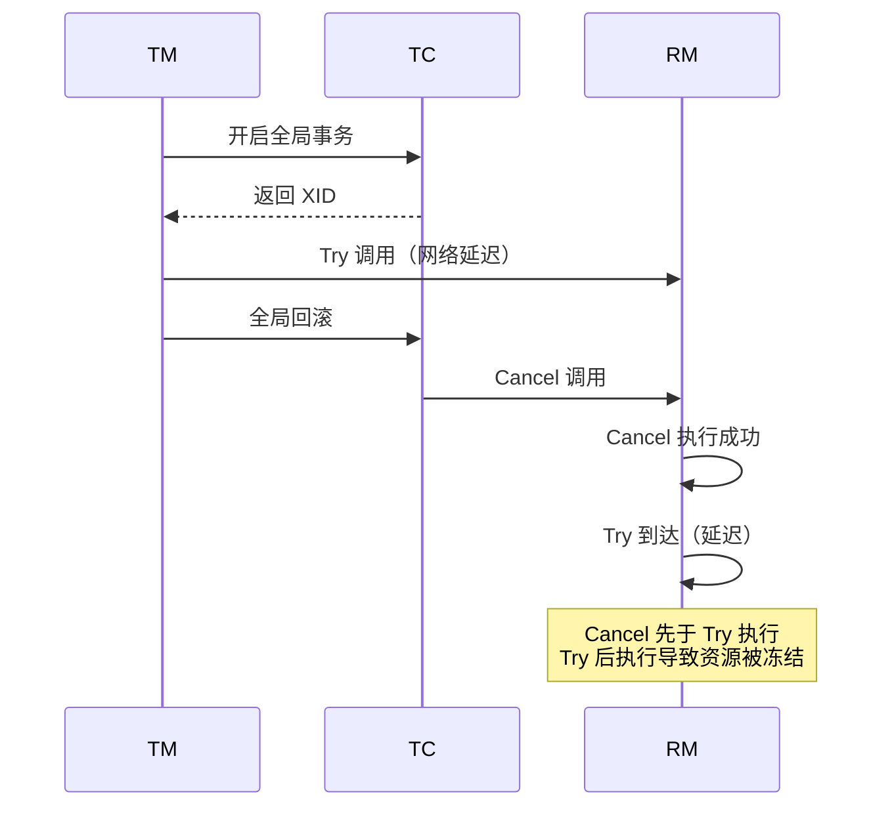
```mermaid
sequenceDiagram
    participant TM as TM
    participant TC as TC
    participant RM as RM
    
    TM->>TC: 开启全局事务
    TC-->>TM: 返回 XID
    TM->>RM: Try 调用（网络延迟）
    TM->>TC: 全局回滚
    TC->>RM: Cancel 调用
    RM->>RM: Cancel 执行成功
    RM->>RM: Try 到达（延迟）
    Note over RM: Cancel 先于 Try 执行<br/>Try 后执行导致资源被冻结
```

**问题说明：** Cancel 先于 Try 执行，Try 后执行导致资源被冻结且无法释放。

**解决方案：** 在 RM 本地的事务控制表中记录 Cancel 执行状态，Try 执行前检查，若已有 Cancel 记录则拒绝执行。

#### 5.4.3 幂等性

**问题发生场景：**

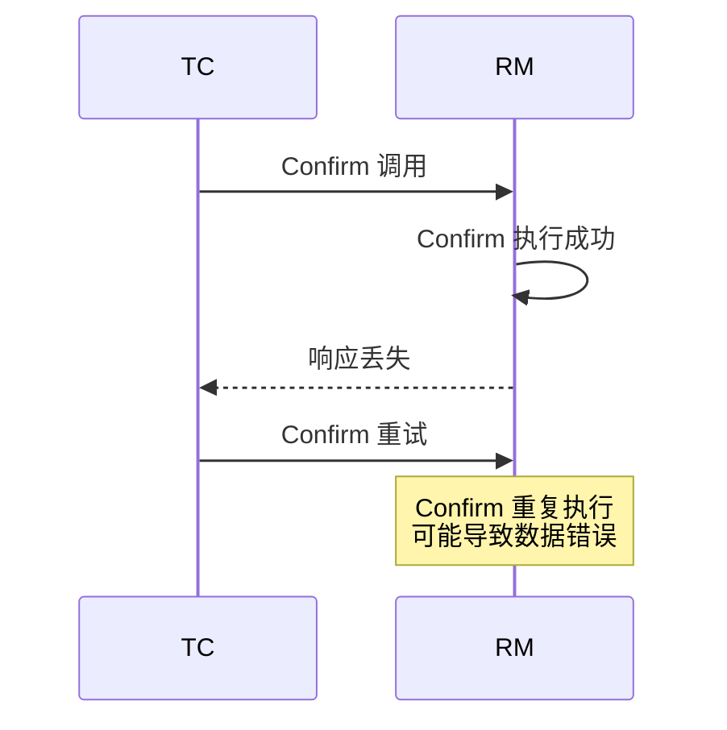
```mermaid
sequenceDiagram
    participant TC as TC
    participant RM as RM
    
    TC->>RM: Confirm 调用
    RM->>RM: Confirm 执行成功
    RM-->>TC: 响应丢失
    TC->>RM: Confirm 重试
    Note over RM: Confirm 重复执行<br/>可能导致数据错误
```

**问题说明：** Confirm/Cancel 可能因网络问题被 TC 重复调用，需要保证多次执行结果一致。

**解决方案：** 在 RM 本地的事务控制表中记录执行状态，重复调用时检查状态，已执行则直接返回成功。

### 5.5 事务控制表设计

#### 5.5.1 表位置说明

**事务控制表（tcc_fence_log）存放在 RM 侧**，即每个参与 TCC 事务的微服务本地数据库中。

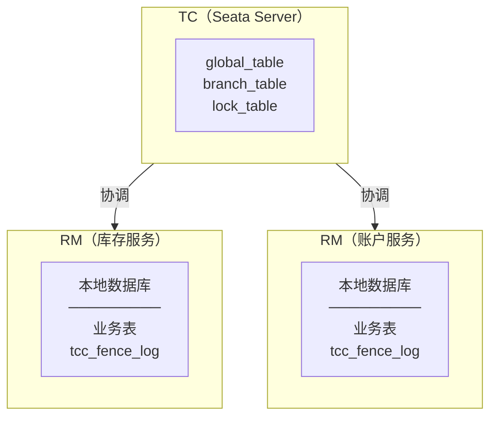
```mermaid
flowchart TB
    subgraph TC["TC（Seata Server）"]
        TC1["global_table<br/>branch_table<br/>lock_table"]
    end
    
    subgraph RM1["RM（库存服务）"]
        RM1_DB["本地数据库<br/>─────────<br/>业务表<br/>tcc_fence_log"]
    end
    
    subgraph RM2["RM（账户服务）"]
        RM2_DB["本地数据库<br/>─────────<br/>业务表<br/>tcc_fence_log"]
    end
    
    TC -->|"协调"| RM1
    TC -->|"协调"| RM2
```

#### 5.5.3 表结构设计

```sql
CREATE TABLE `tcc_fence_log` (
    `id`            BIGINT(20)   NOT NULL AUTO_INCREMENT,
    `xid`           VARCHAR(100) NOT NULL COMMENT '全局事务ID',
    `branch_id`     BIGINT(20)   NOT NULL COMMENT '分支事务ID',
    `action_name`   VARCHAR(100) NOT NULL COMMENT '动作名称',
    `status`        TINYINT      NOT NULL COMMENT '状态：TRIED=1, COMMITTED=2, ROLLBACKED=3',
    `create_time`   DATETIME     NOT NULL,
    `update_time`   DATETIME     NOT NULL,
    PRIMARY KEY (`id`),
    UNIQUE KEY `uk_xid_branch` (`xid`, `branch_id`)
) ENGINE=InnoDB DEFAULT CHARSET=utf8 COMMENT='TCC事务控制表';
```

**状态值说明：**

| 状态值 | 说明 | 设置时机 |
|--------|------|----------|
| 1 (TRIED) | Try 已执行 | Try 阶段执行成功后 |
| 2 (COMMITTED) | Confirm 已执行 | Confirm 阶段执行成功后 |
| 3 (ROLLBACKED) | Cancel 已执行 | Cancel 阶段执行成功后 |

---

## 六、SAGA 模式详解

### 6.1 SAGA 模式原理

**SAGA** 来源于 1987 年 Hector Garcia-Molina 和 Kenneth Salem 的论文《Sagas》，是一种处理长事务的模式。

**核心思想：** 将长事务拆分为多个本地短事务，每个短事务都有对应的补偿事务。当整个流程正常完成时，SAGA 事务成功提交；若任一环节失败，则逆向执行补偿事务。

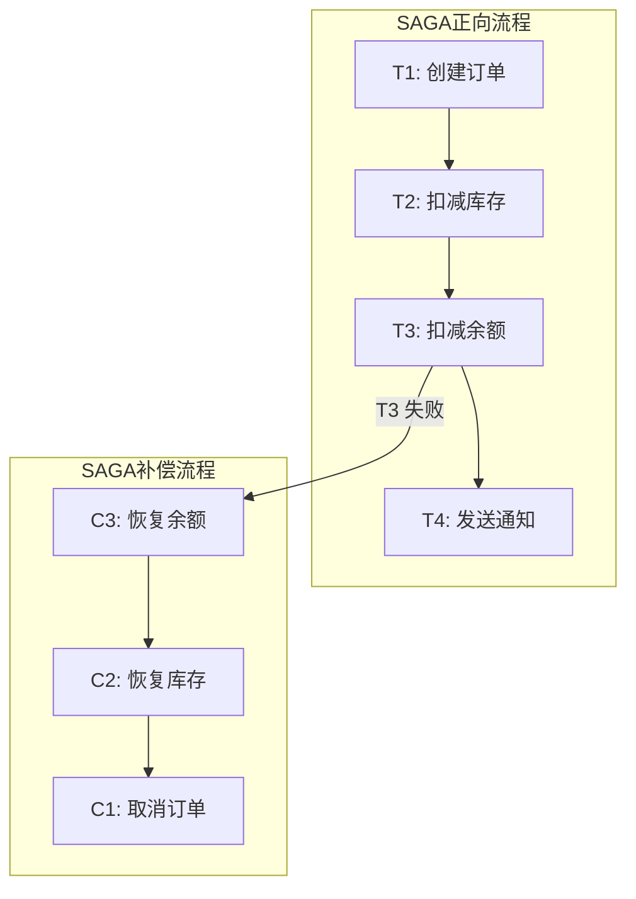
```mermaid
flowchart TB
    subgraph SAGA正向流程
        T1["T1: 创建订单"] --> T2["T2: 扣减库存"]
        T2 --> T3["T3: 扣减余额"]
        T3 --> T4["T4: 发送通知"]
    end
    
    subgraph SAGA补偿流程
        C3["C3: 恢复余额"] --> C2["C2: 恢复库存"]
        C2 --> C1["C1: 取消订单"]
    end
    
    T3 -->|"T3 失败"| C3
```

### 6.2 SAGA 模式特点

| 特点 | 说明 |
|------|------|
| **长事务支持** | 适合跨多服务、耗时长的业务流程 |
| **补偿机制** | 每个正向操作需定义对应的补偿操作 |
| **最终一致** | 不保证强一致，保证最终一致性 |
| **无全局锁** | 性能较高，但存在脏读风险 |

### 6.3 为什么存在脏读风险

**脏读风险说明：**

SAGA 模式下，每个本地事务直接提交，不持有全局锁。在全局事务完成前，其他事务可以读取到已提交但可能被回滚的数据。

**示例：**

```
时间线：
1. T1（创建订单）执行成功，订单状态为"待支付"
2. T2（扣减库存）执行成功
3. T3（扣减余额）执行失败
4. 执行补偿：C2（恢复库存）、C1（取消订单）

在步骤 2-4 期间，其他事务可以读取到：
- 订单状态为"待支付"（实际会被取消）
- 库存已扣减（实际会被恢复）
```

**解决方案：**

1. 业务层面增加状态字段（如"处理中"），查询时过滤
2. 使用 `@GlobalLock` 注解查询时检查全局锁

### 6.4 SAGA 状态机编排

Seata SAGA 模式通过状态机编排定义事务流程，需要完成以下步骤：

#### 6.4.1 定义状态机 JSON 文件

状态机 JSON 文件默认存放在 `resources/seata/saga/statelang/` 目录下，文件名即为状态机名称。

**文件路径：** `resources/seata/saga/statelang/order_transaction.json`

```json
{
    "Name": "orderTransaction",
    "Comment": "订单事务流程",
    "StartState": "CreateOrder",
    "Version": "0.0.1",
    "States": {
        "CreateOrder": {
            "Type": "ServiceTask",
            "ServiceName": "orderService",
            "ServiceMethod": "createOrder",
            "CompensateState": "CancelOrder",
            "Next": "DeductStock",
            "Input": ["$.orderDTO"],
            "Output": {
                "orderId": "$.orderId"
            }
        },
        "DeductStock": {
            "Type": "ServiceTask",
            "ServiceName": "stockService",
            "ServiceMethod": "deductStock",
            "CompensateState": "RestoreStock",
            "Next": "DeductBalance",
            "Input": ["$.orderDTO.productId", "$.orderDTO.quantity"]
        },
        "DeductBalance": {
            "Type": "ServiceTask",
            "ServiceName": "accountService",
            "ServiceMethod": "deductBalance",
            "CompensateState": "RestoreBalance",
            "Input": ["$.orderDTO.userId", "$.orderDTO.amount"],
            "End": true
        },
        "CancelOrder": {
            "Type": "ServiceTask",
            "ServiceName": "orderService",
            "ServiceMethod": "cancelOrder",
            "Input": ["$.orderId"]
        },
        "RestoreStock": {
            "Type": "ServiceTask",
            "ServiceName": "stockService",
            "ServiceMethod": "restoreStock",
            "Input": ["$.orderDTO.productId", "$.orderDTO.quantity"]
        },
        "RestoreBalance": {
            "Type": "ServiceTask",
            "ServiceName": "accountService",
            "ServiceMethod": "restoreBalance",
            "Input": ["$.orderDTO.userId", "$.orderDTO.amount"]
        }
    }
}
```

#### 6.4.2 定义服务接口

状态机中的 `ServiceName` 对应 Spring 容器中的 Bean。在 SAGA 模式中，同一个服务内的调用直接使用本地 Bean，跨服务调用使用 OpenFeign 远程调用。

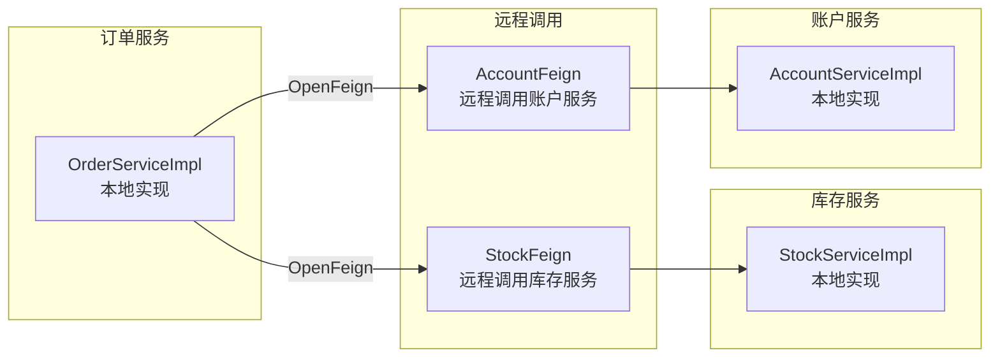
```mermaid
flowchart LR
    subgraph 订单服务
        OS["OrderServiceImpl<br/>本地实现"]
    end
    
    subgraph 远程调用
        OF1["StockFeign<br/>远程调用库存服务"]
        OF2["AccountFeign<br/>远程调用账户服务"]
    end
    
    subgraph 库存服务
        SS["StockServiceImpl<br/>本地实现"]
    end
    
    subgraph 账户服务
        AS["AccountServiceImpl<br/>本地实现"]
    end
    
    OS -->|"OpenFeign"| OF1
    OF1 --> SS
    OS -->|"OpenFeign"| OF2
    OF2 --> AS
```

**1. 定义 OpenFeign 远程调用接口：**

```java
// 库存服务的 Feign 客户端
@FeignClient(name = "stock-service")
public interface StockFeignClient {
    
    @PostMapping("/stock/deduct")
    void deductStock(@RequestParam("productId") Long productId, 
                     @RequestParam("quantity") Integer quantity);
    
    @PostMapping("/stock/restore")
    void restoreStock(@RequestParam("productId") Long productId, 
                      @RequestParam("quantity") Integer quantity);
}

// 账户服务的 Feign 客户端
@FeignClient(name = "account-service")
public interface AccountFeignClient {
    
    @PostMapping("/account/deduct")
    void deductBalance(@RequestParam("userId") Long userId, 
                       @RequestParam("amount") BigDecimal amount);
    
    @PostMapping("/account/restore")
    void restoreBalance(@RequestParam("userId") Long userId, 
                        @RequestParam("amount") BigDecimal amount);
}
```

**2. 订单服务本地实现（整合 OpenFeign）：**

```java
@Service("orderService")
public class OrderServiceImpl implements OrderService {
    
    @Autowired
    private OrderMapper orderMapper;
    
    @Autowired
    private StockFeignClient stockFeignClient;
    
    @Autowired
    private AccountFeignClient accountFeignClient;
    
    @Override
    public Long createOrder(OrderDTO orderDTO) {
        // 创建订单（本地操作）
        Order order = new Order();
        order.setUserId(orderDTO.getUserId());
        order.setAmount(orderDTO.getAmount());
        order.setStatus("CREATED");
        orderMapper.insert(order);
        
        // 扣减库存（远程调用）
        stockFeignClient.deductStock(orderDTO.getProductId(), orderDTO.getQuantity());
        
        // 扣减余额（远程调用）
        accountFeignClient.deductBalance(orderDTO.getUserId(), orderDTO.getAmount());
        
        return order.getId();
    }
    
    @Override
    public void cancelOrder(Long orderId) {
        // 取消订单（本地操作）
        orderMapper.updateStatus(orderId, "CANCELLED");
    }
}
```

**3. 库存服务本地实现：**

```java
@Service("stockService")
public class StockServiceImpl implements StockService {
    
    @Autowired
    private StockMapper stockMapper;
    
    @Override
    public void deductStock(Long productId, Integer quantity) {
        stockMapper.deductStock(productId, quantity);
    }
    
    @Override
    public void restoreStock(Long productId, Integer quantity) {
        stockMapper.restoreStock(productId, quantity);
    }
}
```

**4. 账户服务本地实现：**

```java
@Service("accountService")
public class AccountServiceImpl implements AccountService {
    
    @Autowired
    private AccountMapper accountMapper;
    
    @Override
    public void deductBalance(Long userId, BigDecimal amount) {
        accountMapper.deductBalance(userId, amount);
    }
    
    @Override
    public void restoreBalance(Long userId, BigDecimal amount) {
        accountMapper.restoreBalance(userId, amount);
    }
}
```

**服务调用关系说明：**

| 服务 | ServiceName | 操作类型 | 说明 |
|------|-------------|----------|------|
| 订单服务 | orderService | 本地 + 远程 | 本地创建订单，远程调用库存/账户服务 |
| 库存服务 | stockService | 本地 | 接收远程调用，执行本地操作 |
| 账户服务 | accountService | 本地 | 接收远程调用，执行本地操作 |

#### 6.4.3 配置状态机扫描路径

在 `application.yml` 中配置状态机 JSON 文件扫描路径：

```yaml
seata:
  saga:
    state-machine:
      resources: classpath*:seata/saga/statelang/**/*.json
      enable: true
```

#### 6.4.4 启动状态机执行事务

```java
@Service
public class OrderSagaService {
    
    @Autowired
    private StateMachineEngine stateMachineEngine;
    
    public void createOrder(OrderDTO orderDTO) {
        // 构造输入参数
        Map<String, Object> params = new HashMap<>();
        params.put("orderDTO", orderDTO);
        
        // 启动状态机
        StateMachineInstance instance = stateMachineEngine.startWithBusinessKey(
            "orderTransaction",     // 状态机名称（JSON 文件中的 Name）
            null,                   // 租户ID（可选）
            "ORDER_" + System.currentTimeMillis(),  // 业务Key（用于幂等）
            params                  // 输入参数
        );
        
        // 检查执行状态
        if (ExecutionStatus.SU.equals(instance.getStatus())) {
            log.info("SAGA 事务执行成功，orderId: {}", instance.getEndParams().get("orderId"));
        } else {
            log.error("SAGA 事务执行失败，异常: {}", instance.getException());
            throw new RuntimeException("订单创建失败");
        }
    }
}
```

#### 6.4.5 状态机执行流程

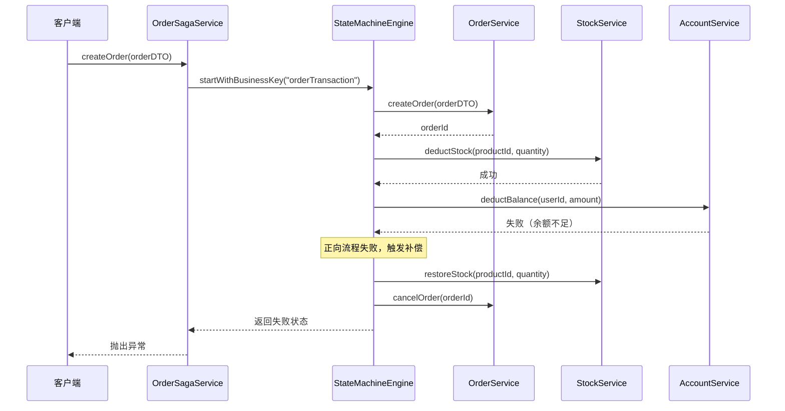
```mermaid
sequenceDiagram
    participant Client as 客户端
    participant Service as OrderSagaService
    participant Engine as StateMachineEngine
    participant Order as OrderService
    participant Stock as StockService
    participant Account as AccountService
    
    Client->>Service: createOrder(orderDTO)
    Service->>Engine: startWithBusinessKey("orderTransaction")
    
    Engine->>Order: createOrder(orderDTO)
    Order-->>Engine: orderId
    
    Engine->>Stock: deductStock(productId, quantity)
    Stock-->>Engine: 成功
    
    Engine->>Account: deductBalance(userId, amount)
    Account-->>Engine: 失败（余额不足）
    
    Note over Engine: 正向流程失败，触发补偿
    
    Engine->>Stock: restoreStock(productId, quantity)
    Engine->>Order: cancelOrder(orderId)
    
    Engine-->>Service: 返回失败状态
    Service-->>Client: 抛出异常
```

---

## 七、XA 模式详解

### 7.1 XA 模式原理

XA 模式基于数据库 XA 协议实现，是标准的两阶段提交（2PC）模式。

```mermaid
flowchart TB
    subgraph XA两阶段提交
        P["Prepare 阶段<br/>─────────<br/>所有参与者准备<br/>持有数据库锁"]
        C["Commit 阶段<br/>─────────<br/>协调者通知提交<br/>释放锁"]
    end
    
    P -->|"所有参与者准备成功"| C
```

### 7.2 XA 模式特点

| 特点 | 说明 |
|------|------|
| **强一致性** | 基于 XA 协议，保证数据强一致 |
| **数据库支持** | 需要数据库支持 XA 协议（MySQL、Oracle 等） |
| **性能较低** | 两阶段提交期间持有数据库锁，并发性能差 |
| **无侵入** | 不需要业务代码改造 |

### 7.3 XA vs AT 对比

| 对比维度 | XA 模式 | AT 模式 |
|----------|---------|---------|
| **一致性** | 强一致 | 最终一致 |
| **锁粒度** | 数据库行锁 | 全局锁 |
| **锁持有时间** | 整个全局事务期间 | 仅本地事务执行期间 |
| **性能** | 较低 | 较高 |
| **侵入性** | 无侵入 | 无侵入 |
| **数据库要求** | 需支持 XA 协议 | 无特殊要求 |

---

## 八、四种模式对比

### 8.1 模式选择决策

```mermaid
flowchart TB
    subgraph 模式选择决策
        A["业务场景"] --> B{"是否需要强一致?"}
        B -->|是| C["XA 模式"]
        B -->|否| D{"是否接受高侵入?"}
        D -->|是| E["TCC 模式<br/>资金交易场景"]
        D -->|否| F{"是否长事务?"}
        F -->|是| G["SAGA 模式<br/>跨多服务长流程"]
        F -->|否| H["AT 模式<br/>普通业务场景"]
    end
```

### 8.2 详细对比

| 对比维度 | AT 模式 | TCC 模式 | SAGA 模式 | XA 模式 |
|----------|---------|----------|-----------|---------|
| **一致性** | 最终一致 | 最终一致 | 最终一致 | 强一致 |
| **性能** | 高 | 高 | 中 | 低 |
| **侵入性** | 低（无侵入） | 高（需编写三阶段代码） | 中（需定义补偿逻辑） | 低（无侵入） |
| **隔离性** | 全局锁保证 | 资源预留保证 | 无隔离（脏读风险） | 数据库锁保证 |
| **回滚方式** | 自动反向 SQL | 业务补偿 | 业务补偿 | 数据库回滚 |
| **适用场景** | 电商下单、普通业务 | 资金交易、库存扣减 | 订单履约、长流程业务 | 金融核心、传统系统 |
| **开发成本** | 低 | 高 | 中 | 低 |

---

## 九、Spring Cloud Alibaba 集成

### 9.1 整体架构

```mermaid
flowchart TB
    subgraph 微服务架构
        G["网关<br/>Spring Cloud Gateway"]
        O["订单服务<br/>TM"]
        S["库存服务<br/>RM"]
        A["账户服务<br/>RM"]
    end
    
    subgraph 基础设施
        N["Nacos<br/>注册中心/配置中心"]
        T["Seata Server<br/>TC"]
        D["MySQL<br/>业务数据库"]
    end
    
    G --> O
    O --> S
    O --> A
    O --> T
    S --> T
    A --> T
    O --> N
    S --> N
    A --> N
    T --> N
    O --> D
    S --> D
    A --> D
```

### 9.2 Nacos 在分布式事务中的作用

| 角色 | 作用 | 说明 |
|------|------|------|
| **注册中心** | 服务发现 | TM/RM 通过 Nacos 发现 Seata Server（TC）地址 |
| **配置中心** | 统一配置管理 | 管理 Seata 的全局配置（事务分组、集群映射等） |

**Nacos 与 Seata 协作流程：**

```mermaid
sequenceDiagram
    participant TM as TM/RM<br/>微服务
    participant N as Nacos
    participant TC as Seata Server
    
    Note over N: 1. Seata Server 启动
    TC->>N: 注册服务（seata-server）
    
    Note over N: 2. 微服务启动
    TM->>N: 获取 Seata Server 地址
    N-->>TM: 返回 Seata Server 地址
    TM->>TC: 连接 Seata Server
    
    Note over N: 3. 配置管理
    TM->>N: 获取事务分组配置
    N-->>TM: 返回配置信息
```

### 9.3 Seata Server 部署

**1. 创建 Seata 数据库：**

```sql
-- 脚本位置：seata/script/server/db/mysql.sql
CREATE DATABASE seata;
USE seata;

-- 全局事务表
CREATE TABLE `global_table` (
    `xid`                       VARCHAR(128) NOT NULL,
    `transaction_id`            BIGINT,
    `status`                    TINYINT      NOT NULL,
    `application_id`            VARCHAR(32),
    `transaction_service_group` VARCHAR(32),
    PRIMARY KEY (`xid`)
) ENGINE=InnoDB DEFAULT CHARSET=utf8;

-- 分支事务表
CREATE TABLE `branch_table` (
    `branch_id`         BIGINT       NOT NULL,
    `xid`               VARCHAR(128) NOT NULL,
    `resource_id`       VARCHAR(256),
    `branch_type`       VARCHAR(8),
    `status`            TINYINT,
    PRIMARY KEY (`branch_id`),
    KEY `idx_xid` (`xid`)
) ENGINE=InnoDB DEFAULT CHARSET=utf8;

-- 全局锁表
CREATE TABLE `lock_table` (
    `row_key`        VARCHAR(128) NOT NULL,
    `xid`            VARCHAR(128),
    `branch_id`      BIGINT       NOT NULL,
    `resource_id`    VARCHAR(256),
    PRIMARY KEY (`row_key`)
) ENGINE=InnoDB DEFAULT CHARSET=utf8;
```

**2. Seata Server 配置（application.yml）：**

```yaml
seata:
  config:
    type: nacos
    nacos:
      server-addr: 127.0.0.1:8848
      group: SEATA_GROUP
      namespace: ""
      username: nacos
      password: nacos
      data-id: seataServer.properties
  registry:
    type: nacos
    nacos:
      application: seata-server
      server-addr: 127.0.0.1:8848
      group: SEATA_GROUP
      namespace: ""
      cluster: default
      username: nacos
      password: nacos
  store:
    mode: db
    db:
      datasource: druid
      db-type: mysql
      driver-class-name: com.mysql.cj.jdbc.Driver
      url: jdbc:mysql://127.0.0.1:3306/seata
      user: root
      password: your_password
```

### 9.4 微服务配置

**1. Maven 依赖：**

```xml
<dependencies>
    <!-- Nacos 服务发现 -->
    <dependency>
        <groupId>com.alibaba.cloud</groupId>
        <artifactId>spring-cloud-starter-alibaba-nacos-discovery</artifactId>
    </dependency>
    
    <!-- Seata -->
    <dependency>
        <groupId>com.alibaba.cloud</groupId>
        <artifactId>spring-cloud-starter-alibaba-seata</artifactId>
    </dependency>
</dependencies>
```

**2. 微服务配置（application.yml）：**

```yaml
spring:
  application:
    name: order-service
  cloud:
    nacos:
      discovery:
        server-addr: 127.0.0.1:8848

seata:
  enabled: true
  application-id: ${spring.application.name}
  tx-service-group: my_tx_group
  data-source-proxy-mode: AT
  registry:
    type: nacos
    nacos:
      server-addr: 127.0.0.1:8848
      group: SEATA_GROUP
      namespace: ""
  config:
    type: nacos
    nacos:
      server-addr: 127.0.0.1:8848
      group: SEATA_GROUP
      namespace: ""
  service:
    vgroup-mapping:
      my_tx_group: default
```

### 9.5 使用示例

**TM 端（发起全局事务）：**

```java
@Service
public class OrderService {
    
    @GlobalTransactional(name = "create-order", rollbackFor = Exception.class)
    public void createOrder(OrderDTO orderDTO) {
        // 1. 创建订单
        orderMapper.insert(order);
        
        // 2. 扣减库存（远程调用）
        stockService.deductStock(orderDTO.getProductId(), orderDTO.getQuantity());
        
        // 3. 扣减余额（远程调用）
        accountService.deductBalance(orderDTO.getUserId(), orderDTO.getAmount());
    }
}
```

**RM 端（执行分支事务）：**

```java
@Service
public class StockService {
    
    @Transactional(rollbackFor = Exception.class)
    public void deductStock(Long productId, Integer quantity) {
        // 扣减库存
        stockMapper.deductStock(productId, quantity);
    }
}
```

---

## 十、最佳实践

### 10.1 模式选择建议

| 业务场景 | 推荐模式 | 原因 |
|----------|----------|------|
| 电商下单 | AT 模式 | 无侵入、高性能、适合普通业务 |
| 资金转账 | TCC 模式 | 高可靠、资源预留保证隔离性 |
| 订单履约流程 | SAGA 模式 | 长事务、跨多服务 |
| 金融核心系统 | XA 模式 | 强一致性要求 |

### 10.2 常见问题与解决方案

| 问题 | 原因 | 解决方案 |
|------|------|----------|
| **全局事务超时** | 业务执行时间超过配置的超时时间 | 调整 `seata.tx-service-group.timeout` |
| **全局锁获取失败** | 多个全局事务竞争同一资源 | 优化业务逻辑，减少热点数据竞争 |
| **undo_log 清理不及时** | 异常导致 undo_log 未清理 | 配置定时任务清理过期 undo_log |
| **XID 未传递** | 服务间调用未携带 XID | 使用 Feign/RestTemplate 自动传递 |

### 10.3 生产环境建议

1. **TC 集群部署**：多节点部署 Seata Server，保证高可用
2. **数据库分离**：Seata 数据库与业务数据库分离
3. **监控告警**：监控全局事务状态、分支事务执行情况
4. **日志审计**：记录全局事务日志，便于问题排查

---

## 十一、总结

### 11.1 核心要点

1. **分布式事务理论**：CAP 定理、BASE 理论、二阶段提交是理解分布式事务的基础
2. **ACID 特性**：一致性（C）是目的，原子性（A）、隔离性（I）、持久性（D）是手段
3. **三大角色**：TC（事务协调器）、TM（事务管理器）、RM（资源管理器）协同完成分布式事务
4. **四种模式**：AT、TCC、SAGA、XA，满足不同业务场景
5. **AT 模式**：无侵入、高性能，通过 undo_log 实现自动回滚，全局锁保证隔离性
6. **TCC 模式**：高可靠，需处理空回滚、悬挂、幂等性问题
7. **SAGA 模式**：长事务场景，通过补偿机制保证最终一致，存在脏读风险
8. **Nacos 作用**：作为注册中心实现服务发现，作为配置中心统一管理配置

### 11.2 面试要点

1. 什么是分布式事务？为什么需要分布式事务？
2. ACID 特性之间的关系是什么？（C 是目的，AID 是手段）
3. CAP 定理和 BASE 理论是什么？
4. 二阶段提交（2PC）的流程是什么？有什么问题？
5. Seata 的三大核心角色是什么？各自的职责是什么？
6. Seata 的四种事务模式有什么区别？各适用什么场景？
7. AT 模式的 undo_log 是如何实现回滚的？
8. 全局锁和本地锁的区别是什么？
9. TCC 模式需要解决哪三个问题？如何解决？
10. SAGA 模式为什么存在脏读风险？
11. Nacos 在 Seata 分布式事务中的作用是什么？