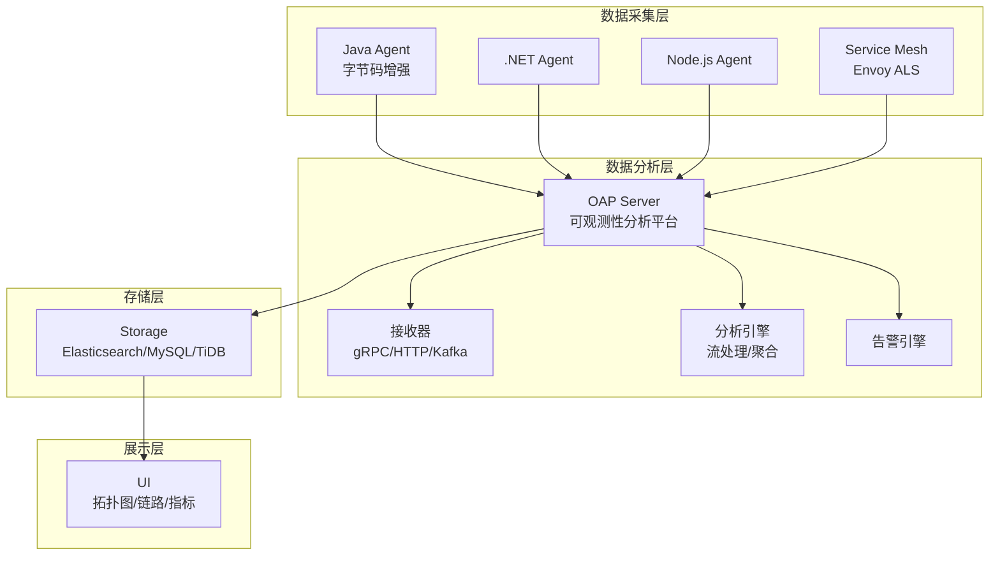
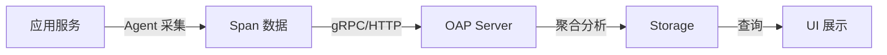
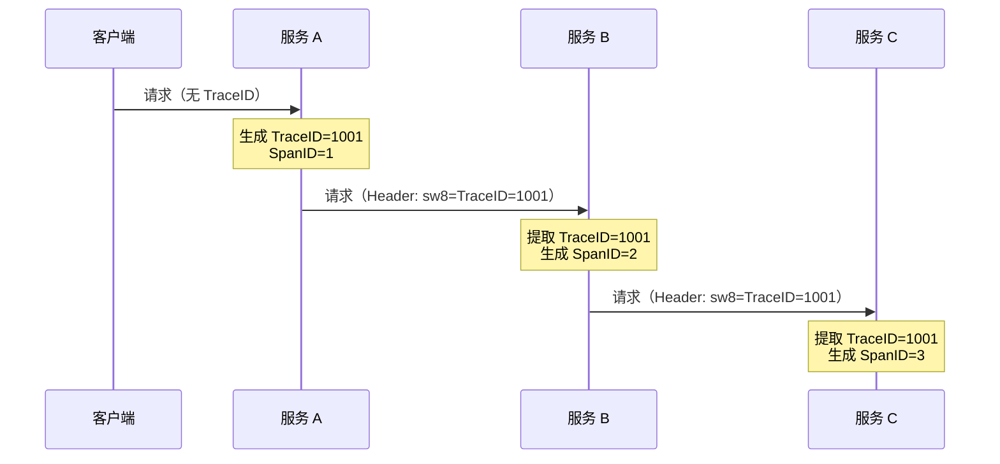
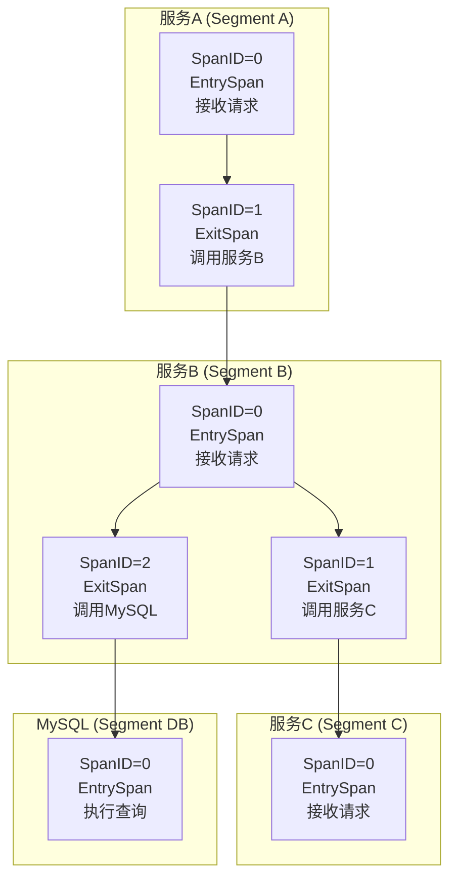
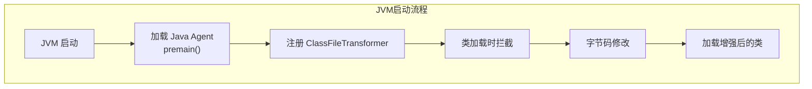
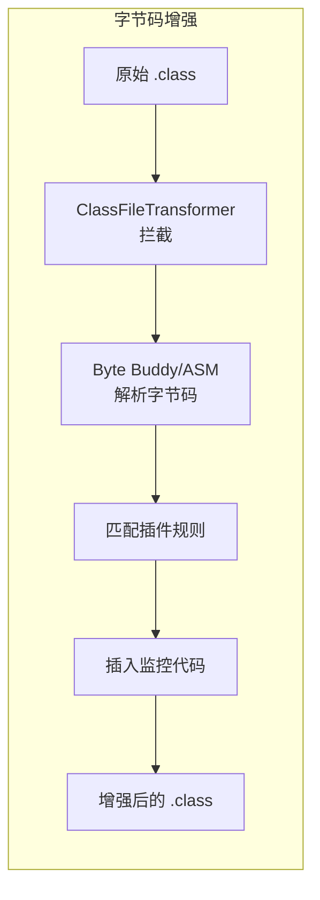
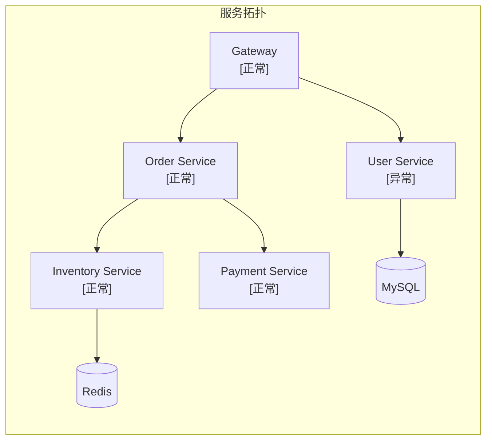

# SkyWalking 分布式链路追踪详解

## 一、概述

### 1.1 什么是 SkyWalking？

SkyWalking 是一款开源的**应用性能监控（APM）**和**分布式追踪系统**，专为微服务、云原生架构和服务网格设计。

### 1.2 核心能力

| 能力 | 说明 |
|------|------|
| **分布式追踪** | 自动追踪请求在微服务间的调用链路 |
| **服务拓扑** | 自动生成服务间依赖关系图 |
| **性能指标** | 监控响应时间、吞吐量、错误率等 |
| **告警** | 基于规则触发告警通知 |

### 1.3 核心优势

| 优势 | 说明 |
|------|------|
| **无侵入** | Java 应用无需修改代码，通过 Java Agent 自动埋点 |
| **多语言支持** | Java、.NET、Node.js、Python、Go 等 |
| **云原生友好** | 支持 Kubernetes、Service Mesh（Istio/Envoy） |
| **国产开源** | Apache 顶级项目，中文文档完善 |

---

## 二、核心架构

### 2.1 整体架构



### 2.2 核心组件

| 组件 | 角色 | 说明 |
|------|------|------|
| **Agent（探针）** | 数据采集 | 通过字节码增强自动收集链路数据，无侵入 |
| **OAP Server** | 数据分析 | 接收、聚合、分析数据，驱动告警 |
| **Storage** | 数据存储 | 支持 Elasticsearch、MySQL、TiDB、H2 |
| **UI** | 可视化 | 展示拓扑图、调用链、性能指标 |

### 2.3 数据流转



---

## 三、分布式链路追踪原理

### 3.1 核心概念

| 概念 | 说明 |
|------|------|
| **Trace** | 一次完整请求的调用链，由多个 Span 组成 |
| **Span** | 单个操作单元，如一次 HTTP 请求、一次 SQL 查询 |
| **TraceID** | 全局唯一标识，贯穿整个调用链 |
| **SpanID** | 标识 Span 在调用链中的位置 |

### 3.2 Span 结构

```
Span
├── 操作名称（Operation Name）
├── 开始时间（Start Time）
├── 结束时间（End Time）
├── 标签（Tags）：如 HTTP 状态码、SQL 语句
├── 日志（Logs）：事件记录
├── 引用（References）：父子 Span 关系
└── 上下文（Context）：TraceID、SpanID
```

### 3.3 上下文传播



**sw8 Header 格式**：

sw8 Header 包含 8 个字段，使用 `-` 分隔：

```
sw8: {采样}-{TraceID}-{ParentSegmentID}-{ParentSpanID}-{ParentService}-{ParentInstance}-{ParentEndpoint}-{TargetAddress}
```

**示例**：

```
sw8: 1-dXNyLXNlcnZpY2U=-dXNyLXNlcnZpY2U=-1-b3JkZXItc2VydmljZQ==-aW5zdGFuY2UtMQ==-L29yZGVyL2NyZWF0ZQ==-MTI3LjAuMC4xOjgwODA=
```

**字段说明**：

| 序号 | 字段 | 类型 | 说明 | 编码前示例 | 编码后示例 |
|------|------|------|------|------------|------------|
| 1 | 采样标志 | 整数 | 0 表示忽略<br/>1 表示需要采样发送到后端 | 1 | 1 |
| 2 | Trace ID | String (Base64) | 全局唯一的追踪标识 | usr-service | dXNyLXNlcnZpY2U= |
| 3 | Parent Segment ID | String (Base64) | 父追踪段的唯一标识 | usr-service | dXNyLXNlcnZpY2U= |
| 4 | Parent Span ID | **整数** | 父追踪段中的 Span 序号，从 0 开始 | 1 | 1 |
| 5 | Parent Service | String (Base64) | 父服务的逻辑名称 | order-service | b3JkZXItc2VydmljZQ== |
| 6 | Parent Instance | String (Base64) | 父服务实例标识 | instance-1 | aW5zdGFuY2UtMQ== |
| 7 | Parent Endpoint | String (Base64) | 父服务的入口端点名称 | /order/create | L29yZGVyL2NyZWF0ZQ== |
| 8 | Target Address | String (Base64) | 客户端访问目标服务的网络地址 | 127.0.0.1:8080 | MTI3LjAuMC4xOjgwODA= |

> **注意**：只有字符串类型字段值需要 Base64 编码。

### 3.4 调用链组装

**重要概念**：每个服务进程有独立的 Segment，SpanID 只在 Segment 内唯一。



**SpanID 分配规则**：

| 规则 | 说明 |
|------|------|
| 作用域 | 仅在单个 Segment 内唯一 |
| 起始值 | 从 0 开始 |
| 分配方式 | 使用 AtomicInteger 原子自增 |
| 分配时机 | 按 Span 创建顺序，非调用层级 |

**多分叉场景 SpanID 确定**：

```java
// 服务B 代码执行顺序决定 SpanID
public void process() {
    // SpanID=0: EntrySpan (自动创建)
    
    // SpanID=1: 先创建的 ExitSpan
    callServiceC();  
    
    // SpanID=2: 后创建的 ExitSpan
    callMySQL();     
}
```

| 调用方式 | SpanID 分配 |
|----------|------------|
| 同步顺序调用 | 按代码执行顺序递增 |
| 异步并发调用 | 按实际创建顺序，取决于线程调度 |
| 并行流处理 | 各线程独立 Segment，SpanID 各自从 0 开始 |

---

## 四、Java Agent 字节码增强原理

### 4.1 Java Agent 机制

Java Agent 是 JVM 提供的在类加载过程中修改字节码的机制。



### 4.2 字节码增强流程



### 4.3 技术实现

| 技术 | 说明 |
|------|------|
| **Java Agent** | 通过 `premain` 方法在 JVM 启动时加载 |
| **Instrumentation API** | JVM 提供的字节码修改接口 |
| **Byte Buddy** | 高层字节码操作库，比 ASM 更易用 |
| **ASM** | 底层字节码操作框架，性能更高 |

### 4.4 插桩示例

**原始代码**：

```java
public class UserService {
    public User getUser(String userId) {
        return userDao.findById(userId);
    }
}
```

**增强后代码（概念）**：

```java
public class UserService {
    public User getUser(String userId) {
        Span span = SkyWalkingAgent.createSpan("UserService.getUser");
        try {
            span.setTag("userId", userId);
            User result = userDao.findById(userId);
            return result;
        } catch (Exception e) {
            span.error(e);
            throw e;
        } finally {
            span.finish();
        }
    }
}
```

### 4.5 插件机制

SkyWalking 通过插件支持主流框架：

| 类型 | 支持框架 |
|------|----------|
| **Web 框架** | Spring MVC、Spring WebFlux、Tomcat、Jetty |
| **RPC 框架** | Dubbo、gRPC、Feign、OkHttp |
| **消息队列** | Kafka、RabbitMQ、RocketMQ |
| **数据库** | MySQL、PostgreSQL、MongoDB、Redis |
| **缓存** | Redis、Memcached |

---

## 五、核心功能

### 5.1 服务拓扑图



**功能**：
- 自动生成服务依赖关系
- 节点颜色反映健康状态
- 连线粗细表示调用量

### 5.2 调用链追踪

| 功能 | 说明 |
|------|------|
| **完整链路** | 展示请求经过的所有服务和组件 |
| **耗时分析** | 每个 Span 的耗时，慢操作高亮 |
| **错误定位** | 标记异常 Span，展示错误堆栈 |
| **标签过滤** | 按 HTTP 状态码、服务名等过滤 |

### 5.3 性能指标监控

| 指标类型 | 具体指标 |
|----------|----------|
| **服务指标** | QPS、平均响应时间、错误率、P99 延迟 |
| **JVM 指标** | CPU、内存、GC 次数、线程数 |
| **数据库指标** | SQL 执行次数、慢查询、连接池状态 |
| **中间件指标** | 消息队列堆积量、缓存命中率 |

### 5.4 告警功能

**告警规则示例**：

```yaml
rules:
  - name: service_response_time
    expression: avg(service_response_time) > 1000
    message: 服务 {name} 平均响应时间超过 1s
    period: 10
    silence: 5
    
  - name: service_error_rate
    expression: avg(service_error_rate) > 0.01
    message: 服务 {name} 错误率超过 1%
```

**告警通知方式**：
- Webhook
- 钉钉
- 企业微信
- 飞书
- Slack

---

## 六、实战部署

### 6.1 Docker 部署

```yaml
version: '3.8'
services:
  elasticsearch:
    image: elasticsearch:8.10.0
    environment:
      - discovery.type=single-node
      - xpack.security.enabled=false
    ports:
      - "9200:9200"

  oap:
    image: apache/skywalking-oap-server:10.0.0
    environment:
      - SW_STORAGE=elasticsearch
      - SW_STORAGE_ES_CLUSTER_NODES=elasticsearch:9200
    ports:
      - "11800:11800"
      - "12800:12800"
    depends_on:
      - elasticsearch

  ui:
    image: apache/skywalking-ui:10.0.0
    environment:
      - SW_OAP_ADDRESS=http://oap:12800
    ports:
      - "8080:8080"
    depends_on:
      - oap
```

### 6.2 Java 应用集成

**启动命令**：

```bash
java -javaagent:/path/to/skywalking-agent.jar \
     -Dskywalking.agent.service_name=order-service \
     -Dskywalking.collector.backend_service=localhost:11800 \
     -jar order-service.jar
```

**关键参数**：

| 参数 | 说明 |
|------|------|
| `-javaagent` | Agent JAR 包路径 |
| `service_name` | 服务名称（显示在 UI 中） |
| `backend_service` | OAP 服务器地址（默认 11800） |
| `sampling_rate` | 采样率（默认 100%，生产建议 10%-50%） |

### 6.3 Spring Boot 集成

**方式一：启动参数（推荐）**

```bash
java -javaagent:skywalking-agent.jar \
     -Dskywalking.agent.service_name=my-service \
     -jar app.jar
```

**方式二：agent.config 配置**

```properties
agent.service_name=my-service
collector.backend_service=localhost:11800
agent.sample_n_per_3_secs=3
```

---

## 七、高级功能

### 7.1 手动埋点

```java
import org.apache.skywalking.apm.toolkit.trace.Trace;
import org.apache.skywalking.apm.toolkit.trace.Tag;
import org.apache.skywalking.apm.toolkit.trace.ActiveSpan;

@Trace
@Tag(key = "userId", value = "arg[0]")
public void processOrder(String userId) {
    ActiveSpan.tag("orderType", "normal");
}
```

### 7.2 日志关联

```java
import org.apache.skywalking.apm.toolkit.trace.TraceContext;

@GetMapping("/order")
public String createOrder() {
    String traceId = TraceContext.traceId();
    log.info("TraceID: {}, Creating order...", traceId);
    return "OK";
}
```

**Logback 配置**：

```xml
<pattern>%d{yyyy-MM-dd HH:mm:ss} [%tid] %-5level %logger{36} - %msg%n</pattern>
```

### 7.3 自定义插件

```java
public class MyPlugin implements ClassEnhancePluginDefine {
    @Override
    protected ClassMatch enhanceClass() {
        return byName("com.example.MyService");
    }
    
    @Override
    public InstanceMethodsInterceptPoint[] getInstanceMethodsInterceptPoints() {
        return new InstanceMethodsInterceptPoint[] {
            new InstanceMethodsInterceptPoint() {
                @Override
                public ElementMatcher<MethodDescription> getMethodsMatcher() {
                    return named("myMethod");
                }
                
                @Override
                public String getMethodsInterceptor() {
                    return "com.example.MyInterceptor";
                }
            }
        };
    }
}
```

---

## 八、性能优化

### 8.1 采样策略

| 策略 | 说明 | 适用场景 |
|------|------|----------|
| **全量采样** | 100% 采样 | 测试环境 |
| **比例采样** | 如 10% 采样 | 生产环境 |
| **慢请求采样** | 只采样慢请求 | 性能分析 |

**配置**：

```properties
agent.sample_n_per_3_secs=3
```

### 8.2 Agent 性能影响

| 指标 | 影响 |
|------|------|
| **CPU 开销** | 通常 < 3% |
| **内存开销** | 约 50-100MB |
| **响应延迟** | 增加 < 5ms |

### 8.3 存储优化

| 优化项 | 说明 |
|--------|------|
| **滚动索引** | Elasticsearch 按天滚动索引 |
| **TTL 设置** | 设置数据保留时间 |
| **冷热分离** | 热数据 SSD，冷数据 HDD |

---

## 九、与其他方案对比

| 特性 | SkyWalking | Zipkin | Jaeger |
|------|------------|--------|--------|
| **埋点方式** | 字节码增强（无侵入） | SDK 埋点 | SDK 埋点 |
| **多语言支持** | 丰富 | 一般 | 丰富 |
| **UI 功能** | 强大 | 基础 | 基础 |
| **告警** | 内置 | 无 | 无 |
| **Service Mesh** | 支持 | 不支持 | 支持 |
| **存储** | ES/MySQL/TiDB | ES/MySQL/Cassandra | ES/Cassandra/Kafka |

---

## 十、总结

### 10.1 核心要点

| 要点 | 说明 |
|------|------|
| **无侵入监控** | Java Agent 字节码增强，零代码修改 |
| **全链路追踪** | TraceID 贯穿整个调用链 |
| **自动拓扑** | 基于调用关系自动生成服务依赖图 |
| **丰富生态** | 支持主流框架和中间件 |

### 10.2 适用场景

| 场景 | 说明 |
|------|------|
| **微服务监控** | 自动追踪服务间调用 |
| **性能瓶颈定位** | 快速发现慢接口和慢 SQL |
| **故障排查** | 通过 TraceID 关联日志 |
| **服务治理** | 基于拓扑图优化服务架构 |
