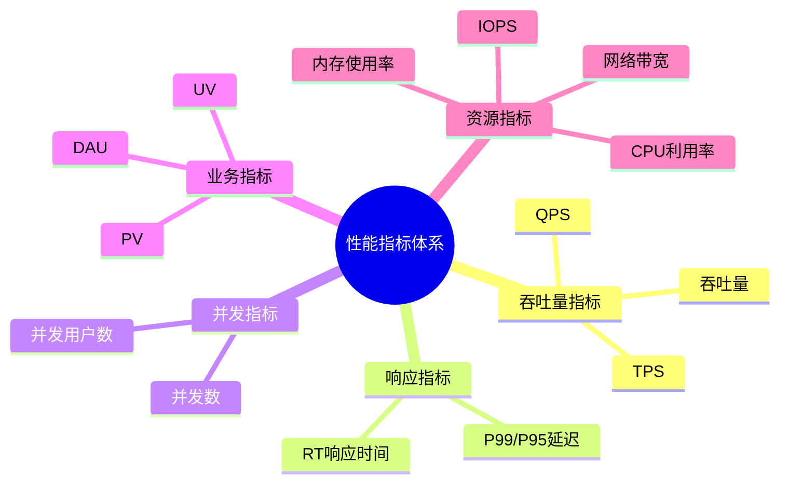
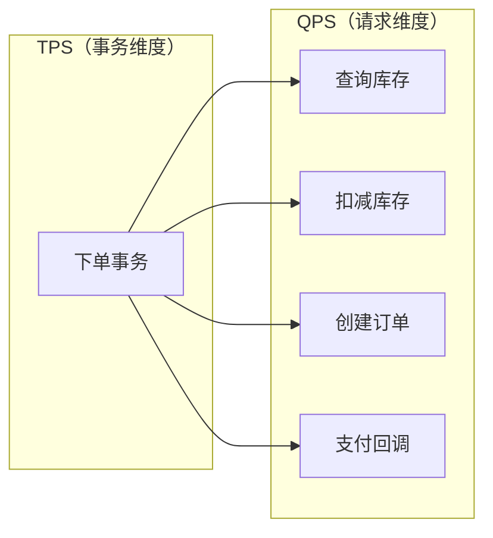
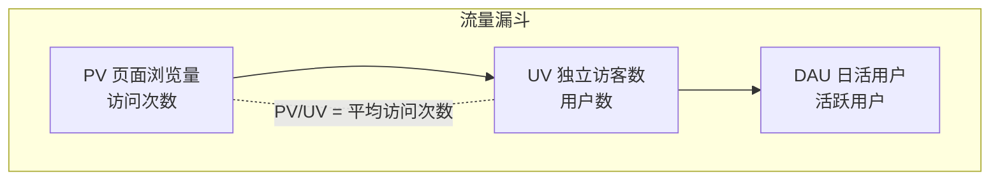
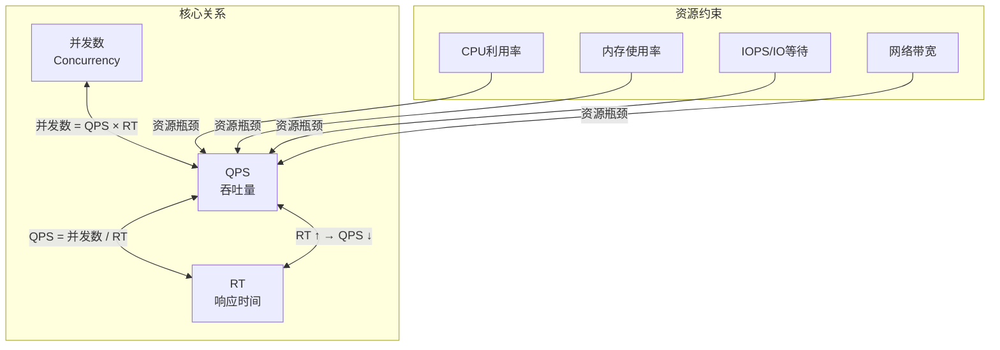

# 并发性能指标详解

## 一、概述

在分布式系统、高并发架构设计中，性能指标是衡量系统能力的核心标尺。本文系统介绍并发场景下的关键性能指标及其计算方法。

### 1.1 指标体系概览



---

## 二、吞吐量指标

### 2.1 QPS（每秒查询数）

**定义**：Queries Per Second，系统每秒能处理的查询/请求总数。

| 属性 | 说明 |
|------|------|
| **全称** | Queries Per Second |
| **计算公式** | QPS = 总请求数 / 统计时长（秒） |
| **适用场景** | Web接口、微服务调用、数据库查询、缓存访问 |
| **关注重点** | 峰值QPS，而非均值QPS |

**示例**：

```
某API在10秒内处理了50,000次请求
QPS = 50,000 / 10 = 5,000
```

### 2.2 TPS（每秒事务数）

**定义**：Transactions Per Second，系统每秒能处理的完整事务数量。

| 属性 | 说明 |
|------|------|
| **全称** | Transactions Per Second |
| **计算公式** | TPS = 成功完成的事务总数 / 统计时长（秒） |
| **适用场景** | 数据库事务、交易系统、订单系统 |
| **关注重点** | 完整事务，包含多个操作 |

**事务示例**：

```
电商下单事务包含：
1. 库存检查
2. 扣减库存
3. 生成订单
4. 支付通知

若每秒完成100笔订单，则 TPS = 100
```

### 2.3 QPS 与 TPS 的区别



| 对比项 | QPS | TPS |
|--------|-----|-----|
| **维度** | 请求级别 | 事务级别 |
| **粒度** | 单次请求 | 完整业务流程 |
| **关系** | 一个事务可能包含多个请求 | TPS ≤ QPS |
| **场景** | 读操作密集型系统 | 事务型系统 |

### 2.4 吞吐量

**定义**：系统在单位时间内处理的总数据量或总请求量。

| 场景 | 单位 | 说明 |
|------|------|------|
| 网络传输 | MB/s、GB/s | 每秒传输的字节数 |
| 服务器处理 | 请求/秒 | QPS + TPS 的总和 |
| 数据库 | TPS | 每秒事务数 |

---

## 三、响应时间指标

### 3.1 RT（响应时间）

**定义**：Response Time，从请求发出到收到完整响应的总时间。

| 属性 | 说明 |
|------|------|
| **全称** | Response Time |
| **单位** | 毫秒（ms） |
| **组成** | 网络传输时间 + 服务处理时间 + IO等待时间 |

**响应时间组成**：


### 3.2 分位数延迟（P95/P99/P999）

**核心观点**：平均RT参考价值极低，应关注分位数延迟。

| 分位数 | 含义 | 说明 |
|--------|------|------|
| **P50** | 中位数 | 50%请求的响应时间低于该值 |
| **P95** | 95分位 | 95%请求的响应时间低于该值 |
| **P99** | 99分位 | 99%请求的响应时间低于该值 |
| **P999** | 99.9分位 | 99.9%请求的响应时间低于该值 |

**示例**：

```
100个请求的响应时间排序后：
- P50 = 第50个请求的响应时间
- P95 = 第95个请求的响应时间
- P99 = 第99个请求的响应时间

若 P99 = 200ms，表示99%的请求在200ms内完成
```

**为什么关注P99？**

| 原因 | 说明 |
|------|------|
| **反映长尾延迟** | 少数慢请求会被平均值掩盖 |
| **用户体验** | P99才是用户真实体验的核心标尺 |
| **发现问题** | 帮助发现偶发的性能问题 |

---

## 四、并发指标

### 4.1 并发数

**定义**：系统同时处理的请求数量。

| 属性 | 说明 |
|------|------|
| **含义** | 同一时刻正在被处理的请求数 |
| **区别** | ≠ 同时在线用户数（在线用户可能不发起请求） |

### 4.2 利特尔法则（Little's Law）

性能领域的核心基础公式，揭示了三大指标的内在关联：

```
L = λ × W

L：系统中平均并发请求数
λ：系统平均请求到达率（即QPS）
W：请求平均响应时间（RT）
```

**核心推导公式**：

```
QPS = 并发数 / RT
并发数 = QPS × RT
```

**示例**：

```
单服务RT为50ms，单节点最大并发数为200
理论峰值QPS = 200 / 0.05 = 4,000
```

### 4.3 并发用户数计算

**经典业务模型**：

```
并发用户数 = (日均PV × 峰值因子 × 平均会话时长) / (86400 × 用户操作占比)
```

**二八原则计算峰值QPS**：

```
峰值QPS = (总PV数 × 80%) / (每天秒数 × 20%)
       = (总PV数 × 0.8) / (86400 × 0.2)
       = 总PV数 / 21600
```

**示例**：

```
日均PV = 100万
峰值QPS = 1,000,000 / 21600 ≈ 46 QPS

若RT = 100ms = 0.1s
并发数 = 46 × 0.1 = 4.6 ≈ 5
```

---

## 五、业务流量指标

### 5.1 PV（页面浏览量）

**定义**：Page View，页面被访问的次数。

| 属性 | 说明 |
|------|------|
| **计数规则** | 每打开或刷新一次页面，PV +1 |
| **统计周期** | 通常按天统计 |
| **用途** | 衡量页面访问频率 |

### 5.2 UV（独立访客数）

**定义**：Unique Visitor，访问站点的独立用户数。

| 属性 | 说明 |
|------|------|
| **计数规则** | 同一用户多次访问只算1次 |
| **识别方式** | Cookie、用户ID、IP等 |
| **统计周期** | 通常按天统计 |
| **用途** | 衡量真实用户数量 |

### 5.3 DAU/MAU

| 指标 | 全称 | 说明 |
|------|------|------|
| **DAU** | Daily Active Users | 日活跃用户数 |
| **MAU** | Monthly Active Users | 月活跃用户数 |
| **DAU/MAU** | 用户粘性指标 | 比值越高，用户粘性越强 |

### 5.4 指标关系图



---

## 六、系统资源指标

### 6.1 CPU 利用率

| 属性 | 说明 |
|------|------|
| **含义** | CPU繁忙程度的百分比 |
| **建议阈值** | 70%-85%（安全水位） |
| **告警阈值** | > 85% 需要预警 |

**监控要点**：

| 要点 | 说明 |
|------|------|
| 关注单核 | 不能只看平均值，单核满载也会影响性能 |
| 区分类型 | 用户态、系统态、IO等待、空闲 |
| GC影响 | 频繁GC会导致CPU飙升 |

### 6.2 内存使用率

| 属性 | 说明 |
|------|------|
| **含义** | 已用内存占总内存的比例 |
| **建议阈值** | < 80% |
| **风险** | 内存不足会触发SWAP，性能急剧下降 |

**监控要点**：

| 要点 | 说明 |
|------|------|
| 堆内存 | JVM堆内存使用情况 |
| 非堆内存 | 直接内存、元空间等 |
| SWAP | 交换空间使用情况 |

### 6.3 IOPS（每秒IO操作数）

**定义**：Input/Output Operations Per Second，存储设备每秒能完成的读写操作次数。

| 存储类型 | 典型IOPS |
|----------|----------|
| HDD机械硬盘 | 80-150 |
| SATA SSD | 5,000-50,000 |
| NVMe SSD | 100,000-500,000+ |

### 6.4 网络带宽

| 指标 | 说明 |
|------|------|
| **入站带宽** | 接收数据的速率 |
| **出站带宽** | 发送数据的速率 |
| **带宽利用率** | 实际使用带宽 / 总带宽 |

### 6.5 磁盘IO等待时间

| 指标 | 说明 | 告警阈值 |
|------|------|----------|
| **IO Wait** | CPU等待IO完成的时间占比 | > 20% 需关注 |
| **IO延迟** | 单次IO操作的耗时 | 视业务而定 |

---

## 七、指标关联与优化

### 7.1 指标关联图



### 7.2 性能优化方向

**提升QPS/TPS**：

| 策略 | 说明 |
|------|------|
| 缓存优化 | Redis缓存热点数据，减少数据库查询 |
| 异步化 | MQ解耦耗时操作 |
| 负载均衡 | 水平扩展，分散请求压力 |
| 连接池 | 复用连接，减少创建开销 |

**降低RT**：

| 策略 | 说明 |
|------|------|
| SQL优化 | 索引优化、避免全表扫描 |
| CDN加速 | 静态资源就近访问 |
| 并行处理 | 多线程/协程并行处理任务 |
| 减少网络往返 | 合并请求、批量操作 |

**提高并发能力**：

| 策略 | 说明 |
|------|------|
| 线程池优化 | 合理配置线程池参数 |
| 限流熔断 | Sentinel/Hystrix防止系统过载 |
| 无状态设计 | 便于水平扩展 |
| 异步非阻塞 | NIO、Netty等 |

### 7.3 性能基线建立

| 步骤 | 说明 |
|------|------|
| 1. 确定基准 | 以线上常态流量的指标为基准 |
| 2. 压测验证 | 模拟真实流量模型进行压测 |
| 3. 对比量化 | 所有优化效果必须与基线对比 |
| 4. 持续监控 | 全链路埋点，持续观测指标变化 |

---

## 八、常见问题

### Q1: QPS和TPS如何选择？

| 场景 | 推荐指标 |
|------|----------|
| 读操作密集型（查询、搜索） | QPS |
| 事务型系统（下单、支付） | TPS |
| 综合评估 | 两者结合 |

### Q2: 为什么平均RT不够用？

| 问题 | 说明 |
|------|------|
| **掩盖问题** | 少数慢请求会被平均值掩盖 |
| **不反映体验** | 用户关心的是大多数情况，不是平均值 |
| **建议** | 关注P95/P99，反映真实用户体验 |

### Q3: 如何估算系统容量？

```
1. 确定目标QPS（峰值）
2. 测量单机QPS（压测）
3. 计算所需节点数：节点数 = 目标QPS / 单机QPS × 冗余系数

示例：
- 目标峰值QPS = 10,000
- 单机QPS = 2,000
- 冗余系数 = 1.5（预留50%容量）
- 节点数 = 10,000 / 2,000 × 1.5 = 7.5 → 8台
```

### Q4: 性能测试的注意事项？

| 注意点 | 说明 |
|------|------|
| 模拟真实流量 | 避免单接口压测的虚假结果 |
| 混合场景 | 模拟真实业务比例 |
| 预热系统 | 压测前先预热缓存 |
| 监控全链路 | 从客户端到数据库全链路监控 |

---

## 九、总结

| 指标类型 | 核心指标 | 关键要点 |
|----------|----------|----------|
| **吞吐量** | QPS、TPS | 关注峰值，QPS≠TPS |
| **响应时间** | RT、P99 | 关注分位数，而非平均值 |
| **并发** | 并发数 | QPS = 并发数 / RT |
| **业务流量** | PV、UV、DAU | 用于容量规划 |
| **系统资源** | CPU、内存、IO | 资源瓶颈决定上限 |

**核心公式**：

```
QPS = 并发数 / RT
并发数 = QPS × RT
峰值QPS = 总PV / 21600（二八原则）
```

**优化核心路径**：

1. **提升QPS**：降低RT、提升并发能力
2. **降低RT**：优化IO、并行处理、缓存
3. **提升并发**：水平扩展、异步化、资源优化
