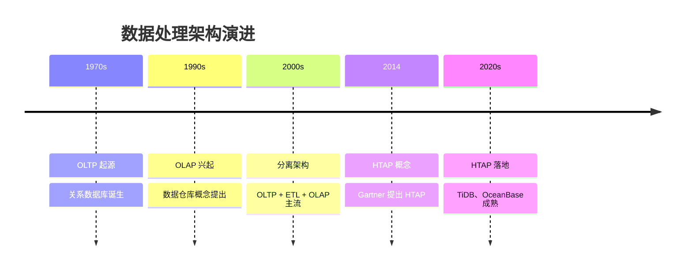
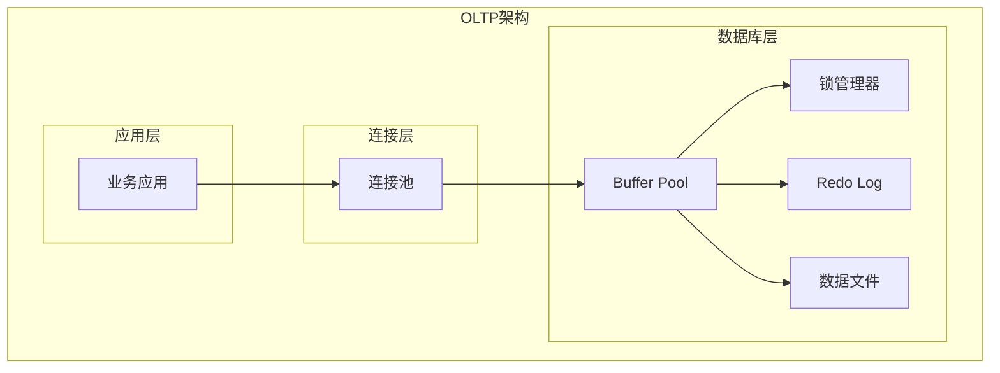
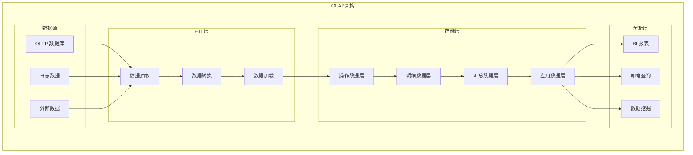
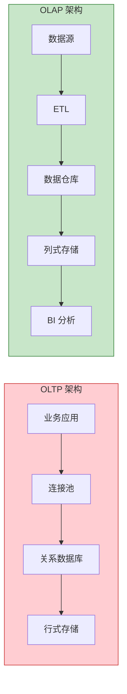
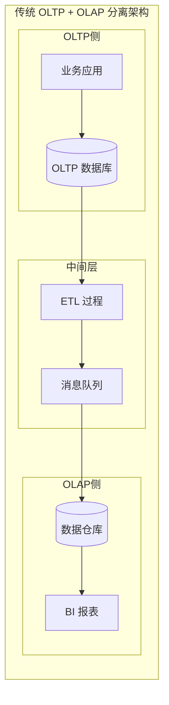
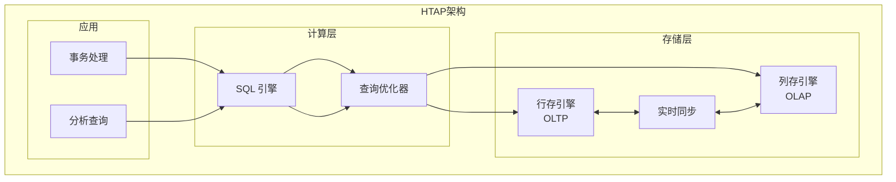
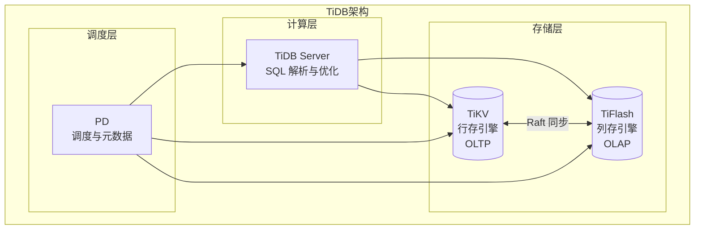
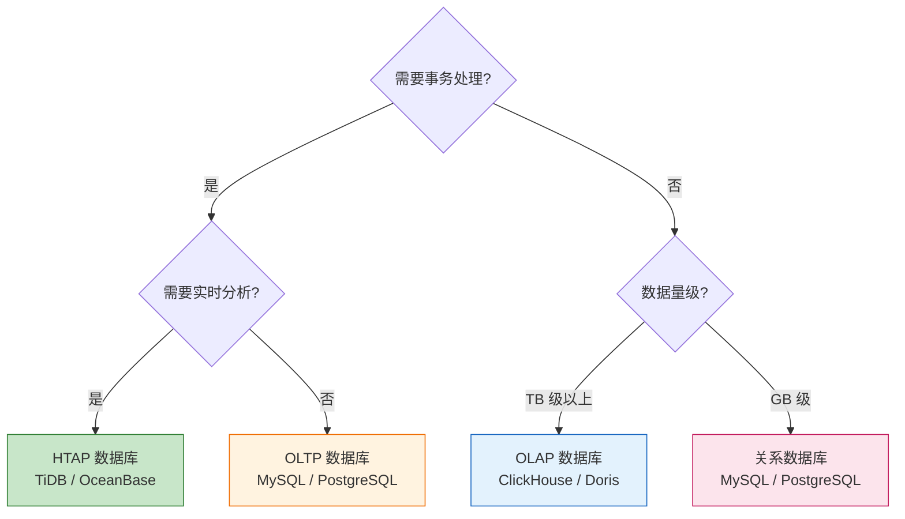

# OLTP 与 OLAP 数据处理架构详解

## 一、概述

### 1.1 什么是 OLTP 和 OLAP？

| 概念 | 全称 | 中文名称 | 核心定位 |
|------|------|----------|----------|
| **OLTP** | Online Transaction Processing | 联机事务处理 | 处理日常业务中的实时交易 |
| **OLAP** | Online Analytical Processing | 联机分析处理 | 对海量历史数据进行多维度分析 |

**形象理解**：

| 场景 | OLTP 操作 | OLAP 操作 |
|------|-----------|-----------|
| **电商** | 用户下单、支付、修改收货地址 | 分析月度销售额、用户购买偏好 |
| **银行** | 转账、存款、取款 | 风险分析、资金流向统计 |
| **物流** | 订单创建、状态更新 | 配送效率分析、路线优化 |

### 1.2 发展历程



---

## 二、OLTP 详解

### 2.1 核心特征

| 特征 | 说明 |
|------|------|
| **高并发** | 支持大量用户同时进行操作 |
| **事务性强** | 必须保证 ACID 特性 |
| **响应快速** | 毫秒级响应，通常 < 100ms |
| **数据粒度细** | 操作少量行记录，但频繁发生 |
| **实时更新** | 数据实时写入，即时可见 |

### 2.2 ACID 事务特性

| 特性 | 说明 | 示例 |
|------|------|------|
| **原子性（Atomicity）** | 事务要么全部成功，要么全部失败 | 转账：扣款和到账必须同时成功或失败 |
| **一致性（Consistency）** | 事务前后数据状态保持一致 | 余额扣除后，账户总额不变 |
| **隔离性（Isolation）** | 并发事务互不干扰 | 两人同时转账，结果正确 |
| **持久性（Durability）** | 事务提交后永久保存 | 断电后数据不丢失 |

### 2.3 技术架构



**核心技术**：

| 技术 | 说明 |
|------|------|
| **行式存储** | 数据按行连续存储，适合点查 |
| **B+ 树索引** | 加速等值查询和范围查询 |
| **MVCC** | 多版本并发控制，读写不阻塞 |
| **WAL** | 预写日志，保证事务持久性 |
| **行级锁** | 细粒度锁，提高并发度 |

### 2.4 数据模型

**规范化设计（第三范式）**：

```
订单系统示例：

users 表          orders 表              order_items 表
┌─────────┐      ┌──────────────┐       ┌─────────────────┐
│ user_id │←─────│ order_id     │←──────│ item_id         │
│ name    │      │ user_id (FK) │       │ order_id (FK)   │
│ email   │      │ total_amount │       │ product_id (FK) │
│ phone   │      │ status       │       │ quantity        │
└─────────┘      │ create_time  │       │ price           │
                 └──────────────┘       └─────────────────┘
```

**设计原则**：
- 消除数据冗余
- 避免更新异常
- 保证数据一致性

### 2.5 典型应用场景

| 场景 | 说明 | 性能要求 |
|------|------|----------|
| **金融交易** | 银行转账、证券交易 | 可用性 99.999%，数据零丢失 |
| **电商订单** | 下单、支付、发货 | 峰值 QPS 数十万 |
| **在线支付** | 支付宝、微信支付 | 毫秒级响应 |
| **企业 ERP** | 库存管理、订单处理 | 数据强一致 |
| **社交应用** | 消息发送、状态更新 | 高并发写入 |

### 2.6 代表性产品

| 产品 | 特点 |
|------|------|
| **MySQL** | 最流行的开源关系数据库 |
| **PostgreSQL** | 功能强大的对象关系数据库 |
| **Oracle** | 企业级数据库，功能全面 |
| **SQL Server** | 微软企业级数据库 |
| **MySQL InnoDB** | 默认存储引擎，支持事务 |

---

## 三、OLAP 详解

### 3.1 核心特征

| 特征 | 说明 |
|------|------|
| **查询复杂** | 多表关联、聚合计算、多维分析 |
| **数据量大** | 处理 TB~PB 级数据 |
| **读多写少** | 以读取为主，批量导入写入 |
| **响应容忍度高** | 秒级到分钟级响应 |
| **数据粒度粗** | 汇总数据、历史数据 |

### 3.2 多维数据模型

**星型模型**：

```
              ┌─────────────┐
              │  时间维度   │
              │ dim_time    │
              └──────┬──────┘
                     │
┌─────────────┐     │     ┌─────────────┐
│  地区维度   │─────┼─────│  产品维度   │
│ dim_region  │     │     │ dim_product │
└─────────────┘     │     └─────────────┘
                     │
              ┌──────┴──────┐
              │  事实表     │
              │ fact_sales  │
              │ - 时间ID    │
              │ - 地区ID    │
              │ - 产品ID    │
              │ - 销售额    │
              │ - 销售量    │
              └─────────────┘
```

**雪花模型**：星型模型的扩展，维度表进一步规范化。

### 3.3 技术架构



**核心技术**：

| 技术 | 说明 |
|------|------|
| **列式存储** | 数据按列存储，聚合查询高效 |
| **向量化执行** | 利用 CPU SIMD 指令批量处理 |
| **分区裁剪** | 跳过无关分区，减少扫描量 |
| **物化视图** | 预计算常用聚合结果 |
| **MPP 架构** | 大规模并行处理 |

### 3.4 典型应用场景

| 场景 | 说明 | 查询特点 |
|------|------|----------|
| **商业智能（BI）** | 销售报表、经营分析 | 多维度聚合 |
| **用户行为分析** | 漏斗分析、留存分析 | 海量日志处理 |
| **风险管控** | 欺诈检测、风险预警 | 复杂模式匹配 |
| **数据仓库** | 企业级数据整合 | ETL + 复杂查询 |
| **实时监控** | 系统监控、业务大屏 | 实时聚合计算 |

### 3.5 代表性产品

| 产品 | 特点 |
|------|------|
| **ClickHouse** | 高性能列式 OLAP 数据库 |
| **Apache Hive** | 基于 Hadoop 的数据仓库 |
| **Snowflake** | 云原生数据仓库 |
| **Amazon Redshift** | AWS 云数据仓库 |
| **Google BigQuery** | Google 云数据仓库 |
| **Apache Doris** | 国产 MPP 分析数据库 |
| **StarRocks** | 国产新一代 OLAP 数据库 |

---

## 四、OLTP vs OLAP 全面对比

### 4.1 核心对比

| 对比维度 | OLTP | OLAP |
|----------|------|------|
| **核心目标** | 保障事务原子性与一致性 | 加速复杂查询，支持多维分析 |
| **数据时效性** | 实时数据，秒级更新 | 历史数据，批量/定时更新 |
| **存储模式** | 行式存储 | 列式存储 |
| **数据模型** | 第三范式规范化设计 | 星型/雪花型多维模型 |
| **查询类型** | 简单 CRUD，单表查询为主 | 多表关联、聚合计算 |
| **响应时间** | 毫秒级（< 100ms） | 秒级到分钟级 |
| **并发量** | 高并发（数万 QPS） | 低并发（数十到数百） |
| **数据量** | GB 级 | TB ~ PB 级 |
| **用户群体** | 一线业务人员 | 数据分析师、管理层 |
| **可用性要求** | 99.99% 以上 | 相对较低 |

### 4.2 架构对比



### 4.3 读写模式对比

| 模式 | OLTP | OLAP |
|------|------|------|
| **读写比例** | 写多读少 | 读多写少 |
| **写入方式** | 随机写入、实时更新 | 批量导入、追加写入 |
| **读取方式** | 索引点查、少量数据 | 全表扫描、聚合计算 |
| **更新频率** | 高频实时更新 | 低频批量更新 |

### 4.4 索引策略对比

| 策略 | OLTP | OLAP |
|------|------|------|
| **主要索引** | B+ 树索引、哈希索引 | 稀疏索引、位图索引 |
| **索引粒度** | 精确到行 | 精确到数据块 |
| **索引大小** | 数据量的 10%-30% | 数据量的 0.01% |
| **查询优化** | 索引覆盖、回表 | 分区裁剪、谓词下推 |

---

## 五、传统分离架构

### 5.1 架构模式



### 5.2 数据流转过程

| 阶段 | 说明 | 延迟 |
|------|------|------|
| **数据产生** | OLTP 系统产生业务数据 | 实时 |
| **数据抽取** | ETL 工具抽取增量数据 | 分钟级 |
| **数据转换** | 清洗、转换、标准化 | 分钟级 |
| **数据加载** | 加载到数据仓库 | 分钟级 |
| **数据可用** | OLAP 系统可查询 | T+1 或小时级 |

### 5.3 分离架构的问题

| 问题 | 说明 |
|------|------|
| **数据延迟** | OLAP 数据滞后，无法实时分析 |
| **架构复杂** | 需要维护多套系统 |
| **运维成本高** | ETL 开发、数据同步、系统维护 |
| **数据一致性** | OLTP 和 OLAP 数据可能不一致 |
| **资源浪费** | 数据多份存储，冗余严重 |

---

## 六、HTAP 混合架构

### 6.1 什么是 HTAP？

**HTAP（Hybrid Transactional/Analytical Processing）** 是一种在同一套系统中同时支持事务处理（OLTP）和分析处理（OLAP）的数据架构。

**核心目标**：
- 一份数据，既能做事务，也能做分析
- 避免 ETL 抽取，减少数据延迟
- 既保证 OLTP 的高并发低延迟，又能支持 OLAP 的大规模复杂查询

### 6.2 HTAP 架构原理



### 6.3 HTAP 核心技术

| 技术 | 说明 |
|------|------|
| **行列混存** | 行存服务 OLTP，列存服务 OLAP |
| **实时同步** | 行存数据实时同步到列存 |
| **存算分离** | 存储和计算独立扩展 |
| **智能路由** | 自动选择最优执行引擎 |
| **资源隔离** | OLTP 和 OLAP 资源物理隔离 |

### 6.4 HTAP 代表产品

| 产品 | 架构特点 | 适用场景 |
|------|----------|----------|
| **TiDB** | 行存 TiKV + 列存 TiFlash，Raft 同步 | 通用 HTAP 场景 |
| **OceanBase** | 统一存储引擎，行列混存 | 金融级 HTAP |
| **StarRocks** | 向量化引擎，实时分析 | 实时数仓 |
| **SingleStore** | 内存优先，行列混合 | 实时分析 |

### 6.5 TiDB HTAP 架构示例



**TiDB HTAP 特点**：

| 特点 | 说明 |
|------|------|
| **双引擎** | TiKV（行存）+ TiFlash（列存） |
| **Raft 同步** | TiFlash 作为 Raft Learner 实时同步 |
| **智能选择** | 优化器自动选择最优引擎 |
| **资源隔离** | OLTP 和 OLAP 物理隔离，互不影响 |

### 6.6 HTAP vs 传统架构

| 特性 | 传统分离架构 | HTAP 架构 |
|------|--------------|-----------|
| **数据链路** | 多份数据，需 ETL 同步 | 一份数据，实时同步 |
| **数据延迟** | 分钟~小时级 | 秒级甚至毫秒级 |
| **运维成本** | 高（多系统） | 低（统一系统） |
| **架构复杂度** | 高 | 中 |
| **适用场景** | 离线 BI 报表 | 实时智能应用 |

### 6.7 HTAP 典型应用场景

| 场景 | 说明 |
|------|------|
| **实时推荐** | 用户行为实时分析 + 交易处理 |
| **金融风控** | 交易写入 + 实时风险分析 |
| **实时报表** | 业务数据 + 实时统计报表 |
| **IoT 监控** | 设备数据写入 + 实时聚合分析 |

---

## 七、选型指南

### 7.1 场景选型

| 业务场景 | 推荐方案 | 说明 |
|----------|----------|------|
| **纯事务处理** | MySQL / PostgreSQL | 传统 OLTP 数据库 |
| **纯分析查询** | ClickHouse / Doris | 专业 OLAP 数据库 |
| **实时分析需求** | HTAP 数据库 | TiDB / OceanBase |
| **离线数仓** | Hive / Spark | 批处理架构 |
| **混合负载** | HTAP 数据库 | 一套系统解决 |

### 7.2 决策流程



### 7.3 产品对比

| 产品 | 类型 | 优势 | 劣势 |
|------|------|------|------|
| **MySQL** | OLTP | 成熟稳定、生态丰富 | 大数据量性能下降 |
| **PostgreSQL** | OLTP | 功能强大、扩展性好 | 运维复杂度高 |
| **ClickHouse** | OLAP | 查询极快、压缩率高 | 不支持事务、更新弱 |
| **TiDB** | HTAP | 水平扩展、HTAP 能力 | 资源消耗较大 |
| **OceanBase** | HTAP | 金融级高可用、兼容性好 | 学习曲线陡 |

---

## 八、总结

### 8.1 核心要点

| 要点 | 说明 |
|------|------|
| **OLTP** | 面向事务处理，强调 ACID、高并发、低延迟 |
| **OLAP** | 面向分析处理，强调大数据量、复杂查询、多维分析 |
| **分离架构** | OLTP + ETL + OLAP，数据延迟高、架构复杂 |
| **HTAP** | 融合 OLTP 和 OLAP，实时分析、简化架构 |

### 8.2 发展趋势

| 趋势 | 说明 |
|------|------|
| **实时化** | 从 T+1 到 T+0，实时分析成为刚需 |
| **云原生化** | 存算分离、弹性扩展、按需付费 |
| **HTAP 化** | 一套系统解决事务和分析需求 |
| **智能化** | AI 辅助查询优化、自动调优 |

### 8.3 学习路径

```
基础概念 → OLTP 原理 → OLAP 原理 → 分离架构 → HTAP 架构 → 产品选型
```

---

## 参考资料

- [OLAP 与 OLTP - OceanBase](https://www.oceanbase.com/)
- [HTAP 数据库 - Gartner](https://www.gartner.com/)
- [TiDB 官方文档](https://docs.pingcap.com/zh/tidb/stable)
- [ClickHouse 官方文档](https://clickhouse.com/docs)
