# 消息中间件 MQ 对比详情

## 一、消息中间件概述

### 1.1 什么是消息中间件？

消息中间件（Message Queue，MQ）是分布式系统中用于**异步通信、服务解耦、流量削峰**的核心组件，通过消息队列实现应用间的可靠通信。

### 1.2 核心功能

| 功能 | 说明 |
|------|------|
| **异步处理** | 将同步调用转为异步，提升响应速度 |
| **服务解耦** | 生产者与消费者无需直接交互，降低耦合 |
| **流量削峰** | 高峰期消息堆积，平滑处理请求 |
| **可靠传输** | 消息持久化、确认机制保证消息不丢失 |
| **广播通信** | 一条消息可被多个消费者消费 |

### 1.3 消息模型

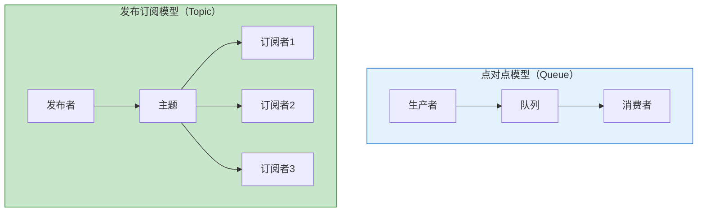

---

## 二、主流 MQ 演进历程

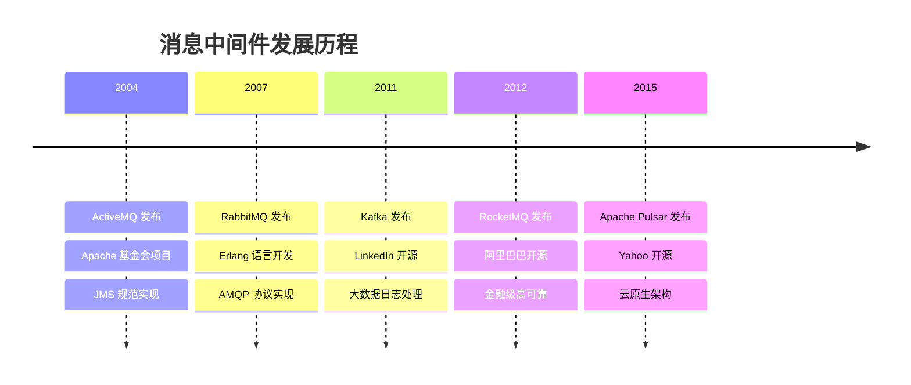

---

## 三、主流 MQ 详细对比

### 3.1 ActiveMQ

**简介**：Apache ActiveMQ 是最早的开源消息中间件之一，完全支持 JMS（Java Message Service）规范。

**架构特点**：
- 基于 Java 开发，跨平台
- 支持 JMS 1.1 规范
- 主从架构，支持集群

**优缺点**：

| 优点 | 缺点 |
|------|------|
| 完全支持 JMS 规范 | 性能较低（万级 TPS） |
| 跨平台，部署简单 | 社区活跃度下降 |
| 支持多种协议 | 不适合高并发场景 |
| 成熟稳定 | 消息堆积能力弱 |

**适用场景**：
- 传统企业应用
- JMS 规范要求的项目
- 低并发业务系统

---

### 3.2 RabbitMQ

**简介**：RabbitMQ 是实现 AMQP 协议的开源消息中间件，由 Erlang 语言开发，最初起源于金融系统。

**架构特点**：
- 基于 Erlang 开发，高并发能力强
- 支持 AMQP 0.9.1 协议
- Exchange + Queue 路由模型

**架构图**：

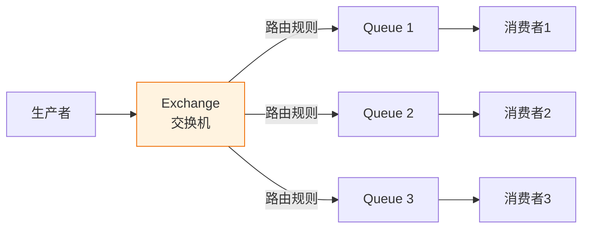

**Exchange 类型**：

| 类型 | 说明 |
|------|------|
| **Direct** | 精确匹配路由键 |
| **Topic** | 通配符匹配路由键 |
| **Fanout** | 广播到所有绑定队列 |
| **Headers** | 根据消息头匹配 |

**优缺点**：

| 优点 | 缺点 |
|------|------|
| 消息可靠性高 | 吞吐量有限（万级 TPS） |
| 灵活的路由机制 | Erlang 语言门槛高 |
| 支持多种协议 | 水平扩展复杂 |
| 管理界面友好 | 消息堆积能力一般 |
| 延迟低（微秒级） | 集群镜像队列性能损耗 |

**适用场景**：
- 金融交易系统
- 订单处理系统
- 需要复杂路由的场景
- 对可靠性要求高的业务

---

### 3.3 Kafka

**简介**：Apache Kafka 是 LinkedIn 开源的分布式流处理平台，专为大数据场景设计，具有超高吞吐量。

**架构特点**：
- 基于 Scala/Java 开发
- Partition + Segment 分区存储
- 顺序磁盘 IO，零拷贝技术

**架构图**：

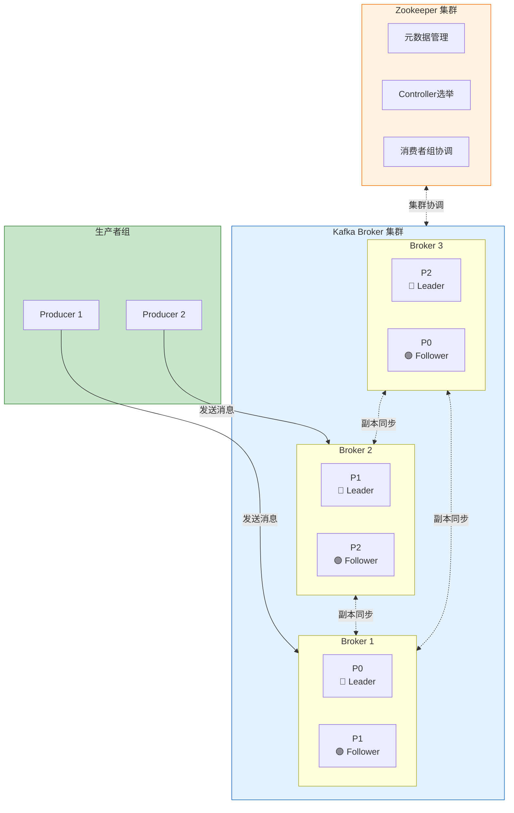

**消费者组消费模型**：

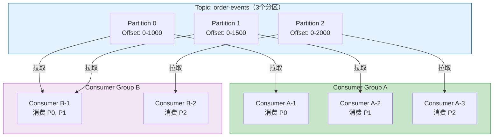

**消费者组工作原理**：

| 特性 | 说明 |
|------|------|
| **分区分配** | 同一消费者组内，每个分区只能被一个消费者消费 |
| **负载均衡** | 消费者数量 ≤ 分区数量时，每个消费者消费一个或多个分区 |
| **广播消费** | 不同消费者组可以独立消费同一 Topic 的全部消息 |
| **Rebalance** | 消费者加入/退出时，重新分配分区 |

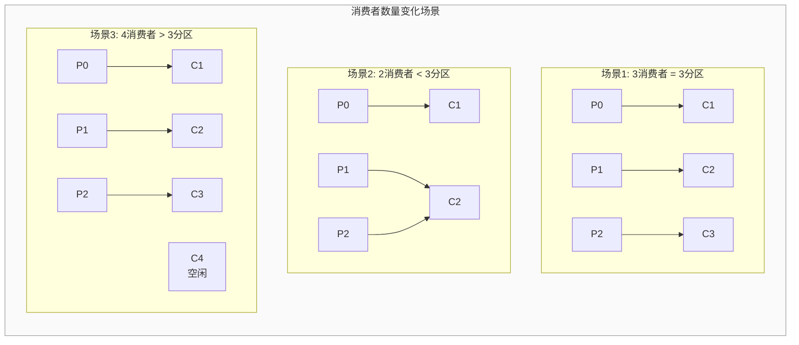

**工作流程**：

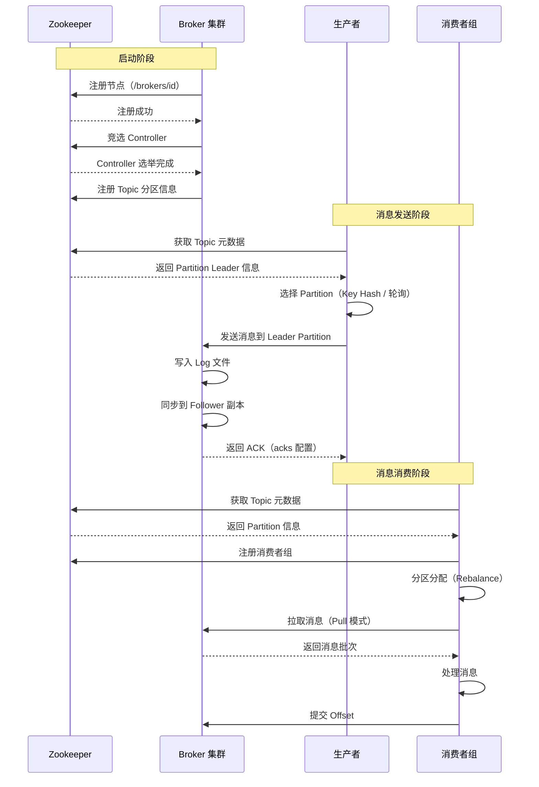

**核心概念**：

| 概念 | 说明 |
|------|------|
| **Broker** | Kafka 服务器节点 |
| **Topic** | 消息主题，逻辑分类 |
| **Partition** | 分区，并行处理单元 |
| **Segment** | 分区内的存储段 |
| **Consumer Group** | 消费者组，实现广播/单播 |

**优缺点**：

| 优点 | 缺点 |
|------|------|
| 超高吞吐量（百万级 TPS） | 实时性稍差（毫秒级） |
| 消息持久化，支持回溯 | 功能相对简单 |
| 天然分布式，易扩展 | 消息路由能力弱 |
| 高可用，数据副本机制 | 依赖 Zookeeper（旧版） |
| 支持流处理 | 不支持事务消息 |

**适用场景**：
- 大数据日志采集
- 实时数据流处理
- 用户行为分析
- 消息堆积场景
- 数据管道

---

### 3.4 RocketMQ

**简介**：Apache RocketMQ 是阿里巴巴开源的分布式消息中间件，专为金融级高可靠场景设计。

**架构特点**：
- 基于 Java 开发
- NameServer + Broker 架构
- 支持事务消息、延迟消息

**架构图**：

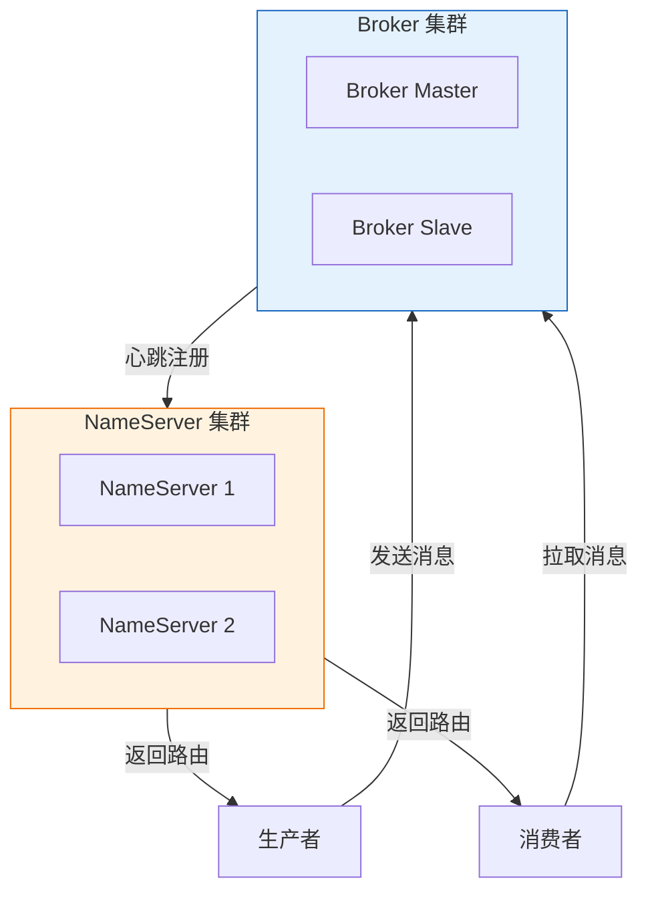

**工作流程**：

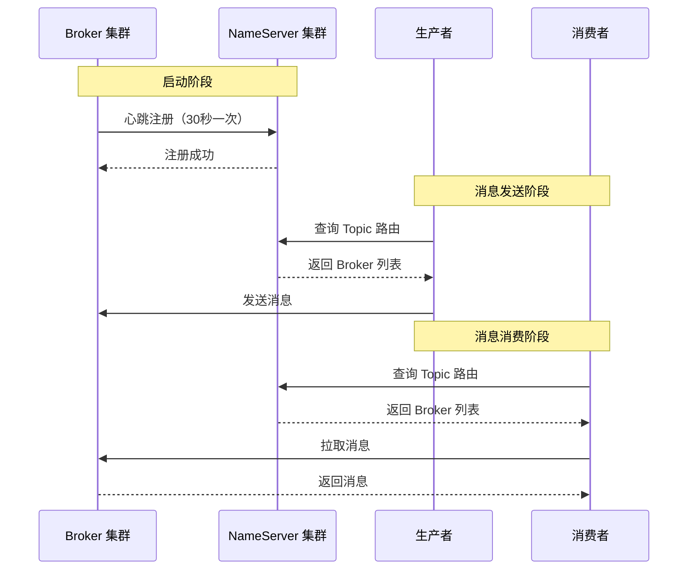

**核心特性**：

| 特性 | 说明 |
|------|------|
| **事务消息** | 分布式事务最终一致性 |
| **延迟消息** | 支持任意时间延迟 |
| **顺序消息** | 全局/分区顺序 |
| **消息过滤** | Tag/SQL92 过滤 |
| **消息回溯** | 支持按时间回溯 |

**优缺点**：

| 优点 | 缺点 |
|------|------|
| 高可靠，金融级验证 | 社区生态不如 Kafka |
| 支持事务消息 | 管理界面一般 |
| 支持延迟消息 | 多语言客户端较少 |
| 吞吐量高（10万级 TPS） | 文档相对较少 |
| 阿里云生态支持 | 学习曲线较陡 |

**适用场景**：
- 电商交易系统
- 金融支付系统
- 订单超时取消
- 分布式事务场景
- 需要延迟消息的业务

---

### 3.5 Apache Pulsar

**简介**：Apache Pulsar 是 Yahoo 开源的新一代云原生消息中间件，采用存储计算分离架构。

**架构特点**：
- 存储计算分离架构
- BookKeeper 持久化存储
- 原生支持多租户

**架构图**：

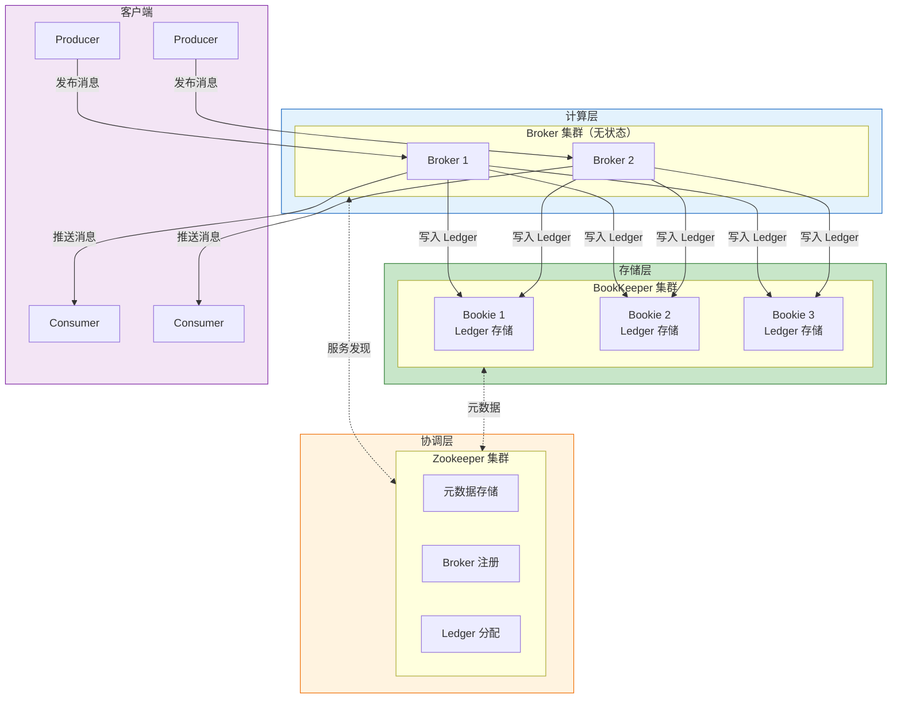

**存储计算分离架构优势**：

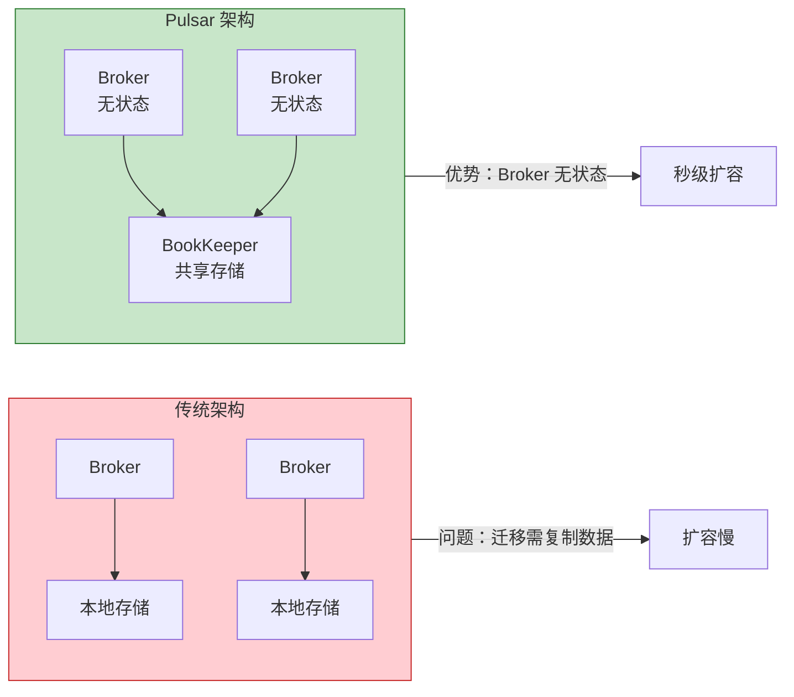

**工作流程**：

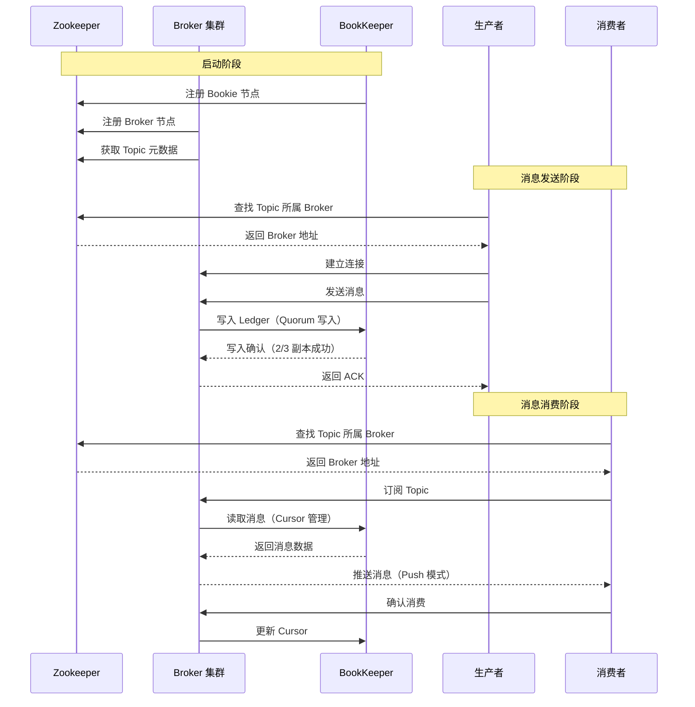

**核心特性**：

| 特性 | 说明 |
|------|------|
| **存储计算分离** | 独立扩展，灵活部署 |
| **多租户** | 原生支持多租户隔离 |
| **分层存储** | 热数据/冷数据分离 |
| **跨地域复制** | 原生支持异地多活 |
| **多种订阅模式** | 独占、共享、故障转移、键共享 |

**优缺点**：

| 优点 | 缺点 |
|------|------|
| 云原生架构 | 社区生态较新 |
| 超高吞吐量（百万级） | 运维复杂度高 |
| 支持队列+流两种模型 | 资源消耗较大 |
| 多租户原生支持 | 学习资料较少 |
| 秒级扩容 | 企业应用案例较少 |

**适用场景**：
- 云原生应用
- 多租户 SaaS 平台
- 跨地域数据同步
- 大规模消息处理
- 流批一体处理

---

## 四、核心指标对比

### 4.1 性能对比

| 指标 | ActiveMQ | RabbitMQ | Kafka | RocketMQ | Pulsar |
|------|----------|----------|-------|----------|--------|
| **吞吐量** | 万级 | 万级 | 百万级 | 10万级 | 百万级 |
| **延迟** | 毫秒级 | 微秒级 | 毫秒级 | 毫秒级 | 毫秒级 |
| **消息堆积** | 弱 | 一般 | 极强 | 强 | 极强 |
| **可用性** | 高 | 高 | 极高 | 极高 | 极高 |

### 4.2 功能对比

| 功能 | ActiveMQ | RabbitMQ | Kafka | RocketMQ | Pulsar |
|------|----------|----------|-------|----------|--------|
| **事务消息** | ✅ | ✅ | ❌ | ✅ | ✅ |
| **延迟消息** | ✅ | ✅ | ❌ | ✅ | ✅ |
| **顺序消息** | ✅ | ✅ | ✅ | ✅ | ✅ |
| **消息过滤** | ✅ | ✅ | ❌ | ✅ | ✅ |
| **消息回溯** | ❌ | ❌ | ✅ | ✅ | ✅ |
| **多租户** | ❌ | ❌ | ❌ | ❌ | ✅ |
| **管理界面** | ✅ | ✅ | ❌ | ✅ | ✅ |

### 4.3 运维对比

| 维度 | ActiveMQ | RabbitMQ | Kafka | RocketMQ | Pulsar |
|------|----------|----------|-------|----------|--------|
| **部署复杂度** | 低 | 低 | 中 | 中 | 高 |
| **运维难度** | 低 | 低 | 高 | 中 | 高 |
| **社区活跃度** | 低 | 高 | 极高 | 中 | 中 |
| **文档完善度** | 高 | 高 | 高 | 中 | 中 |
| **云原生支持** | ❌ | ❌ | 一般 | ❌ | ✅ |

---

## 五、选型建议

### 5.1 选型决策树

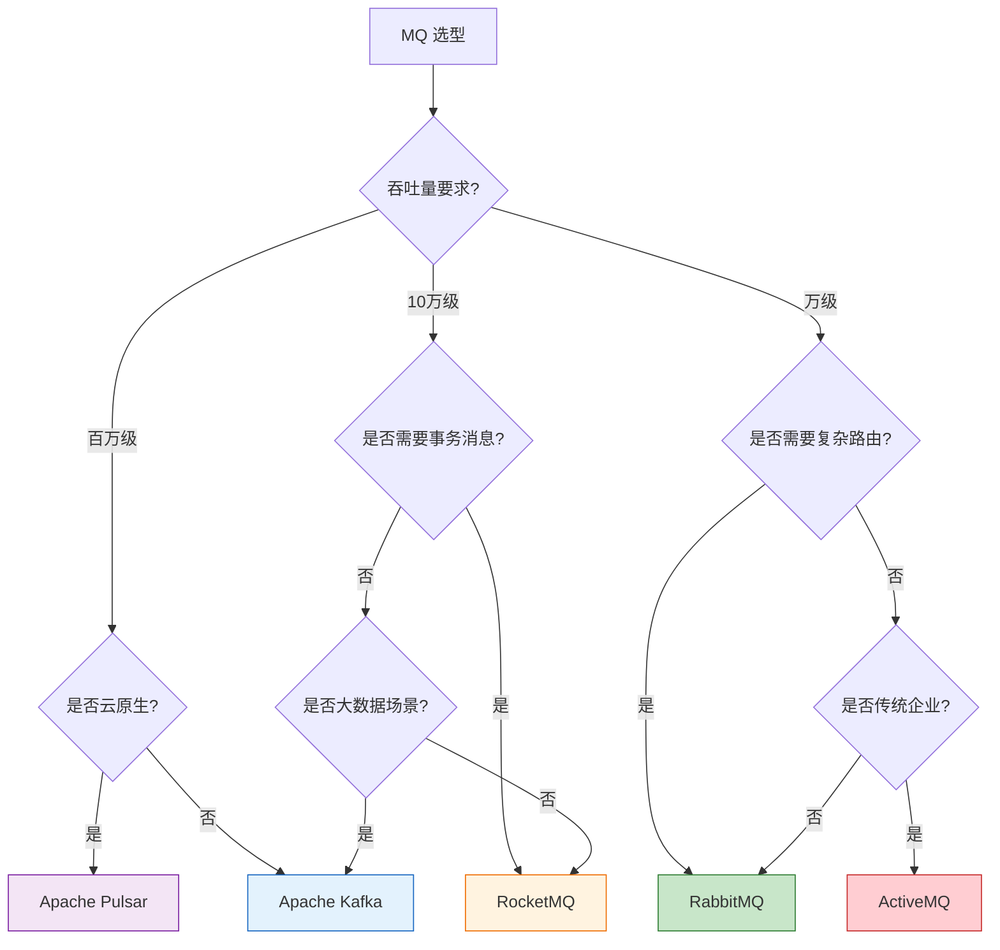

### 5.2 场景推荐

| 场景 | 推荐 MQ | 理由 |
|------|---------|------|
| **电商秒杀** | RocketMQ | 事务消息、高可靠、延迟消息 |
| **金融交易** | RabbitMQ / RocketMQ | 低延迟、高可靠 |
| **日志采集** | Kafka | 高吞吐、消息堆积 |
| **大数据处理** | Kafka | 流处理生态完善 |
| **订单超时取消** | RocketMQ | 延迟消息支持 |
| **分布式事务** | RocketMQ | 事务消息支持 |
| **云原生应用** | Pulsar | 存储计算分离、多租户 |
| **跨地域同步** | Pulsar | 原生跨地域复制 |
| **传统企业应用** | ActiveMQ | JMS 规范、成熟稳定 |
| **复杂路由** | RabbitMQ | Exchange 灵活路由 |

### 5.3 技术栈匹配

| 技术栈 | 推荐 MQ |
|--------|---------|
| Spring Cloud Alibaba | RocketMQ |
| Spring Cloud Netflix | RabbitMQ |
| 大数据生态 | Kafka |
| Kubernetes 云原生 | Pulsar |
| 传统 Java EE | ActiveMQ |

---

## 六、总结

### 6.1 快速选型口诀

```
大数据日志选 Kafka，
金融交易 RabbitMQ，
电商业务 RocketMQ，
云原生选 Pulsar，
传统企业 ActiveMQ。
```

### 6.2 最终建议

| 项目类型 | 首选 | 备选 |
|----------|------|------|
| **互联网高并发** | Kafka | RocketMQ |
| **金融/电商** | RocketMQ | RabbitMQ |
| **大数据平台** | Kafka | Pulsar |
| **云原生项目** | Pulsar | Kafka |
| **中小项目** | RabbitMQ | RocketMQ |

---

## 参考资料

- [Apache Kafka 官方文档](https://kafka.apache.org/documentation/)
- [RabbitMQ 官方文档](https://www.rabbitmq.com/documentation.html)
- [Apache RocketMQ 官方文档](https://rocketmq.apache.org/)
- [Apache Pulsar 官方文档](https://pulsar.apache.org/)
- [ActiveMQ 官方文档](https://activemq.apache.org/)
