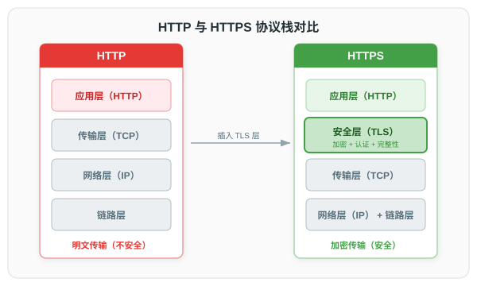
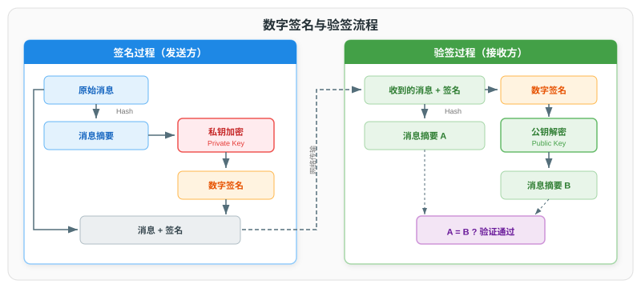
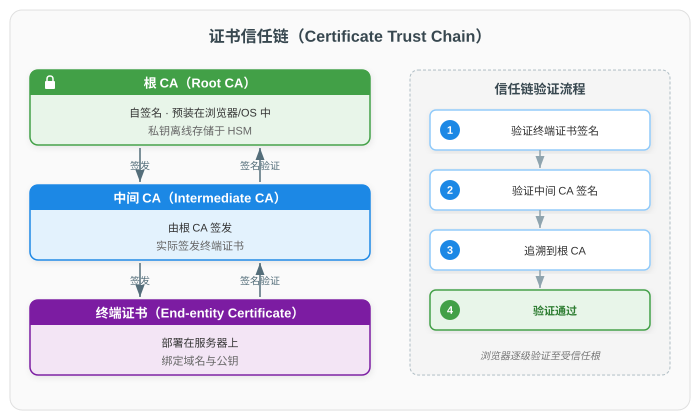
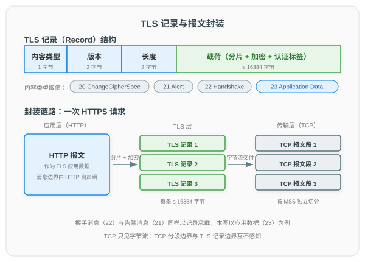
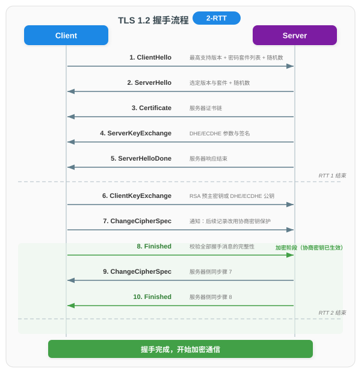
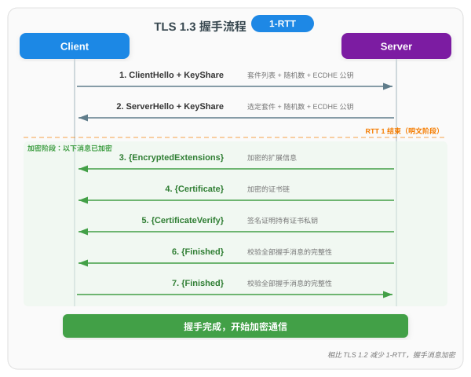
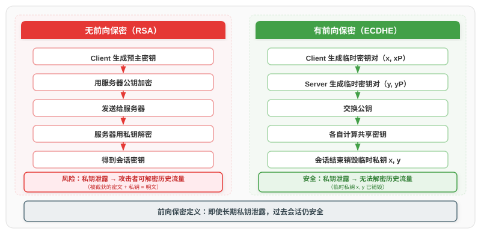

# HTTPS 原理与 TLS 握手详解

> 本文系统梳理 HTTPS 的核心技术体系，涵盖密码学基础、PKI 与证书体系、TLS 1.2 与 TLS 1.3 握手流程、密钥交换与前向保密、安全实践及常见攻击防御。文档分为八个部分：一、概述；二、密码学基础；三、PKI 与证书体系；四、TLS 握手流程；五、密钥交换与前向保密；六、HTTPS 安全实践；七、常见攻击与防御；八、未来展望。文末另附参考资料。

---

## 一、概述

### 1.1 从 HTTP 到 HTTPS

HTTP（HyperText Transfer Protocol）是互联网应用层的核心协议，但其数据以明文传输，存在三大安全缺陷：

| 安全缺陷 | 说明 | 风险 |
|----------|------|------|
| 窃听 | 数据明文传输，中间节点可截获 | 账号、密码、信用卡号泄露 |
| 篡改 | 无完整性校验，数据可被修改 | 页面被注入恶意脚本、广告 |
| 伪造 | 无身份验证，无法确认服务器真实性 | 钓鱼网站冒充正规站点 |

HTTPS（HTTP Secure）通过在 HTTP 和 TCP 之间插入 TLS（Transport Layer Security）协议层来解决上述问题：



### 1.2 SSL 与 TLS 的关系

SSL（Secure Sockets Layer）由 Netscape 于 1995 年设计，后由 IETF 接管并更名为 TLS（Transport Layer Security）。两者的关系如下：

| 版本 | 发布时间 | 状态 | 说明 |
|------|----------|------|------|
| SSL 2.0 | 1995 | 已废弃（2011） | 存在严重安全缺陷 |
| SSL 3.0 | 1996 | 已废弃（2015） | POODLE 攻击导致退役 |
| TLS 1.0 | 1999 | 已废弃（2020） | BEAST 攻击，浏览器已移除支持 |
| TLS 1.1 | 2006 | 已废弃（2020） | 已修复 BEAST 利用的缺陷，但使用率极低 |
| TLS 1.2 | 2008 | 当前主流 | AEAD 加密引入，广泛部署 |
| TLS 1.3 | 2018 | 当前推荐 | 1-RTT 握手，强制前向保密 |

> **命名习惯**：尽管 SSL 已被 TLS 取代多年，业界仍习惯性地将 TLS 证书称为"SSL 证书"，将 HTTPS 连接称为"SSL 连接"。本文统一使用 TLS 术语。

### 1.3 HTTPS 提供的安全保障

HTTPS 提供四项核心安全保障：

| 保障 | 实现机制 | 对应缺陷 |
|------|----------|----------|
| 机密性（Confidentiality） | 对称加密（AES-GCM、ChaCha20） | 防窃听 |
| 完整性（Integrity） | AEAD 认证标签 | 防篡改 |
| 身份验证（Authentication） | 数字证书 + 数字签名 | 防伪造 |
| 前向保密（Forward Secrecy） | ECDHE 临时密钥交换 | 防事后解密 |

---

## 二、密码学基础

### 2.1 对称加密

对称加密使用同一密钥进行加密和解密，优点是计算速度快，适合大量数据加密。

| 算法 | 类型 | 密钥长度 | 说明 |
|------|------|----------|------|
| AES-GCM | AEAD | 128/256 位 | 硬件加速（AES-NI），TLS 1.3 标准算法 |
| ChaCha20-Poly1305 | AEAD | 256 位 | 软件实现高效，移动端友好 |
| AES-CBC | 分组密码 | 128/256 位 | 已在 TLS 1.3 中移除（Padding Oracle 风险） |
| 3DES | 分组密码 | 168 位 | 已废弃，性能低且安全性不足 |

> **AEAD（Authenticated Encryption with Associated Data）** 同时完成加密和认证，将 Encrypt 与 MAC 两个原语融合为一步操作，避免了 MAC-then-Encrypt 等组合模式的安全缺陷。TLS 1.3 强制使用 AEAD 模式。
>
> **认证与 MAC 的关系**：认证是安全目标，**MAC**（Message Authentication Code，消息认证码）是共享密钥场景下实现该目标的原语——双方以共享密钥计算认证标签，接收方重算比对，AEAD 的认证标签即由其内置的 MAC 计算得出。与 2.4 节的数字签名不同，持有密钥的任何一方都能生成有效的 MAC 标签（接收方也不例外），第三方因此无法断定其出处，即不具备不可否认性。**HMAC** 则是以哈希函数构造 MAC 的标准方式（HMAC-SHA256 即以 SHA-256 为核心哈希），后文 4.4 节 CBC 套件的报文认证与 5.3 节 HKDF 密钥派生均基于这一构造。

### 2.2 非对称加密

非对称加密使用密钥对（公钥 + 私钥），公钥公开用于加密或验签，私钥保密用于解密或签名。

| 算法 | 用途 | 密钥长度 | 说明 |
|------|------|----------|------|
| RSA | 加密/签名 | 2048/4096 位 | 最广泛部署，但密钥较大 |
| ECDSA | 签名 | 256/384 位 | 椭圆曲线签名，密钥更短 |
| Ed25519 | 签名 | 256 位 | 现代签名算法，高性能高安全 |

> **RSA 与 ECDSA 对比**：256 位 ECDSA 提供的安全强度相当于 3072 位 RSA，但密钥和签名尺寸更小、计算更快。现代 TLS 部署优先选择 ECDSA 证书。

### 2.3 哈希函数

哈希函数将任意长度数据映射为固定长度摘要，用于完整性校验和数字签名。

| 算法 | 摘要长度 | 状态 | 说明 |
|------|----------|------|------|
| MD5 | 128 位 | 已废弃 | 碰撞攻击可行，TLS 1.3 已移除 |
| SHA-1 | 160 位 | 已废弃 | SHAttered 攻击，TLS 1.3 已移除 |
| SHA-256 | 256 位 | 当前标准 | TLS 1.2/1.3 默认哈希算法 |
| SHA-384 | 384 位 | 当前标准 | 高安全场景使用 |

### 2.4 数字签名

数字签名结合非对称加密和哈希函数，实现身份验证和不可否认性：



签名过程（发送方）：原始消息 → Hash → 消息摘要 → 私钥加密 → 数字签名 → 与原始消息一同发出

验签过程（接收方）：收到"消息 + 签名" → 消息经 Hash 得消息摘要 A → 签名经公钥解密得消息摘要 B → 比对 A 与 B：一致则验证通过

### 2.5 密钥交换

2.1 节的对称加密要求通信双方持有**相同的密钥**，但这个密钥本身如何交给对方？直接在不安全信道上发送，密钥会被窃听者截获，后续的加密通信形同虚设——此即**密钥分发问题**。

**密钥交换**（Key Exchange）是解决密钥分发问题的机制：通信双方相互交换公开信息，据此各自独立计算出同一个**共享密钥**（Shared Key）——它是对称密钥，用于随后的加密通信；窃听者虽能截获全部交换内容，却无法由这些内容推导出共享密钥。常见的密钥交换协议如下：

| 协议 | 说明 | 前向保密 |
|------|------|----------|
| RSA 密钥传输 | 严格说是密钥传输而非交换：客户端生成**预主密钥**（Pre-Master Secret，随机生成的秘密值），用服务器公钥加密发送，服务器以私钥解密获得，双方再由它派生共享密钥 | 否（私钥泄露可解密历史流量） |
| DH | Diffie-Hellman 密钥交换：双方交换公开参数，各自计算出相同的共享密钥，安全性基于有限域离散对数难题 | 是（使用临时密钥对时） |
| ECDHE | 椭圆曲线 Diffie-Hellman 临时密钥交换：以椭圆曲线实现 DH，且每次会话使用临时密钥对 | 是（TLS 1.3 强制使用） |

> **DH 家族的命名**：ECDHE 可拆解为 EC（Elliptic Curve，椭圆曲线）+ DH（Diffie-Hellman）+ E（Ephemeral，临时）——DH 是基础协议（在有限域上运行），ECDH 是它的椭圆曲线实现而非另一个协议；后缀 E 表示每次会话使用**临时密钥对**而非长期密钥（DHE、ECDHE 同理）。无 E 的静态形态使用固定密钥对，不具备前向保密（见 5.1 节）。表中"前向保密"指：即使长期私钥在未来泄露，历史通信仍可保密。

---

## 三、PKI 与证书体系

### 3.1 数字证书

2.2 节的公钥以明文公开分发，但客户端无法分辨收到的公钥是目标服务器的，还是中间人伪造后替换的——公钥本身没有身份证明。**数字证书**（Digital Certificate）就是为公钥提供身份证明的电子文件：由权威机构（CA，Certificate Authority，证书颁发机构）签发，将一个**公钥**与其持有者的身份（如域名）绑定在一起，并以 CA 的私钥对绑定关系签名——签名可用预装的 CA 公钥验证，伪造无法通过。

一份证书从诞生到发挥作用经历四个环节：

1. **申请**：服务器运营者生成密钥对，将公钥与域名等身份信息提交给 CA；
2. **签发**：CA 验证申请者对该域名的控制权后，用 CA 私钥对"公钥 + 身份信息"整体签名，生成证书；
3. **部署与下发**：证书部署在服务器上，TLS 握手时下发给客户端；
4. **验证**：客户端用本地预装的 CA 公钥验证证书签名，通过后即信任证书中的公钥，用于后续的密钥交换与身份验证。

> 第 4 步的验证即 2.4 节验签流程的复用，签名人由服务器换为 CA：用本地预装的 CA 公钥解密证书的签名值，得到签发时 CA 计算的摘要 A；按签名算法字段指定的哈希算法，对证书的数据部分（公钥与身份的绑定关系）重算得摘要 B；两者一致，即证明证书内容未被篡改并且确实经过 CA 私钥签名——这也解释了 3.3 节"签名算法"与"签名值"两个字段的用途。

管理证书的申请、签发、验证与吊销等全生命周期的体系即 **PKI**（见 3.2 节）；真实网络中 CA 分层存在，签名验证沿证书链逐级展开（见 3.5 节）。

### 3.2 PKI 概述

PKI（Public Key Infrastructure，公钥基础设施）是管理数字证书的完整体系，核心目标是将公钥与身份绑定，并通过信任链传递信任。PKI 的核心组件：

| 组件 | 说明 |
|------|------|
| CA（Certificate Authority） | 证书颁发机构，签发和管理数字证书 |
| RA（Registration Authority） | 注册机构，验证申请者身份 |
| CRL/OCSP | 证书吊销检查机制 |
| 证书持有者 | 拥有证书的服务器或个人 |
| 依赖方 | 验证证书的客户端（如浏览器） |

### 3.3 X.509 证书结构

HTTPS 证书遵循 X.509 v3 标准，亦称为 X.509 证书，其核心字段如下：

| 字段 | 说明 |
|------|------|
| 版本（Version） | X.509 版本号（当前 v3） |
| 序列号（Serial Number） | CA 颁发的唯一标识 |
| 签名算法（Signature Algorithm） | CA 签名所用算法（如 SHA256withRSA） |
| 颁发者（Issuer） | 签发证书的 CA 名称 |
| 有效期（Validity） | 生效时间（Not Before）和过期时间（Not After） |
| 主题（Subject） | 证书所有者信息（域名、组织等） |
| 公钥信息（Subject Public Key Info） | 证书持有者的公钥及算法 |
| SAN（Subject Alternative Name） | 证书覆盖的域名列表 |
| 签名值（Signature Value） | CA 用私钥对证书内容的签名 |

### 3.4 证书类型

证书沿两个相互独立的维度分类：
- **验证级别**——CA 签发前对申请者身份的核查深度，从"仅证明你控制该域名"到"额外证明组织真实且合法"；
- **域名覆盖范围**——证书声明保护的域名集合，浏览器仅对这些域名信任此证书。

**按验证级别**：

| 类型 | 全称 | 验证内容 | 审核签发耗时 | 适用场景 |
|------|------|----------|--------------|----------|
| DV | Domain Validation（域名验证） | 仅验证域名所有权 | 分钟级 | 个人网站、博客、API |
| OV | Organization Validation（组织验证） | 域名所有权 + 组织身份 | 1-3 天 | 企业官网、B2B 服务 |
| EV | Extended Validation（扩展验证） | 域名 + 组织 + 法律地位 | 3-7 天 | 金融、电商等高安全场景 |

> "审核签发耗时"指 CA 完成身份核查并签发证书所需的处理时长，与证书的有效期（3.3 节 Validity 字段，以月/年计）无关。**DV、OV、EV 的加密强度相同**，区别仅在于身份验证的严格程度。2019 年起，主流浏览器已移除 EV 证书的绿色地址栏显示，EV 的视觉区分不再明显。

**按域名覆盖范围**：

| 类型 | 覆盖范围 | 示例 |
|------|----------|------|
| 单域名证书 | 仅保护一个域名 | `www.example.com` |
| 通配符证书 | 保护一个域名及其所有子域名 | `*.example.com` |
| 多域名证书（SAN） | 保护多个不同域名 | `example.com`、`api.example.net` |

### 3.5 证书信任链

HTTPS 证书的信任基于层级 CA 体系，核心逻辑是"信任根 CA，即信任其颁发的所有下级证书"：



| 层级 | 说明 | 安全特性 |
|------|------|----------|
| 根 CA（Root CA） | 自签名证书，预装在操作系统/浏览器中 | 私钥离线存储于 HSM（硬件安全模块） |
| 中间 CA（Intermediate CA） | 由根 CA 签发，实际签发终端证书 | 隔离风险，中间 CA 泄露不影响根 CA |
| 终端证书（End-Entity） | 部署在服务器上，绑定域名和公钥 | 由中间 CA 签发，不可签发其他证书 |

**信任链验证流程**：

1. 客户端收到服务器的终端证书及中间证书链
2. 用中间 CA 的公钥验证终端证书的签名
3. 用根 CA 的公钥验证中间 CA 证书的签名
4. 追溯到本地信任库中的根 CA 证书 → 验证通过
5. 检查每级证书的有效期和吊销状态

> **为什么根证书不随链发送？** 根证书必须由客户端本地信任。如果根证书也由服务器发送，则信任验证将陷入"自证可信"的循环。根证书的信任来源于操作系统和浏览器的预装信任库。

### 3.6 证书吊销机制

当证书私钥泄露或域名变更时，需要吊销证书：

| 机制 | 全称 | 说明 | 优缺点 |
|------|------|------|--------|
| CRL | Certificate Revocation List | CA 定期发布吊销证书列表 | 简单但列表可能过大、更新不及时 |
| OCSP | Online Certificate Status Protocol | 客户端实时查询证书状态 | 实时性强但泄露用户访问记录 |
| OCSP Stapling | OCSP 封套 | 服务器预先获取 OCSP 响应并附带在握手中 | 兼顾实时性和隐私 |

---

## 四、TLS 握手流程

TLS 握手运行于 TCP 连接之上：客户端与服务器先完成 TCP 三次握手建立传输层连接，再在该连接上进行 TLS 握手。两者目的不同——TCP 握手建立可靠字节流通道，解决"数据如何可靠到达"；TLS 握手协商密码套件与密钥，解决"数据如何加密与认证"（密码套件的构成见 4.4 节）。TLS 的记录封装是理解握手与数据传输的前置概念，见 4.1 节；握手完成后，HTTP 报文作为应用数据经 TLS 加密、再经 TCP 传输；TCP 握手细节见 [TCP 三次握手与四次挥手详解](./TCP%20三次握手与四次挥手详解.md)。

### 4.1 TLS 记录与报文封装

TLS 的协议数据单元是**记录**（Record）。握手消息与 HTTP 报文对 TLS 而言都是待承载的"内容"：前者由握手协议产生，后者是应用数据，二者仅靠记录头的**内容类型**字段区分。记录的结构如下：

| 字段 | 长度 | 说明 |
|------|------|------|
| 内容类型 | 1 字节 | 20=切换信号（ChangeCipherSpec），21=告警（Alert），22=握手（Handshake），23=应用数据（Application Data） |
| 版本 | 2 字节 | 协议版本（如 TLS 1.2） |
| 长度 | 2 字节 | 载荷长度 |
| 载荷 | ≤ 2¹⁴（16384）字节 | 握手消息或应用数据的分片；握手阶段为明文，密钥生效后为密文（附认证标签） |

TLS 是流式协议：超过 16384 字节的消息被拆分为多条记录，多条短消息也可合并进同一条记录；记录边界与上层的消息边界互不对应。HTTPS 中一次请求的完整封装链路如下：



HTTP 报文作为应用数据（内容类型 23）交予 TLS 层，加密后形成若干条记录；记录再作为数据交予 TCP，成为 TCP 字节流的一部分，由 TCP 按 MSS（Maximum Segment Size，最大报文段长度）独立切分——TCP 不感知记录边界，正如 TLS 不感知 HTTP 消息边界，HTTP/1.1 仍需 Content-Length 等方式自声明定界（见 [4）应用层及核心协议](./基础网络技术/4）应用层及核心协议.md) 2.2 节）。

### 4.2 TLS 1.2 握手（2-RTT）

TLS 1.2 握手需要 2 个往返（2 Round-Trip Times，简称 2-RTT；RTT 即 Round-Trip Time，往返时延），流程如下：



| 步骤 | RTT | 方向 | 消息 | 说明 |
|------|-----|------|------|------|
| 1 | RTT 1 | Client → Server | ClientHello | 携带客户端支持的最高协议版本、密码套件列表与客户端随机数 |
| 2 | RTT 1 | Server → Client | ServerHello | 选定协议版本与密码套件，携带服务器随机数 |
| 3 | RTT 1 | Server → Client | Certificate | 发送服务器证书链 |
| 4 | RTT 1 | Server → Client | ServerKeyExchange | DHE/ECDHE 参数与签名（RSA 密钥交换时省略） |
| 5 | RTT 1 | Server → Client | ServerHelloDone | 服务器响应结束，等待客户端发送密钥材料 |
| 6 | RTT 2 | Client → Server | ClientKeyExchange | RSA 预主密钥或 DHE/ECDHE 公钥 |
| 7 | RTT 2 | Client → Server | ChangeCipherSpec | 通知对端：本端后续发出的记录改用协商的密钥与密码套件保护 |
| 8 | RTT 2 | Client → Server | Finished | 首个用协商密钥保护的消息，校验全部握手消息的完整性 |
| 9 | RTT 2 | Server → Client | ChangeCipherSpec | 服务器侧同步骤 7 |
| 10 | RTT 2 | Server → Client | Finished | 服务器侧同步骤 8 |

> **协议版本为何需要协商**：客户端无法预知服务器支持的版本，ClientHello 携带的是客户端支持的最高版本而非固定值；服务器取客户端告知版本与其自身支持的最高版本中的较低者，作为本次连接的协议版本。"TLS 1.2 握手"指这一消息序列由 TLS 1.2 规范定义，实际协商结果也可能是双方仅有的更低共同版本（如 TLS 1.1）。TLS 1.3 将版本协商移入 supported_versions 扩展（见 7.2 节）。

> **ChangeCipherSpec 消息的语义**：该消息本身不携带加密数据，是一条切换信号——发送方通知对端，本端自此之后发出的记录将用刚协商的密钥与密码套件保护。双方各自完成密钥计算后分别发送一次，故表中出现两次。

> **Finished 消息的作用**：Finished 是发送方发出的首个用协商密钥保护的消息，携带对之前全部握手消息计算的校验值（握手摘要）。其作用有二：**密钥确认**——双方只有推导出相同的密钥，才能生成并通过对方的校验；**握手完整性**——若任何握手消息在途中被篡改（如中间人改写版本协商），校验值即不一致，连接随即中止。7.2 节的降级防护正依赖此机制。

> **密钥派生**：两种密钥交换殊途同归——RSA 密钥传输模式下，客户端生成随机值并以服务器公钥加密发送，服务器以私钥解密获得（见 2.5 节）；DHE/ECDHE 模式下，双方由 DH 交换各自独立计算出相同的共享密钥（见 5.2 节）。这一共享材料即**预主密钥**（Pre-Master Secret），双方以预主密钥 + 客户端随机数 + 服务器随机数，通过 PRF（伪随机函数）派生出主密钥（Master Secret），再派生出会话密钥——三个随机值确保每次会话的密钥不同。

### 4.3 TLS 1.3 握手（1-RTT）

TLS 1.3 将握手从 2-RTT 缩减为 1-RTT，关键改进是客户端在 ClientHello 中直接携带 ECDHE 公钥：



| 步骤 | 方向 | 消息 | 说明 |
|------|------|------|------|
| 1 | Client → Server | ClientHello + KeyShare | 携带支持的密码套件列表、客户端随机数与 ECDHE 临时公钥（KeyShare 扩展） |
| 2 | Server → Client | ServerHello + KeyShare | 选定密码套件，携带服务器随机数与服务器 ECDHE 公钥 |
| 3 | Server → Client | {EncryptedExtensions} | 加密的扩展信息 |
| 4 | Server → Client | {Certificate} | 加密的服务器证书链 |
| 5 | Server → Client | {CertificateVerify} | 服务器以签名证明持有证书私钥 |
| 6 | Server → Client | {Finished} | 校验全部握手消息的完整性 |
| 7 | Client → Server | {Finished} | 校验全部握手消息的完整性 |

> **关键改进**：TLS 1.3 中 ServerHello 之后的所有握手消息均被加密，包括证书。这意味着被动观察者无法看到服务器证书内容，显著提升了隐私保护。

### 4.4 TLS 密码套件

密码套件（Cipher Suite）是握手双方协商确定、用于保护本次连接的密码算法组合，套件名称即算法清单。两个版本的命名格式不同，协商机制也随之不同：

**TLS 1.2——套件绑定全部算法**。名称按"密钥交换_证书认证_加密_哈希"四段构成（如 ECDHE-RSA-AES256-GCM-SHA384：ECDHE 交换密钥、RSA 证书认证、AES-256-GCM 加密、SHA-384 哈希供 PRF 派生密钥），协商一个套件即同时确定全部算法角色。注册套件多达数百种，其中不乏已不安全的遗留选项，需在部署时显式挑选（6.3 节 Nginx 配置的 ssl_ciphers 指令即按此格式书写），典型选择如下：

| 套件 | 构成解析 | 定位 |
|------|----------|------|
| ECDHE-RSA-AES256-GCM-SHA384 | ECDHE 交换 + RSA 认证 + AES-256-GCM 加密（AEAD）+ SHA-384 哈希（PRF 派生密钥） | RSA 证书的主流首选 |
| ECDHE-ECDSA-AES256-GCM-SHA384 | 同上，证书认证为 ECDSA | ECDSA 证书场景 |
| ECDHE-RSA-AES128-GCM-SHA256 | ECDHE 交换 + RSA 认证 + AES-128-GCM 加密（AEAD）+ SHA-256 哈希（PRF 派生密钥） | 通用配置 |
| ECDHE-RSA-AES256-CBC-SHA | ECDHE 交换 + RSA 认证 + AES-256-CBC 加密 + SHA-1 哈希（HMAC 报文认证） | 仅旧系统兼容（CBC 存在 Padding Oracle 风险，应避免） |
| RSA-AES256-GCM-SHA384 | 静态 RSA 交换 + RSA 认证 + AES-256-GCM 加密（AEAD）+ SHA-384 哈希（PRF 派生密钥） | 无前向保密，应禁用 |

> 尾段哈希的角色随加密模式而异：AEAD（GCM/CCM）自带认证，哈希仅用于 PRF 派生密钥；CBC 无内置认证，哈希作为 HMAC 承担报文认证。

**TLS 1.3——套件仅确定对称算法**。密钥交换（ECDHE 或 PSK）与签名算法改由独立扩展协商，不再写入套件名称，名称只剩"加密_哈希"两段，套件因此收敛为 5 种，全部为 AEAD 模式：

| 密码套件 | 加密算法 | 哈希算法 | 说明 |
|----------|----------|----------|------|
| TLS_AES_256_GCM_SHA384 | AES-256-GCM | SHA-384 | 高安全场景首选 |
| TLS_AES_128_GCM_SHA256 | AES-128-GCM | SHA-256 | 通用推荐 |
| TLS_CHACHA20_POLY1305_SHA256 | ChaCha20-Poly1305 | SHA-256 | 移动端友好 |
| TLS_AES_128_CCM_SHA256 | AES-128-CCM | SHA-256 | 受限设备 |
| TLS_AES_128_CCM_8_SHA256 | AES-128-CCM-8 | SHA-256 | 极受限设备 |

### 4.5 TLS 1.2 vs TLS 1.3 对比

| 对比维度 | TLS 1.2 | TLS 1.3 |
|----------|---------|---------|
| 握手延迟 | 2-RTT | 1-RTT（首次连接）/ 0-RTT（恢复） |
| 密钥交换 | RSA 或 ECDHE（可选） | 仅 ECDHE（强制前向保密） |
| 加密模式 | CBC + HMAC 或 AEAD | 仅 AEAD |
| 密码套件 | 数百种（含不安全选项） | 5 种标准套件 |
| 握手消息加密 | 部分明文 | ServerHello 后全加密 |
| 哈希算法 | MD5/SHA-1/SHA-256 | 仅 SHA-256/SHA-384 |
| 密钥派生 | PRF | HKDF（三阶段密钥调度，见 5.3 节） |
| 0-RTT | 不支持 | 支持（有重放风险） |

> 表中"0-RTT（恢复）"指**会话恢复**：完整握手（4.3 节）中，客户端必须等服务器响应返回、完成密钥计算后才能发出加密的应用数据，重连时同样要付这 1 个 RTT；会话恢复的目标就是省去这次等待，具体实现如下：
>
> - **PSK（Pre-Shared Key，预共享密钥）——恢复的前提**：上次会话结束时，客户端与服务器各自留存一份双方共有的密钥材料，即 PSK（因在本次连接之前已共享而得名）。重连时双方已共同持有这一秘密，无需再经密钥交换协商新密钥；
> - **0-RTT——以 PSK 直接加密数据发出**：客户端重连时，以 PSK 派生的密钥加密应用数据，随 ClientHello 一并发出；服务器收到后以 PSK 解密。首个应用数据在任何往返之前就已发出，往返次数因此为零；
> - **早期数据（early data）——0-RTT 的载体，也是风险所在**：上述先于握手完成而发出的应用数据即早期数据。它仅以 PSK 加密、未经新的 ECDHE 协商，不具备前向保密（见 5.1 节）；攻击者截获后原样重放，服务器可能重复接受（风险与对策见 7.3 节）；
> - **适用边界——仅限重连**：首次连接没有 PSK 可用，仍为 1-RTT。

---

## 五、密钥交换与前向保密

### 5.1 前向保密原理

前向保密（Forward Secrecy，FS）是指：即使服务器长期私钥在未来被泄露，攻击者也无法解密之前记录的加密通信。



| 密钥交换方式 | 前向保密 | 说明 |
|-------------|----------|------|
| RSA 密钥传输 | 否 | 预主密钥用服务器公钥加密，私钥泄露可解密历史流量 |
| 静态 DH/ECDH | 否 | 使用长期固定密钥对（DH 家族的无 E 形态），私钥泄露影响历史会话 |
| ECDHE（临时） | 是 | 每次会话使用独立临时密钥对，会话结束后销毁 |

> **ECDHE 实现前向保密的原理**：RSA 密钥传输模式下，预主密钥由服务器的长期公钥保护，长期私钥一旦泄露，攻击者可解密此前截获的全部预主密钥，历史流量随之暴露。ECDHE 将这一依赖反转：会话密钥仅由每次握手新生成的临时密钥对派生，长期私钥只承担握手时的身份验证签名、从不参与数据加密，且临时私钥在会话结束后即被销毁——长期私钥日后泄露，历史会话的共享密钥也无法还原。完整交换流程与安全性依据见 5.2 节。

### 5.2 ECDHE 密钥交换流程

ECDHE（Elliptic Curve Diffie-Hellman Ephemeral）是 TLS 1.3 唯一实际部署的密钥交换方式（会话恢复基于 PSK，见 4.5 节）：

| 步骤 | 客户端 | 服务器 |
|------|--------|--------|
| 1 | 生成随机私钥 x，计算公钥 xP（P 为椭圆曲线基点） | 生成随机私钥 y，计算公钥 yP |
| 2 | 发送公钥 xP | 接收 xP，计算共享密钥 k=KDF(y·xP) |
| 3 | 接收 yP，计算共享密钥 k=KDF(x·yP) | 发送公钥 yP |
| 4 | 双方持有相同的共享密钥 k | 双方持有相同的共享密钥 k |
| 5 | 会话结束后销毁 x | 会话结束后销毁 y |

> **双方结果相等性**：客户端计算 k=KDF(x·yP)，服务器计算 k=KDF(y·xP)，由于椭圆曲线乘法满足交换律 x·yP=y·xP，双方得到相同的共享密钥。窃听者只能获取公开的 xP 与 yP，要计算 k 则需要 x 或 y 之一，这等价于求解椭圆曲线离散对数问题（ECDLP），在当前算力下不可行。

### 5.3 HKDF 密钥派生

TLS 1.3 使用 HKDF（HMAC-based Key Derivation Function，RFC 5869）替代 TLS 1.2 的 PRF，通过三阶段密钥调度派生密钥：

| 阶段 | 输入 | 输出 | 用途 |
|------|------|------|------|
| Early Secret | PSK 或零值 | Early Secret | 0-RTT 密钥派生 |
| Handshake Secret | Early Secret + ECDHE 共享密钥 | Handshake Secret | 握手消息加密密钥 |
| Master Secret | Handshake Secret | Master Secret | 应用数据加密密钥 |

> **HKDF 的优势**：相比 TLS 1.2 的 PRF，HKDF 基于标准 HMAC 原语构建，经过形式化验证，且三阶段密钥调度确保不同阶段使用的密钥相互隔离，防止密钥重用攻击。

---

## 六、HTTPS 安全实践

### 6.1 HSTS

HSTS（HTTP Strict Transport Security）通过响应头强制浏览器使用 HTTPS 连接，防止 SSL Strip（中间人剥离 HTTPS、迫使连接回落 HTTP 明文的攻击，见 7.1 节）：

```
Strict-Transport-Security: max-age=31536000; includeSubDomains; preload
```

| 参数 | 说明 |
|------|------|
| max-age | HSTS 有效期（秒），建议 1 年（31536000） |
| includeSubDomains | 覆盖所有子域名 |
| preload | 申请加入浏览器内置 HSTS 预加载列表 |

> **首次访问问题**：HSTS 仅在浏览器首次访问后生效。若首次访问时被中间人强制以 HTTP 明文连接，HSTS 无法防御。解决方法是申请加入浏览器 HSTS 预加载列表（hstspreload.org），使浏览器在出厂时就知道该域名必须使用 HTTPS。

### 6.2 证书选择建议

| 场景 | 推荐证书类型 | 理由 |
|------|-------------|------|
| 个人网站/博客 | DV + ECDSA | 免费获取（Let's Encrypt），签发快 |
| 企业官网 | OV + RSA | 组织信息可见，兼容性好 |
| 金融/电商 | EV + RSA | 最高级别身份验证 |
| API 服务 | DV + ECDSA | 签发快，性能好 |
| 内网服务 | 私有 CA 签发 | 避免公网依赖 |

### 6.3 服务器配置优化

**Nginx 配置示例**：

```nginx
server {
    listen 443 ssl http2;
    server_name example.com;

    # 启用 TLS 1.2 和 1.3
    ssl_protocols TLSv1.2 TLSv1.3;

    # TLS 1.3 密码套件（优先 AEAD）
    ssl_ciphers TLS_AES_256_GCM_SHA384:TLS_AES_128_GCM_SHA256:TLS_CHACHA20_POLY1305_SHA256;

    # TLS 1.2 密码套件（仅 AEAD + ECDHE）
    ssl_ciphers ECDHE-ECDSA-AES256-GCM-SHA384:ECDHE-RSA-AES256-GCM-SHA384;

    # 启用 OCSP Stapling
    ssl_stapling on;
    ssl_stapling_verify on;

    # 启用 HSTS
    add_header Strict-Transport-Security "max-age=31536000; includeSubDomains; preload" always;

    # 证书链（包含中间证书）
    ssl_certificate /path/to/fullchain.pem;
    ssl_certificate_key /path/to/privkey.pem;

    # 会话复用
    ssl_session_cache shared:SSL:10m;
    ssl_session_timeout 1d;
    ssl_session_tickets off;
}
```

---

## 七、常见攻击与防御

### 7.1 攻击概览

| 攻击 | 目标 | TLS 版本影响 | 防御措施 |
|------|------|-------------|----------|
| 中间人攻击（MITM） | 通信机密性 | 所有版本 | 数字证书验证 + HSTS |
| SSL Strip | 降级为 HTTP | 所有版本 | HSTS 预加载 |
| POODLE | SSL 3.0 CBC | SSL 3.0 | 禁用 SSL 3.0 |
| BEAST | TLS 1.0 CBC | TLS 1.0 | 升级至 TLS 1.2+ |
| CRIME | TLS 压缩 | TLS 1.0-1.2 | 禁用 TLS 压缩 |
| Heartbleed | OpenSSL 内存 | 实现漏洞 | 修复 OpenSSL |
| 降级攻击 | TLS 版本与密码套件 | TLS 1.2 及以下 | TLS 1.3 强制最高版本 |
| 0-RTT 重放 | 0-RTT 数据 | TLS 1.3 | 仅允许幂等请求使用 0-RTT |

### 7.2 降级攻击与防御

降级攻击是指攻击者迫使客户端和服务器使用较低版本或不安全的密码套件：

| 攻击方式 | 说明 | 防御 |
|----------|------|------|
| 协议降级 | 强制使用 TLS 1.0/SSL 3.0 | TLS 1.3 移除版本协商，改用 supported_versions 扩展 |
| 密码套件降级 | 强制使用弱密码套件 | TLS 1.3 仅保留 5 种强套件 |
| 中间人降级 | 篡改 ClientHello | downgrade protection（Finished 消息包含全握手摘要） |

> **TLS 1.3 的降级保护**：TLS 1.3 在 ServerHello 的随机数末尾嵌入特殊标记（`D4 4F 8A 67 10 3B 76 57`），如果中间人将 TLS 1.3 降级为 1.2，该标记会出现在随机数中，客户端检测到后立即中止连接。
>
> **与 SSL Strip 的边界**：SSL Strip（7.1 节）同样使连接回落为较弱的安全强度，但它作用于 TLS 握手之前——连接从未进入 TLS，本节的各项降级防护对它无效，其对应防御是 6.1 节的 HSTS。

### 7.3 0-RTT 重放风险

TLS 1.3 的 0-RTT（零往返时间；机制见 4.5 节）允许回访客户端在首个消息中携带加密的应用数据，但存在重放攻击风险：

| 维度 | 说明 |
|------|------|
| 原理 | 攻击者捕获 0-RTT 请求，重放给服务器 |
| 风险 | 若请求非幂等（如 POST 转账），可能导致重复执行 |
| 防御 | 服务器仅允许幂等请求（GET、HEAD）使用 0-RTT；限制 0-RTT 数据量和有效期 |

---

## 八、未来展望

### 8.1 发展趋势

| 趋势 | 说明 |
|------|------|
| TLS 1.3 普及 | 逐步替代 TLS 1.2，据 Cloudflare 统计已超 80% 流量 |
| 后量子密码学 | NIST 标准化后量子算法（如 Kyber），应对量子计算威胁 |
| ECH（Encrypted Client Hello） | 加密 SNI（Server Name Indication，服务器名称指示），防止中间人看到访问的域名 |
| 证书有效期缩短 | 从 1 年缩短至 90 天（Let's Encrypt），推动自动化续签 |
| ACME 自动化 | 经由 ACME（Automatic Certificate Management Environment，自动证书管理环境）协议完成申请、验证、部署、续签全流程 |
| mTLS 普及 | 双向 TLS 认证，零信任网络的基础组件 |

### 8.2 后量子密码学

量子计算机的 Shor 算法可在多项式时间内分解大整数和求解离散对数，威胁 RSA 和 ECC（Elliptic Curve Cryptography，椭圆曲线密码）的安全性。NIST 已于 2024 年发布后量子密码标准：

| 算法 | 类型 | 说明 |
|------|------|------|
| ML-KEM（Kyber） | 密钥封装（Key Encapsulation Mechanism，KEM） | 替代 RSA/ECDH 密钥交换 |
| ML-DSA（Dilithium） | 数字签名 | 替代 RSA/ECDSA 签名 |
| SLH-DSA（SPHINCS+） | 数字签名 | 基于哈希的后备方案 |

> **混合密钥交换**：在过渡期，TLS 将采用"经典 + 后量子"混合密钥交换（如 X25519Kyber768），同时计算两种算法的共享密钥并拼接。即使其中一种被攻破，另一种仍能保证安全性。Google Chrome 已在 2023 年开始部署混合密钥交换。

### 8.3 技术演进规律

回顾 HTTPS 二十年的发展历程，可总结出以下演进规律：

1. **安全性与性能并重**：TLS 1.3 在强化安全（移除弱算法）的同时提升了性能（1-RTT 握手）
2. **最小化明文暴露**：从 TLS 1.2 的部分明文握手到 TLS 1.3 的 ServerHello 后全加密，逐步减少信息泄露
3. **从可选到强制**：前向保密、AEAD 加密等从 TLS 1.2 的可选变为 TLS 1.3 的强制
4. **自动化降低运维风险**：证书有效期缩短推动自动化管理，减少人为配置错误
5. **隐私保护前移**：从仅加密内容到加密元数据（ECH 加密 SNI），隐私保护范围持续扩大

> HTTPS 的每一次演进，都是对前一代安全漏洞的系统性修复。SSL 3.0 因 POODLE 被废弃，TLS 1.0 因 BEAST 被弃用，RSA 密钥交换因无前向保密被移除，CBC 模式因 Padding Oracle 被 AEAD 取代。当量子计算逐步从理论走向现实，后量子密码学正在为 HTTPS 的下一个二十年铺路。

---

## 九、参考资料

### 9.1 核心标准

| 标准 | 说明 |
|------|------|
| [RFC 5246](https://datatracker.ietf.org/doc/html/rfc5246) | TLS 1.2 协议规范 |
| [RFC 5869](https://datatracker.ietf.org/doc/html/rfc5869) | HKDF 密钥派生函数规范 |
| [RFC 8446](https://datatracker.ietf.org/doc/html/rfc8446) | TLS 1.3 协议规范 |
| [ITU-T X.509](https://www.itu.int/rec/T-REC-X.509) | 公钥证书与属性证书框架标准 |
| [CA/Browser Forum 基线要求](https://cabforum.org/baseline-requirements/) | 受公众信任证书的签发与管理基线 |

### 9.2 实践与延伸

| 资源 | 说明 |
|------|------|
| [Cloudflare：TLS 握手过程解析](https://www.cloudflare.com/learning/ssl/what-happens-in-a-tls-handshake/) | TLS 握手流程科普 |
| [Microsoft：From Hello to Secure](https://techcommunity.microsoft.com/blog/iis-support-blog/from-hello-to-secure-the-ssl-tls-handshake-explained-like-a-conversation/4413208) | TLS 握手对话式讲解 |
| [Mozilla SSL Configuration Generator](https://ssl-config.mozilla.org/) | 服务器 TLS 配置在线生成工具 |
| [Let's Encrypt 文档](https://letsencrypt.org/docs/) | 免费证书签发与自动化管理文档 |
| [NIST 后量子密码标准化](https://csrc.nist.gov/projects/post-quantum-cryptography) | 后量子密码标准化项目 |
