# TCP 三次握手与四次挥手详解

## 一、概述

### 1.1 TCP 协议特性

TCP（Transmission Control Protocol，传输控制协议）是一种面向连接的、可靠的、基于字节流的传输层通信协议。

| 特性 | 说明 |
|------|------|
| **面向连接** | 通信前需建立连接，通信后需释放连接 |
| **可靠传输** | 通过确认、重传、校验和机制保证数据可靠 |
| **全双工** | 双方可同时发送和接收数据 |
| **字节流** | 数据以字节流形式传输，无消息边界 |

### 1.2 TCP 报文格式

TCP 报文由首部和数据两部分组成，首部包含以下关键字段：

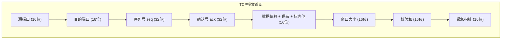

**关键字段说明**：

| 字段 | 长度 | 说明 |
|------|------|------|
| **序列号 (seq)** | 32 位 | 标识数据段在字节流中的位置，初始值随机生成 |
| **确认号 (ack)** | 32 位 | 期望收到的下一个序列号，表示已成功收到 ack-1 之前的所有数据 |
| **标志位** | 6 位 | 控制连接建立、断开和数据传输 |

**核心标志位**：

| 标志位 | 名称 | 说明 |
|--------|------|------|
| **SYN** | Synchronize | 同步标志位，用于建立连接，SYN=1 表示请求建立连接 |
| **ACK** | Acknowledgment | 确认标志位，ACK=1 表示确认号字段有效 |
| **FIN** | Finish | 结束标志位，FIN=1 表示请求关闭连接 |
| **RST** | Reset | 重置标志位，RST=1 表示连接异常，需要重新建立连接 |

### 1.3 ISN（初始序列号）

**ISN（Initial Sequence Number，初始序列号）** 是 TCP 连接建立时双方各自生成的随机序列号。

| 特性 | 说明 |
|------|------|
| **生成方式** | 基于时钟、连接四元组等信息随机生成，非从 0 或 1 开始 |
| **作用** | 防止网络中延迟的旧报文被新连接误接收 |
| **交换时机** | 三次握手中，第一次握手携带客户端 ISN，第二次握手携带服务器 ISN |

**为什么 ISN 要随机生成？**

若 ISN 固定从 1 开始，旧连接的延迟报文可能在新连接建立后被接收，导致数据混乱。随机 ISN 使得旧报文的序列号大概率不在新连接的有效窗口内。

### 1.4 TCP 连接的标识

TCP 连接通过**四元组**唯一标识：

```
(源IP, 源端口, 目的IP, 目的端口)
```

| 概念 | 说明 |
|------|------|
| **端口** | 传输层标识应用进程的 16 位数字，范围 0-65535 |
| **连接与端口的关系** | 一个端口可对应多个连接（通过不同四元组区分），服务端监听端口可同时处理多个客户端连接 |

### 1.5 TCP 连接生命周期

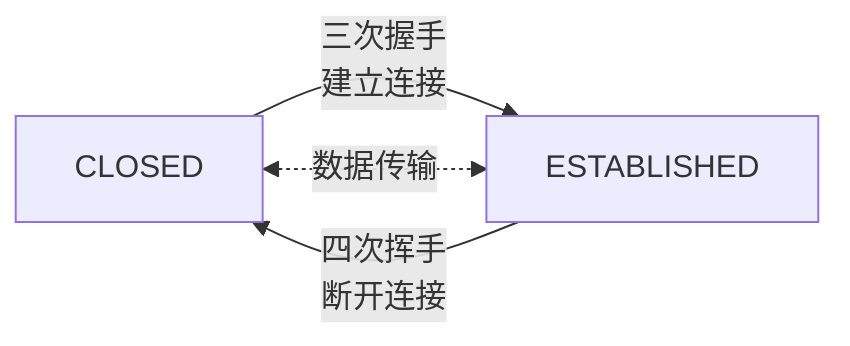

---

## 二、三次握手（连接建立）

### 2.1 核心目的

1. **同步初始序列号（ISN）**：双方交换并确认各自的初始序列号
2. **确认双向通信能力**：验证双方的发送和接收能力正常
3. **防止无效连接**：避免失效的SYN请求导致创建无效连接

### 2.2 握手流程

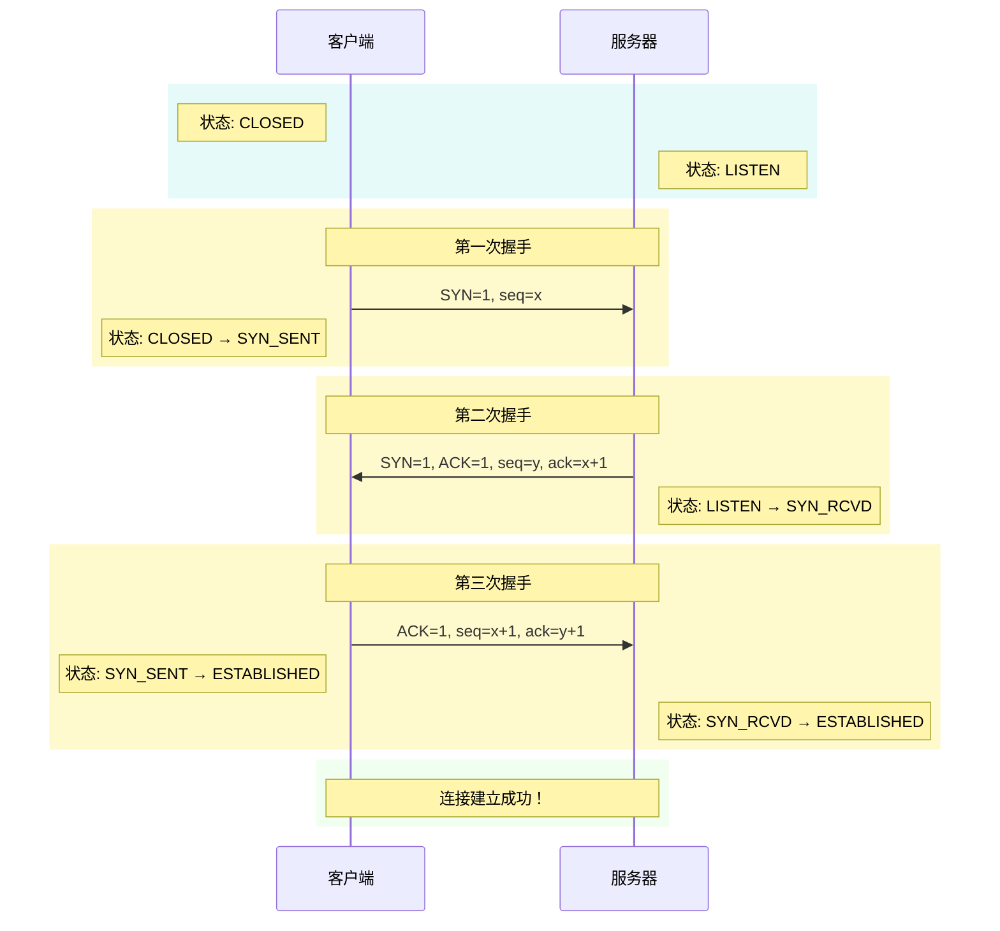

### 2.3 详细步骤解析

| 步骤 | 报文内容 | 状态变化 | 说明 |
|------|----------|----------|------|
| **第一次** | SYN=1, seq=x | 客户端：CLOSED → SYN_SENT | 客户端请求建立连接，发送初始序列号 x |
| **第二次** | SYN=1, ACK=1, seq=y, ack=x+1 | 服务器：LISTEN → SYN_RCVD | 服务器确认收到 x，发送自己的序列号 y |
| **第三次** | ACK=1, seq=x+1, ack=y+1 | 双方：ESTABLISHED | 客户端确认收到 y，连接正式建立 |

### 2.4 为什么需要三次握手？

**问题：为什么不是两次握手？**

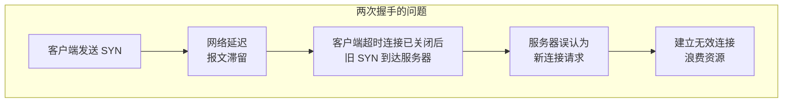

| 原因 | 说明 |
|------|------|
| **防止无效连接** | 若客户端旧 SYN 因网络延迟后到达，三次握手可让客户端识别并拒绝旧连接 |
| **确认双向能力** | 第一次：验证客户端发、服务器收；第二次：验证服务器发、客户端收；第三次：验证客户端发、服务器收 |
| **同步序列号** | 双方需要交换并确认各自的初始序列号 |

**问题：为什么不是四次握手？**

第二次握手将 SYN 和 ACK 合并发送，减少了一次握手，提高了效率。

### 2.5 第三次握手可以携带数据吗？

**可以**。第三次握手时，客户端已进入 ESTABLISHED 状态，可以携带数据。

**前两次握手不能携带数据**：防止攻击者在 SYN 报文中放入大量数据，消耗服务器资源。

---

## 三、四次挥手（连接断开）

### 3.1 核心目的

1. **双向独立关闭**：TCP 全双工通信，每个方向需单独关闭
2. **确保数据完整**：被动关闭方可继续发送未完成的数据
3. **优雅终止连接**：避免数据丢失或连接异常

### 3.2 挥手流程

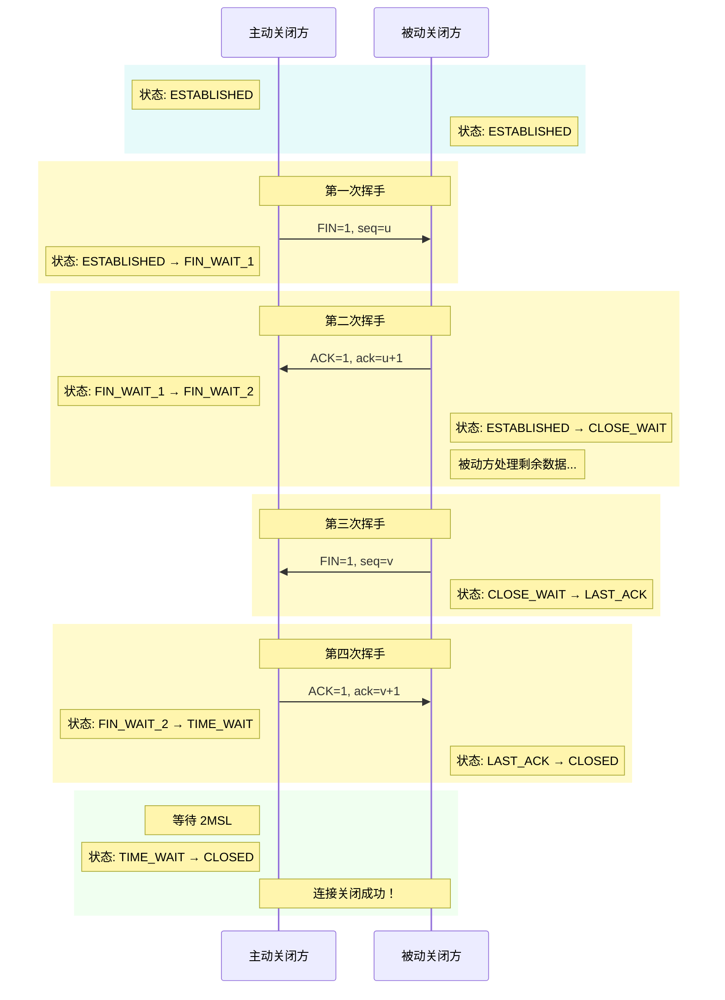

### 3.3 详细步骤解析

| 步骤 | 报文内容 | 状态变化 | 说明 |
|------|----------|----------|------|
| **第一次** | FIN=1, seq=u | 主动方：ESTABLISHED → FIN_WAIT_1 | 主动方请求关闭，不再发送数据 |
| **第二次** | ACK=1, ack=u+1 | 主动方：FIN_WAIT_1 → FIN_WAIT_2<br/>被动方：ESTABLISHED → CLOSE_WAIT | 被动方确认关闭请求，但仍可发送数据 |
| **第三次** | FIN=1, seq=v | 被动方：CLOSE_WAIT → LAST_ACK | 被动方数据发送完毕，请求关闭 |
| **第四次** | ACK=1, ack=v+1 | 主动方：FIN_WAIT_2 → TIME_WAIT<br/>被动方：LAST_ACK → CLOSED | 主动方确认关闭，等待 2MSL 后关闭 |

### 3.4 为什么需要四次挥手？

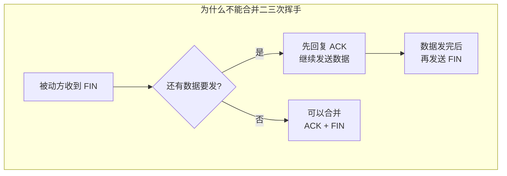

| 原因 | 说明 |
|------|------|
| **半关闭特性** | TCP 支持半关闭，一方关闭发送通道后，另一方仍可发送数据 |
| **数据处理** | 第二次挥手（ACK）和第三次挥手（FIN）通常不能合并，因为中间可能还有数据未发送完毕，需先处理完再关闭 |

**对比三次握手**：服务器可在 SYN+ACK 中同时确认客户端请求并发送自己的连接请求，因此只需三次。

---

## 四、TCP 状态转换

### 4.1 三次握手状态转换

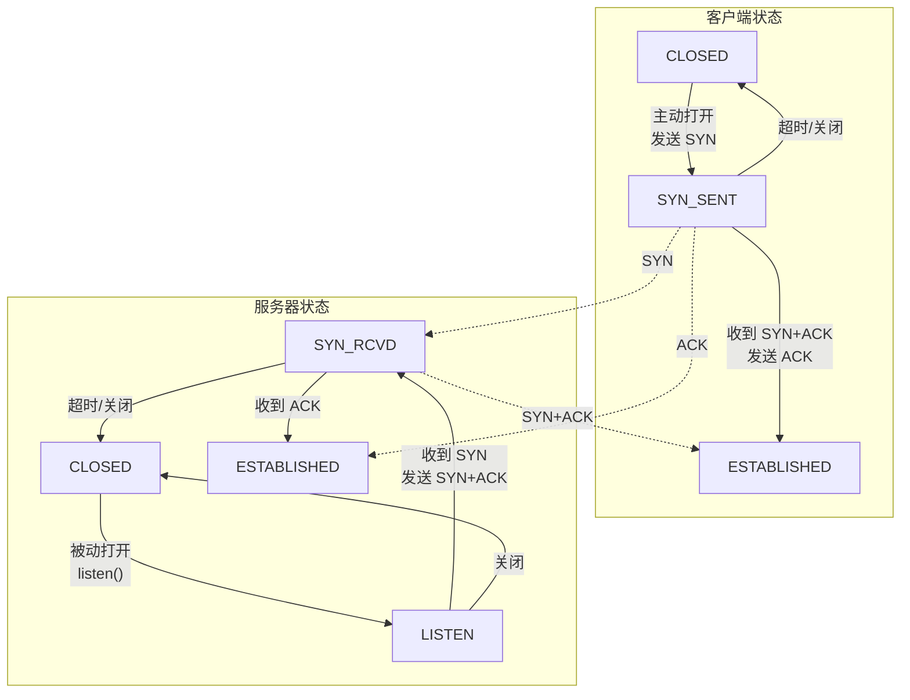

### 4.2 四次挥手状态转换

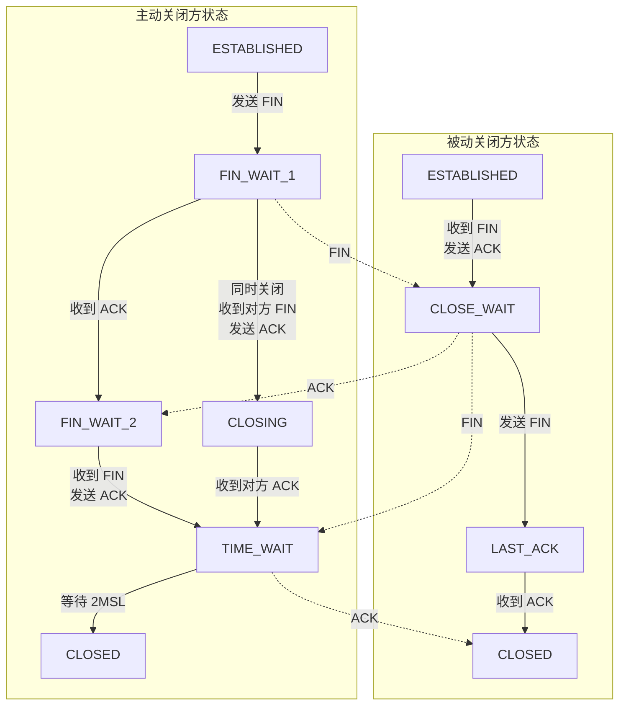

> **CLOSING 状态说明**：当双方**同时发起关闭**时（双方几乎同时发送 FIN），双方都是主动关闭方，都走主动关闭方的状态线。此时：
> - 双方都处于 FIN_WAIT_1 状态
> - 双方都收到对方的 FIN（而非预期的 ACK）
> - 双方都发送 ACK 确认对方的 FIN
> - 双方都进入 CLOSING 状态
> - 双方都收到对方的 ACK 后进入 TIME_WAIT 状态

---

## 五、TIME_WAIT 状态详解

### 5.1 TIME_WAIT 的作用

TIME_WAIT 是主动关闭方在发送最后一个 ACK 后进入的状态，需等待 **2MSL**（Maximum Segment Lifetime，报文最大生存时间）后才关闭。

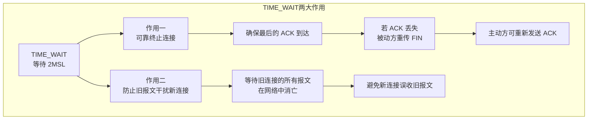

| 作用 | 说明 |
|------|------|
| **可靠终止连接** | 若最后 ACK 丢失，被动方会重传 FIN，TIME_WAIT 状态可重新发送 ACK |
| **防止旧报文干扰新连接** | 等待旧连接的所有报文（包括延迟、重传的报文）在网络中消亡，避免被相同四元组的新连接误接收 |

> **"防止旧报文干扰新连接"详解**：
> 
> **问题场景**：假设旧连接关闭后立即建立相同四元组的新连接，旧连接中延迟的报文可能在新连接建立后才到达，被新连接误认为是自己的数据，导致数据混乱。
> 
> **2MSL 如何防止旧报文干扰新连接？**
> 
> MSL（Maximum Segment Lifetime）是报文在网络中的最大生存时间。2MSL 的设计原理：
> 
> ```
> 第 1 个 MSL：确保主动方发送的最后一个 ACK 在网络中消失
> 第 2 个 MSL：确保被动方重传的 FIN（如果 ACK 丢失）在网络中消失
> 合计 2MSL：网络彻底干净，无任何旧连接的残留报文
> ```
> 
> 这样，当新连接建立时，网络中已经不存在旧连接的任何报文，从根本上避免了旧报文被误接收的问题。
> 
> **是否必须等待 2MSL 才能创建新连接？**
> 
> **默认情况下：是的。** 在 TIME_WAIT 状态下，定义该连接的四元组不能被使用，必须等待 2MSL 结束后才能再被使用。
> 
> **绕过限制的方式**：
> 
> | 方式 | 类型 | 说明 | 适用场景 |
> |------|------|------|----------|
> | **SO_REUSEADDR** | socket 选项 | 允许绑定 TIME_WAIT 状态的端口，新旧连接四元组不同 | 服务端重启 |
> | **tcp_tw_reuse** | 内核参数 | 允许复用 TIME_WAIT 状态的四元组，需开启 `tcp_timestamps` | 客户端发起连接 |
> 
> **SO_REUSEADDR 的作用场景**：
> 
> **场景背景**：服务端程序崩溃或被 kill 后重启。
> 
> **问题**：服务端进程被 kill 时，内核会自动关闭所有连接。如果服务端是主动关闭方，连接会进入 TIME_WAIT 状态。此时重启服务端：
> 
> ```
> 服务端进程被 kill
>     ↓
> 内核自动关闭连接（服务端主动关闭）
>     ↓
> 连接进入 TIME_WAIT 状态（四元组：server:80, client:12345）
>     ↓
> 服务端重启，尝试 bind(80)
>     ↓
> 内核检查：端口 80 有 TIME_WAIT 状态的四元组
>     ↓
> bind() 失败："Address already in use"
> ```
> 
> **SO_REUSEADDR 的作用**：
> 
> ```
> 服务端设置 SO_REUSEADDR
>     ↓
> 服务端重启，尝试 bind(80)
>     ↓
> 内核检查：端口 80 有 TIME_WAIT 状态的四元组
>     ↓
> SO_REUSEADDR 生效：允许绑定
>     ↓
> bind() 成功，可以接受新连接
> ```
> 
> **为什么安全？**
> 
> 新连接的四元组与 TIME_WAIT 状态的四元组不同（客户端 IP/端口不同），内核可以区分，不会收到旧报文。
> 
> **tcp_tw_reuse 的作用场景**：
> 
> 当客户端频繁发起短连接时，客户端临时端口可能耗尽。启用 tcp_tw_reuse 后：
> - 允许使用相同的四元组创建新连接（TIME_WAIT 状态超过 1 秒后）
> - 依赖时间戳机制识别并丢弃旧报文
> 
> **tcp_timestamps 的作用**：
> 
> tcp_tw_reuse 必须配合 tcp_timestamps 使用，时间戳机制确保安全性：
> 
> ```
> 旧连接：时间戳 = 1000，进入 TIME_WAIT
>     ↓
> 新连接：时间戳 = 2000（大于旧连接）
>     ↓
> 旧报文到达：时间戳 = 1000
>     ↓
> 内核检查：时间戳小于当前连接
>     ↓
> 丢弃旧报文
> ```
> 
> **配置方式**：
> 
> ```bash
> # TCP 时间戳选项（0=禁用，1=启用+有随机偏移量，2=启用+无随机偏移量，默认=1）
> sysctl -w net.ipv4.tcp_timestamps=1
> 
> # TIME_WAIT 复用（0=禁用，1=启用，需配合 tcp_timestamps）
> sysctl -w net.ipv4.tcp_tw_reuse=1
> ```
> 
> **SO_REUSEADDR 与 tcp_tw_reuse 的区别**：
> 
> | 特性 | SO_REUSEADDR | tcp_tw_reuse |
> |------|--------------|--------------|
> | **类型** | socket 选项（用户态） | 内核参数 |
> | **使用方** | 服务端（连接接受方） | 客户端（连接发起方） |
> | **解决的问题** | bind() 失败 | 端口耗尽 |
> | **四元组** | 必须不同 | 可以相同 |
> 
> **为什么需要 2MSL 而不能仅依赖 ISN 机制？**
> 
> | 问题 | 说明 |
> |------|------|
> | **ISN 回绕** | ISN 是 32 位（约 43 亿），高速网络中可能短时间内回绕，导致新连接 ISN 小于旧连接序列号，旧报文可能恰好在新连接窗口内 |
> | **时间戳非强制** | TCP 时间戳选项是扩展选项，非所有实现都支持。<br/>若对方不支持，PAWS（Protect Against Wrapped Sequence numbers）机制无法工作 |
> | **协议兼容性** | 2MSL 是 TCP 协议基础机制，不依赖任何扩展选项 |
> 
> **2MSL 的不可替代性**：
> 
> - **基础保护**：不依赖任何扩展选项，是 TCP 协议的**基础保护机制**
> - **兜底保护**：即使 ISN 回绕、时间戳选项不支持，2MSL 也能确保旧报文彻底消失
> - **可靠协议**：保证 TCP 协议在各种环境下都能可靠工作

### 5.2 MSL 时间

| 系统 | MSL 默认值 | TIME_WAIT 持续时间 |
|------|------------|-------------------|
| Linux | 60 秒 | 120 秒（2 × 60） |
| Windows | 120 秒 | 240 秒（2 × 120） |

### 5.3 TIME_WAIT 过多的原因

**核心原因**：服务端主动关闭连接 + 高并发短连接。

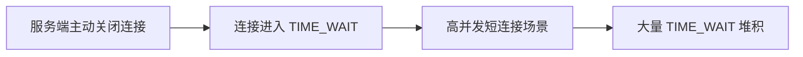

**典型场景**：

| 场景 | 说明 |
|------|------|
| **服务端主动关闭** | 服务端处理完请求后主动调用 close()，成为主动关闭方 |
| **高并发短连接** | 每秒处理大量请求，每个连接生命周期短，频繁创建和关闭 |
| **客户端不主动关闭** | 客户端未正确关闭连接，服务端超时后主动关闭 |

### 5.4 TIME_WAIT 过多的解决方案

**问题背景**：TIME_WAIT 状态的连接会占用四元组资源，当数量过多时可能导致新连接无法创建。

| 方案 | 说明 | 配置方式 |
|------|------|----------|
| **启用四元组复用** | 允许复用 TIME_WAIT 状态的四元组连接<br/>（需开启 TCP 时间戳） | `sysctl -w net.ipv4.tcp_timestamps=1`<br/>`sysctl -w net.ipv4.tcp_tw_reuse=1` |
| **扩大端口范围** | 增加可用临时端口数量 | `sysctl -w net.ipv4.ip_local_port_range="1024 65535"` |
| **缩短超时时间** | 减少 TIME_WAIT 持续时间 | `sysctl -w net.ipv4.tcp_fin_timeout=30` |
| **使用长连接** | 减少连接创建和关闭次数 | HTTP Keep-Alive、数据库连接池 |

---

## 六、半连接队列与全连接队列

### 6.1 队列概念

在三次握手过程中，服务器维护两个队列：

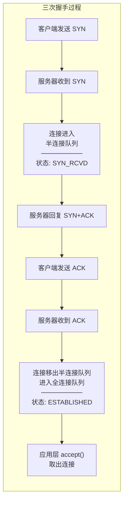

### 6.2 队列对比

| 特性 | 半连接队列（SYN Queue） | 全连接队列（Accept Queue） |
|------|------------------------|---------------------------|
| **存储内容** | SYN_RCVD 状态的连接（等待 ACK） | ESTABLISHED 状态的连接（等待 accept） |
| **触发条件** | 收到 SYN 后进入 | 收到 ACK 后迁移 |
| **队列满影响** | 新 SYN 被丢弃 | 客户端收到 RST |
| **调整参数** | `net.ipv4.tcp_max_syn_backlog` | `net.core.somaxconn` |

> **RST（Reset）说明**：RST 是 TCP 报文的标志位，用于异常关闭连接。当服务器全连接队列满时，会向客户端发送 RST 报文，客户端收到后会立即关闭连接（不进入 TIME_WAIT），应用层会收到"Connection reset by peer"错误。

---

## 七、SYN Flood 攻击

### 7.1 攻击原理

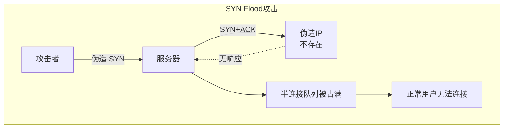

攻击者利用 TCP 三次握手缺陷：
1. 发送大量伪造 IP 的 SYN 报文
2. 服务器回复 SYN+ACK 到不存在的伪造 IP
3. 半连接队列被占满
4. 正常用户无法建立连接

### 7.2 防御措施

| 方案 | 原理 | 配置 |
|------|------|------|
| **SYN Cookie** | 不分配资源，通过 Cookie 验证合法连接 | `sysctl -w net.ipv4.tcp_syncookies=1` |
| **增大队列** | 扩大半连接队列容量 | `sysctl -w net.ipv4.tcp_max_syn_backlog=4096` |
| **减少重试** | 缩短 SYN+ACK 重试次数，加速超时释放 | `sysctl -w net.ipv4.tcp_synack_retries=2` |
| **速率限制** | 限制单个 IP 的 SYN 速率 | iptables 限流 |
| **DDoS 防护** | 云厂商 Anti-DDoS 服务 | 硬件防护 |

> **SYN Cookie 工作原理**：
> 
> 传统方式下，服务器收到 SYN 后会分配资源并存储连接信息到半连接队列。SYN Cookie 则不同：
> 1. 服务器收到 SYN 后**不分配资源**，而是根据源 IP、端口、时间戳等信息计算一个 Cookie 值
> 2. 将 Cookie 值作为初始序列号放入 SYN+ACK 发送给客户端
> 3. 收到客户端 ACK 后，验证 ACK 中的序列号是否为合法 Cookie
> 4. 只有 Cookie 验证通过才分配资源，将连接移入全连接队列
> 
> 这样即使收到大量伪造 SYN，也不会占用半连接队列资源。

### 7.3 检测 SYN Flood

```bash
# 查看 SYN_RCVD 状态连接数
netstat -antp | grep SYN_RCVD | wc -l

# 监控半连接队列溢出
netstat -s | grep "SYNs to LISTEN"
```

---

## 八、常见面试问题

### 8.1 三次握手相关问题

**Q1：为什么是三次握手而不是两次？**

防止失效报文导致无效连接，确保双向通信能力正常。

**Q2：三次握手可以携带数据吗？**

第三次握手可以携带数据，前两次不能（防止攻击）。

**Q3：SYN Flood 攻击如何防御？**

启用 SYN Cookie、增大半连接队列、iptables 速率限制、DDoS 防护。

### 8.2 四次挥手相关问题

**Q1：为什么挥手需要四次？**

TCP 支持半关闭，被动关闭方可能还有数据要发送，ACK 和 FIN 不能合并。

**Q2：TIME_WAIT 状态的作用是什么？**

确保最后 ACK 到达，等待旧报文消亡，避免影响新连接。

**Q3：TIME_WAIT 过多怎么办？**

启用四元组复用、扩大端口范围、使用长连接、连接池技术。

### 8.3 状态相关问题

**Q1：CLOSE_WAIT 过多是什么原因？**

程序 Bug，未调用 close() 关闭连接，导致资源泄漏。

**Q2：如何排查连接状态问题？**

```bash
# 查看各状态连接数
netstat -ant | awk '{print $6}' | sort | uniq -c

# 查看特定状态
netstat -ant | grep TIME_WAIT | wc -l
netstat -ant | grep CLOSE_WAIT | wc -l
```

---

## 九、总结

### 9.1 核心对比

| 阶段 | 目的 | 报文数量 | 关键状态 |
|------|------|----------|----------|
| **三次握手** | 建立可靠连接 | 3（SYN → SYN+ACK → ACK） | SYN_SENT、SYN_RCVD、ESTABLISHED |
| **四次挥手** | 优雅断开连接 | 4（FIN → ACK → FIN → ACK） | FIN_WAIT、CLOSE_WAIT、TIME_WAIT |

### 9.2 面试要点

1. 三次握手的目的和流程
2. 四次挥手的目的和流程
3. 为什么握手是三次，挥手是四次
4. TIME_WAIT 状态的作用和解决方案
5. SYN Flood 攻击原理和防御
6. 半连接队列和全连接队列的区别
7. TCP 状态转换过程
