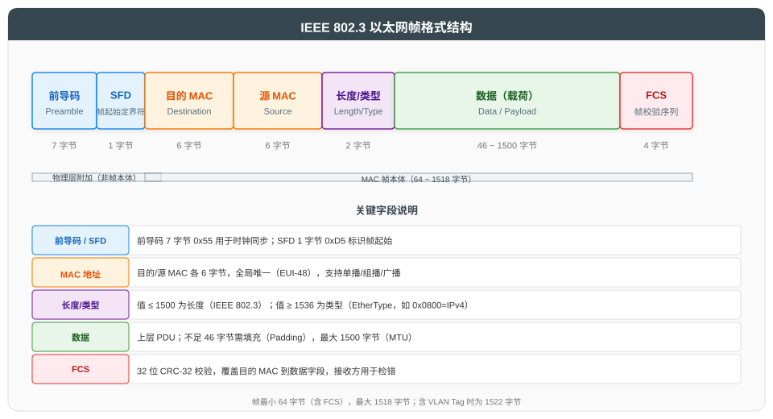
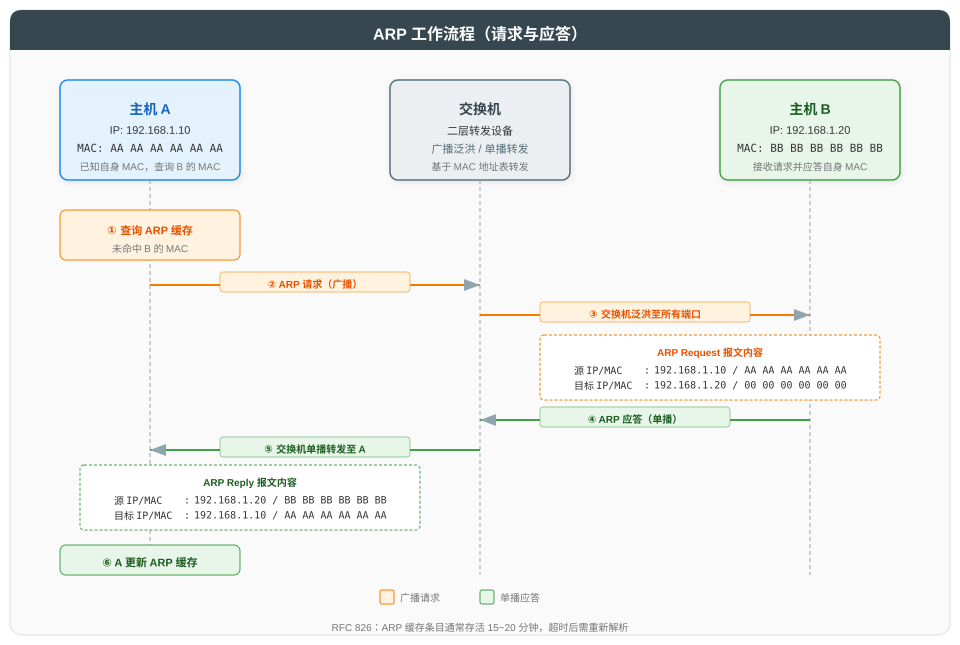
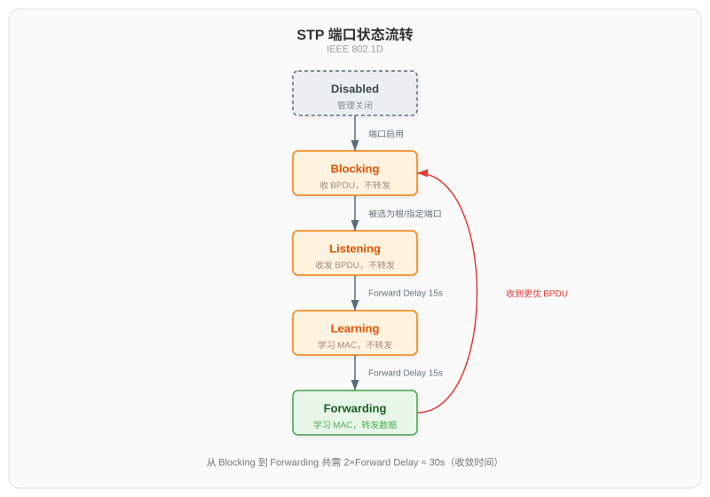

# 物理层与数据链路层

## 一、概述

物理层与数据链路层位于网络体系结构的最底层，承担"比特传输"与"帧传输"两类基础职责。本文遵循"总分循序渐进"原则，先总述两层职责边界，再分别深入物理层与数据链路层的关键技术。

| 层级 | 核心职责 | 数据单元 | 关键问题 |
|------|----------|----------|----------|
| **物理层** | 在物理介质上传输原始比特流 | 比特（Bit） | 信号编码、同步、传输介质 |
| **数据链路层** | 在相邻节点间可靠传输帧 | 帧（Frame） | 成帧、寻址、差错控制、介质访问 |

数据链路层通常进一步划分为两个子层：

| 子层 | 名称 | 主要功能 | 典型协议 |
|------|------|----------|----------|
| **LLC**（逻辑链路控制） | IEEE 802.2 | 流量控制、差错控制、服务访问点 | LLC 头部 |
| **MAC**（介质访问控制） | IEEE 802.3/802.11 | 介质访问、寻址、成帧 | Ethernet、Wi-Fi |

---

## 二、物理层

### 2.1 信号编码

物理层将数字比特流转换为适合物理介质传输的信号。常用编码方式如下：

| 编码方式 | 规则 | 时钟同步 | 典型应用 |
|----------|------|----------|----------|
| **NRZ**（不归零） | 1 为高电平，0 为低电平 | 不自同步 | 低速串口 |
| **Manchester** | 比特中央跳变：上跳为 1，下跳为 0 | 自同步 | 经典以太网（10Base-T） |
| **4B/5B** | 4 位数据映射为 5 位码字，保证跳变密度 | 配合 NRZI 自同步 | 100Base-TX、FDDI |
| **8B/10B** | 8 位数据映射为 10 位码字，DC 平衡 | 自同步 | 千兆以太网、PCIe |
| **64B/66B** | 64 位数据加 2 位同步头，开销更低 | 自同步 | 10G/100G 以太网 |

> Manchester 编码每比特占用两个电平周期，效率仅 50%；4B/5B 将效率提升至 80%。

### 2.2 传输介质

| 介质类型 | 规格 | 带宽 | 单段最大长度 | 抗干扰 | 成本 |
|----------|------|------|-------------|--------|------|
| **双绞线（UTP）** | Cat5e/Cat6/Cat6a | 1~10 Gbps | 100 m | 较弱 | 低 |
| **多模光纤** | OM3/OM4 | 10~100 Gbps | 300~550 m | 强 | 中 |
| **单模光纤** | OS2 | 100 Gbps+ | 10~80 km | 极强 | 高 |
| **同轴电缆** | RG-58 | 10 Mbps | 185 m | 中 | 中（已淘汰） |

> 表中"单段最大长度"指以太网标准规定的无中继链路最大段长，主要受 CSMA/CD 冲突检测窗口约束（铜缆）或信号衰减与色散约束（光纤），并非介质的物理传输极限。

UTP 双绞线分类：

| 类别 | 最大速率 | 典型应用 |
|------|----------|----------|
| Cat5e | 1 Gbps（100 m） | 千兆以太网 |
| Cat6 | 1 Gbps（100 m）/ 10 Gbps（55 m） | 千兆/万兆 |
| Cat6a | 10 Gbps（100 m） | 万兆以太网 |
| Cat8 | 25/40 Gbps（30 m） | 数据中心短距 |

### 2.3 物理层设备

| 设备 | 功能 | 工作层级 |
|------|------|----------|
| **中继器（Repeater）** | 信号再生与放大，延长传输距离 | 物理层 |
| **集线器（Hub）** | 多端口中继器，广播转发比特 | 物理层 |

> 集线器共享带宽，所有端口处于同一冲突域，已被交换机淘汰。

---

## 三、数据链路层 - 以太网基础

### 3.1 以太网帧格式

以太网（IEEE 802.3）是当前最广泛使用的局域网链路层技术。其帧格式如下：



**关键字段说明**：

| 字段 | 长度 | 说明 |
|------|------|------|
| **前导码（Preamble）** | 7 字节 | 0x55 交替位模式，用于接收端时钟同步 |
| **SFD** | 1 字节 | 0xD5，帧起始定界符，标识帧开始 |
| **目的 MAC** | 6 字节 | 接收方硬件地址 |
| **源 MAC** | 6 字节 | 发送方硬件地址 |
| **长度/类型** | 2 字节 | ≤1500 为长度；≥1536 为 EtherType（如 0x0800=IPv4, 0x86DD=IPv6） |
| **数据** | 46~1500 字节 | 上层 PDU，不足 46 字节需填充（Padding） |
| **FCS** | 4 字节 | CRC-32 校验，覆盖目的 MAC 到数据字段 |

**帧长度约束**（均指 MAC 帧本体，不含前导码与 SFD）：

- 最小帧长：64 字节 = DMAC(6) + SMAC(6) + 长度/类型(2) + 数据(46) + FCS(4)。该约束源于 CSMA/CD 的冲突检测要求：发送方必须持续发送，直到冲突信号能从链路最远端传回被自己检测到，否则发送方在冲突发生前已结束发送，无法触发重传。因此最小帧的发送时间需 ≥ 信号往返时延（RTT），在 10 Mbps 以太网中 RTT ≈ 51.2 μs，按"最小帧长 = 发送速率 × RTT"计算：10 Mbps × 51.2 μs = 512 bit = 64 字节
- 最大帧长：1518 字节 = DMAC(6) + SMAC(6) + 长度/类型(2) + 数据(1500) + FCS(4)；含 VLAN Tag（4 字节，插入位置详见 6.1 节）时为 1522 字节
- MTU（最大传输单元）：1500 字节，指数据字段最大长度

> 前导码（7 字节）与 SFD（1 字节）属于物理层附加字段，用于接收端时钟同步与帧定界，不计入 MAC 帧长度。

### 3.2 CSMA/CD 机制

CSMA/CD（载波监听多路访问/冲突检测）是半双工以太网的介质访问控制机制：

| 阶段 | 操作 | 说明 |
|------|------|------|
| ① 载波监听 | 发送前先监听信道 | 信道空闲才发送，忙则等待 |
| ② 边发边听 | 发送同时检测冲突 | 比较发送信号与接收信号 |
| ③ 冲突检测 | 检测到冲突立即停止 | 发送 32 位拥塞信号（Jam） |
| ④ 退避重发 | 二进制指数退避 | 第 n 次冲突后等待 k×SlotTime，k∈[0, 2^n-1]，n≤10 |

> 全双工交换式以太网中，每端口独占信道，不存在冲突，CSMA/CD 实际已不发挥作用，但帧格式保留兼容。

### 3.3 MAC 地址

MAC 地址（Media Access Control Address）是数据链路层的硬件地址，长度为 48 位（6 字节），又称 EUI-48。

**作用对象**：

MAC 地址针对的是**网络接口**（网卡），而非整台主机。一块物理网卡在出厂时由厂商将 MAC 烧录在 ROM 中，全球唯一；操作系统可软件覆盖此地址，此时 U/L 位置 1，表示本地管理地址。因此：

- 单网卡主机：1 个 MAC 地址
- 双网卡主机（如笔记本同时具备有线网卡与 Wi-Fi 网卡）：2 个独立 MAC 地址
- N 端口交换机：N 个 MAC 地址（每端口一个，用于 STP、管理协议）

这也解释了为什么数据链路层的通信端点表述为"相邻节点到相邻节点"而非"主机到主机"——链路层寻址的精确对象是接口，不是主机。

**地址结构**：

EUI-48 共 48 位，由 OUI（位 47~24，24 位）与 NIC（位 23~0，24 位）拼接而成。其中 OUI 的最高 2 位作为标志位单独定义：

| 位范围 | 位宽 | 字段 | 所属 | 含义与取值 |
|--------|------|------|------|-----------|
| 位 47 | 1 位 | I/G | OUI | 单播/组播标志：0=单播；1=组播/广播 |
| 位 46 | 1 位 | U/L | OUI | 全局/本地标志：0=全局唯一（IEEE 分配）；1=本地管理 |
| 位 45~24 | 22 位 | OUI 主体 | OUI | 组织唯一标识符的其余部分，IEEE 分配给厂商 |
| 位 23~0 | 24 位 | NIC | NIC | 厂商自行分配的网卡扩展标识 |

**特殊地址**：

| 地址 | 类型 | 说明 |
|------|------|------|
| FF-FF-FF-FF-FF-FF | 广播 | 所有位为 1，发往同一广播域所有主机 |
| 01-00-5E-xx-xx-xx | 组播 | IPv4 组播对应的 MAC（低 23 位映射自 IP） |

---

## 四、数据链路层 - ARP 协议

### 4.1 ARP 工作原理

ARP（Address Resolution Protocol，RFC 826）用于将 IPv4 地址解析为 MAC 地址，是局域网通信的前置条件。



**封装关系**：

ARP 报文封装于以太网帧内（EtherType = 0x0806），二者为不同层次的 PDU。ARP 请求/应答涉及两类 MAC 字段，需严格区分：

| 所属层次 | PDU | 关键字段 | ARP 请求时取值 | ARP 应答时取值 |
|---------|-----|---------|--------------|---------------|
| 数据链路层 | 以太网帧头 | 目的 MAC | FF-FF-FF-FF-FF-FF（广播） | 请求方 A 的 MAC（单播） |
| 数据链路层 | 以太网帧头 | 源 MAC | 请求方 A 的 MAC | 应答方 B 的 MAC |
| ARP 报文内部 | ARP 报文 | 目标硬件地址 | 00-00-00-00-00-00（未知，置 0） | 请求方 A 的 MAC |
| ARP 报文内部 | ARP 报文 | 发送方硬件地址 | 请求方 A 的 MAC | 应答方 B 的 MAC |

> 以太网帧头决定二层转发行为（广播泛洪或单播转发）；ARP 报文内字段承载地址解析信息。两者不可混淆。

**流程步骤**：

| 步骤 | 操作 | 报文类型 | 说明 |
|------|------|----------|------|
| ① | 主机 A 查询 ARP 缓存 | - | 未命中则发起 ARP 请求 |
| ② | A 构造 ARP 请求 | 广播 | 以太网帧头目的 MAC 填广播地址 FF-FF-FF-FF-FF-FF；ARP 报文内目标硬件地址置 0 |
| ③ | 交换机泛洪请求 | 广播 | 同一广播域所有主机接收 |
| ④ | 主机 B 匹配 IP 后应答 | 单播 | 以太网帧头源 MAC 为 B、目的 MAC 为 A；ARP 报文填入 B 的 MAC |
| ⑤ | 交换机单播转发应答 | 单播 | A 收到应答 |
| ⑥ | A 更新 ARP 缓存 | - | 缓存条目存活 15~20 分钟 |

**ARP 报文字段**：

| 字段 | 长度 | 说明 |
|------|------|------|
| 硬件类型 | 2 字节 | 1=以太网 |
| 协议类型 | 2 字节 | 0x0800=IPv4 |
| 硬件地址长度 | 1 字节 | 6（MAC） |
| 协议地址长度 | 1 字节 | 4（IPv4） |
| 操作码 | 2 字节 | 1=请求，2=应答 |
| 发送方硬件地址 | 6 字节 | 请求方/应答方的 MAC |
| 发送方协议地址 | 4 字节 | 请求方/应答方的 IP |
| 目标硬件地址 | 6 字节 | 请求时置 0（未知），应答时填请求方 MAC |
| 目标协议地址 | 4 字节 | 待解析的 IP（请求）/请求方 IP（应答） |

### 4.2 特殊 ARP 变体

| 类型 | 说明 | 应用场景 |
|------|------|----------|
| **Gratuitous ARP** | 自问自答，广播"我的 IP 是 X，MAC 是 Y" | IP 冲突检测、主备切换时刷新他人缓存 |
| **代理 ARP** | 路由器代答其他网段主机的 ARP 请求 | 掩码配置不当时跨网段通信 |
| **RARP** | 反向 ARP，由 MAC 求 IP | 早期无盘工作站获取 IP（已淘汰） |

> IPv6 不再使用 ARP，改用 NDP（Neighbor Discovery Protocol，RFC 4861）基于 ICMPv6 实现。

---

## 五、数据链路层 - 交换机与转发

### 5.1 交换机工作原理

二层交换机基于 MAC 地址表（CAM 表）进行帧转发。转发行为取决于目的 MAC 的类型，故先界定帧的分类，再说明转发流程。

**帧分类与转发行为**：

"表项命中"指交换机在 MAC 地址表中查询到目的 MAC 对应的端口条目；"未命中"指表中无此条目。

| 帧类型 | 目的 MAC | MAC 表查询 | 转发行为 | 典型场景 |
|--------|---------|-----------|----------|---------|
| 已知单播 | 特定接口的 MAC | 命中 | 单播转发至目标端口 | 一对一通信 |
| 未知单播 | 单播 MAC，但 MAC 表无条目 | 未命中 | 泛洪至所有端口（除入端口） | 交换机首次见到该 MAC |
| 广播 | FF-FF-FF-FF-FF-FF | 不查询 | 泛洪至所有端口（除入端口） | ARP 请求、DHCP 发现 |
| 组播 | 01-00-5E-xx-xx-xx | 不查询 | 默认泛洪（IGMP Snooping 优化为按组转发） | 视频流、OSPF Hello |

> 未知单播本质是单播，仅因交换机尚未学习到该 MAC 的端口位置，故采取泛洪行为，是"未知"导致的行为分类，而非独立的帧类型。

**交换机工作流程**：

| 步骤 | 操作 | 说明 |
|------|------|------|
| ① 学习 | 收到帧时记录 {源 MAC, 入端口} | 动态构建 MAC 地址表 |
| ② 老化 | 条目存活 300 秒后删除 | 适应拓扑变化 |
| ③ 转发决策 | 查表匹配目的 MAC | 按上方"帧分类与转发行为"表执行 |

### 5.2 冲突域与广播域

**概念定义**：

| 概念 | 定义 |
|------|------|
| **冲突域（Collision Domain）** | 网络中任两节点同时发送会产生信号冲突的范围。在共享介质网络（如集线器、总线型拓扑）中，所有端口电气连通于同一信道，构成单一冲突域；在交换式网络中，每端口与对端设备间为独立链路，每端口为独立冲突域 |
| **广播域（Broadcast Domain）** | 能接收到同一广播帧的所有节点的集合，由二层连通性决定范围 |
| **冲突域隔离** | 将一个冲突域划分为多个独立冲突域，使不同域内的发送互不影响 |
| **广播域隔离** | 将一个广播域划分为多个独立广播域，使广播帧不跨域传播 |

**设备隔离能力对比**：

| 设备 | 冲突域隔离 | 广播域隔离 |
|------|------------|------------|
| 集线器（Hub） | 否（所有端口共享） | 否 |
| 交换机（Switch） | 是（每端口独立） | 否（默认同广播域） |
| 路由器（Router） | 是 | 是 |

> 交换机每端口是一个独立冲突域；VLAN 技术用于在交换机上隔离广播域。

---

## 六、数据链路层 - VLAN

### 6.1 VLAN 概念

**问题背景**：

默认情况下，交换机的所有端口属于同一广播域，任意广播帧（如 ARP 请求、DHCP 发现）会被泛洪至全部端口。当网络规模扩大时，广播流量持续增长，带来三类问题：

| 问题 | 说明 |
|------|------|
| 广播风暴 | 广播帧在整网泛洪，消耗链路带宽与设备 CPU |
| 安全隔离不足 | 不同业务（如财务、研发）的主机处于同一广播域，可被二层嗅探 |
| 故障域过大 | 一台主机的广播异常影响整网，故障难以定位与限制 |

**VLAN 定义与作用**：

VLAN（Virtual Local Area Network，虚拟局域网，IEEE 802.1Q）通过在以太网帧中插入 Tag 标识所属 VLAN，将一个物理交换机逻辑划分为多个独立广播域。同一 VLAN 内主机二层互通，不同 VLAN 间广播帧相互隔离。

**VLAN Tag 结构**：

VLAN Tag 共 4 字节，插入在源 MAC 与长度/类型字段之间，用于标识帧所属 VLAN，使交换机能够据此限制转发范围。

| 字段 | 位数 | 说明 |
|------|------|------|
| **TPID** | 16 | 标签协议标识，固定 0x8100，用于标识该帧携带 802.1Q Tag |
| **PCP** | 3 | 优先级代码点，标识帧的 QoS 优先级（0~7，值越大优先级越高） |
| **DEI** | 1 | 丢弃资格指示，1 表示网络拥塞时可优先丢弃该帧 |
| **VID** | 12 | VLAN ID，标识帧所属 VLAN，范围 0~4095（0 与 4095 保留，可用 1~4094） |

> Tag 的插入使最大帧长从 1518 字节增至 1522 字节（参见 3.1 节帧长度约束）。

### 6.2 端口类型

**Tag 处理需求**：

6.1 节定义的 VLAN Tag 标识帧所属 VLAN，但 Tag 的处理方式需根据链路两端设备的特性而定：

- 终端主机的网卡通常不识别 VLAN Tag，收到带 Tag 的帧会丢弃
- 交换机之间需承载多 VLAN 流量，必须保留 Tag 以区分帧所属 VLAN

因此交换机每个端口需配置 Tag 处理规则，决定接收时是否打 Tag、发送时是否剥离 Tag。不同规则对应不同链路场景，由此在交换机上定义三类端口类型。

**前置概念：PVID**：

PVID（Port VLAN ID）是端口的默认 VLAN 标识，作用于接收侧——端口收到无 Tag 帧时将其归类到 PVID 所指 VLAN。所有端口类型（Access/Trunk/Hybrid）均有 PVID。

**端口类型对比**：

下表以交换机端口为主体，描述其对帧的收发处理规则：

| 端口类型 | 所属 VLAN 数 | 接收方向（交换机端口接收对端发来的帧） | 发送方向（交换机端口向对端发送帧） | 典型链路 | 特性说明 |
|----------|-------------|------------------|------------------|---------|---------|
| **Access** | 1 个 | 收到无 Tag 帧打上 PVID，收到带 Tag 帧丢弃 | 剥离 Tag 后发送 | 交换机 ↔ 终端主机 | 仅承载单一 VLAN，规则简单 |
| **Trunk** | 多个 | 收到无 Tag 帧打上 PVID，收到带 Tag 帧按 VID 转发 | 除 Native VLAN 外均保留 Tag 发送 | 交换机 ↔ 交换机 | 标准协议，跨交换机承载多 VLAN |
| **Hybrid** | 多个 | 收到无 Tag 帧打上 PVID，收到带 Tag 帧按 VID 转发 | 可按 VLAN 独立配置发送时是否带 Tag | 交换机 ↔ 终端主机或交换机 | 华为设备特有，灵活控制 Tag 行为 |

**Access 端口的 Tag 加解流程**：

以同一交换机 VLAN 10 内主机 A → 主机 B 通信为例：

```
主机A ──[无Tag帧]──> Access端口1(入,PVID=10) ──[打上VLAN10 Tag]──> 交换机内部 ──[带Tag帧]──> Access端口2(出,PVID=10) ──[剥离Tag]──> 主机B
```

加 Tag 与剥离 Tag 发生在不同的 Access 端口上：入端口加 Tag 让交换机内部识别帧所属 VLAN，从而限制转发范围（只在 VLAN 10 的端口内泛洪/转发，不泄漏到其他 VLAN）；出端口剥离 Tag 让不支持 802.1Q 的终端正常接收。Access 端口"进则标记、出则剥离"的本质是：在交换机内部用 Tag 维持 VLAN 边界，在边缘对终端屏蔽 Tag 复杂性。

**PVID 与 Native VLAN**：

Native VLAN 是 Trunk 端口特有的概念，作用于发送侧——Trunk 端口发出该 VLAN 的帧时不带 Tag。PVID 与 Native VLAN 分属不同概念：

| 维度 | PVID | Native VLAN |
|------|------|------------|
| **适用端口** | 所有端口（Access/Trunk/Hybrid 均有） | 仅 Trunk 端口 |
| **作用方向** | 接收侧——端口收到无 Tag 帧时归类到哪个 VLAN | 发送侧——端口发出哪个 VLAN 的帧时不带 Tag |
| **本质** | 端口属性，每个端口必有一个 PVID | Trunk 端口的行为描述，在多 VLAN 中指定一个无 Tag 收发 |

在 Trunk 端口上，PVID 与 Native VLAN 通常配置为相同值，使收发方向 Tag 行为对称（接收无 Tag 帧归入 VLAN X，发送 VLAN X 帧也不带 Tag）。

> Native VLAN 用于向后兼容不支持 802.1Q 的老旧设备（如集线器、早期网卡）——此时由交换机端将 Native VLAN 配置为该老旧设备所属的 VLAN，老旧设备无需配置。Native VLAN 配置错误有两种场景：同一端口 PVID 与 Native VLAN 配置不同，会导致收发方向 Tag 行为不对称；Trunk 链路两端 Native VLAN 配置不同，会导致两端对无 Tag 帧归类不一致。两者均引发流量错配。

### 6.3 VLAN 间通信

**隔离原因**：

不同 VLAN 属于不同广播域，二层隔离，无法通过交换机直接互通。跨 VLAN 通信需借助三层设备完成路由转发。

**实现方式对比**：

| 方式 | 设备 | 原理 | 优缺点 |
|------|------|------|--------|
| **多端口路由器** | 路由器 | 路由器每端口接入一个 VLAN，各端口配对应子网网关 | 结构简单；但每 VLAN 占用一个路由器端口与一条物理链路，扩展性差 |
| **单臂路由** | 路由器 | 路由器单物理接口划分为多个逻辑子接口，每个子接口封装一个 802.1Q VLAN，交换机通过 Trunk 链路上联 | 节省物理端口；但所有 VLAN 流量汇聚单链路，易成瓶颈，且路由器由 CPU 软件转发（相对于三层交换机的 ASIC 硬件转发），性能有限 |
| **三层交换机** | L3 交换机 | 交换机内置路由引擎（硬件 ASIC 转发），VLAN 间路由在一次交换中完成 | 性能高、扩展性好；成本较高，配置复杂度高于纯二层方案 |

> 三层交换机是当前企业网主流方案，兼顾二层线速转发与三层路由能力。

---

## 七、数据链路层 - 生成树协议

**协议概述**：

生成树协议（Spanning Tree Protocol, STP）是一族二层协议，运行于交换机之间，通过协商阻塞冗余端口，在物理冗余拓扑上构建无环逻辑拓扑。

**解决的问题**：

为提高可靠性，交换网络常部署冗余链路。但冗余链路在未运行 STP 时会导致三类故障：

| 故障 | 原因 | 后果 |
|------|------|------|
| 广播风暴 | 广播帧在环路中无限循环 | 带宽耗尽，网络瘫痪 |
| MAC 地址表震荡 | 交换机从不同端口反复学习同一 MAC | 表项反复刷新，转发紊乱 |
| 重复帧 | 同一帧经环路多次到达接收端 | 上层协议重复处理 |

**与转发机制和 VLAN 的关系**：

- **与帧转发机制**：STP 通过阻塞冗余端口消除环路，使交换机的帧转发机制在无环逻辑拓扑上正常工作。阻塞端口仅收发 BPDU，不参与数据帧的转发与 MAC 学习；非阻塞端口按 MAC 地址表学习与转发规则正常工作
- **与 VLAN 机制**：STP 默认对所有 VLAN 运行单一生成树（CST），即所有 VLAN 共享同一无环逻辑拓扑；MSTP 将 VLAN 分组映射到不同生成树实例，使不同 VLAN 组可走不同物理路径，实现负载均衡

### 7.1 STP（IEEE 802.1D）

**STP 工作流程**：

STP 通过以下步骤构建无环逻辑拓扑：

| 步骤 | 操作 | 说明 |
|------|------|------|
| ① 选举根桥 | 所有交换机交换 BPDU，Bridge ID 最小者成为根桥 | 根桥是拓扑中心，所有路径开销以根桥为参考 |
| ② 选举根端口 | 每个非根桥交换机选举到根桥开销最小的端口 | 每台非根桥有且仅有一个根端口 |
| ③ 选举指定端口 | 每条链路上选举到根桥开销最小的端口 | 每条链路有且仅有一个指定端口 |
| ④ 阻塞冗余端口 | 既非根端口也非指定端口的端口被阻塞 | 阻塞端口仅收发 BPDU，不转发数据 |
| ⑤ 收敛 | 所有端口角色确定，拓扑稳定 | 收敛指网络从拓扑变化到达到稳定状态的过程 |

**关键概念**：

下表列出 STP 协商过程中涉及的核心概念。其中根端口、指定端口、阻塞端口构成 STP 的 3 种端口角色，决定端口在转发中的职责：

| 概念 | 说明 | 应用场景 |
|------|------|----------|
| **BPDU** | 桥接协议数据单元，交换机间交换拓扑信息 | 每 2 秒由根桥产生，其他交换机转发，用于维护拓扑 |
| **Bridge ID** | 优先级（2 字节）+ MAC 地址（6 字节） | 选举根桥的依据，值最小者为根桥 |
| **根桥（Root Bridge）** | Bridge ID 最小的交换机 | 作为拓扑中心，所有路径开销以根桥为参考 |
| **根端口（Root Port）** | 非根桥上到根桥开销最小的端口 | 每台非根桥有且仅有一个，用于接收来自根桥的流量 |
| **指定端口（Designated Port）** | 每条链路上到根桥开销最小的端口 | 每条链路有且仅有一个，用于发送流量到该链路 |
| **阻塞端口（Blocked Port）** | 既非根端口也非指定端口 | 阻塞数据帧但仍接收 BPDU，作为冗余备份 |

**端口状态与流转**：

STP 端口有 5 种状态，各自承担不同职责：

| 状态 | 接收 BPDU | 发送 BPDU | 学习 MAC | 转发数据 | 用途 |
|------|-----------|-----------|----------|----------|------|
| Disabled | 否 | 否 | 否 | 否 | 管理关闭 |
| Blocking | 是 | 否 | 否 | 否 | 阻塞冗余端口，仅接收 BPDU |
| Listening | 是 | 是 | 否 | 否 | 参与 STP 协商，不学习 MAC |
| Learning | 是 | 是 | 是 | 否 | 学习 MAC 地址，准备转发 |
| Forwarding | 是 | 是 | 是 | 是 | 正常转发数据 |



**收敛**：

收敛指网络从拓扑变化（如链路故障、交换机启动）到重新达到稳定状态的过程。STP 收敛时间主要消耗在端口状态流转上：从 Blocking 到 Forwarding 需经历 Listening 和 Learning 两个中间状态，各停留 Forward Delay（默认 15 秒），共计约 30 秒。在此期间，端口不转发数据，导致网络中断。

### 7.2 RSTP（IEEE 802.1w）

**STP 的局限**：

STP 收敛慢（约 30 秒）的原因有三：

| 局限 | 原因 |
|------|------|
| 定时器驱动 | 端口状态流转依赖 Forward Delay 等定时器，必须等待固定时长 |
| 端口角色无备份 | 根端口或指定端口故障后需重新选举，无法快速切换 |
| 拓扑变更通知慢 | 变更需先通知根桥，再由根桥泛洪至全网 |

**RSTP 是什么**：

RSTP（Rapid STP，快速生成树）针对上述局限改进，通过握手机制替代定时器、新增 Alternate/Backup 端口角色作为备份、直接泛洪拓扑变更，将收敛时间从 30~50 秒缩短至 1~2 秒。

**改进机制**：

| 改进点 | STP | RSTP | 改进效果 |
|--------|-----|------|----------|
| 端口状态 | 5 种 | 3 种（Discarding/Learning/Forwarding） | 简化状态流转 |
| 端口角色 | 3 种 | 4 种（新增 Alternate/Backup） | 冗余端口快速切换 |
| 收敛机制 | 定时器驱动 | 握手驱动（Proposal/Agreement） | 快速协商，无需等待定时器 |
| 拓扑变更 | 通知根桥后泛洪 | 直接泛洪 BPDU | 加快变更传播 |
| 收敛时间 | 30~50 秒 | 1~2 秒 | 显著减少网络中断时间 |

> RSTP 的 Alternate 端口和 Backup 端口作为根端口的备份，当根端口故障时立即切换，无需重新收敛。

### 7.3 MSTP（IEEE 802.1s）

**CST 与其局限**：

STP/RSTP 默认对所有 VLAN 运行单一生成树（CST，Common Spanning Tree），即所有 VLAN 共享同一棵无环逻辑拓扑。CST 无法为不同 VLAN 选择不同转发路径，无法实现负载均衡。

**MSTP 是什么**：

MSTP（Multiple STP，多生成树）将多个 VLAN 分组，每组 VLAN 对应一个生成树实例（MSTI，Multiple Spanning Tree Instance），每个实例独立计算一棵生成树：

- **VLAN 与实例关系**：多对一（N:1），多个 VLAN 归入一个实例，管理员按需分组
- **同组 VLAN**：共享同一棵生成树，走相同物理路径，节约计算资源
- **不同实例**：各自计算独立生成树，可走不同物理路径，实现负载均衡
- **默认实例**：未显式分组的 VLAN 归入实例 0（即 CST）

**与 STP/RSTP 对比**：

| 协议 | 生成树实例数 | 负载均衡 | 兼容性 | 适用场景 |
|------|--------------|----------|--------|----------|
| STP（802.1D） | 1（CST） | 不支持 | 兼容老设备 | 小型网络，无需负载均衡 |
| RSTP（802.1w） | 1（CST） | 不支持 | 兼容 STP | 中型网络，需快速收敛 |
| MSTP（802.1s） | 多实例（MSTI） | 支持（VLAN 分组映射到不同实例） | 兼容 STP/RSTP | 大型网络，需负载均衡 |

> VLAN 与生成树的映射关系有三种：CST 为一对多（1:N，所有 VLAN 共享一棵树）；MSTP 为多对一（N:1，多个 VLAN 分组共享一棵树）；PVST+（Cisco 私有）为一对一（1:1，每个 VLAN 独立一棵树）。MSTP 作为 IEEE 标准化的多实例方案，介于 CST 与 PVST+ 之间，平衡开销与负载均衡。

---

## 八、参考资料

### 8.1 标准文档

| 标准 | 说明 |
|------|------|
| [IEEE 802.3-2022](https://standards.ieee.org/ieee/802.3/10445/) | 以太网标准（帧格式、CSMA/CD、物理层规范） |
| [IEEE 802.1Q-2022](https://standards.ieee.org/ieee/802.1Q/6852/) | VLAN 与桥接协议 |
| [IEEE 802.1D-2004](https://standards.ieee.org/ieee/802.1D/1035/) | STP 生成树协议（已被 802.1Q 合并） |
| [IEEE 802.1w](https://standards.ieee.org/ieee/802.1w/1036/) | RSTP 快速生成树 |
| [IEEE 802.1s](https://standards.ieee.org/ieee/802.1s/1037/) | MSTP 多生成树 |
| [RFC 826](https://www.rfc-editor.org/rfc/rfc826) | ARP 地址解析协议 |
| [RFC 5227](https://www.rfc-editor.org/rfc/rfc5227) | IPv4 地址冲突检测（基于 Gratuitous ARP） |
| [RFC 4861](https://www.rfc-editor.org/rfc/rfc4861) | IPv6 邻居发现协议（NDP，替代 ARP） |

### 8.2 教材与延伸阅读

| 资源 | 说明 |
|------|------|
| 《TCP/IP 详解 卷一》W. Richard Stevens | 协议经典教材 |
| 《计算机网络：自顶向下方法》Kurose & Ross | 主流高校教材 |
| [Cisco VLAN 架构白皮书](https://www.cisco.com/c/en/us/support/docs/lan-switching/vlan/) | VLAN 与 Trunk 实践指南 |
| [IEEE Registration Authority](https://standards-oui.ieee.org/) | OUI 查询与 MAC 地址分配 |
