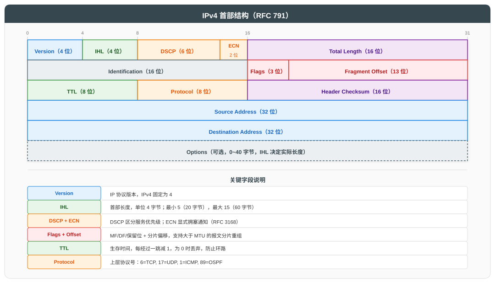
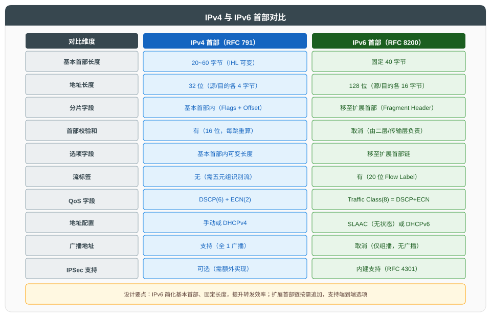

# 网络层与 IP 协议

## 一、概述

网络层位于数据链路层之上、传输层之下，核心职责是在跨越多个链路的异构网络间实现**主机到主机**的通信。本文遵循"总分循序渐进"原则，先总述网络层功能与关键问题，再依次展开 IPv4、IPv6、ICMP、路由协议与 NAT 等核心内容。

| 功能 | 说明 |
|------|------|
| **逻辑寻址** | 用 IP 地址标识主机与网络，与硬件地址解耦 |
| **路由转发** | 路由器根据路由表逐跳转发分组 |
| **分片重组** | 报文长度超过 MTU 时分片，目的端重组 |
| **拥塞控制** | 通过 ICMP 源站抑制、ECN 等机制反馈拥塞 |

---

## 二、IPv4 协议

### 2.1 IPv4 首部结构

IPv4 首部由固定 20 字节的基本部分和可变长度的选项字段组成，定义于 RFC 791。

**关键字段详解**：

| 字段 | 长度 | 说明 |
|------|------|------|
| **Version** | 4 位 | 协议版本，IPv4 固定为 4 |
| **IHL** | 4 位 | 首部长度，单位 4 字节；最小 5（20 字节），最大 15（60 字节） |
| **DSCP** | 6 位 | 区分服务代码点，用于 QoS 标记（RFC 2474） |
| **ECN** | 2 位 | 显式拥塞通知（RFC 3168） |
| **Total Length** | 16 位 | 整个 IP 报文长度（首部+数据），最大 65535 字节 |
| **Identification** | 16 位 | 标识符，用于分片重组时识别同一原始报文 |
| **Flags** | 3 位 | bit0 保留；bit1 DF（禁止分片）；bit2 MF（还有更多分片） |
| **Fragment Offset** | 13 位 | 分片偏移，单位 8 字节 |
| **TTL** | 8 位 | 生存时间，每跳减 1，为 0 时丢弃，防止环路 |
| **Protocol** | 8 位 | 上层协议号：6=TCP, 17=UDP, 1=ICMP, 89=OSPF |
| **Header Checksum** | 16 位 | 首部校验和，每跳需重算（TTL 变化） |
| **Source/Destination Address** | 各 32 位 | 源/目的 IP 地址 |

### 2.2 IPv4 地址分类

传统 IPv4 地址分为五类（RFC 790）：

| 类别 | 首位 | 网络号范围 | 默认掩码 | 地址范围 | 用途 |
|------|------|------------|----------|----------|------|
| A | 0 | 1~126 | /8 | 1.0.0.0 ~ 126.255.255.255 | 大型网络 |
| B | 10 | 128~191 | /16 | 128.0.0.0 ~ 191.255.255.255 | 中型网络 |
| C | 110 | 192~223 | /24 | 192.0.0.0 ~ 223.255.255.255 | 小型网络 |
| D | 1110 | - | - | 224.0.0.0 ~ 239.255.255.255 | 组播 |
| E | 1111 | - | - | 240.0.0.0 ~ 255.255.255.255 | 保留实验 |

**特殊地址**：

| 地址 | 说明 |
|------|------|
| 0.0.0.0 | 本网络本主机（DHCP 申请阶段） |
| 255.255.255.255 | 有限广播（同一广播域） |
| 127.0.0.0/8 | 环回测试（Loopback） |
| 169.254.0.0/16 | 链路本地（APIPA 自动分配） |

### 2.3 私有地址（RFC 1918）

RFC 1918 定义了三段私有 IPv4 地址，不在公网路由：

| 类别 | 私有地址范围 | 前缀 |
|------|--------------|------|
| A | 10.0.0.0 ~ 10.255.255.255 | 10.0.0.0/8 |
| B | 172.16.0.0 ~ 172.31.255.255 | 172.16.0.0/12 |
| C | 192.168.0.0 ~ 192.168.255.255 | 192.168.0.0/16 |

### 2.4 CIDR 与 VLSM

**CIDR（无类别域间路由，RFC 1519）** 打破了传统 A/B/C 类边界，使用任意长度前缀：

| 表示法 | 示例 | 含义 |
|--------|------|------|
| 前缀表示 | 192.168.1.0/24 | 前 24 位为网络号 |
| 斜线表示 | /26 | 32-26=6 位主机号，64 个地址 |

**VLSM（可变长子网掩码）** 允许同一主网下使用不同长度掩码，按需分配地址：

| 子网需求 | 主机数 | 分配掩码 | 可用地址数 |
|----------|--------|----------|------------|
| 大部门 | 60 | /26 | 62 |
| 中部门 | 28 | /27 | 30 |
| 小部门 | 12 | /28 | 14 |
| 点对点链路 | 2 | /30 | 2 |

**CIDR 路由聚合示例**：

| 原始路由 | 聚合后 |
|----------|--------|
| 192.168.0.0/24, 192.168.1.0/24, ..., 192.168.255.0/24 | 192.168.0.0/16 |

### 2.5 IP 分片

当 IP 报文长度超过链路 MTU 时，且 DF=0，路由器将报文分片：

| 字段 | 分片行为 |
|------|----------|
| Identification | 所有分片相同（来自原始报文） |
| MF | 除最后一片外均为 1 |
| Fragment Offset | 标识本片在原始数据中的偏移（单位 8 字节） |

> 分片在目的端重组。若任一分片丢失，整个报文被丢弃，导致性能下降。现代网络建议通过 Path MTU Discovery（RFC 1191）避免分片。

---

## 三、IPv6 协议

### 3.1 IPv6 首部与 IPv4 对比

IPv6（RFC 8200）设计目标：扩大地址空间、简化首部、增强安全性与 QoS 支持。

**IPv6 基本首部字段**：

| 字段 | 长度 | 说明 |
|------|------|------|
| Version | 4 位 | 固定为 6 |
| Traffic Class | 8 位 | 等价于 IPv4 的 DSCP+ECN |
| Flow Label | 20 位 | 标识同一流，便于 QoS 处理 |
| Payload Length | 16 位 | 载荷长度（不含基本首部） |
| Next Header | 8 位 | 下一首部类型（等价于 Protocol，可指向扩展首部） |
| Hop Limit | 8 位 | 等价于 TTL |
| Source/Destination Address | 各 128 位 | 源/目的地址 |

### 3.2 IPv6 地址类型

| 类型 | 前缀 | 说明 | 示例 |
|------|------|------|------|
| **全球单播** | 2000::/3 | 公网可路由 | 2001:db8::1 |
| **链路本地** | fe80::/10 | 仅同一链路，自动生成 | fe80::1 |
| **唯一本地** | fc00::/7 | 私有地址（RFC 4193） | fd00::1 |
| **组播** | ff00::/8 | 一对多 | ff02::1（所有节点） |
| **环回** | ::1/128 | 等价于 127.0.0.1 | ::1 |

> IPv6 取消广播，组播承担原广播功能；地址表示中连续零块可压缩为 `::`（仅一次）。

### 3.3 IPv6 地址配置

| 方式 | 说明 | 标准 |
|------|------|------|
| **SLAAC** | 无状态自动配置，主机根据 RA 前缀+EUI-64 生成地址 | RFC 4862 |
| **DHCPv6** | 有状态配置，由 DHCPv6 服务器分配地址 | RFC 8415 |
| **手动** | 静态配置 | - |

---

## 四、ICMP 协议

ICMP（Internet Control Message Protocol，RFC 792）用于传递错误信息与控制消息，IPv4 与 IPv6 分别对应 ICMPv4 和 ICMPv6。

### 4.1 常用 ICMP 报文

| 类型 | 代码 | 名称 | 说明 |
|------|------|------|------|
| 0 | 0 | Echo Reply | Ping 应答 |
| 3 | 0~15 | Destination Unreachable | 目的不可达（含端口不可达、需分片等） |
| 5 | 0~3 | Redirect | 重定向到更优路径 |
| 8 | 0 | Echo Request | Ping 请求 |
| 11 | 0 | Time Exceeded | TTL 超时（Traceroute 利用此消息） |
| 12 | 0 | Parameter Problem | 首部字段错误 |

### 4.2 ICMP 应用

| 工具 | 使用的 ICMP | 原理 |
|------|-------------|------|
| **ping** | Echo Request/Reply | 测试连通性与往返时延 |
| **Traceroute** | Time Exceeded | 逐跳递增 TTL，记录每跳路由器响应 |
| **Path MTU Discovery** | Destination Unreachable (Type 3 Code 4) | DF=1 探测路径最小 MTU |

---

## 五、路由协议

### 5.1 路由协议分类

| 分类维度 | 类别 | 代表协议 |
|----------|------|----------|
| 工作范围 | IGP（内部网关协议） | RIP、OSPF、IS-IS |
| | EGP（外部网关协议） | BGP |
| 算法类型 | 距离矢量 | RIP、IGRP |
| | 链路状态 | OSPF、IS-IS |
| | 路径矢量 | BGP |

### 5.2 主流路由协议对比

| 协议 | 类型 | 度量值 | 收敛速度 | 规模 | 标准 |
|------|------|--------|----------|------|------|
| **RIP** | 距离矢量 | 跳数（≤15） | 慢 | 小型 | RFC 2453 |
| **OSPF** | 链路状态 | 带宽（Cost） | 快 | 中大型 | RFC 2328 |
| **IS-IS** | 链路状态 | Cost | 快 | 大型（运营商） | ISO 10589 |
| **BGP** | 路径矢量 | AS_PATH 等属性 | 慢 | 互联网级 | RFC 4271 |

### 5.3 OSPF 关键机制

OSPF（开放最短路径优先）基于 Dijkstra 算法计算最短路径树。

| 概念 | 说明 |
|------|------|
| **Area** | 区域，分层路由；Area 0 为骨干区域 |
| **LSA** | 链路状态通告，描述链路状态 |
| **DR/BDR** | 广播网选举指定路由器，减少邻接关系 |
| **Cost** | 度量值 = 100 Mbps / 接口带宽 |

### 5.4 BGP 关键机制

BGP（边界网关协议）是互联网域间路由的事实标准，基于 AS（自治系统）间交换可达性信息。

| 路径属性 | 说明 |
|----------|------|
| **AS_PATH** | 经过的 AS 序列，用于防环与选路 |
| **NEXT_HOP** | 下一跳地址 |
| **LOCAL_PREF** | 本地优先级，影响出站选路 |
| **MED** | 多出口鉴别器，影响入站选路 |
| **Community** | 团体属性，用于批量策略 |

---

## 六、NAT 网络地址转换

NAT（Network Address Translation，RFC 3022）在私有地址与公网地址间转换，缓解 IPv4 地址枯竭问题。

### 6.1 NAT 类型

| 类型 | 说明 | 应用 |
|------|------|------|
| **静态 NAT** | 一对一固定映射 | 服务器对外发布 |
| **动态 NAT** | 从地址池动态分配 | 一般上网 |
| **NAPT（PAT）** | 多对一，复用端口 | 家庭/企业最常用 |

### 6.2 NAPT 工作机制

| 步骤 | 操作 | 说明 |
|------|------|------|
| ① | 内部主机 10.1.1.1:1234 发起外网访问 | 私有源地址 |
| ② | NAT 设备改写源地址为公网 IP:5001 | 记录映射表 |
| ③ | 外网响应到达公网 IP:5001 | NAT 查表反向转换 |
| ④ | 目标地址改写回 10.1.1.1:1234 | 转发至内部主机 |

### 6.3 NAT 的副作用

| 问题 | 说明 |
|------|------|
| **破坏端到端** | 外部无法主动发起连接 |
| **应用层兼容** | FTP/SIP 等内嵌 IP 的协议需 ALG 辅助 |
| **性能开销** | 维护连接表、改写报文 |
| **IPv6 推进** | NAT 是过渡方案，IPv6 才是根本解决 |

---

## 七、参考资料

### 7.1 核心标准

| 标准 | 说明 |
|------|------|
| [RFC 791](https://www.rfc-editor.org/rfc/rfc791) | IPv4 协议规范 |
| [RFC 790](https://www.rfc-editor.org/rfc/rfc790) | IPv4 地址分配（A/B/C/D/E 类） |
| [RFC 1918](https://www.rfc-editor.org/rfc/rfc1918) | 私有 IPv4 地址分配 |
| [RFC 1519](https://www.rfc-editor.org/rfc/rfc1519) | CIDR 无类别域间路由 |
| [RFC 950](https://www.rfc-editor.org/rfc/rfc950) | 子网划分 |
| [RFC 8200](https://www.rfc-editor.org/rfc/rfc8200) | IPv6 协议规范 |
| [RFC 4291](https://www.rfc-editor.org/rfc/rfc4291) | IPv6 地址架构 |
| [RFC 4862](https://www.rfc-editor.org/rfc/rfc4862) | IPv6 无状态地址自动配置（SLAAC） |
| [RFC 792](https://www.rfc-editor.org/rfc/rfc792) | ICMPv4 |
| [RFC 4443](https://www.rfc-editor.org/rfc/rfc4443) | ICMPv6 |
| [RFC 3022](https://www.rfc-editor.org/rfc/rfc3022) | NAT 网络地址转换 |
| [RFC 1191](https://www.rfc-editor.org/rfc/rfc1191) | Path MTU Discovery |

### 7.2 路由协议标准

| 标准 | 说明 |
|------|------|
| [RFC 2453](https://www.rfc-editor.org/rfc/rfc2453) | RIP v2 |
| [RFC 2328](https://www.rfc-editor.org/rfc/rfc2328) | OSPF v2 |
| [RFC 5340](https://www.rfc-editor.org/rfc/rfc5340) | OSPF for IPv6 |
| [RFC 4271](https://www.rfc-editor.org/rfc/rfc4271) | BGP-4 |
| [RFC 5123](https://www.rfc-editor.org/rfc/rfc5123) | IS-IS 扩展 |
