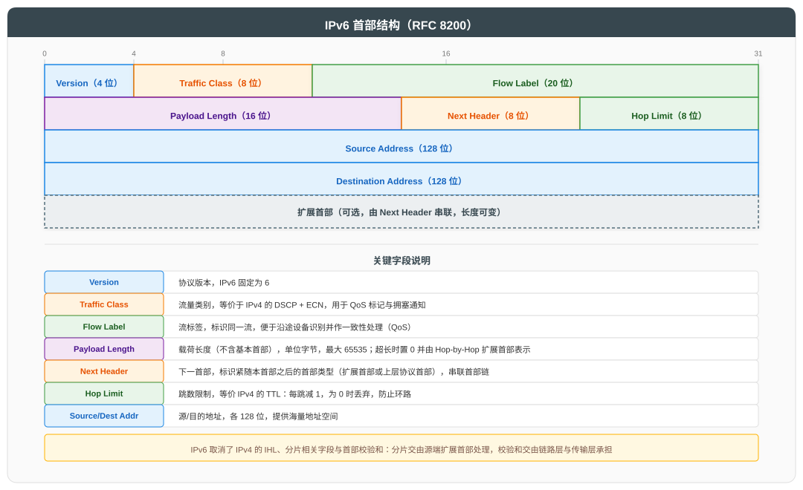
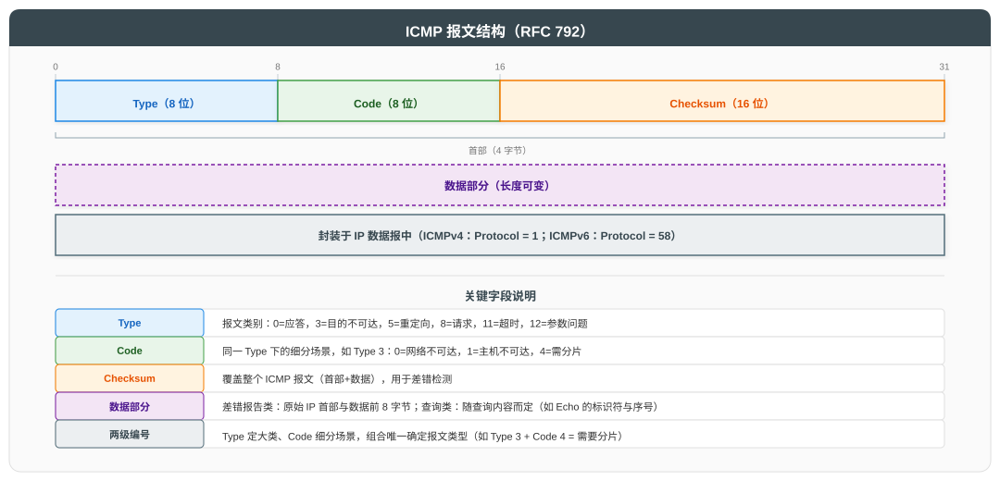
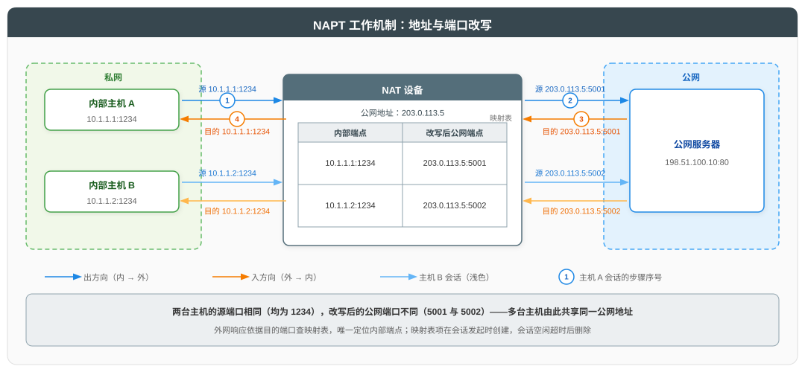

# 网络层及 IP 协议

## 一、概述

网络层位于数据链路层之上、传输层之下，核心职责是在跨越多个广播域的异构网络间实现**主机到主机**的通信。网络层的协议数据单元（PDU）为**分组（Packet）**，在 TCP/IP 体系中亦称 **IP 数据报（IP Datagram）**。本文遵循"总分循序渐进"原则，先总述网络层功能与关键问题，再依次展开 IPv4、IPv6、ICMP、路由协议与 NAT 等核心内容。

| 功能 | 说明 |
|------|------|
| **逻辑寻址** | 用 IP 地址标识主机与网络，与硬件地址解耦 |
| **路由转发** | 路由器根据路由表逐跳转发分组 |
| **分片重组** | 报文长度超过 MTU 时分片，目的端重组 |
| **拥塞控制** | 通过 ECN 等机制反馈拥塞（ICMP 源站抑制已弃用，见 4.2 节） |

---

## 二、IPv4 协议

IPv4（Internet Protocol version 4）是网络层的核心承载协议，将【一】中概述的网络层功能具体化：以 32 位 IP 地址实现逻辑寻址，以分组为单位逐跳路由转发，实现跨广播域的主机到主机通信。

**服务模型**：

| 特征 | 说明 |
|------|------|
| **无连接** | 发送前无需建立连接，每个分组独立选路转发 |
| **不可靠** | 不保证送达与顺序，校验出错或 TTL 耗尽即丢弃，可靠性由上层协议（如 TCP）按需保障 |
| **尽最大努力交付** | 不承诺时延与带宽，网络拥塞时直接丢包 |

> "无连接、不可靠"是有意的设计取舍：网络层专注高效转发，可靠性交由传输层实现，使 IP 保持简单并可运行于任意链路技术之上，支撑异构网络互联。

### 2.1 IPv4 首部结构

IPv4 首部由固定 20 字节的基本部分和可变长度的选项字段组成，定义于 [RFC 791](https://www.rfc-editor.org/rfc/rfc791)。

**关键字段详解**：

| 字段 | 长度 | 说明 |
|------|------|------|
| **Version** | 4 位 | 协议版本，IPv4 固定为 4 |
| **IHL** | 4 位 | 首部长度，单位 4 字节；最小 5（20 字节），最大 15（60 字节） |
| **DSCP** | 6 位 | 区分服务代码点，用于 QoS 标记（[RFC 2474](https://www.rfc-editor.org/rfc/rfc2474)） |
| **ECN** | 2 位 | 显式拥塞通知（[RFC 3168](https://www.rfc-editor.org/rfc/rfc3168)） |
| **Total Length** | 16 位 | 整个 IP 报文长度（首部+数据），最大 65535 字节 |
| **Identification** | 16 位 | 标识符，用于分片重组时识别同一原始报文 |
| **Flags** | 3 位 | bit0 保留；bit1 DF（禁止分片）；bit2 MF（还有更多分片） |
| **Fragment Offset** | 13 位 | 分片偏移，单位 8 字节 |
| **TTL** | 8 位 | 生存时间，每跳减 1，为 0 时丢弃，防止环路 |
| **Protocol** | 8 位 | 上层协议号：6=TCP, 17=UDP, 1=ICMP, 89=OSPF |
| **Header Checksum** | 16 位 | 首部校验和，每跳需重算（TTL 变化） |
| **Source/Destination Address** | 各 32 位 | 源/目的 IP 地址 |

**服务类型字段（DSCP 与 ECN）**：

DSCP 与 ECN 共占首部的"服务类型"（Type of Service，ToS）1 字节，是 IP 首部中与服务质量相关的两个字段。理解它们需先明确 QoS 的概念：

- **QoS（Quality of Service，服务质量）**：网络在带宽有限时为不同业务提供差异化服务的能力。核心思想是当资源不足时，让重要的流量（如语音通话）优先获得转发，让可容忍延迟的流量（如文件下载）延后。
- **QoS 标记**：在报文头部写入优先级信息，使网络中沿途各节点无需理解业务内容，仅依据标记即可执行统一的差异化处理。

**DSCP（Differentiated Services Code Point，区分服务代码点）——标记优先级**：

发送方将 6 位 DSCP 填入首部，取值决定该报文在沿途路由器中的转发优先级。EF、AFxy、CS、DF 是 RFC 定义的助记标记，每个标记对应 6 位字段的一个十进制取值（字段取值范围 0~63）：

| 标记 | 十进制值 | 类别 | 典型应用 |
|------|---------|------|----------|
| EF | 46 | 加速转发 | 语音（低时延、低抖动） |
| AF4x | 34、36、38 | 确保转发 | 按类别保证带宽，超承诺部分降级转发 |
| AF3x | 26、28、30 | 确保转发 | 按类别保证带宽，超承诺部分降级转发 |
| AF2x | 18、20、22 | 确保转发 | 按类别保证带宽，超承诺部分降级转发 |
| AF1x | 10、12、14 | 确保转发 | 按类别保证带宽，超承诺部分降级转发 |
| CS6 / CS7 | 48 / 56 | 类选择器 | 网络控制协议（OSPF、BGP 报文） |
| DF | 0 | 默认转发 | 普通数据（尽最大努力） |

AF 采用 AFxy 命名：x 为转发类（1~4，类越高优先级越高，路由器为各类分配独立队列与带宽承诺）；y 为丢弃优先级（1~3，同类内拥塞时 y=3 最先丢弃）。每个类 3 个码点，共 12 个（如 AF41 = 34、AF42 = 36、AF43 = 38，DSCP = 8x + 2y）。

沿途路由器依据 DSCP 执行队列调度（如优先级队列、加权队列），高优先级报文优先出队。

**ECN（Explicit Congestion Notification，显式拥塞通知）——报告拥塞**：

传统拥塞控制的拥塞信号是丢包：路由器缓冲区满时丢弃报文，发送方通过超时重传感知拥塞。丢包代价高（触发重传与时延），ECN 提供无丢弃的替代信号：

| ECN 值 | 含义 |
|--------|------|
| 00 | 不支持 ECN，按传统方式处理 |
| 01 / 10 | 支持 ECN（发送方声明） |
| 11 | 拥塞已发生（路由器标记） |

工作流程：发送方置 01/10 声明支持 → 链路拥塞时路由器将转发中的报文改写为 11 → 接收方通过传输层反馈（如 TCP 的 ECE 标志）通知发送方 → 发送方减速。

> DSCP 与 ECN 分工明确：DSCP 由发送方预先标记，供沿途路由器差异化转发；ECN 由路由器在转发途中动态标记，供发送方感知拥塞并主动降速。

### 2.2 IPv4 地址分类

**地址格式与结构**：

IPv4 地址是 32 位二进制数，按每 8 位一组分为 4 段，各段转换为十进制（0~255）后以点分隔，即点分十进制表示（如 `192.168.1.10`）。32 位在逻辑上划分为两部分：

- **网络号（Network ID）**：标识主机所属的网络（广播域）。路由器据此判断目的网络是否可达、该向哪个方向转发——路由表中记录的是网络号，而非单个主机地址。
- **主机号（Host ID）**：标识网络内的具体主机。

网络号与主机号的边界由**掩码（Mask）**界定。掩码是 32 位二进制数，前段连续 1 对应网络号，后段连续 0 对应主机号。判断某 IP 所属网络的方法：将 IP 与掩码按位与运算，结果即网络号。掩码有两种等价表示：

| 表示法 | 示例 | 说明 |
|--------|------|------|
| 点分十进制 | 255.255.255.0 | 24 个 1 + 8 个 0 |
| 前缀长度（CIDR） | /24 | 掩码中 1 的个数 |

> "默认掩码"指分类地址制式下各类地址固有的掩码，取值见下方分类表。无类别编址（CIDR）的任意长度前缀见 2.4 节。

**分类地址**：传统 IPv4 地址按前几位取值分为五类（[RFC 790](https://www.rfc-editor.org/rfc/rfc790)），每类的首位模式与默认掩码均由标准统一规定：

| 类别 | 首位模式 | 首字节范围 | 网络号数量 | 默认掩码 | 地址范围 | 用途 |
|------|---------|------------|-----------|----------|----------|------|
| A | 0 | 1~126 | 126（2^7 - 2） | /8（255.0.0.0） | 1.0.0.0 ~ 126.255.255.255 | 大型网络 |
| B | 10 | 128~191 | 16384（2^14） | /16（255.255.0.0） | 128.0.0.0 ~ 191.255.255.255 | 中型网络 |
| C | 110 | 192~223 | 2097152（2^21） | /24（255.255.255.0） | 192.0.0.0 ~ 223.255.255.255 | 小型网络 |
| D | 1110 | 224~239 | - | - | 224.0.0.0 ~ 239.255.255.255 | 组播 |
| E | 1111 | 240~255 | - | - | 240.0.0.0 ~ 255.255.255.255 | 保留实验 |

> **默认掩码的由来**：各类的网络号位数由标准直接规定（A 类 8 位、B 类 16 位、C 类 24 位），掩码长度即网络号位数。规定的目的是提供三档网络规模，适配不同规模的组织：A 类少量网络（126 个）× 海量主机（约 1677 万）、B 类中等网络（1.6 万）× 中等主机（6.5 万）、C 类大量网络（约 210 万）× 少量主机（254）。掩码与首位模式之间不存在推导关系，二者是标准绑定于同一类别的两项属性。
>
> **首位模式的作用**：它是各类地址自带的识别标志——连续 1 的个数编码类别（0→A、10→B、110→C、1110→D、1111→E）。路由器仅检查地址前几位即可识别类别、得知网络号位数，无需额外配置掩码，分类地址因此具备"地址自身蕴含网络边界"的特性。
>
> 表中其余两列则由首位模式约束：
>
> - **首字节范围**：首位模式约束首字节的取值区间。如 B 类以 10 开头，首字节为 10000000 ~ 10111111，即 128~191
> - **网络号数量**：网络号位数减去固定模式位数后，剩余自由位数决定数量。如 B 类网络号 16 位中 2 位为固定模式，剩 14 位自由取值，共 2^14 = 16384 个（A 类扣除全 0 与 127 两个保留网络号，故为 126 个）
>
> D、E 类不划分网络号/主机号，故无网络号数量与掩码。

**特殊地址**：

| 地址 | 说明 |
|------|------|
| 0.0.0.0 | 本网络本主机（DHCP 申请阶段） |
| 255.255.255.255 | 有限广播（同一广播域） |
| 127.0.0.0/8 | 环回测试（Loopback） |
| 169.254.0.0/16 | 链路本地（APIPA 自动分配） |

### 2.3 私有地址（RFC 1918）

[RFC 1918](https://www.rfc-editor.org/rfc/rfc1918) 定义了三段私有 IPv4 地址，不在公网路由：

| 类别标签 | 私有地址范围 | 前缀 | 与类别默认掩码的关系 |
|----------|--------------|------|---------------------|
| A | 10.0.0.0 ~ 10.255.255.255 | 10.0.0.0/8 | 一致：恰为 A 类空间的完整一块 |
| B | 172.16.0.0 ~ 172.31.255.255 | 172.16.0.0/12 | 脱离：B 类空间中 16 个连续 /16 网络的聚合块 |
| C | 192.168.0.0 ~ 192.168.255.255 | 192.168.0.0/16 | 脱离：C 类空间中 256 个连续 /24 网络的聚合块 |

> 表中"类别标签"是历史沿用的称谓，仅用于指代地址块所在的传统类别，不决定地址块的边界；实际边界由前缀长度决定（如 172.16.0.0/12 的边界是 /12，而非 B 类默认的 /16）。三段地址块的容量依次递减：A 标签块约 1677 万个地址、B 标签块约 105 万个、C 标签块约 6.5 万个，部署私有网络时按内网主机规模选择对应量级的地址块。表中前缀仅界定整块边界，并非使用者必须采用的掩码——组织可在块内再划分子网（如在 10.0.0.0/8 内取 10.1.0.0/24 作为一个子网），子网掩码由实际组网需求决定。

### 2.4 CIDR 与 VLSM

**CIDR（无类别域间路由，[RFC 1519](https://www.rfc-editor.org/rfc/rfc1519)）** 打破了传统 A/B/C 类边界，使用任意长度前缀：

| 表示法 | 示例 | 含义 |
|--------|------|------|
| 地址前缀 | 192.168.1.0/24 | 前 24 位为网络号 |
| 前缀长度 | /26 | 32-26=6 位主机号，共 2^6 = 64 个地址；其中网络地址（主机号全 0）与广播地址（主机号全 1）不可分配，可用地址为 62 个 |

**VLSM（可变长子网掩码）** 允许在同一主网（如一个 C 类网络 192.168.1.0/24）内使用不同长度掩码，按需分配地址：

| 子网需求 | 主机数 | 分配掩码 | 可用地址数 |
|----------|--------|----------|------------|
| 大部门 | 60 | /26 | 62 |
| 中部门 | 28 | /27 | 30 |
| 小部门 | 12 | /28 | 14 |
| 点对点链路 | 2 | /30 | 2 |

**CIDR 路由聚合示例**：

| 原始路由 | 聚合后 |
|----------|--------|
| 192.168.0.0/24, 192.168.1.0/24, ..., 192.168.255.0/24 | 192.168.0.0/16 |

### 2.5 IP 分片

**前置概念**：

- **MTU（Maximum Transmission Unit，最大传输单元）**：链路层单帧能承载的最大载荷长度（详见数据链路层文档 3.1 节），以太网为 1500 字节。不同链路技术的 MTU 不同，报文途经的各段链路中取值最小者称为路径 MTU。
- **DF（Don't Fragment，禁止分片）**：IPv4 首部 Flags 字段的 bit1（详见 2.1 节）。DF=0 表示允许分片；DF=1 表示禁止分片，超长报文将被丢弃并返回 ICMP 差错报文。
- **MF（More Fragments，还有更多分片）**：IPv4 首部 Flags 字段的 bit2（详见 2.1 节）。分片报文中除最后一片外 MF=1，最后一片 MF=0，接收方据此判断分片是否接收完整。

**分片机制**：当 IP 报文长度超过出接口链路 MTU 且 DF=0 时，路由器将报文拆分为多个分片独立转发：

| 字段 | 分片行为 |
|------|----------|
| Identification | 所有分片相同（来自原始报文） |
| MF | 除最后一片外均为 1 |
| Fragment Offset | 标识本片在原始数据中的偏移（单位 8 字节） |

> 分片在目的端重组。若任一分片丢失，整个报文被丢弃，导致性能下降。现代网络建议通过 Path MTU Discovery（[RFC 1191](https://www.rfc-editor.org/rfc/rfc1191)）避免分片。

**Path MTU Discovery 工作流程**：

发送方将 DF 置 1 发送报文，路径上若存在 MTU 更小的链路，对应路由器丢弃报文并返回 ICMP"目的地不可达、需要分片"差错报文（内含该链路的 MTU 值）；发送方据 ICMP 报文将发送上限调整为该 MTU 后重发，重复探测直至报文成功通过，此后按探测得到的路径 MTU 发送，全程不再分片。

**PMTUD 与 IP 分片的机制对比**：

PMTUD 的"避免分片"并非将 IP 层的拆分工作移交传输层，而是源头控制——传输层（如 TCP）本就按 MSS（最大报文段长度）将字节流切分为报文段，PMTUD 仅将 MSS 调整为不超过"路径 MTU - 头部开销"（见下方说明），使每个报文段在发送前就已适配瓶颈链路的尺寸限制：

> MSS 指单个报文段中 TCP 载荷的最大字节数，**不含 TCP 头部与 IP 头部**。MSS 的计算基准已扣除全部头部开销：MSS = 路径 MTU - IP 头部长度 - TCP 头部长度（以太网典型值：1500 - 20 - 20 = 1460）。因此完整的 IP 报文（IP 头部 + TCP 头部 + 载荷）恰好不超过 MTU，不会出现"MSS 适配了 MTU、封装后却超限"的问题。TCP 连接建立时，通信双方在 SYN 报文中交换各自的 MSS 选项，取较小值作为连接的生效 MSS。

| 维度 | IP 分片（DF=0） | PMTUD（DF=1，传输层配合） |
|------|----------------|--------------------------|
| 处理时机 | 事后拆分：报文超过 MTU 后由路由器切割 | 源头控制：生成时即按尺寸上限切分 |
| 报文形态 | 一个大 IP 报文 → 多个 IP 分片 | 多个完整 IP 报文（各含一个 TCP 段） |
| 完整性保障 | 目的端 IP 层重组（Identification + Offset + MF） | TCP 字节流机制（序列号 + 确认 + 重传） |
| 丢失代价 | 任一分片丢失 → 全报文作废 | 单个报文丢失 → 仅重传该报文 |

> PMTUD 对 UDP 收效有限：UDP 不做分段，应用数据超路径 MTU 且 DF=1 时报文直接被丢弃，需应用层自行控制报文尺寸（如 QUIC 在应用层实现了类似的探测机制）。

---

## 三、IPv6 协议

IPv6（Internet Protocol version 6，[RFC 8200](https://www.rfc-editor.org/rfc/rfc8200)）是为解决 IPv4 地址枯竭而设计的下一代协议。相比 IPv4，其设计目标为：扩大地址空间（32 位 → 128 位）、简化首部（定长 40 字节，取消校验和与分片字段）、增强 QoS 支持（流标签），并通过扩展首部机制实现灵活扩展。

**与 IPv4 的核心差异**：

| 维度 | IPv4 | IPv6 |
|------|------|------|
| 地址长度 | 32 位 | 128 位 |
| 首部长度 | 可变（20~60 字节） | 固定 40 字节 |
| 分片 | 路由器可分片 | 仅源端分片（路由器不分片） |
| 校验和 | 首部校验和（每跳重算） | 取消（交由链路层与传输层） |
| 广播 | 支持 | 取消，由组播承担 |
| 地址配置 | 手动/DHCP | SLAAC/DHCPv6/手动 |

### 3.1 IPv6 首部结构

IPv6 首部为固定 40 字节的定长结构，定义于 [RFC 8200](https://www.rfc-editor.org/rfc/rfc8200)。

**关键字段详解**：

| 字段 | 长度 | 说明 |
|------|------|------|
| **Version** | 4 位 | 协议版本，IPv6 固定为 6 |
| **Traffic Class** | 8 位 | 流量类别，等价于 IPv4 的 DSCP + ECN，用于 QoS 标记与拥塞通知 |
| **Flow Label** | 20 位 | 流标签，标识同一流，便于沿途设备识别并作一致性处理 |
| **Payload Length** | 16 位 | 载荷长度（不含基本首部），最大 65535 字节；超长时置 0 并由 Hop-by-Hop 扩展首部表示 |
| **Next Header** | 8 位 | 下一首部，标识紧随本首部之后的首部类型，串联首部链（详见下方"Next Header 与首部链"） |
| **Hop Limit** | 8 位 | 跳数限制，等价 IPv4 的 TTL：每跳减 1，为 0 时丢弃 |
| **Source/Destination Address** | 各 128 位 | 源/目的地址 |

> IPv6 取消了 IPv4 的 IHL（首部定长无需指示）、标识/标志/分片偏移（分片功能移入 Fragment 扩展首部，见下方分片机制）与首部校验和（转发开销降低，差错检测交由链路层 FCS 与传输层校验和承担）。

**Next Header 与首部链**：

IPv6 将报文组织为首部链：基本首部 → 零或多个扩展首部 → 上层协议首部 → 数据。上层协议（如 TCP）报文的首部同样是链上的一环，因此无论指向扩展首部还是上层协议首部，该字段标识的都是"下一个首部"，故名"下一首部"。其取值空间与 IPv4 的 Protocol 字段一致：指向扩展首部时取扩展首部类型值（如 0=Hop-by-Hop、43=Routing、44=Fragment），指向上层协议首部时取协议号（如 6=TCP、17=UDP，此时该首部之后即为协议数据）。

接收方的解析方式：从基本首部开始，逐首部读取 Next Header 以确定下一个首部的类型，直到取值为上层协议号时结束。

| 场景 | 各首部 Next Header 取值 | 报文结构（首部链） |
|------|------------------------|-------------------|
| 无扩展首部 | 基本首部：6（TCP） | 基本首部 → TCP 首部 → 数据 |
| 含 1 个扩展首部（以 Fragment 为例） | 基本首部：44（Fragment）；Fragment 首部：6（TCP） | 基本首部 → Fragment 扩展首部 → TCP 首部 → 数据 |
| 含 2 个扩展首部（Hop-by-Hop + Fragment） | 基本首部：0（Hop-by-Hop）；Hop-by-Hop 首部：44（Fragment）；Fragment 首部：6（TCP） | 基本首部 → Hop-by-Hop 扩展首部 → Fragment 扩展首部 → TCP 首部 → 数据 |
| 含 3 个扩展首部（Hop-by-Hop + Routing + Fragment） | 基本首部：0（Hop-by-Hop）；Hop-by-Hop 首部：43（Routing）；Routing 首部：44（Fragment）；Fragment 首部：6（TCP） | 基本首部 → Hop-by-Hop 扩展首部 → Routing 扩展首部 → Fragment 扩展首部 → TCP 首部 → 数据 |

> Hop-by-Hop 扩展首部（类型值 0）携带沿途每跳均需处理的选项，RFC 8200 规定其为链上唯一必须紧跟基本首部之后的扩展首部，因此上例将其置于链首。Routing 扩展首部（类型值 43）用于源路由——发送方在首部中列出报文必须依次途经的节点地址，沿途路由器按此列表逐跳转发，而非依据自身路由表自行选路，常见于 SRv6 等场景。

**分片机制**（Fragment 扩展首部的应用）：

IPv6 规定**只有发送报文的源主机（源端）可以执行分片，转发路径上的路由器一律不分片**，分片参数由 Fragment 扩展首部承载。工作流程：

1. 发送前，源主机通过 Path MTU Discovery 探测出路径 MTU（与 IPv4 相同机制）
2. 若待发送数据超过"路径 MTU - 40 字节基本首部"，源主机在发送时将其划分多个分片，并为每个分片构造一个 **Fragment 扩展首部**，填入分片参数（分片偏移、M 标志、报文标识）
3. 转发路径上的路由器不执行分片。报文超过某路由器出接口 MTU 时，该路由器将其丢弃，并返回 ICMPv6"数据包过大"消息（Type 2，携带该出接口 MTU）告知源主机重新分片
4. 目的主机依据各分片 Fragment 扩展首部中的参数完成重组

与 IPv4 的关键差异：IPv4 分片字段位于基本首部、路由器可中途分片；IPv6 将分片信息移入 Fragment 扩展首部，且分片职责**集中在源端**——好处是路由器转发逻辑简化（无需处理分片重组表），代价是源主机必须预先知道路径 MTU（依赖 PMTUD 或因 ICMPv6 被过滤导致的"黑洞"问题）。

### 3.2 IPv6 地址分类

IPv6 地址长度 128 位，采用冒号分隔的十六进制表示法：每 16 位（2 字节）为一组写成 4 位十六进制，共 8 组，组间用冒号分隔（如 `2001:0db8:0000:0000:0000:0000:0000:0001`）。为缩短书写，连续零组可压缩为 `::`（每个地址仅允许一次），前导零可省略，上例即 `2001:db8::1`。

**地址类型的划分依据**：

IPv6 不划分 A/B/C 类地址，IPv6 地址按**用途**划分不同类型（单播、组播等）。每种类型构成一个连续的地址块，类型地址块的范围由**前缀**（地址最高若干位的固定取值）界定。

前缀承担两级作用：

| 层级 | 作用 | 示例 |
|------|------|------|
| 划分类型地址块 | 前缀决定地址属于哪个类型 | 最高 3 位为 001 → 落在 2000::/3 内 → 全球单播地址 |
| 块内划分子网 | 在类型地址块内用更长前缀再细分 | 在 2000::/3 内取 2001:db8::/32 作为一个子网 |

两级前缀是同一机制的不同长度运用：短前缀划出类型地址块，长前缀在块内划出子网。子网划分方式与 IPv4 无类别编址相同（在地址块内用任意长度前缀细分）。由此可见 IPv6 不存在 IPv4 那种绑定默认掩码的类别——IPv6 地址的归属与地址块的边界均由前缀表达。

| 类型 | 前缀 | 作用范围 | 说明 | 示例 |
|------|------|----------|------|------|
| **全球单播** | 2000::/3 | 全球公网 | 等价于 IPv4 公网地址，公网可路由 | 2001:db8::1 |
| **链路本地** | fe80::/10 | 单条链路 | 接口启动时自动生成，仅同一链路内有效，用于邻居发现等底层协议 | fe80::1 |
| **唯一本地** | fc00::/7 | 私有网络 | 等价于 IPv4 私有地址（[RFC 4193](https://www.rfc-editor.org/rfc/rfc4193)），不在公网路由 | fd00::1 |
| **组播** | ff00::/8 | 按组成员 | 一对多投递，组成员通过组播协议加入 | ff02::1（所有节点） |
| **环回** | ::1/128 | 本机 | 等价于 IPv4 的 127.0.0.1，用于本机协议栈自测 | ::1 |

> **与 IPv4 地址体系的两点关键差异**：
>
> - **取消广播**：IPv4 的广播地址（255.255.255.255 及子网定向广播）在 IPv6 中取消，原广播功能由组播承担（如"所有节点"ff02::1、"所有路由器"ff02::2），避免广播对无关主机的干扰
> - **特殊地址的处理方式不同**：IPv4 将特殊地址（环回、链路本地等）列为独立的特殊地址分类；IPv6 不设独立分类，而是将特殊地址归入常规地址类型体系——环回 `::1` 归入单播，链路本地 fe80::/10 本身就是一种单播地址类型，由接口自动配置，是 IPv6 节点的标准配置而非故障回退

### 3.3 IPv6 地址配置

| 方式 | 说明 | 标准 |
|------|------|------|
| **SLAAC** | 无状态自动配置，主机根据 RA 前缀+EUI-64 生成地址 | [RFC 4862](https://www.rfc-editor.org/rfc/rfc4862) |
| **DHCPv6** | 有状态配置，由 DHCPv6 服务器分配地址 | [RFC 8415](https://www.rfc-editor.org/rfc/rfc8415) |
| **手动** | 静态配置 | - |

**SLAAC 的工作原理**：

SLAAC 无需服务器参与，地址由主机自行生成，依赖两个工作机制：

- **RA 前缀**：RA（Router Advertisement，路由器通告）是本地路由器周期性向主机发送的 ICMPv6 报文，携带本链路使用的网络前缀即 RA 前缀，主机由此获知所在子网的前缀
- **接口标识符**：标识链路内具体接口的 64 位字段，长度固定为 64 位。经典生成方法为 EUI-64（由 48 位 MAC 地址在中间插入固定字节 ff:fe 扩展为 64 位，并将第 7 位翻转）；现代操作系统因隐私考虑多改用随机生成方法，但无论何种方法，接口标识符长度均为 64 位

地址由 RA 前缀与接口标识符两段拼接而成：前者标识所在子网，后者标识链路内的具体接口。拼接成立的前提是 RA 前缀长度恰好 64 位——接口标识符固定 64 位，仅长度为 /64 的 RA 前缀可与之拼出 128 位地址。因此 [RFC 4862](https://www.rfc-editor.org/rfc/rfc4862) 规定：RA 前缀长度不是 /64 时，该前缀不用于地址生成（如运营商委派的 /56 前缀，需由路由器划分为多个 /64 子网后逐链路通告）。主机收到长度为 /64 的 RA 前缀后，将两段拼接为完整地址，无需申请与分配过程。

与 DHCPv6 相比：SLAAC 无需维护服务器与地址分配状态（故称"无状态"），配置简单，是 IPv6 的默认方式；DHCPv6 由服务器集中管理地址（故称"有状态"），便于策略控制，适用于需统一审计的场景。

---

## 四、ICMP 协议

ICMP（Internet Control Message Protocol，[RFC 792](https://www.rfc-editor.org/rfc/rfc792)）用于传递错误信息与控制消息，IPv4 与 IPv6 分别对应 ICMPv4 和 ICMPv6。

### 4.1 ICMP 报文结构

ICMP 报文由首部与数据两部分组成，首部为固定的 4 字节：

ICMP 报文按用途分为两大类：

| 类别 | 用途 | 典型报文 |
|------|------|----------|
| **差错报告类** | 路由器或主机向源端报告传输中出现的差错 | 目的不可达（Type 3）、超时（Type 11）、参数问题（Type 12）、重定向（Type 5） |
| **查询类** | 主动发起探测请求并获取应答 | Echo 请求/应答（Type 8/0） |

**关键字段详解**：

| 字段 | 长度 | 说明 |
|------|------|------|
| **Type（类型）** | 8 位 | 标识报文类别，取值见 4.2 节 |
| **Code（代码）** | 8 位 | 对同一 Type 进一步细分场景，如 Type 3 下 Code 0=网络不可达、Code 1=主机不可达、Code 4=需分片 |
| **Checksum（校验和）** | 16 位 | 覆盖整个 ICMP 报文（首部+数据），用于差错检测 |
| **数据部分** | 可变 | 差错报告类携带触发差错的原始 IP 报文首部及数据前 8 字节（供源端定位差错原因）；查询类随查询内容而定（如 Echo 的标识符与序号） |

> ICMP 报文封装在 IP 数据报中传输：ICMPv4 报文对应的 IP 首部 Protocol 字段值为 1，ICMPv6 对应值为 58。Type 与 Code 两级编号共同确定一个具体报文——接收方依据二者组合判断如何处理。

### 4.2 常用 ICMP 报文

**差错报告类**：

| 类型 | 代码 | 名称 | 发送方 | 触发场景 | 典型应用 |
|------|------|------|--------|----------|----------|
| 3 | 0 | Network Unreachable（网络不可达） | 路由器 | 路由表中无到达目的网络的路由，丢弃报文并通告源端 | 排查路由缺失或配置错误 |
| 3 | 1 | Host Unreachable（主机不可达） | 路由器 | 最后一跳路由器已到达目的网络，但无法定位目的主机（如 ARP 解析无应答） | 排查主机离线或子网配置错误 |
| 3 | 2 | Protocol Unreachable（协议不可达） | 目的主机 | 报文已送达目的主机，但 Protocol 字段标识的上层协议未运行 | 排查目的主机协议未启用 |
| 3 | 3 | Port Unreachable（端口不可达） | 目的主机 | 报文已送达目的主机，但无进程监听目标端口（多见于 UDP，TCP 直接以 RST 拒绝） | 排查服务未启动或端口错误 |
| 3 | 4 | Fragmentation Needed（需分片） | 路由器 | 报文长度超过出接口 MTU 且 DF=1，丢弃并通告出接口 MTU 供源端调整（[RFC 1191](https://www.rfc-editor.org/rfc/rfc1191)） | Path MTU Discovery |
| 3 | 13 | Administratively Prohibited（管理禁止） | 路由器 | 访问控制策略（ACL）拦截报文 | 排查防火墙或 ACL 拦截 |
| 5 | 0~3 | Redirect（重定向） | 首跳路由器 | 转发源端报文时发现更优下一跳且与源端同链路，通知源端后续报文直接发往该下一跳（仅 Code 1 主机重定向仍在使用，其余代码已淘汰） | 优化转发路径 |
| 11 | 0 | Time Exceeded（传输超时） | 路由器 | 转发途中 TTL 减至 0，丢弃报文并通告源端 | Traceroute 逐跳探测 |
| 11 | 1 | Time Exceeded（重组超时） | 目的主机 | 重组时限内未收齐全部分片，放弃重组并通告源端 | 诊断分片丢失 |
| 12 | 0 | Parameter Problem（参数问题） | 路由器或主机 | IP 首部字段存在无法处理的错误，Pointer 字段指明出错字节位置 | 诊断首部异常 |

**查询类**：

| 类型 | 代码 | 名称 | 发送方 | 触发场景 | 典型应用 |
|------|------|------|--------|----------|----------|
| 8 | 0 | Echo Request（回显请求） | 发起探测的主机 | 主动探测目的主机是否可达 | ping 请求 |
| 0 | 0 | Echo Reply（回显应答） | 被探测的主机 | 收到 Echo Request 后回应 | ping 应答 |

> 上表均为 ICMPv4 取值，完整列表见 [IANA ICMP 参数注册表](https://www.iana.org/assignments/icmp-parameters/icmp-parameters.xhtml)；ICMPv6 报文类型独立编号（如 Echo Request 为 Type 128），完整列表见 [IANA ICMPv6 参数注册表](https://www.iana.org/assignments/icmpv6-parameters/icmpv6-parameters.xhtml)。

> 两类历史报文已不再使用：Type 4（Source Quench，源站抑制）因在拥塞链路上产生额外流量、加剧拥塞，[RFC 1812](https://www.rfc-editor.org/rfc/rfc1812) 规定路由器不应发送，拥塞控制改由 ECN 与传输层机制承担；Type 13/14（Timestamp 请求/应答）用于时钟同步，已被 NTP 取代。

### 4.3 ICMP 应用

| 工具 | 使用的 ICMP | 原理 |
|------|-------------|------|
| **ping** | Echo Request/Reply | 测试连通性与往返时延 |
| **Traceroute** | Time Exceeded | 逐跳递增 TTL，记录每跳路由器响应 |
| **Path MTU Discovery** | Destination Unreachable (Type 3 Code 4) | DF=1 探测路径最小 MTU |

---

## 五、路由协议

**路由协议（Routing Protocol）**是路由器之间自动交换网络可达性信息的协议：各路由器据此计算到达每个网络的最优路径，生成并维护路由表；网络拓扑变化时，路由表随之更新。路由表是路由器转发分组的依据：查找目的网络对应的表项，确定下一跳与出接口。

### 5.1 路由协议的作用

路由表项有三个来源：

| 来源 | 生成方式 | 特点 |
|------|----------|------|
| **直连路由** | 接口配置 IP 地址并启用后自动生成 | 仅覆盖接口直连的网络，无需配置 |
| **静态路由** | 管理员逐条手动配置 | 不随拓扑变化自动更新，适合拓扑简单且稳定的小型网络 |
| **动态路由** | 路由协议自动学习与维护 | 随拓扑变化自动更新，适合大规模网络 |

直连路由与静态路由难以支撑大规模网络：前者仅覆盖自身接口所在的网络；后者要求管理员预知全部路径并逐台配置路由器，当链路故障或网络扩容时，人工逐台更新既不及时也易出错。大规模网络因此依赖动态路由协议，其工作过程可概括为四步：

1. **发现邻居**：与相邻路由器建立协议关系，确定信息交换对象
2. **交换信息**：向邻居通告自身掌握的可达性信息或链路状态
3. **计算路径**：依据算法从交换所得的信息计算到达各网络的最优路径，写入路由表
4. **响应变化**：检测到拓扑变化（如链路故障）后重新执行上述过程，更新路由表

拓扑变化后，全网路由器的路由表重新达成一致的过程称为**收敛（Convergence）**，所需时间即**收敛速度**，是衡量路由协议优劣的核心指标——收敛越快，因新旧路由不一致导致的丢包与转发环路窗口越短。

> 注意区分**路由协议**与**被路由协议（Routed Protocol）**：前者（如 OSPF）负责生成路由表；后者（如 IP）是被转发的对象。二者相互独立——IP 报文的转发逻辑不依赖任何具体路由协议，路由表由谁、以何种方式生成亦不影响转发本身的执行。

### 5.2 路由协议分类

按工作范围分类前，需先明确**自治系统（Autonomous System，AS）**的概念：处于同一管理机构、对外呈现统一路由策略的网络集合，拥有全局唯一的 AS 号。

| 分类维度 | 类别 | 说明 | 代表协议 |
|----------|------|------|----------|
| 工作范围 | IGP（内部网关协议） | 在单一 AS 内部运行，路由器之间交换路由信息 | RIP、IGRP、OSPF、IS-IS |
| | EGP（外部网关协议） | 在 AS 之间交换可达性信息 | BGP |
| 算法类型 | 距离矢量 | 仅知晓去往各网络的距离（度量值）与方向（下一跳），与邻居交换路由表、逐跳传递信息 | RIP、IGRP |
| | 链路状态 | 泛洪自身链路状态，掌握全网拓扑后自行计算最短路径 | OSPF、IS-IS |
| | 路径矢量 | 通告携带完整 AS 路径序列，以策略而非最短路径为选路依据 | BGP |

### 5.3 主流路由协议对比

到达同一网络常有多条路径，路由协议需要统一的比较标准，即**度量值（Metric）**：衡量路径优劣的数值，含义随协议而异——RIP 以跳数计，OSPF 以 Cost 计，BGP 以路径属性组合计。

| 协议 | 类型 | 度量值 | 收敛速度 | 适用规模 | 标准 |
|------|------|--------|----------|----------|------|
| **RIP** | 距离矢量 | 跳数（≤15） | 慢 | 小型 | [RFC 2453](https://www.rfc-editor.org/rfc/rfc2453) |
| **OSPF** | 链路状态 | Cost（常见实现按带宽计算） | 快 | 中大型 | [RFC 2328](https://www.rfc-editor.org/rfc/rfc2328) |
| **IS-IS** | 链路状态 | Cost（默认固定值） | 快 | 大型（运营商） | ISO 10589 |
| **BGP** | 路径矢量 | AS_PATH 等属性 | 慢 | 互联网级 | [RFC 4271](https://www.rfc-editor.org/rfc/rfc4271) |

> OSPF 与 IS-IS 的度量值同名（均为 Cost，即接口开销），但取值方式不同：OSPF 常见实现默认按 参考带宽 / 接口带宽 自动计算（见 5.4 节）；IS-IS 的 Cost 由管理员配置，未配置时所有接口默认取相同固定值（如 10），与带宽无关，按带宽自动计算需显式启用。

> BGP 收敛慢是设计取舍而非缺陷：域间路由以策略可控与全局稳定优先，速度让位于稳定性，避免路由抖动在互联网范围内放大。

### 5.4 OSPF 关键机制

OSPF（Open Shortest Path First，开放最短路径优先）是应用最广泛的 IGP，直接封装于 IP 传输（Protocol = 89，见 2.1 节）。作为链路状态协议，其工作方式为：每台路由器将自身链路状态封装为 LSA 泛洪至整个区域 → 各路由器据此建立一致的链路状态数据库（即全网拓扑图）→ 各自运行 Dijkstra 算法计算以自己为根的最短路径树 → 从树中导出路由表。

| 概念 | 说明 |
|------|------|
| **Area** | 区域，将 AS 划分为多个单元以限制 LSA 泛洪范围，实现分层路由；Area 0 为骨干区域，其余区域必须与它相连 |
| **LSA** | 链路状态通告，描述路由器的接口、开销与邻接关系，是泛洪与建立拓扑图的基本单元 |
| **DR/BDR** | 指定路由器与备份指定路由器，广播网络中选举产生，将网状邻接关系简化为星型，减少邻接数量与 LSA 重复泛洪 |
| **Cost** | 接口度量值，常见实现为参考带宽 / 接口带宽（默认参考带宽 100 Mbps） |

### 5.5 BGP 关键机制

BGP（Border Gateway Protocol，边界网关协议）是互联网 AS 间路由的事实标准，基于 TCP（端口 179）建立会话并交换路由。域间选路与域内的根本差异在于策略优先：AS 之间存在商业关系（客户、服务商、对等伙伴），选路须服从商业策略而非单纯的最短路径。BGP 将策略信息编码为随路由通告的路径属性，各 AS 依据属性执行选路决策。

| 路径属性 | 说明 |
|----------|------|
| **AS_PATH** | 通告经过的 AS 序列，用于防环（含自身 AS 号的通告被拒绝）与选路（其他条件相同时优先路径较短者） |
| **NEXT_HOP** | 去往目的网络的下一跳地址 |
| **LOCAL_PREF** | 本地优先级，仅在 AS 内部传播，影响本 AS 的出站选路（值越大越优先） |
| **MED** | 多出口鉴别器，由通告方 AS 随路由通告给邻接 AS。两 AS 之间的多个互连点，对通告方是多个出口，对邻接方是多个入口；邻接 AS 依据 MED 选择进入通告方的互连点，即影响通告方 AS 的入站流量（值越小越优先） |
| **Community** | 团体属性，为路由附加标记，供多台路由器识别并批量执行策略 |

---

## 六、NAT 网络地址转换

IPv4 地址总量约 43 亿个，无法为全球联网设备逐一分配公网地址。2.3 节介绍的私有地址解决了内部网络的编址问题——各机构内部复用地址空间、互不冲突——但公网路由器不转发私有地址的报文，仅持有私有地址的主机无法与公网通信。**NAT（Network Address Translation，网络地址转换，[RFC 3022](https://www.rfc-editor.org/rfc/rfc3022)）**在私网与公网的边界化解这一矛盾：NAT 设备改写途经报文的 IP 地址，使内部主机借用公网地址与公网通信——少量公网地址即可支撑大量内部主机，地址枯竭由此缓解。

### 6.1 NAT 的类型

| 类型 | 映射关系 | 说明 | 典型应用 |
|------|----------|------|----------|
| **静态 NAT** | 一对一，固定 | 映射由管理员预先配置且长期有效，外部可据此主动发起访问 | 内部服务器对外发布 |
| **动态 NAT** | 一对一，临时 | 从公网地址池按需借用、用毕归还，同时在线的会话数受地址池大小限制 | 内部主机访问公网 |
| **NAPT**（又称 PAT） | 多对一 | 改写传输层端口以区分会话，多个内部主机共享同一公网地址 | 家庭与企业出口上网（最常用） |

三类的地址节约程度递进：静态 NAT 的公网地址被内部主机固定独占；动态 NAT 改为按需借用，地址池可服务更多主机，但同时在线的会话数仍受池大小限制；NAPT（Network Address and Port Translation，网络地址端口转换）突破了一一对应——利用端口区分共享同一公网地址的不同会话，单个公网地址即可同时承载大量内部主机的并发访问，因此成为家庭与企业出口的标准形态。

### 6.2 NAPT 工作机制

NAPT 同时改写 IP 地址与端口，其可行性依赖传输层首部的结构：TCP 与 UDP 的首部均含源端口字段，（IP 地址, 端口）组合标识一个通信端点——共享同一公网地址的多个会话，可凭不同端口相互区分。NAT 设备改写报文的同时维护映射表，记录改写前后的对应关系：

以主机 A 访问公网服务器为例，一次会话依次经过四步（图中深色流程与数字标注）：① 内部主机发出报文，源地址为私有端点 10.1.1.1:1234；② NAT 设备将源地址改写为 203.0.113.5:5001，同时在映射表记录对应关系；③ 服务器将响应发往改写后的公网端点；④ 接收到公网端点的响应后，NAT 设备查映射表，将目的地址改写回私有端点并转发。主机 B 并发访问时流程相同（图中浅色流程）：两台主机的源端口即使相同（均为 1234），改写后也以不同公网端口区分，外网响应依据目的端口即可唯一定位内部端点。映射表项在内部主机发起访问时创建，会话空闲超时后删除。

### 6.3 NAT 的副作用

| 问题 | 成因 |
|------|------|
| **外部无法主动访问内部** | 映射表项仅由内部发起的访问创建（见 6.2 节），外部主动发来的报文查表无果即被丢弃；内部主机对外提供服务需预先配置静态映射（见 6.1 节的静态 NAT） |
| **应用层协议失配** | NAT 仅改写 IP 与传输层首部，不感知应用层数据；FTP、SIP 等在数据部分内嵌 IP 地址与端口的协议因此失效，需 ALG（应用层网关）协作改写 |
| **性能与状态开销** | 每个会话需维护映射表项，每个报文需查表、改写并重算校验和，NAT 设备易成为转发瓶颈与故障单点 |

> NAT 缓解而非解决地址枯竭，三方面副作用均源于地址转换本身。IPv6 将地址空间从 32 位扩展至 128 位，每台设备可持有全局地址，从根源上消除地址短缺，上述转换代价亦不复存在。

---

## 七、参考资料

### 7.1 核心标准

| 标准 | 说明 |
|------|------|
| [RFC 791](https://www.rfc-editor.org/rfc/rfc791) | IPv4 协议规范 |
| [RFC 790](https://www.rfc-editor.org/rfc/rfc790) | IPv4 地址分配（A/B/C/D/E 类） |
| [RFC 1918](https://www.rfc-editor.org/rfc/rfc1918) | 私有 IPv4 地址分配 |
| [RFC 1519](https://www.rfc-editor.org/rfc/rfc1519) | CIDR 无类别域间路由 |
| [RFC 950](https://www.rfc-editor.org/rfc/rfc950) | 子网划分 |
| [RFC 8200](https://www.rfc-editor.org/rfc/rfc8200) | IPv6 协议规范 |
| [RFC 4291](https://www.rfc-editor.org/rfc/rfc4291) | IPv6 地址架构 |
| [RFC 4862](https://www.rfc-editor.org/rfc/rfc4862) | IPv6 无状态地址自动配置（SLAAC） |
| [RFC 792](https://www.rfc-editor.org/rfc/rfc792) | ICMPv4 |
| [RFC 4443](https://www.rfc-editor.org/rfc/rfc4443) | ICMPv6 |
| [RFC 3022](https://www.rfc-editor.org/rfc/rfc3022) | NAT 网络地址转换 |
| [RFC 1191](https://www.rfc-editor.org/rfc/rfc1191) | Path MTU Discovery |

### 7.2 路由协议标准

| 标准 | 说明 |
|------|------|
| [RFC 2453](https://www.rfc-editor.org/rfc/rfc2453) | RIP v2 |
| [RFC 2328](https://www.rfc-editor.org/rfc/rfc2328) | OSPF v2 |
| [RFC 5340](https://www.rfc-editor.org/rfc/rfc5340) | OSPF for IPv6 |
| [RFC 4271](https://www.rfc-editor.org/rfc/rfc4271) | BGP-4 |
| [RFC 5123](https://www.rfc-editor.org/rfc/rfc5123) | IS-IS 扩展 |
