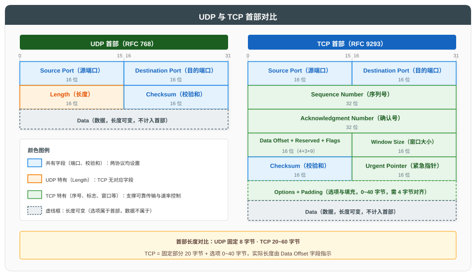
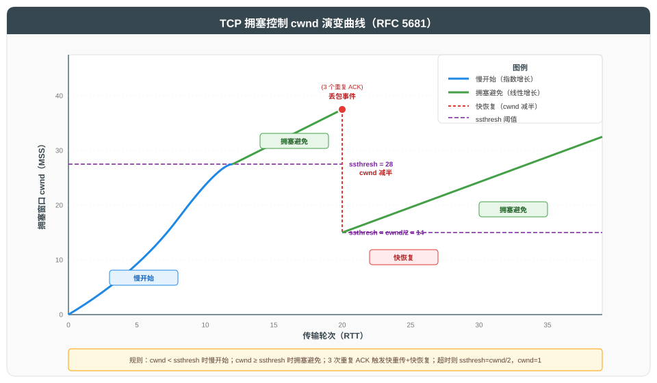

# 传输层 UDP 与 TCP

## 一、概述

传输层位于应用层与网络层之间，核心职责是为**进程间**通信提供端到端的数据传输服务。本文遵循"总分循序渐进"原则，先总述传输层功能，再依次展开 UDP、TCP 及其关键机制。

| 功能 | 说明 |
|------|------|
| **端口复用** | 通过端口号区分同一主机上的多个应用进程 |
| **分段重组** | 将应用层数据分段，目的端按序重组 |
| **差错控制** | 校验和检测传输错误 |
| **可靠传输** | TCP 通过确认重传保证可靠（UDP 不保证） |
| **流量控制** | TCP 通过滑动窗口匹配接收方处理能力 |
| **拥塞控制** | TCP 通过 cwnd 控制发送速率，避免网络拥塞 |

### 1.1 端口与复用

端口是传输层标识应用进程的 16 位数字，范围 0~65535。

| 端口范围 | 类别 | 说明 |
|----------|------|------|
| 0~1023 | 知名端口（Well-known） | IANA 分配给标准服务（如 HTTP=80, DNS=53） |
| 1024~49151 | 注册端口（Registered） | 应用可向 IANA 注册 |
| 49152~65535 | 动态端口（Dynamic） | 客户端临时使用 |

> TCP 连接通过四元组（源 IP, 源端口, 目的 IP, 目的端口）唯一标识；UDP 套接字通常由二元组（目的 IP, 目的端口）标识。

---

## 二、UDP 协议

### 2.1 UDP 特性

UDP（User Datagram Protocol，RFC 768）是无连接、不可靠、面向报文的传输层协议。

| 特性 | 说明 |
|------|------|
| **无连接** | 发送前无需建立连接 |
| **不可靠** | 不保证交付、不保证顺序、无重传 |
| **面向报文** | 应用层报文整体传输，不拆分也不合并 |
| **首部开销小** | 仅 8 字节 |
| **支持广播/组播** | 适合一对多通信 |

### 2.2 UDP 首部

UDP 首部共 8 字节，字段如下：

| 字段 | 长度 | 说明 |
|------|------|------|
| **Source Port** | 16 位 | 源端口，可选（全 0 表示无源端口） |
| **Destination Port** | 16 位 | 目的端口 |
| **Length** | 16 位 | UDP 报文总长度（首部+数据），最小 8 |
| **Checksum** | 16 位 | 校验和，覆盖伪首部+首部+数据；IPv4 可选全 0 |

### 2.3 UDP 伪首部

UDP 校验和计算时需附加 12 字节伪首部，包含源/目的 IP、协议号（17）、UDP 长度，用于校验数据是否送达正确目的端。

| 字段 | 长度 |
|------|------|
| 源 IP | 32 位 |
| 目的 IP | 32 位 |
| 0 | 8 位 |
| Protocol（17） | 8 位 |
| UDP Length | 16 位 |

### 2.4 UDP 应用场景

| 场景 | 依据 | 例子 |
|------|------|------|
| 实时音视频 | 容忍丢包，要求低时延 | WebRTC、RTP |
| 查询应答 | 请求小、响应快 | DNS、SNMP |
| 广播/组播 | 一对多 | IPTV、mDNS |
| 简单传输 | 应用层自管可靠性 | QUIC（HTTP/3） |

---

## 三、TCP 协议

### 3.1 TCP 特性

TCP（Transmission Control Protocol，RFC 9293）是面向连接、可靠、基于字节流的传输层协议。

| 特性 | 说明 |
|------|------|
| **面向连接** | 通信前三次握手建立连接，通信后四次挥手释放 |
| **可靠传输** | 通过序列号、确认、重传保证数据可靠送达 |
| **全双工** | 双方可同时发送和接收 |
| **面向字节流** | 数据以字节流形式传输，无消息边界 |
| **流量控制** | 滑动窗口匹配接收方能力 |
| **拥塞控制** | 动态调整发送速率避免网络拥塞 |

> TCP 连接管理（三次握手、四次挥手、状态转换）详见 [TCP 三次握手与四次挥手详解](../TCP%20三次握手与四次挥手详解.md)。本文重点展开可靠传输、流量控制与拥塞控制。

### 3.2 TCP 首部

TCP 首部最小 20 字节，字段如图所示（见上方对比图）。

**关键字段说明**：

| 字段 | 长度 | 说明 |
|------|------|------|
| **Sequence Number** | 32 位 | 序列号，标识字节流位置；ISN 随机生成 |
| **Acknowledgment Number** | 32 位 | 确认号，期望收到的下一字节序号 |
| **Data Offset** | 4 位 | 首部长度，单位 4 字节 |
| **Flags** | 9 位 | 控制标志位（SYN/ACK/FIN/RST/PSH/URG/ECE/CWR/NS） |
| **Window Size** | 16 位 | 接收窗口，告知发送方本端可接收字节数 |
| **Checksum** | 16 位 | 校验和，覆盖伪首部+首部+数据 |
| **Urgent Pointer** | 16 位 | 紧急数据指针（URG=1 时有效） |

---

## 四、TCP 可靠传输机制

### 4.1 序列号与确认

TCP 通过序列号实现按序交付与去重：

| 机制 | 说明 |
|------|------|
| **字节流编号** | 每字节有序列号，首字节序号为 ISN+1 |
| **累积确认** | ACK 号表示"此前所有字节已收到"，如 ACK=1001 表示序号 1000 及之前已收到 |
| **选择性确认（SACK）** | RFC 2018，告知发送方已收到的非连续块，减少重传 |

### 4.2 重传机制

| 重传类型 | 触发条件 | 算法 |
|----------|----------|------|
| **超时重传** | RTO 内未收到 ACK | RFC 6298 RTO 计算 |
| **快重传** | 收到 3 个重复 ACK | RFC 5681，无需等待超时 |

### 4.3 RTO 计算（RFC 6298）

TCP 维护平滑往返时延 SRTT 与往返时延偏差 RTTVAR：

| 步骤 | 公式 | 说明 |
|------|------|------|
| 首次测量 | SRTT = R, RTTVAR = R/2 | R 为首次 RTT |
| 后续测量 | RTTVAR = (1-β)×RTTVAR + β×\|SRTT-R\| | β=1/4 |
| | SRTT = (1-α)×SRTT + α×R | α=1/8 |
| RTO | RTO = SRTT + max(G, 4×RTTVAR) | G 为时钟粒度 |
| 下限 | RTO ≥ 1 秒 | 避免过小导致误重传 |

> 初始 RTO 为 1 秒；若 SYN 重传，下一次 RTO 翻倍（指数退避）。

---

## 五、TCP 流量控制

### 5.1 滑动窗口

流量控制由接收方通过 Window Size 字段通告，发送方据此调整发送窗口：

| 机制 | 说明 |
|------|------|
| **接收窗口 rwnd** | 接收方在 ACK 中通告剩余缓冲区大小 |
| **发送窗口** | min(rwnd, cwnd)，限制在途未确认字节数 |
| **窗口滑动** | 收到 ACK 后左边界右移，新数据进入窗口 |
| **零窗口探测** | rwnd=0 时发送方定期发送 1 字节探测，避免死锁 |

### 5.2 窗口通告与糊涂窗口综合征

| 问题 | 原因 | 解决方案 |
|------|------|----------|
| **发送方糊涂窗口** | 应用层数据小块产生，导致小报文 | Nagle 算法：小数据缓存，待 ACK 或凑够 MSS 再发 |
| **接收方糊涂窗口** | 缓冲区刚释放一点就通告 | Clark 算法：仅当可通告窗口 ≥ MSS 或缓冲区空时才通告 |

> Nagle 算法与延迟 ACK 可能产生交互延迟，对时延敏感场景（如 SSH、游戏）通常禁用 Nagle（设置 TCP_NODELAY）。

---

## 六、TCP 拥塞控制

拥塞控制由发送方自主控制发送速率，避免网络过载。核心是维护拥塞窗口 cwnd，实际发送窗口 = min(rwnd, cwnd)。

### 6.1 四大算法（RFC 5681）

| 阶段 | 触发条件 | cwnd 变化 | 说明 |
|------|----------|-----------|------|
| **慢开始** | 连接初始或超时后 | 每收到 1 个 ACK，cwnd += 1 MSS | 指数增长（每 RTT 翻倍） |
| **拥塞避免** | cwnd ≥ ssthresh | 每 RTT，cwnd += 1 MSS | 线性增长，谨慎探测 |
| **快重传** | 收到 3 个重复 ACK | 立即重传丢失报文 | 不等超时 |
| **快恢复** | 快重传后 | ssthresh = cwnd/2；cwnd = ssthresh + 3 | 不回到慢开始，线性增长 |

**超时与快恢复的差异**：

| 事件 | ssthresh | cwnd | 进入阶段 |
|------|----------|------|----------|
| **超时** | cwnd/2 | 1 | 慢开始 |
| **3 次重复 ACK** | cwnd/2 | ssthresh + 3 | 快恢复 |

> 超时视为"严重拥塞"，cwnd 重置为 1；3 次重复 ACK 视为"轻度拥塞"，cwnd 减半即可。

### 6.2 拥塞控制算法演进

| 算法 | 年代 | 核心 | 标准 | 特点 |
|------|------|------|------|------|
| **Tahoe** | 1988 | 慢开始+拥塞避免+快重传 | - | 超时与丢包均回到慢开始 |
| **Reno** | 1990 | 引入快恢复 | RFC 5681 | 3 次重复 ACK 不回慢开始 |
| **NewReno** | 1995 | 改进快恢复处理多包丢失 | RFC 6582 | 一次 RTT 内恢复多个丢包 |
| **CUBIC** | 2008 | 三次函数曲线调整 cwnd | RFC 8312 | Linux 默认，适合高带宽 |
| **BBR** | 2016 | 基于带宽与 RTT 模型 | RFC 8888 | 不依赖丢包，时延更低 |

### 6.3 CUBIC 与 BBR 对比

| 维度 | CUBIC | BBR |
|------|-------|-----|
| **拥塞信号** | 丢包 | 带宽与 RTT 探测 |
| **cwnd 模型** | 三次函数 w(t)=C(t-K)³+W_max | 基于瓶颈带宽与最小 RTT |
| **缓冲区依赖** | 依赖路由器缓冲区填满才丢包 | 不依赖缓冲区 |
| **高带宽场景** | 表现好 | 表现优异 |
| **浅缓冲区场景** | 容易误判拥塞 | 稳定 |
| **部署现状** | Linux 2.6.19+ 默认 | Google 内部、CDN 广泛使用 |

---

## 七、UDP 与 TCP 对比

| 维度 | UDP | TCP |
|------|-----|-----|
| **连接性** | 无连接 | 面向连接 |
| **可靠性** | 不可靠 | 可靠（确认+重传） |
| **顺序性** | 不保证 | 保证按序交付 |
| **流量控制** | 无 | 滑动窗口 |
| **拥塞控制** | 无 | 多种算法 |
| **首部开销** | 8 字节 | 20+ 字节 |
| **传输效率** | 高 | 较低 |
| **通信方式** | 单播/广播/组播 | 仅单播 |
| **典型应用** | DNS、DHCP、视频流、QUIC | HTTP、SMTP、FTP、SSH |

---

## 八、参考资料

### 8.1 核心标准

| 标准 | 说明 |
|------|------|
| [RFC 768](https://www.rfc-editor.org/rfc/rfc768) | UDP 协议规范 |
| [RFC 9293](https://www.rfc-editor.org/rfc/rfc9293) | TCP 协议规范（取代 RFC 793） |
| [RFC 5681](https://www.rfc-editor.org/rfc/rfc5681) | TCP 拥塞控制 |
| [RFC 6298](https://www.rfc-editor.org/rfc/rfc6298) | TCP RTO 计算 |
| [RFC 2018](https://www.rfc-editor.org/rfc/rfc2018) | TCP SACK 选择性确认 |
| [RFC 8312](https://www.rfc-editor.org/rfc/rfc8312) | CUBIC 拥塞控制 |
| [RFC 8888](https://www.rfc-editor.org/rfc/rfc8888) | BBR 拥塞控制 |
| [RFC 7323](https://www.rfc-editor.org/rfc/rfc7323) | TCP 窗口缩放选项 |

### 8.2 延伸阅读

| 资源 | 说明 |
|------|------|
| [TCP 三次握手与四次挥手详解](../TCP%20三次握手与四次挥手详解.md) | 本系列 TCP 连接管理专题 |
| [HTTPS 原理与 TLS 握手详解](../HTTPS%20原理与%20TLS%20握手详解.md) | 基于 TCP 的安全层 |
| 《TCP/IP 详解 卷一》W. Richard Stevens | 协议经典教材 |
| [BBR 论文](https://research.google/pubs/pub45646/) | Google BBR 算法原始论文 |
