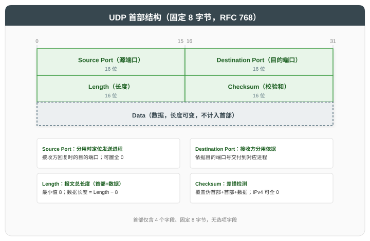
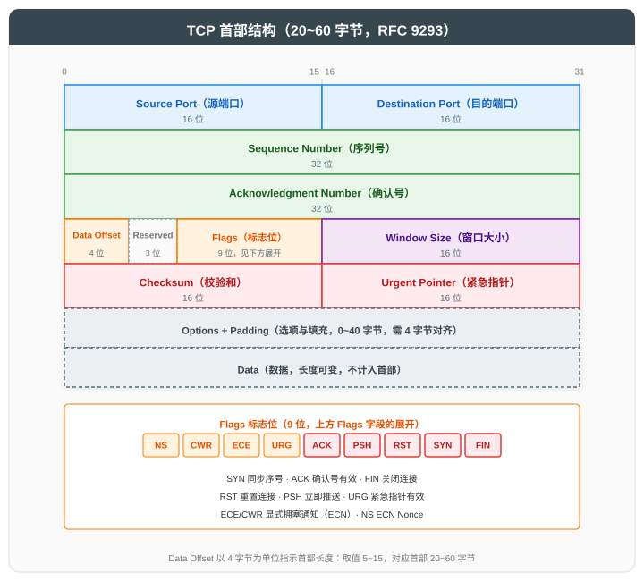

# 传输层及 UDP 与 TCP 协议

## 一、概述

传输层位于应用层与网络层之间，核心职责是为**进程间**通信提供端到端的数据传输服务。传输层的协议数据单元（PDU）因协议而异：UDP 为**用户数据报（User Datagram）**，TCP 为**报文段（Segment）**。本文遵循"总分循序渐进"原则：先总述传输层功能，再分别展开 UDP 与 TCP（含 TCP 的可靠传输、流量控制与拥塞控制机制），最后对比总结。

| 功能 | 说明 |
|------|------|
| **复用与分用** | 发送方汇集多个应用进程的数据交由网络层发送；接收方依据端口号将数据交付给对应的应用进程 |
| **分段重组** | 将应用层数据分段，目的端按序重组 |
| **差错控制** | 通过校验和检测数据在传输过程中是否发生差错 |
| **可靠传输** | TCP 通过确认重传保证可靠（UDP 不保证） |
| **流量控制** | TCP 通过滑动窗口匹配接收方处理能力 |
| **拥塞控制** | TCP 通过 cwnd 控制发送速率，避免网络拥塞 |

### 1.1 端口、复用与分用

端口是传输层标识应用进程的 16 位数字，范围 0~65535，是实现复用与分用的基础。

| 端口范围 | 类别 | 说明 |
|----------|------|------|
| 0~1023 | 知名端口（Well-known） | IANA 分配给标准服务（如 HTTP=80, DNS=53） |
| 1024~49151 | 注册端口（Registered） | 应用可向 IANA 注册 |
| 49152~65535 | 动态端口（Dynamic） | 客户端临时使用 |

复用与分用互为逆过程：复用是发送方向的汇合，同一主机的多个应用进程共用一个 IP 地址发送数据；分用是接收方向的分发，将到达的报文依据端口交付给对应的应用进程。

**复用（发送方向）**：同一主机上的多个应用进程各自拥有绑定端口号的套接字，应用数据经各自套接字进入传输层，封装后交给网络层，经同一 IP 地址发送。报文首部中的源端口即发送套接字的端口号，其确定方式分为两种：服务端进程需要客户端预先知晓端口才能被访问，故绑定固定的知名端口或注册端口；客户端进程的端口无需对端预知，服务器将响应发往报文中的源端口即可送达，故由操作系统从动态端口范围自动分配临时端口。

**分用（接收方向）**：报文到达目的主机后，网络层将数据交付给传输层，由于 IP 首部不含端口信息，网络层无法区分数据属于哪个进程，因此分用由传输层依据报文首部中的端口信息完成，将数据交付给对应的应用进程。定位套接字的依据因协议而异：UDP 无连接，套接字通常由二元组（目的 IP, 目的端口）标识，目的地址匹配的报文无论来自哪个源端，均进入同一套接字；TCP 面向连接，服务器的同一端口需同时服务多个客户端连接，仅凭目的端口无法区分连接；且不同客户端可能使用相同的源端口，仅凭目的端口与源端口的组合仍无法区分连接，故每条连接由四元组（源 IP, 源端口, 目的 IP, 目的端口）唯一标识，报文按四元组交付给对应连接的套接字。

---

## 二、UDP 协议

### 2.1 UDP 特性

UDP（User Datagram Protocol，[RFC 768](https://www.rfc-editor.org/rfc/rfc768)）是无连接、不可靠、面向报文的传输层协议。

| 特性 | 说明 |
|------|------|
| **无连接** | 发送前无需握手，不维护连接状态 |
| **不可靠** | 不确认、不重传、不保证按序，尽力而为交付 |
| **面向报文** | 应用层报文整体传输，不拆分也不合并，保留消息边界 |
| **首部开销小** | 仅 8 字节 |
| **支持广播/组播** | 适合一对多通信 |

这些特性围绕同一设计目标：在网络层的主机间交付能力之上，以最小开销提供进程间通信。各特性由这一目标派生：

- **不可靠是设计取舍的起点**：不确认、不重传、不保证按序，省去可靠性机制的处理开销与等待时延；
- **无连接由不可靠派生**：确认与重传要求双方预先协商并维护状态，既然不确认、不重传，握手与连接状态一并省去；
- **支持广播/组播由无连接派生**：通信不绑定单一对端，一份报文可同时发往多个目的地址；
- **面向报文直接服务于最小开销**：应用层报文整体收发，不拆分不合并，省去分段重组的处理；
- **首部开销小直接服务于最小开销**：无需承载序列号、确认号、窗口等字段，4 个字段共 8 字节即可（见 2.2 节）。

代价是 UDP 不弥补任何网络缺陷：报文可能丢失、重复或乱序。应用能否使用 UDP，取决于其能否容忍或弥补这三类缺陷（见 2.4 节）。

### 2.2 UDP 首部

UDP 首部固定 8 字节，仅含 4 个字段：

| 字段 | 长度 | 说明 |
|------|------|------|
| **Source Port** | 16 位 | 源端口，接收方回复时的目的端口；无需回复时可全 0 |
| **Destination Port** | 16 位 | 目的端口，接收方分用的依据 |
| **Length** | 16 位 | UDP 报文总长度（首部+数据），最小值 8；数据长度 = Length − 8 |
| **Checksum** | 16 位 | 校验和，覆盖伪首部+首部+数据（伪首部见 2.3 节） |

UDP 仅提供复用分用与差错检测两项传输层服务，4 个字段与之对应：

- **Source Port / Destination Port**：支撑复用分用（见 1.1 节）；
- **Checksum**：实现差错检测，计算范围含伪首部（见 2.3 节）；
- **Length**：界定报文总长度与数据边界，并与 IP 首部的总长度字段冗余，可交叉校验。

Checksum 的计算在 IPv4 中可选——全 0 表示未计算，早期实现为节省 CPU 开销而跳过；在 IPv6 中必须计算——IPv6 首部不再包含校验和字段，UDP 校验和成为唯一的端到端差错检测手段。

### 2.3 UDP 伪首部

UDP 校验和的计算范围除首部与数据外，还需在报文前临时拼接一个 12 字节的伪首部（Pseudo Header）：

| 字段 | 长度 | 说明 |
|------|------|------|
| 源 IP 地址 | 32 位 | 取自 IP 首部 |
| 目的 IP 地址 | 32 位 | 取自 IP 首部 |
| 全 0（填充） | 8 位 | 填充位，恒为全 0，仅用于将伪首部补齐至 12 字节（32 位的整数倍），不承载信息 |
| Protocol | 8 位 | 协议号，UDP 为 17 |
| UDP Length | 16 位 | UDP 报文总长度（首部+数据） |

伪首部的引入与命名各有一个缘由：

- **为何需要伪首部**：若校验和只覆盖 UDP 首部与数据，则报文因 IP 首部损坏而误投到其他主机时，校验和仍然匹配，错误无从发现。将源/目的 IP 与协议号纳入校验范围后，误投报文在接收端按（错误的）地址计算出的校验和必然与发送端不符，报文被丢弃。校验和由此同时验证两件事：数据本身未损坏，且送达了正确的目的主机与协议栈。
- **为何称为"伪"首部**：伪首部只在计算校验和时临时拼接于 UDP 报文之前，既不随报文实际传输，也不占用 UDP 报文的任何字节。

### 2.4 UDP 应用场景

各类应用选择 UDP 的缘由不同，但均为 UDP 的某一特性与场景需求恰好匹配：

| 场景 | 选择 UDP 的缘由 | 例子 |
|------|----------------|------|
| 实时音视频 | 时延敏感且容忍丢包：重传的数据到达时已失去价值，确认与重传机制反而增加时延 | WebRTC、RTP |
| 查询应答 | 交互轻量：单次请求的数据量小，TCP 握手的时延开销相对过大，丢失后应用层重试即可 | DNS、SNMP |
| 广播/组播 | 一对多通信：TCP 连接是点对点的，无法广播或组播 | IPTV、mDNS |
| 新传输协议载体 | 需绕开 TCP 的演进约束：TCP 实现于操作系统内核，新特性需等待各系统逐一升级；另建新传输协议则需分配新的 IP 协议号（IP 首部以协议号标识上层协议），而 NAT 与防火墙通常仅放行 TCP 与 UDP 报文，新协议无法穿透部署。故 QUIC 以 UDP 为载体，在用户空间重建可靠传输与拥塞控制 | QUIC（HTTP/3） |

---

## 三、TCP 协议

### 3.1 TCP 特性

TCP（Transmission Control Protocol，[RFC 9293](https://www.rfc-editor.org/rfc/rfc9293)）是面向连接、可靠、基于字节流的传输层协议。

| 特性 | 说明 |
|------|------|
| **面向连接** | 通信前三次握手建立连接，通信后四次挥手释放 |
| **可靠传输** | 通过序列号、确认、重传保证数据可靠送达 |
| **全双工** | 双方可同时发送和接收 |
| **面向字节流** | 数据以字节流形式传输，无消息边界 |
| **流量控制** | 滑动窗口匹配接收方能力 |
| **拥塞控制** | 动态调整发送速率避免网络拥塞 |

这些特性围绕同一设计目标：在网络状况不确定的网络层之上，可靠地交付字节流。各特性由这一目标派生：

- **可靠传输是目标本身**：数据不丢失、不重复、按序到达；
- **面向连接由可靠派生**：确认与重传要求双方预先协商初始序列号并维护状态，协商过程即三次握手；
- **全双工由面向连接派生**：连接的两个方向各自独立维护序列号与窗口，双方可同时发送与接收；
- **面向字节流是数据模型**：以字节为单位编号与确认，报文段可灵活切分；消息边界不保留，界定由应用层负责；
- **流量控制与拥塞控制保障交付可持续**：重传会放大注入网络的流量，若不约束发送速率，接收方与网络都可能过载，可靠交付反而不可持续（分别见 3.4、3.5 节）。

> TCP 连接管理（三次握手、四次挥手、状态转换）详见 [TCP 三次握手与四次挥手详解](../TCP%20三次握手与四次挥手详解.md)。本文重点展开可靠传输、流量控制与拥塞控制。

### 3.2 TCP 首部

TCP 首部长度在 20~60 字节之间：固定部分 20 字节，选项最多 40 字节。字段如下：

| 字段 | 长度 | 说明 |
|------|------|------|
| **Source / Destination Port** | 各 16 位 | 源端口与目的端口，复用分用的依据 |
| **Sequence Number** | 32 位 | 序列号，标识字节流位置；ISN 随机生成 |
| **Acknowledgment Number** | 32 位 | 确认号，期望收到的下一字节序号 |
| **Data Offset** | 4 位 | 首部长度，单位 4 字节，取值 5~15 对应 20~60 字节 |
| **Flags** | 9 位 | 控制标志位（SYN/ACK/FIN/RST/PSH/URG/ECE/CWR/NS） |
| **Window Size** | 16 位 | 接收窗口，告知发送方本端可接收字节数 |
| **Checksum** | 16 位 | 校验和，覆盖伪首部+首部+数据（伪首部见 2.3 节，协议号为 6） |
| **Urgent Pointer** | 16 位 | 紧急数据指针（URG=1 时有效） |
| **Options + Padding** | 0~40 字节 | 选项（如 MSS、窗口缩放、SACK）及填充，需 4 字节对齐 |

与 UDP 相比，TCP 多出的字段与其机制一一对应：

- **Sequence Number / Acknowledgment Number / Flags**：支撑可靠传输（见 3.3 节）；
- **Window Size**：支撑流量控制（见 3.4 节）；
- **Options + Padding**：承载 MSS 协商、窗口缩放、SACK 等扩展能力。

### 3.3 TCP 可靠传输机制

TCP 的可靠传输由三部分协同实现：序列号与确认使接收方能够按序重组并去重，重传机制弥补丢失的报文段，RTO 计算决定重传时机。

#### 3.3.1 序列号与确认

TCP 通过序列号实现按序交付与去重：

| 机制 | 说明 |
|------|------|
| **字节流编号** | 每字节对应一个序号，整个字节流从 ISN 起逐字节编号 |
| **累积确认** | ACK 号为期望收到的下一字节序号：ACK=1001 表示序号 1000 及之前已收到，1001 起尚未收到 |
| **选择性确认（SACK）** | [RFC 2018](https://www.rfc-editor.org/rfc/rfc2018)，接收方通告已收到的不连续块，发送方仅重传缺失的报文段 |

补充说明：

- **序列号如何累加**：逐字节加 1——报文段首部的序列号即该段首个数据字节的序号，下一报文段的序列号 = 本段序列号 + 本段携带的数据字节数。按字节而非按报文段（每段加 1）编号，使序号与数据的对应关系不受报文段划分的影响：无论数据如何被切分为报文段（或重传时重新切分），同一字节始终对应同一序号，接收方按序号即可还原字节流的原始顺序；
- **ISN 如何确定**：ISN（Initial Sequence Number，初始序列号）在握手时随机选定，并被 SYN 报文段占用，首个数据字节的序号因此为 ISN+1；
- **ACK 号为何是"期望收到的下一字节"**：该约定使 ACK 号直接成为发送方继续发送的起始位置——收到 ACK=1001 即从 1001 起发送，无需换算；若 ACK 号表示最后收到的字节序号，发送方还需自行加一才能得到发送位置；
- **SACK 为何能减少重传**：每个到达的报文段通常都会触发一个 ACK（延迟 ACK 机制可能合并相邻的确认），但累积确认要求 ACK 号之前的字节全部收到，ACK 号因此只能停留在首个空洞的起点。设发送方连续发出 5 个报文段，第 2、4 个丢失、第 1、3、5 个到达：第 1 个到达后 ACK 号推进至第 2 个的起始序号；第 3、5 个随后乱序到达，但第 2 个未到，ACK 号无法越过该空洞推进，触发的 ACK 号与此前相同（即重复 ACK，3.3.2 节快重传的触发信号）。"第 3、5 个已到"的信息无法通过 ACK 号传回，发送方只能从第 2 个起全部重发，第 3、5 个被重复发送。SACK 将已收到的不连续块（第 3、5 个）的起止序号写入 TCP 选项一并通告，发送方据此仅重传真正缺失的第 2、4 个。

#### 3.3.2 重传机制

丢失的报文段依靠重传弥补，触发重传的方式有两种：

| 重传类型 | 触发条件 | 算法 |
|----------|----------|------|
| **超时重传** | RTO 内未收到 ACK | [RFC 6298](https://www.rfc-editor.org/rfc/rfc6298) RTO 计算 |
| **快重传** | 收到 3 个重复 ACK | [RFC 5681](https://www.rfc-editor.org/rfc/rfc5681)，无需等待超时 |

#### 3.3.3 RTO 计算（[RFC 6298](https://www.rfc-editor.org/rfc/rfc6298)）

RTO（Retransmission Timeout，重传超时）指发出报文段后等待 ACK 的时间上限，超时未确认即触发重传（见 3.3.2 节超时重传）。其取值面临两难：小于 RTT 会误重传，过大则恢复迟缓，因此需基于实测 RTT 动态计算。TCP 维护平滑往返时延 SRTT 与往返时延偏差 RTTVAR：

| 步骤 | 公式 | 说明 |
|------|------|------|
| 首次测量 | SRTT = R, RTTVAR = R/2 | R 为首次 RTT |
| 偏差更新 | RTTVAR = (1-β)×RTTVAR + β×\|SRTT-R\| | β=1/4 |
| 平滑更新 | SRTT = (1-α)×SRTT + α×R | α=1/8 |
| RTO | RTO = SRTT + max(G, 4×RTTVAR) | G 为时钟粒度 |
| 下限 | RTO ≥ 1 秒 | 避免过小导致误重传 |

> 初始 RTO 为 1 秒；若 SYN 重传，下一次 RTO 翻倍（指数退避）。

### 3.4 TCP 流量控制

可靠传输只保证数据最终到达，不约束发送速率：若发送速率超过接收方的处理能力，接收缓冲区溢出，已到达的数据反而丢失。流量控制针对这一问题，使发送速率与接收方的处理能力相匹配。

#### 3.4.1 滑动窗口

发送方任一时刻的在途未确认数据量不得超过发送窗口，而发送窗口由两个窗口中较小者决定：

- **rwnd（receive window，接收窗口）**：接收方剩余缓冲区的大小，由接收方通过 ACK 的 Window Size 字段通告——流量控制的对象（本节）；
- **cwnd（congestion window，拥塞窗口）**：发送方依据网络拥塞程度自主维护的窗口大小——拥塞控制的对象（见 3.5 节）。

发送窗口 = min(rwnd, cwnd)：既不超过接收方的处理能力，也不超过网络的承载能力。窗口的运行机制如下：

| 机制 | 说明 |
|------|------|
| **窗口通告** | 接收方将当前 rwnd 写入 ACK 的 Window Size 字段，发送方据此更新发送窗口 |
| **窗口滑动** | 发送方收到 ACK 后，发送窗口整体右移：左边界右移越过新近确认的字节，窗口大小不变使右边界随之右移，右端腾出的空间允许新数据进入 |
| **零窗口探测** | rwnd=0 时发送方定期发送 1 字节探测，避免双方互相等待的死锁 |

#### 3.4.2 窗口通告与糊涂窗口综合征

滑动窗口若逐字节地通告与发送，效率会显著下降：TCP 首部至少 20 字节，报文段携带的数据越少，首部占比越高，有效传输效率越低；大量小报文段也会加重网络与收发双方的处理负担。这种低效现象可能由发送方或接收方任一侧的行为引发，称为**糊涂窗口综合征（Silly Window Syndrome，SWS）**：滑动窗口机制运行良好，但窗口每次只容纳或通告很小的数据量，报文段因此始终"小而不绝"。衡量报文段大小的基准是 MSS（Maximum Segment Size，最大报文段长度）：单个报文段可携带的最大数据字节数（不含首部），在建立连接时通过 TCP 选项协商确定。SWS 的两类典型诱因及其对策如下：

| 问题 | 原因 | 解决方案 |
|------|------|----------|
| **发送方糊涂窗口** | 应用层数据小块产生，导致小报文 | Nagle 算法：小数据先缓存，待在途数据被确认或攒够 MSS 再发 |
| **接收方糊涂窗口** | 缓冲区刚释放一点就通告 | Clark 算法：仅当可通告窗口 ≥ MSS 或缓冲区空时才通告 |

补充说明：

- **Nagle 算法的完整约束**：只要仍有未被确认的数据在途，后续到达的小数据一律缓存；在途数据均被确认（收到其 ACK）或缓存攒够 MSS 时，缓存的数据方可发出；若无未被确认的数据在途，小数据可直接发送。效果是任意时刻至多一个小报文段在途，小报文段不再密集出现；
- **延迟 ACK**：接收方的另一项独立机制。纯 ACK 报文段不携带任何数据，首部占比达百分之百，是小报文段的极端情形；每个到达的报文段通常都会触发一个 ACK（见 3.3.1 节），若接收方收到即回，纯 ACK 报文段将随之密集出现。延迟 ACK 令接收方不立即回复，短暂等待（[RFC 1122](https://www.rfc-editor.org/rfc/rfc1122) 规定不超过 0.5 秒）以捎带反向数据或累积确认后续到达的报文段，从而减少纯 ACK 报文段的数量；
- **两者的交互延迟**：启用 Nagle 的发送方要等在途小报文段的 ACK 才肯发送缓存的数据，接收方又因延迟 ACK 暂缓发出该确认——双方互相等待，缓存的数据直至延迟 ACK 超时才得以发出。时延敏感场景（如 SSH、游戏）通常禁用 Nagle（设置 TCP_NODELAY）。

### 3.5 TCP 拥塞控制

流量控制只保护接收方，未考虑网络的承载能力：当所有连接的注入速率总和超过网络容量时，路由器缓冲区耗尽并大量丢包，所有连接的性能同时下降。拥塞控制针对这一问题，由发送方自主控制发送速率，避免网络过载：其核心手段是调整 cwnd，经发送窗口 = min(rwnd, cwnd) 的关系（见 3.4.1 节）约束实际发送的数据量。

#### 3.5.1 四大算法（[RFC 5681](https://www.rfc-editor.org/rfc/rfc5681)）

TCP 拥塞控制的基本框架由四个算法构成：**慢开始**、**拥塞避免**、**快重传**与**快恢复**。发送方无法直接观测网络内部的拥塞程度，只能依据丢包引发的两类间接信号推断：**超时**——RTO 到期仍未收到 ACK（见 3.3.3 节）；**重复 ACK**——后续报文段乱序到达的标志（见 3.3.1 节）。四个算法依据信号的类型与严重程度调整 cwnd，典型演变过程如下图：

| 阶段 | 触发条件 | cwnd 变化 | 说明 |
|------|----------|-----------|------|
| **慢开始** | 连接初始或超时后 | 每收到 1 个 ACK，cwnd += 1 MSS | 每 RTT 翻倍，指数增长 |
| **拥塞避免** | cwnd ≥ ssthresh | 每 RTT，cwnd += 1 MSS | 线性增长，谨慎探测 |
| **快重传** | 收到 3 个重复 ACK | 立即重传丢失的报文段 | 不等 RTO 到期 |
| **快恢复** | 快重传后 | ssthresh = cwnd/2，cwnd = ssthresh + 3 | 不回慢开始，继续线性增长 |

各阶段与取值的因果说明如下：

- **ssthresh 的含义与更新**：ssthresh（slow start threshold，慢开始门限）是划分两种增长模式的 cwnd 界限——低于门限时按慢开始指数增长，达到门限后转入拥塞避免线性增长。初始取值较高，此后每次判定拥塞都更新为当时 cwnd 的一半，作为下一次逼近容量的谨慎起点；
- **ACK 与 RTT 的数量关系**：发送窗口内的每个报文段各触发一个 ACK，约在一个 RTT 后返回；因此某轮次发出 cwnd 个报文段，下一轮次便收到约 cwnd 个 ACK。这一对应关系是理解两种增长模式的基准；
- **慢开始为何指数增长**：设某轮次 cwnd = N MSS，则该轮发出 N 个报文段，下一轮返回 N 个 ACK；慢开始阶段每个 ACK 使 cwnd += 1 MSS，cwnd 恰好翻倍为 2N。每 RTT 翻倍即指数增长——远低于门限时以最快速度爬升；
- **拥塞避免为何线性增长**：达到门限后，每个 ACK 的增量从 1 MSS 缩小为约 1/cwnd MSS，一轮 cwnd 个 ACK 累计仅使 cwnd 增加约 1 MSS——逼近未知容量时放缓脚步，即使引发丢包，损失也被控制在最小；在 RFC 5681 的实现中，cwnd 以字节为单位，SMSS 定义为发送方最大报文段长度，实践中等于连接协商的 MSS，那么每个 ACK 增量 = SMSS ÷ (cwnd/SMSS) = SMSS×SMSS/cwnd 个字节，而每轮 ACK 的个数 = cwnd/SMSS，那么拥塞避免线性增长的算式为：每 ACK 增量 × ACK 个数 = SMSS×SMSS/cwnd × cwnd/SMSS = 1 SMSS（1 MSS），符合线性增长的要求。
- **快重传为何以 3 个重复 ACK 为判据**：重复 ACK 也可能源于报文段乱序（迟到而非丢失），一两个重复 ACK 不足以断定丢失；收到 3 个重复 ACK，意味着其后至少三个报文段已到达接收端，而夹在中间的报文段仍未出现，丢失的把握足够大（RFC 5681 将该阈值 dupthresh 定为 3）；
- **快重传为何不等超时**：3 个重复 ACK 本身已是丢失的充分证据，而 RTO 为避免误重传取得保守（不小于 1 秒，见 3.3.3 节）；证据在手仍等待超时，只会让接收方空等；
- **快恢复为何取 ssthresh + 3**：3 个重复 ACK 同时表明其后三个报文段已被接收——这三个报文段已离开网络，腾出了等量的注入空间，故 cwnd 在新 ssthresh（原值一半）的基础上加 3（RFC 5681 称为窗口膨胀），降速而不断流。

两类拥塞信号的处置差异汇总如下：

| 信号 | 拥塞程度推断 | ssthresh | cwnd | 其后阶段 |
|------|--------------|----------|------|----------|
| **超时** | 连重复 ACK 都未返回，反馈近乎中断——严重拥塞 | cwnd/2 | 1 MSS | 慢开始（指数增长） |
| **3 个重复 ACK** | 后续报文段仍在到达，网络仍在转发——轻度拥塞 | cwnd/2 | ssthresh + 3 | 拥塞避免（线性增长） |

#### 3.5.2 拥塞控制算法演进

四大算法并非一次成型：Tahoe（1988）提出慢开始、拥塞避免与快重传，对丢包——无论超时还是重复 ACK——一律重回慢开始；Reno（1990）补入快恢复，两类信号得以区别处置，构成 3.5.1 节所述的完整框架。此后的演进先后集中于两个方向：恢复策略上，NewReno（1995）改进快恢复，同一窗口内多处丢失时无需逐处等待新的重复 ACK；速率模型上，CUBIC（2008）改进 cwnd 的增长函数，BBR（2016）则更换拥塞信号本身。

| 算法 | 年代 | 演进方向 | 核心改进 | 标准 |
|------|------|----------|----------|------|
| **Tahoe** | 1988 | 框架奠基 | 提出慢开始、拥塞避免与快重传；丢包一律重回慢开始 | - |
| **Reno** | 1990 | 框架补全 | 补入快恢复，3 个重复 ACK 不再重回慢开始 | [RFC 5681](https://www.rfc-editor.org/rfc/rfc5681) |
| **NewReno** | 1995 | 恢复策略 | 同一窗口多处丢失时逐个重传恢复，无需逐处等待重复 ACK | [RFC 6582](https://www.rfc-editor.org/rfc/rfc6582) |
| **CUBIC** | 2008 | 速率模型 | cwnd 按时间的三次函数增长，临近上次拥塞时的窗口值放缓 | [RFC 9438](https://www.rfc-editor.org/rfc/rfc9438) |
| **BBR** | 2016 | 速率模型 | 拥塞信号弃用丢包，改由带宽与 RTT 测量直接计算发送速率 | [IETF 草案](https://datatracker.ietf.org/doc/draft-ietf-ccwg-bbr/) |

表中五个算法按拥塞信号可归入两条路线：Tahoe 至 CUBIC 一脉沿用丢包信号，BBR 则改以带宽与 RTT 测量判定拥塞，两条路线的对比见 3.5.3 节。

#### 3.5.3 CUBIC 与 BBR 对比

按拥塞信号的选择，拥塞控制算法划分为两条路线；同一路线内，算法先后演进，拥塞信号一脉相承：

- **丢包驱动路线**：自 Tahoe（1988）起，经 Reno、NewReno，至 CUBIC（2008）——历次演进改进的是框架、恢复策略与增长函数，拥塞信号始终是丢包；
- **测量驱动路线**：由 Vegas（1995）开创，以 RTT 增长为拥塞信号；BBR（2016）以带宽与 RTT 测量为拥塞信号，将此路线推向成熟。

CUBIC 与 BBR 分别是两条路线中部署最广的算法，本节以二者为例展开对比。丢包信号的局限在于丢包与拥塞并非一一对应，对应程度取决于路由器缓冲区的深度：

- **缓冲区浅**：网络远未饱和也可能偶发丢包，据此降速属于误判，链路利用率不必要地损失；
- **缓冲区深**：丢包发生前缓冲区已被填满、排队时延已大幅增长，此时才降速为时已晚。

> **网络饱和与丢包的关系**：饱和指注入速率达到瓶颈带宽（网络中带宽最小的链路的带宽）的状态，此时瓶颈处路由器的队列开始持续增长；丢包是队列溢出的结果，其出现时刻由缓冲区容量决定。因此缓冲区容量不改变饱和条件——注入速率达到瓶颈带宽，网络即进入饱和状态；容量仅决定从进入饱和到发生丢包的间隔，以及该间隔内排队时延的增长幅度。以 10 Mbps 的瓶颈链路（1.25 MB/s）为例：注入速率达到 10 Mbps 的瞬间，网络即进入饱和状态，与缓冲区容量无关；容量 1 MB 的缓冲区被填满后才开始丢包，此时队列中积压 1 MB 数据，排队时延为 1 MB ÷ 10 Mbps = 0.8 秒；容量 10 KB 的缓冲区约 8 ms 后即溢出丢包；即便注入速率未达到瓶颈带宽、网络并未饱和，一次瞬时到达的数据突发也可能超出缓冲区剩余容量而被丢弃。CUBIC 所依赖的丢包信号因此与缓冲区容量耦合。

BBR 针对这一局限改以带宽与 RTT 测量为拥塞信号：周期性测量瓶颈带宽与最小 RTT，将发送速率维持在二者的乘积——带宽时延积（Bandwidth-Delay Product，BDP）附近，既填满瓶颈链路，又不制造排队。两条路线的系统性对比如下：

| 维度 | CUBIC | BBR |
|------|-------|-----|
| **拥塞信号** | 丢包 | 带宽与 RTT 测量 |
| **cwnd 模型** | 三次函数 w(t)=C(t-K)³+W_max | 瓶颈带宽 × 最小 RTT（BDP） |
| **缓冲区依赖** | 强：拥塞判定受缓冲区深浅左右，表现在深浅不同的网络间差异大 | 弱：以 RTT 变化为观测对象，主动避免排队，不随缓冲区深浅波动 |
| **高带宽长距离** | 增长快，表现好 | 表现优异 |
| **浅缓冲区** | 易将偶发丢包误判为拥塞 | 稳定 |
| **深缓冲区** | 降速迟缓，时延已恶化 | 稳定 |
| **部署现状** | Linux 2.6.19+ 默认 | Google 内部与 CDN 广泛使用 |

### 3.6 TCP 应用场景

适合 TCP 的应用同时满足两个条件：

- 数据完整性优先于时延——内容缺一个字节即不可用；
- 通信为点对点——无需广播或组播。

| 场景 | 依据 | 例子 |
|------|------|------|
| 网页与邮件 | 内容不容忍丢失与乱序 | HTTP/HTTPS、SMTP |
| 文件传输 | 每个字节都必须完整到达 | FTP、SFTP |
| 远程终端 | 命令与输出需按序可靠到达 | SSH、Telnet |
| 数据库访问 | 事务数据不容忍差错 | MySQL、PostgreSQL 协议 |

---

## 四、UDP 与 TCP 对比

两者的首部结构对比如下图，整体对比如下表：

| 维度 | UDP | TCP |
|------|-----|-----|
| **连接性** | 无连接 | 面向连接 |
| **可靠性** | 不可靠 | 可靠（确认+重传） |
| **顺序性** | 不保证 | 保证按序交付 |
| **流量控制** | 无 | 滑动窗口 |
| **拥塞控制** | 无 | 多种算法 |
| **首部开销** | 8 字节 | 20+ 字节 |
| **传输效率** | 高 | 较低 |
| **通信方式** | 单播/广播/组播 | 仅单播 |
| **典型应用** | DNS、DHCP、视频流、QUIC | HTTP、SMTP、FTP、SSH |

---

## 五、参考资料

### 5.1 核心标准

| 标准 | 说明 |
|------|------|
| [RFC 768](https://www.rfc-editor.org/rfc/rfc768) | UDP 协议规范 |
| [RFC 9293](https://www.rfc-editor.org/rfc/rfc9293) | TCP 协议规范（取代 [RFC 793](https://www.rfc-editor.org/rfc/rfc793)） |
| [RFC 5681](https://www.rfc-editor.org/rfc/rfc5681) | TCP 拥塞控制 |
| [RFC 6298](https://www.rfc-editor.org/rfc/rfc6298) | TCP RTO 计算 |
| [RFC 2018](https://www.rfc-editor.org/rfc/rfc2018) | TCP SACK 选择性确认 |
| [RFC 9438](https://www.rfc-editor.org/rfc/rfc9438) | CUBIC 拥塞控制（取代 [RFC 8312](https://www.rfc-editor.org/rfc/rfc8312)） |
| [RFC 7323](https://www.rfc-editor.org/rfc/rfc7323) | TCP 窗口缩放选项 |

### 5.2 延伸阅读

| 资源 | 说明 |
|------|------|
| [TCP 三次握手与四次挥手详解](../TCP%20三次握手与四次挥手详解.md) | 本系列 TCP 连接管理专题 |
| [HTTPS 原理与 TLS 握手详解](../HTTPS%20原理与%20TLS%20握手详解.md) | 基于 TCP 的安全层 |
| 《TCP/IP 详解 卷一》W. Richard Stevens | 协议经典教材 |
| [BBR 论文](https://research.google/pubs/pub45646/) | Google BBR 算法原始论文 |
| [BBR 拥塞控制草案](https://datatracker.ietf.org/doc/draft-ietf-ccwg-bbr/) | BBR 算法规范（IETF Internet-Draft，尚未成为 RFC） |
