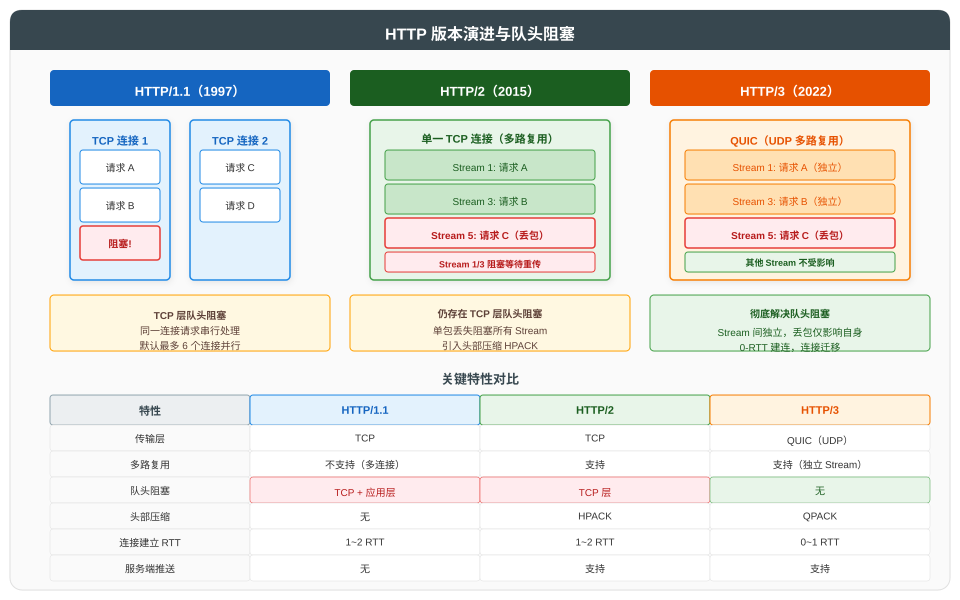

# 应用层及核心协议

## 一、概述

应用层位于网络体系结构最高层，直接为用户进程提供网络服务。应用层的协议数据单元（PDU）为**报文（Message）**。本文遵循"总分循序渐进"原则，先总述应用层协议分类，再依次展开 HTTP、DNS、DHCP、邮件协议与 FTP 等核心协议。

| 协议类别 | 代表协议 | 传输层依赖 | 说明 |
|----------|----------|------------|------|
| **Web** | HTTP/HTTPS | TCP | 万维网数据传输 |
| **名称解析** | DNS | UDP/TCP | 域名解析为 IP |
| **地址配置** | DHCP | UDP | 动态分配 IP 与配置 |
| **邮件** | SMTP/POP3/IMAP | TCP | 邮件发送与接收 |
| **文件传输** | FTP | TCP | 文件上传下载 |
| **远程登录** | SSH/Telnet | TCP | 远程命令行 |

---

## 二、HTTP 协议

### 2.1 HTTP 概述

HTTP（HyperText Transfer Protocol）是 Web 的核心协议，采用请求-响应模型。最新版本为 HTTP/3（RFC 9114）。

> HTTPS 即 HTTP over TLS，TLS 握手细节详见 [HTTPS 原理与 TLS 握手详解](../HTTPS%20原理与%20TLS%20握手详解.md)。本文聚焦 HTTP 协议本身。

### 2.2 HTTP 请求方法

| 方法 | 语义 | 安全 | 幂等 | 说明 |
|------|------|------|------|------|
| **GET** | 获取资源 | 是 | 是 | 不应产生副作用 |
| **POST** | 创建资源 | 否 | 否 | 请求体含数据 |
| **PUT** | 更新/创建资源 | 否 | 是 | 完整替换 |
| **DELETE** | 删除资源 | 否 | 是 | - |
| **PATCH** | 部分更新 | 否 | 否 | 仅更新指定字段 |
| **HEAD** | 获取首部 | 是 | 是 | 不返回响应体 |
| **OPTIONS** | 查询支持的方法 | 是 | 是 | 预检请求（CORS） |

> "安全"指不修改服务器资源；"幂等"指多次执行结果相同。

### 2.3 HTTP 状态码

| 类别 | 范围 | 含义 |
|------|------|------|
| 1xx | 100~101 | 信息性 |
| 2xx | 200~206 | 成功 |
| 3xx | 300~305 | 重定向 |
| 4xx | 400~415 | 客户端错误 |
| 5xx | 500~505 | 服务器错误 |

**常见状态码**：

| 状态码 | 名称 | 说明 |
|--------|------|------|
| 200 | OK | 请求成功 |
| 301 | Moved Permanently | 永久重定向 |
| 302 | Found | 临时重定向 |
| 304 | Not Modified | 资源未修改（缓存有效） |
| 400 | Bad Request | 请求语法错误 |
| 401 | Unauthorized | 未认证 |
| 403 | Forbidden | 拒绝访问 |
| 404 | Not Found | 资源不存在 |
| 500 | Internal Server Error | 服务器内部错误 |
| 502 | Bad Gateway | 网关错误 |
| 503 | Service Unavailable | 服务不可用 |

### 2.4 HTTP 版本演进

| 版本 | 年份 | 标准 | 关键特性 |
|------|------|------|----------|
| **HTTP/0.9** | 1991 | - | 仅 GET，纯文本 |
| **HTTP/1.0** | 1996 | RFC 1945 | 引入首部、状态码、多方法 |
| **HTTP/1.1** | 1997 | RFC 9112 | 持久连接、管道化、Host 头、分块传输 |
| **HTTP/2** | 2015 | RFC 9113 | 二进制分帧、多路复用、头部压缩（HPACK）、服务端推送 |
| **HTTP/3** | 2022 | RFC 9114 | 基于 QUIC（UDP），0-RTT 建连，彻底解决队头阻塞 |

### 2.5 队头阻塞问题

| 版本 | 队头阻塞位置 | 说明 |
|------|--------------|------|
| HTTP/1.1 | 应用层 + TCP 层 | 同一连接请求串行；多连接并行上限 6 |
| HTTP/2 | TCP 层 | 多路复用解决应用层阻塞，但 TCP 丢包阻塞所有 Stream |
| HTTP/3 | 无 | QUIC 基于 UDP，Stream 间独立，丢包仅影响自身 |

---

## 三、DNS 协议

### 3.1 DNS 概述

DNS（Domain Name System，RFC 1034/1035）是互联网的名称解析系统，采用层次化分布式数据库架构，将人类可读的域名解析为 IP 地址。

**层次结构**：

| 层级 | 示例 | 说明 |
|------|------|------|
| 根域 | `.` | 13 组根服务器（A~M） |
| 顶级域（TLD） | `.com`、`.cn`、`.org` | 分为 gTLD 与 ccTLD |
| 二级域 | `example.com` | 注册的域名 |
| 子域 | `www.example.com` | 由域名所有者划分 |

### 3.2 DNS 解析流程

**流程步骤**：

| 步骤 | 操作 | 查询类型 | 说明 |
|------|------|----------|------|
| ① | 浏览器查询本地缓存 | - | 命中则直接返回 |
| ② | 浏览器向本地 DNS 发起请求 | 递归 | 由本地 DNS 代为解析 |
| ③ | 本地 DNS 查询根服务器 | 迭代 | 根返回 TLD 地址 |
| ④ | 本地 DNS 查询 TLD 服务器 | 迭代 | TLD 返回权威地址 |
| ⑤ | 本地 DNS 查询权威服务器 | 迭代 | 权威返回最终 IP |
| ⑥ | 本地 DNS 返回结果给浏览器 | - | 并缓存结果 |

> **递归查询**：客户端仅发一次请求，由被查询方代为完成全部解析。
> **迭代查询**：被查询方返回下一级地址，由查询方自行再次查询。

### 3.3 DNS 记录类型

| 类型 | 名称 | 说明 |
|------|------|------|
| **A** | Address | 域名→IPv4 地址 |
| **AAAA** | IPv6 Address | 域名→IPv6 地址 |
| **CNAME** | Canonical Name | 域名别名 |
| **MX** | Mail Exchange | 邮件服务器 |
| **NS** | Name Server | 该域的权威服务器 |
| **TXT** | Text | 任意文本（SPF、DKIM 等） |
| **PTR** | Pointer | IP→域名（反向解析） |
| **SOA** | Start of Authority | 区域权威信息 |
| **SRV** | Service | 服务记录 |

### 3.4 DNS 传输协议

| 协议 | 端口 | 使用场景 |
|------|------|----------|
| UDP 53 | 默认 | 常规查询，响应 ≤512 字节 |
| TCP 53 | 备选 | 响应 >512 字节、区域传送 |
| DoT（DNS over TLS） | 853 | 加密 DNS 查询（RFC 7858） |
| DoH（DNS over HTTPS） | 443 | 基于 HTTPS 的 DNS（RFC 8484） |

---

## 四、DHCP 协议

### 4.1 DHCP 概述

DHCP（Dynamic Host Configuration Protocol，RFC 2131）基于 UDP（客户端 68、服务端 67），动态分配 IP 地址及网络配置。

### 4.2 DORA 四步流程

| 步骤 | 报文 | 方向 | 传输方式 | 说明 |
|------|------|------|----------|------|
| **D**iscover | DHCPDISCOVER | 客户端→广播 | 广播 | 客户端寻找 DHCP 服务器 |
| **O**ffer | DHCPOFFER | 服务器→客户端 | 广播 | 服务器提供 IP 候选 |
| **R**equest | DHCPREQUEST | 客户端→广播 | 广播 | 客户端正式请求该 IP（告知所有服务器） |
| **A**cknowledge | DHCPACK | 服务器→客户端 | 单播/广播 | 服务器确认分配，附租约信息 |

> 客户端在 Discover 阶段无 IP，故只能广播；Request 阶段广播是为了告知未被选中的服务器可回收候选 IP。

### 4.3 DHCP 租约管理

| 事件 | 触发时机 | 动作 |
|------|----------|------|
| **租约更新 T1** | 租约 50% | 客户端单播 DHCPREQUEST 续约 |
| **租约更新 T2** | 租约 87.5% | 客户端广播 DHCPREQUEST 续约 |
| **租约到期** | 100% | 客户端释放 IP，重新发起 DORA |
| **主动释放** | 客户端下线 | 发送 DHCPRELEASE |

---

## 五、邮件协议

### 5.1 邮件系统架构

| 角色 | 协议 | 端口 | 说明 |
|------|------|------|------|
| **MUA**（邮件客户端） | SMTP/IMAP/POP3 | - | Outlook、Thunderbird |
| **MTA**（邮件传输代理） | SMTP | 25/587 | 服务器间转发 |
| **MDA**（邮件投递代理） | IMAP/POP3 | 143/110 | 投递至用户邮箱 |

### 5.2 SMTP/POP3/IMAP 对比

| 协议 | 全称 | 端口 | 方向 | 特性 |
|------|------|------|------|------|
| **SMTP** | Simple Mail Transfer Protocol | 25/465/587 | 发送 | 推送模式，TCP |
| **POP3** | Post Office Protocol v3 | 110/995 | 接收 | 下载后默认删除，单设备 |
| **IMAP** | Internet Message Access Protocol | 143/993 | 接收 | 服务端同步，多设备 |

| 维度 | POP3 | IMAP |
|------|------|------|
| 邮件存储 | 本地 | 服务端 |
| 多设备同步 | 不支持 | 支持 |
| 文件夹管理 | 不支持 | 支持 |
| 离线访问 | 支持 | 需先同步 |
| 流量消耗 | 低 | 较高 |

> 现代邮件系统普遍使用 IMAP 实现多设备同步；SMTPS/IMAPS/POP3S 为基于 TLS 的安全版本。

---

## 六、FTP 协议

### 6.1 FTP 概述

FTP（File Transfer Protocol，RFC 959）基于 TCP，使用**两个连接**：控制连接（21 端口）与数据连接（20 端口或随机高位端口）。

### 6.2 主动模式与被动模式

| 模式 | 控制连接 | 数据连接建立方 | 数据连接方向 | 适用场景 |
|------|----------|----------------|--------------|----------|
| **主动模式（PORT）** | 客户端→服务器:21 | 服务器主动连接 | 服务器:20→客户端:随机 | 客户端无防火墙 |
| **被动模式（PASV）** | 客户端→服务器:21 | 客户端主动连接 | 客户端→服务器:随机 | 客户端有防火墙（默认推荐） |

**主动模式流程**：

| 步骤 | 操作 | 说明 |
|------|------|------|
| ① | 客户端连接服务器:21 | 建立控制连接 |
| ② | 客户端发送 PORT 命令 | 告知服务器数据监听端口 |
| ③ | 服务器从 20 端口连接客户端指定端口 | 建立数据连接 |

**被动模式流程**：

| 步骤 | 操作 | 说明 |
|------|------|------|
| ① | 客户端连接服务器:21 | 建立控制连接 |
| ② | 客户端发送 PASV 命令 | 请求被动模式 |
| ③ | 服务器返回随机监听端口 | 告知客户端数据端口 |
| ④ | 客户端连接服务器指定端口 | 建立数据连接 |

> 现代网络环境中客户端普遍位于 NAT/防火墙后，主动模式的服务器主动连接常被拦截，故被动模式为默认推荐。SFTP（SSH File Transfer Protocol）与 FTP 不同，基于 SSH 22 端口，单连接加密传输。

---

## 七、参考资料

### 7.1 HTTP 相关标准

| 标准 | 说明 |
|------|------|
| [RFC 9110](https://www.rfc-editor.org/rfc/rfc9110) | HTTP 语义 |
| [RFC 9112](https://www.rfc-editor.org/rfc/rfc9112) | HTTP/1.1 消息语法 |
| [RFC 9113](https://www.rfc-editor.org/rfc/rfc9113) | HTTP/2 协议 |
| [RFC 9114](https://www.rfc-editor.org/rfc/rfc9114) | HTTP/3 协议 |
| [RFC 9204](https://www.rfc-editor.org/rfc/rfc9204) | QPACK 头部压缩（HTTP/3） |
| [RFC 7541](https://www.rfc-editor.org/rfc/rfc7541) | HPACK 头部压缩（HTTP/2） |

### 7.2 DNS 相关标准

| 标准 | 说明 |
|------|------|
| [RFC 1034](https://www.rfc-editor.org/rfc/rfc1034) | DNS 概念与设施 |
| [RFC 1035](https://www.rfc-editor.org/rfc/rfc1035) | DNS 实现与规范 |
| [RFC 7858](https://www.rfc-editor.org/rfc/rfc7858) | DNS over TLS（DoT） |
| [RFC 8484](https://www.rfc-editor.org/rfc/rfc8484) | DNS over HTTPS（DoH） |
| [RFC 4033](https://www.rfc-editor.org/rfc/rfc4033) | DNSSEC 安全扩展 |

### 7.3 其他协议标准

| 标准 | 说明 |
|------|------|
| [RFC 2131](https://www.rfc-editor.org/rfc/rfc2131) | DHCP 动态主机配置 |
| [RFC 8415](https://www.rfc-editor.org/rfc/rfc8415) | DHCPv6 |
| [RFC 5321](https://www.rfc-editor.org/rfc/rfc5321) | SMTP 简单邮件传输 |
| [RFC 1939](https://www.rfc-editor.org/rfc/rfc1939) | POP3 |
| [RFC 9051](https://www.rfc-editor.org/rfc/rfc9051) | IMAP4rev2 |
| [RFC 959](https://www.rfc-editor.org/rfc/rfc959) | FTP 文件传输 |

### 7.4 延伸阅读

| 资源 | 说明 |
|------|------|
| [HTTPS 原理与 TLS 握手详解](../HTTPS%20原理与%20TLS%20握手详解.md) | HTTP over TLS 的安全机制 |
| [TCP 三次握手与四次挥手详解](../TCP%20三次握手与四次挥手详解.md) | HTTP/1.1/2 底层连接管理 |
| 《HTTP 权威指南》David Gourley | HTTP 经典教材 |
| [IANA 端口注册表](https://www.iana.org/assignments/service-names-port-numbers) | 标准端口分配查询 |
