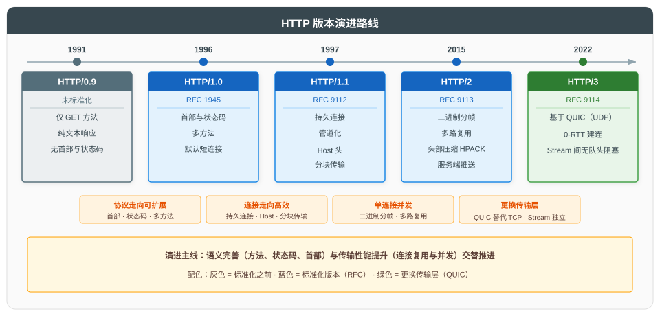
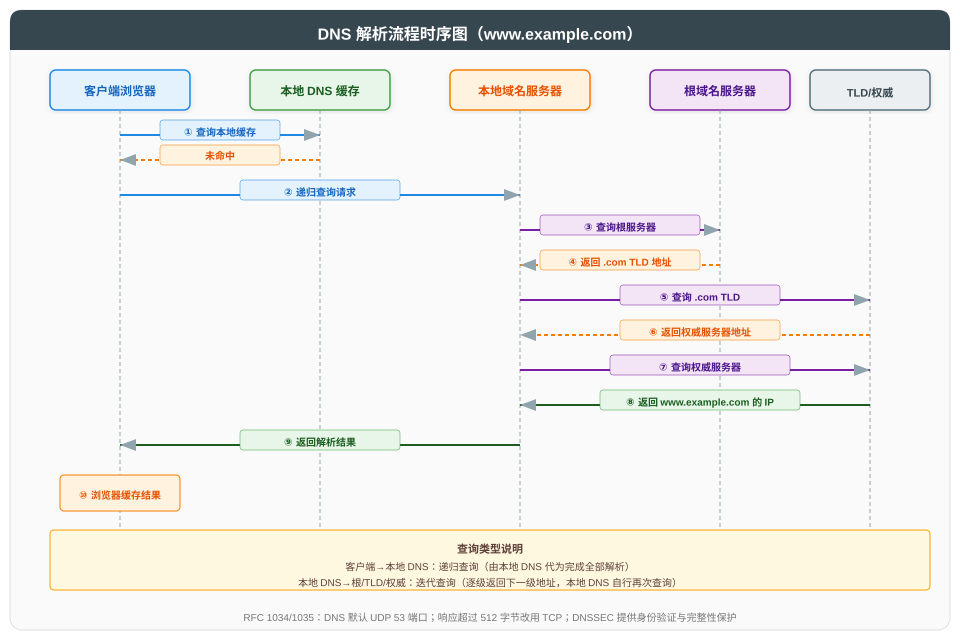
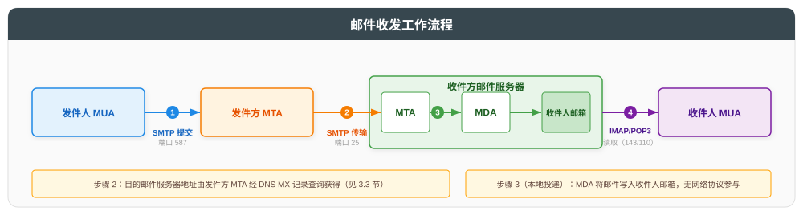
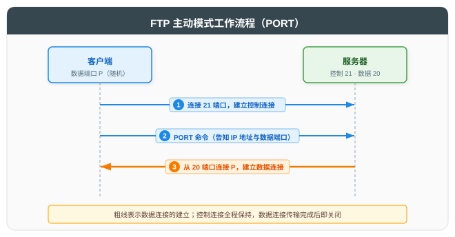
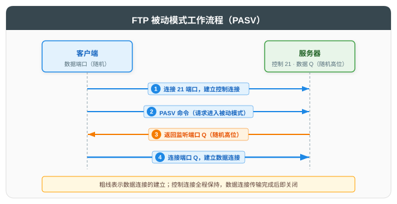

# 应用层及核心协议

## 一、概述

应用层位于网络体系结构最高层，直接为用户进程提供网络服务。应用层的协议数据单元（PDU）为**报文（Message）**。本文遵循"总分循序渐进"原则，先总述应用层协议分类，再依次展开 HTTP、DNS、DHCP、邮件协议与 FTP 等核心协议。

| 协议类别 | 代表协议 | 传输层依赖 | 说明 |
|----------|----------|------------|------|
| **Web** | HTTP/HTTPS | TCP | 万维网数据传输 |
| **名称解析** | DNS | UDP/TCP | 域名解析为 IP |
| **地址配置** | DHCP | UDP | 动态分配 IP 与配置 |
| **邮件** | SMTP/POP3/IMAP | TCP | 邮件发送与接收 |
| **文件传输** | FTP | TCP | 文件上传下载 |
| **远程登录** | SSH/Telnet | TCP | 远程命令行 |

---

## 二、HTTP 协议

### 2.1 HTTP 概述

HTTP（HyperText Transfer Protocol）是 Web 的核心协议，语义由 [RFC 9110](https://www.rfc-editor.org/rfc/rfc9110) 定义。它位于应用层，以 TCP 为传输层（HTTP/3 改用 QUIC），采用**请求-响应模型**：每次交互由客户端发起一个请求，服务器处理后返回一个响应。

HTTP 同时是**无状态协议**：协议不记录请求之间的关系，每个请求独立处理，会话状态需由 Cookie 等机制在应用层维护。

HTTP 三十余年的演进沿两条线索展开，也是本章的组织顺序：

- **语义线索**：报文结构、请求方法、状态码逐步完善——先讲报文由什么构成（2.2 节），再讲请求（2.3 节）与响应（2.4 节）如何表达语义；
- **性能线索**：连接复用与并发传输不断改进——版本演进（2.5 节）与贯穿其中的核心问题队头阻塞（2.6 节）。

> HTTPS 即 HTTP over TLS，TLS 握手细节详见 [HTTPS 原理与 TLS 握手详解](../HTTPS%20原理与%20TLS%20握手详解.md)。本文聚焦 HTTP 协议本身。

### 2.2 HTTP 报文结构

HTTP 报文分为请求报文与响应报文，结构对称，均由四部分组成：

| 组成 | 请求报文 | 响应报文 |
|------|----------|----------|
| **起始行** | 请求行：方法 + URI + 版本，如 `GET /index.html HTTP/1.1` | 状态行：版本 + 状态码 + 原因短语，如 `HTTP/1.1 200 OK` |
| **首部** | 若干"字段名: 值"行，携带元信息（Host、Content-Type、Content-Length 等） | 同请求报文（Content-Type、Set-Cookie 等） |
| **空行** | 标志首部结束、正文开始 | 同请求报文 |
| **正文** | 请求负载（POST/PUT 等携带），可为空 | 响应数据，可为空 |

首部为可扩展的键值对；正文的类型与长度由首部声明（Content-Type、Content-Length）。以一次请求与响应为例：

```text
GET /index.html HTTP/1.1          ← 请求行
Host: www.example.com             ← 首部（可多行）
User-Agent: curl/8.0
                                   ← 空行（无正文）

HTTP/1.1 200 OK                   ← 状态行
Content-Type: text/html           ← 首部
Content-Length: 125
                                   ← 空行
<html>…（125 字节正文）             ← 正文
```

起始行与首部为 ASCII 文本，正文可为任意字节序列。方法与状态码分别定义请求与响应的语义，见 2.3 与 2.4 节。

> HTTP/2 将报文拆分为二进制帧传输（见 2.5 节），但"起始行 + 首部 + 正文"的语义模型不变。

### 2.3 HTTP 请求方法

请求行以方法开头，方法（[RFC 9110](https://www.rfc-editor.org/rfc/rfc9110) 第 9 章）定义了请求对目标资源的语义：

| 方法 | 语义 | 安全 | 幂等 | 说明 |
|------|------|------|------|------|
| **GET** | 获取资源 | 是 | 是 | 不应产生副作用 |
| **HEAD** | 同 GET，但仅返回首部 | 是 | 是 | 不返回响应体 |
| **POST** | 提交数据，触发处理 | 否 | 否 | 提交表单、创建资源等 |
| **PUT** | 以请求体完整替换目标资源 | 否 | 是 | 目标不存在则创建 |
| **PATCH** | 对资源应用部分修改 | 否 | 否 | 修改格式由媒体类型定义 |
| **DELETE** | 删除目标资源 | 否 | 是 | - |
| **OPTIONS** | 查询通信选项 | 是 | 是 | CORS 预检请求 |

表中"安全"与"幂等"是定义方法语义的两个属性：

- **安全**：请求不修改服务器状态。GET、HEAD、OPTIONS 仅读取或协商，属安全方法。安全指协议语义上的只读——服务器记录访问日志、统计计数等附带行为不算修改状态；
- **幂等**：同一请求执行一次与执行多次，对服务器状态的影响相同。PUT 与 DELETE 天然幂等：重复替换同一资源，结果仍是那份资源；重复删除同一资源，结果仍是已删除。PATCH 的修改语义不由协议本身定义，无法保证幂等（如"计数器加一"式的部分修改，执行两次影响翻倍）；
- **两者的关系**：两个属性从不同角度约束执行的影响——安全要求单次执行不改变状态，幂等要求重复执行不扩大影响。安全的方法必然幂等：单次执行不改变状态，重复执行自然无从扩大影响；幂等的方法不一定安全：PUT 替换与 DELETE 删除单次执行即改变状态，但重复执行不再扩大影响。

幂等性的实践意义在于**重试**：请求发出后响应丢失（超时、断连）时，幂等请求可安全重发而不产生额外影响；非幂等请求盲目重发可能重复创建资源，需用户进程以唯一请求标识等机制自行保证幂等。

### 2.4 HTTP 状态码

响应报文的状态行携带状态码（见 2.2 节），以三位数字标识请求的处理结果，首位数字划分类别：

| 类别 | 范围 | 含义 |
|------|------|------|
| 1xx | 100~199 | 信息性：请求已接收，继续处理 |
| 2xx | 200~299 | 成功：请求已被成功接收、理解并处理 |
| 3xx | 300~399 | 重定向：完成请求需进一步操作 |
| 4xx | 400~499 | 客户端错误：请求含有错误或无法完成 |
| 5xx | 500~599 | 服务器错误：服务器处理请求失败 |

**常见状态码**：

| 状态码 | 名称 | 说明 |
|--------|------|------|
| 200 | OK | 请求成功 |
| 301 | Moved Permanently | 永久重定向：资源已迁移，后续请求应改用新 URI |
| 302 | Found | 临时重定向：资源暂时位于其他 URI。HTTP/1.0 中名为 Moved Temporarily，HTTP/1.1 更名为 Found，语义未变 |
| 304 | Not Modified | 资源未修改，客户端可继续使用缓存 |
| 400 | Bad Request | 请求语法错误，服务器无法理解 |
| 401 | Unauthorized | 未认证：缺少或提供了无效的认证凭据（名称易误解，语义为未认证而非未授权） |
| 403 | Forbidden | 服务器拒绝执行请求（已认证但无权限） |
| 404 | Not Found | 资源不存在 |
| 500 | Internal Server Error | 服务器内部错误 |
| 502 | Bad Gateway | 网关/代理从上游服务器收到无效响应 |
| 503 | Service Unavailable | 服务暂不可用（过载或维护） |

### 2.5 HTTP 版本演进

性能线索驱动了 HTTP 的四次版本更替，整体演进路线如下图：



| 版本 | 年份 | 标准 | 关键特性 |
|------|------|------|----------|
| **HTTP/0.9** | 1991 | - | 仅 GET，纯文本，无首部与状态码 |
| **HTTP/1.0** | 1996 | [RFC 1945](https://www.rfc-editor.org/rfc/rfc1945) | 引入首部、状态码、多方法；默认短连接 |
| **HTTP/1.1** | 1997 | [RFC 9112](https://www.rfc-editor.org/rfc/rfc9112) | 持久连接、管道化、Host 头、分块传输 |
| **HTTP/2** | 2015 | [RFC 9113](https://www.rfc-editor.org/rfc/rfc9113) | 二进制分帧、多路复用、头部压缩（HPACK）、服务端推送 |
| **HTTP/3** | 2022 | [RFC 9114](https://www.rfc-editor.org/rfc/rfc9114) | 基于 QUIC（UDP），0-RTT 建连，Stream 间无队头阻塞 |

> 表中年份为版本最初发布年份，标准为现行版本：HTTP/1.1 最初发布为 RFC 2068（后被 RFC 2616、7230 系列取代），HTTP/2 最初发布为 RFC 7540，两者现行标准均已更新。

各版本的关键特性均指向同一核心问题的持续缓解——队头阻塞，见 2.6 节。

### 2.6 队头阻塞问题

**术语约定**：HTTP 规范中的"连接"即指传输层连接，不存在独立于传输层的"HTTP 连接"——HTTP/1.1 与 HTTP/2 中为 TCP 连接，HTTP/3 中为 QUIC 连接。HTTP 的基本活动单位是一次**请求-响应交换**：客户端发出一个请求报文，服务器返回一个响应报文；HTTP/2 与 HTTP/3 将每个交换映射为一个 Stream（见下文）。

**队头阻塞**（Head-of-Line Blocking）指数据按序排队处理时，队首数据未完成，其后所有数据被迫等待的现象。在 HTTP 中，队头阻塞出现在两个层面，成因各自独立：

- **应用层成因——响应必须按序返回**：HTTP/1.x 报文不携带编号，请求与响应的配对只能依靠先后顺序，HTTP/1.1 因此规定服务器必须按请求到达顺序返回响应。前一个响应未返回完毕，后续已就绪的响应也不能发出——一条连接上的全部交换只能串行完成，队首交换阻塞其后全部交换。
- **传输层成因——字节必须按序交付**：TCP 向应用提供有序字节流。某报文段丢失时，其后到达的数据被接收端 TCP 暂存而不交付，待丢失部分重传补齐后方能按序交付应用——一次丢包即阻塞整条连接上后续全部数据的交付，与 HTTP 版本无关。

**HTTP/1.1 的应对与局限**（两层队头阻塞均未消除）：

- **持久连接**（HTTP/1.1 默认启用，HTTP/1.0 需以 `Connection: keep-alive` 首部协商）：一次交换完成后不关闭连接，省去逐交换建连的三次握手与慢启动开销。但它只省去建连开销，交换仍逐个串行完成，各交换的往返时延无法重叠，应用层队头阻塞原样存在。
- **管道化**：允许客户端不等响应、连续发出多个请求，试图让交换重叠。但响应必须按序返回（报文无编号，配对依赖顺序），第一个响应未就绪，后续已就绪的响应也不能发出——队头阻塞只是从客户端的逐个等待转移为服务器侧的排队返回，并未消除。管道化另有重试风险：连接中断时客户端无法判断哪些请求已被服务器执行，非幂等请求（POST 等）盲目重发会产生重复副作用。主流浏览器因此从未默认启用（Chrome 未启用、Firefox 默认关闭、Safari 后移除），真实部署近乎为零。
- **并行连接**：单条连接上无法并发完成交换，浏览器（应用进程）转而对同一服务器同时开启多条 TCP 连接（典型约 6 条），每条连接由独立的四元组标识、承载独立的字节流，各自串行完成交换、互不阻塞。此为浏览器实现策略而非协议规定，代价是建连与维持开销，以及多条连接对带宽的竞争。

**HTTP/2：多路复用消除应用层队头阻塞**。报文被拆分为二进制帧，帧头携带 Stream ID，每个交换映射为一个 Stream。不同 Stream 的帧可在同一条 TCP 连接上交错传输，接收端按 Stream ID 分别重组各自的报文，请求与响应的配对不再依赖顺序——客户端与同一服务器之间的全部并发请求可由一条连接承载，无需再开并行连接。但帧仍经由 TCP 字节流传输：一次丢包仍会阻塞整条连接上后续全部数据的交付，这些数据此时分属各 Stream，全部 Stream 一并被阻塞——传输层队头阻塞依旧。且并行连接被单条连接取代后，一次丢包的影响面从"所在连接上的部分请求"扩大为"全部请求"。

**HTTP/3：Stream 独立交付消除跨 Stream 的传输层队头阻塞**。传输层协议由 TCP 换为 QUIC：QUIC 承载于 UDP 之上，自行实现可靠传输（确认、重传、拥塞控制），并将可靠按序交付的范围从整条连接的单一字节流细化为每个 Stream 独立——应用数据以 STREAM 帧承载，帧头携带 Stream ID 与该 Stream 内的字节偏移，确认、重传与按序交付均以 Stream 为单位独立进行。某个 Stream 丢包只阻塞该 Stream 自身的数据交付，其余 Stream 照常进行，跨 Stream 的传输层队头阻塞消除。Stream 内部仍是必须按序重组的字节流：报文本身即有序的字节序列，中途字节丢失时，其后字节须待重传补齐后才能交付——单 Stream 内的队头阻塞是字节流模型的固有代价，在保留报文字节流模型的前提下无法消除。

| 版本 | 改进机制 | 队头阻塞的消除情况 |
|------|----------|--------------------|
| HTTP/1.1 | 持久连接、管道化、并行连接 | 两层均未消除：应用层交换串行完成；传输层一次丢包阻塞整条连接上的全部数据（并行连接以多条连接分散影响，属绕行而非消除） |
| HTTP/2 | 多路复用（报文拆为二进制帧，帧头携带 Stream ID） | 消除应用层阻塞：应用层交换并发完成；传输层仍未消除：一次丢包阻塞全部 Stream |
| HTTP/3 | QUIC Stream 独立交付 | 消除跨 Stream 的传输层阻塞：一次丢包仅阻塞丢失数据所属的单个 Stream |

> 队头阻塞的作用范围逐代缩小：应用层阻塞自 HTTP/2 起消除（交换并发完成）；传输层阻塞在 HTTP/1.1 与 HTTP/2 中均覆盖整条连接上的全部数据（HTTP/2 中分属各 Stream），HTTP/3 中缩小为仅丢失数据所属的单个 Stream。其最终边界是单 Stream 内部：报文本身即必须按序重组的字节序列，在保留字节流模型的前提下无法消除。

---

## 三、DNS 协议

### 3.1 DNS 概述

DNS（Domain Name System，[RFC 1034](https://www.rfc-editor.org/rfc/rfc1034)/[RFC 1035](https://www.rfc-editor.org/rfc/rfc1035)）是互联网的名称解析系统，其将人类可读的域名解析为 IP 地址。DNS 的名称数据库采用**层次化分布式**架构：**层次化**指所有域名组织为根域 → 顶级域 → 二级域 → 子域的层级结构；**分布式**指全部记录分散存储于各级的权威域名服务器，而非集中于一个中心数据库。两者分述如下。

**层次化——域名组织为层级结构**。所有域名组织为一棵树，自上而下依次为根域 → 顶级域 → 二级域 → 子域，可逐级向下延伸。域名以点分隔为多个标签，越靠右层级越高：`www.example.com.` 从右向左依次为根域（末尾句点，书写时通常省略）、顶级域 `com`、二级域 `example`、子域 `www`。

| 层级 | 示例 | 说明 |
|------|------|------|
| 根域 | `.` | 树的顶端；由 13 组根域名服务器承载（标识 A~M，经任播扩展为大量实例） |
| 顶级域（TLD，Top-Level Domain） | `.com` | 直接隶属于根域的域，即域名中最右侧的标签；按命名依据分为 gTLD 与 ccTLD 两大类别（见下表） |
| 二级域 | `example.com` | 直接隶属于某一顶级域的域，由注册人向域名注册商申请获得 |
| 子域 | `www.example.com` | 二级域之下由域名所有者自行划分的域，无需注册 |

**分布式——记录分区存储**。**区**（zone）是存储记录的基本单位：一个域默认整体构成一个区；域名所有者也可将某个子域划出单独管理（如把 `sub.example.com` 从 `example.com` 中划出），被划出的子域连同其后代另成新区。每个区的全部记录由一组权威域名服务器统一存储，分为两类：

| 类别 | 内容 | 示例 |
|------|------|------|
| 数据记录 | 本区内各域名的解析数据 | `example.com` 区存储 `www.example.com` 的 A 记录 |
| NS 委派记录（见 3.3 节） | 下级区的权威域名服务器地址 | 根区存储 `.com` 区权威域名服务器的地址 |

因此每级权威域名服务器只掌握下一级的去向：根域名服务器只掌握各顶级域名服务器的地址（根区几乎不含数据记录，所存基本全是 NS 委派记录），顶级域名服务器只掌握其下二级域的权威域名服务器地址，逐级类推。解析流程因此从根域名服务器开始，沿层级逐级向下询问（见 3.2 节）。

> **域名服务器称呼的两个维度**：
>
> - **层级**：按所服务的区命名——根域名服务器、顶级域名服务器即此类专名；
> - **角色**：按在解析中承担的职责命名——**权威域名服务器**指存储某一区的官方记录、其应答即该区权威应答的服务器。
>
> 三级服务器在角色上都是各自区的权威域名服务器：根与顶级域属全球基础设施而拥有层级专名；二级域及以下数量众多、无层级专名，故按角色统称。3.2 节流程中的"权威域名服务器"为特称，专指目标域的权威域名服务器。

**顶级域的分类**：

| 类别 | 全称 | 命名依据 | 示例 |
|------|------|----------|------|
| **gTLD** | generic TLD（通用顶级域） | 按用途类别命名，向通用领域开放注册 | `.com`、`.org`；2011 年起开放新 gTLD 申请（如 `.app`、`.dev`） |
| **ccTLD** | country-code TLD（国家代码顶级域） | 按 ISO 3166-1 双字母国家/地区代码命名 | `.cn`（中国）、`.us`（美国） |

> gTLD 与 ccTLD 并列为 TLD 的两大主要类别，互不重叠。

### 3.2 DNS 解析流程

一次完整的解析由以下角色协作完成：

| 角色 | 职责 |
|------|------|
| 浏览器 | 发起域名解析的客户端进程 |
| 本地缓存 | 浏览器与操作系统各自维护的 DNS 缓存 |
| 本地域名服务器 | 由 ISP 或公共 DNS 服务商提供（如 `114.114.114.114`、`8.8.8.8`），接受解析请求并代为完成解析，亦称递归解析器（recursive resolver） |
| 根域名服务器 | 收到查询后返回顶级域名服务器的地址 |
| 顶级域名服务器 | 收到查询后返回权威域名服务器的地址 |
| 权威域名服务器 | 返回其负责域的最终解析结果 |

**两种查询类型**（以"由谁完成解析"区分）：

- **递归查询**：查询方发出请求后等待最终结果，由被查询方代为完成全部解析——浏览器 → 本地域名服务器即为此类；
- **迭代查询**：被查询方不代为解析，仅返回下一级服务器的地址，由查询方自行再次查询——本地域名服务器 → 根域名服务器、顶级域名服务器与权威域名服务器均为此类。



**流程步骤**（以解析 `www.example.com` 为例，本地缓存未命中时）：

| 步骤 | 操作 | 查询类型 | 说明 |
|------|------|----------|------|
| ① | 浏览器查询本地缓存 | - | 含浏览器缓存与操作系统缓存；命中则直接返回，解析结束 |
| ② | 浏览器向本地域名服务器发起请求 | 递归 | 由本地域名服务器代为完成全部后续解析 |
| ③ | 本地域名服务器查询根域名服务器 | 迭代 | 根域名服务器返回顶级域名服务器的地址 |
| ④ | 本地域名服务器查询顶级域名服务器 | 迭代 | 顶级域名服务器返回权威域名服务器的地址 |
| ⑤ | 本地域名服务器查询权威域名服务器 | 迭代 | 权威域名服务器返回 `www.example.com` 的 IP 地址 |
| ⑥ | 本地域名服务器返回结果给浏览器 | - | 本地域名服务器将结果写入自身缓存后返回，浏览器将其写入本地缓存 |

### 3.3 DNS 记录类型

| 类型 | 名称 | 说明 |
|------|------|------|
| **A** | Address | 域名→IPv4 地址 |
| **AAAA** | IPv6 Address | 域名→IPv6 地址 |
| **CNAME** | Canonical Name | 域名别名 |
| **MX** | Mail Exchange | 邮件服务器 |
| **NS** | Name Server | 该域的权威域名服务器 |
| **TXT** | Text | 任意文本（SPF、DKIM 等） |
| **PTR** | Pointer | IP→域名（反向解析） |
| **SOA** | Start of Authority | 区域权威信息 |
| **SRV** | Service | 服务记录 |

### 3.4 DNS 传输协议

| 协议 | 端口 | 使用场景 |
|------|------|----------|
| UDP 53 | 默认 | 常规查询，响应 ≤512 字节（未启用 EDNS0 时） |
| TCP 53 | 备选 | 响应超长、区域传送 |
| DoT（DNS over TLS） | 853 | 加密 DNS 查询（[RFC 7858](https://www.rfc-editor.org/rfc/rfc7858)） |
| DoH（DNS over HTTPS） | 443 | 基于 HTTPS 的 DNS（[RFC 8484](https://www.rfc-editor.org/rfc/rfc8484)） |

> EDNS0（[RFC 6891](https://www.rfc-editor.org/rfc/rfc6891)）将 UDP 响应长度上限扩展至 4096 字节，现代客户端普遍携带；TCP 用于响应仍超长或服务器间区域传送的场景。DNSSEC（[RFC 4033](https://www.rfc-editor.org/rfc/rfc4033)）则为 DNS 应答提供数据来源验证与完整性保护，防止应答被篡改或伪造。

---

## 四、DHCP 协议

### 4.1 DHCP 概述

DHCP（Dynamic Host Configuration Protocol，[RFC 2131](https://www.rfc-editor.org/rfc/rfc2131)）基于 UDP（客户端 68、服务端 67），动态分配 IP 地址及网络配置；IPv6 网络使用对应的 DHCPv6（[RFC 8415](https://www.rfc-editor.org/rfc/rfc8415)）。

### 4.2 DORA 四步流程

| 步骤 | 报文 | 方向 | 传输方式 | 说明 |
|------|------|------|----------|------|
| **D**iscover | DHCPDISCOVER | 客户端→广播 | 广播 | 客户端寻找 DHCP 服务器 |
| **O**ffer | DHCPOFFER | 服务器→客户端 | 单播/广播 | 服务器提供 IP 候选 |
| **R**equest | DHCPREQUEST | 客户端→广播 | 广播 | 客户端正式请求该 IP（告知所有服务器） |
| **A**cknowledge | DHCPACK | 服务器→客户端 | 单播/广播 | 服务器确认分配，附租约信息 |

> 客户端发出的 Discover 与 Request 均以广播发送：Discover 阶段客户端尚无 IP 地址，亦不知 DHCP 服务器的地址，只能以广播寻找；Request 阶段的广播则用于告知未被选中的服务器可回收其提供的候选 IP。服务器回复的 Offer 与 Acknowledge 则存在单播与广播两种方式，其选择缘由如下：
>
> - **服务器具备单播条件**：单播回复需要链路层与 IP 两个目的地址。DHCP 报文的 chaddr（client hardware address，客户端硬件地址）字段携带客户端 MAC 地址，作为链路层目的地址；服务器分配的 IP 地址则写入 yiaddr（"your" IP address）字段，作为 IP 目的地址。两个目的地址均已明确，单播回复可行；
> - **但单播对部分客户端失效**：部分客户端的协议栈在 IP 地址配置完成前，无法接收目的 IP 为单播的报文。若服务器单播将陷入"IP 未配置导致收不到单播、收不到单播导致 IP 无法配置"的死锁，重试也无法打破这一循环；
> - **因此回复方式由客户端声明**：客户端能否在配置完成前接收单播报文取决于自身协议栈的实现，仅客户端自身知晓，服务器无从判断。存在失效风险的客户端在发送 DHCPDISCOVER/DHCPREQUEST 时置位报文 flags 字段中的 **BROADCAST 标志**，请求服务器以广播方式回复；标志未置位时，服务器以 yiaddr 为 IP 目的地址、chaddr 为链路层目的地址单播回复。

### 4.3 DHCP 租约管理

| 事件 | 触发时机 | 动作 |
|------|----------|------|
| **租约更新 T1** | 租约期流逝 50% | 客户端向原服务器单播 DHCPREQUEST 续约 |
| **租约重绑定 T2** | 租约期流逝 87.5% | 客户端广播 DHCPREQUEST 续约 |
| **租约到期** | 租约期流逝 100% | 客户端立即停止使用该 IP，重新发起 DORA |
| **主动释放** | 客户端不再需要该地址 | 发送 DHCPRELEASE |

> T1 单播而 T2 广播，源于两个阶段的前提不同：T1 时客户端进入更新阶段（RENEWING），其仍持有有效租约的 IP 地址，且已从初始分配（DORA）中获知原服务器地址，具备单播条件，故反复向原服务器单播续约；若单播始终未获响应（原服务器宕机或不可达），则 T2 时客户端进入重绑定阶段（REBINDING），不再依赖原服务器，改用广播求助网内任意 DHCP 服务器，以求在租约到期前完成重绑定。若重绑定仍失败，租约到期后客户端立即停止使用该 IP 并从头执行 DORA。

---

## 五、邮件协议

### 5.1 邮件系统架构

一封邮件从发件人撰写到收件人阅读，需要发件方与收件方两侧的多类角色接力完成。各角色的职责与所使用的协议如下：

| 角色 | 所在位置 | 职责 | 所用协议 |
|------|----------|------|----------|
| **MUA**（邮件用户代理） | 发件方与收件方的用户设备上 | 客户端程序：撰写、发送与阅读邮件 | 提交邮件用 SMTP，收取邮件用 IMAP/POP3 |
| **MTA**（邮件传输代理） | 发件方与收件方的邮件服务器上 | 在服务器之间转发邮件，直至到达收件方服务器 | SMTP |
| **MDA**（邮件投递代理） | 收件方邮件服务器内 | 将到达的邮件投入收件人邮箱 | 本地投递程序，无网络协议 |

### 5.2 邮件收发流程



一封邮件从发件人到收件人依次经过四个步骤：

| 步骤 | 阶段 | 邮件流向 | 说明 |
|------|------|----------|------|
| 1 | 提交（Submission） | 发件人 MUA → 发件方 MTA | 发件人 MUA 经 SMTP 将邮件提交给发件方 MTA（端口 587） |
| 2 | 中继（Relay） | 发件方 MTA → 收件方 MTA | 发件方 MTA 经 SMTP 将邮件转发给收件方 MTA（端口 25），目的服务器地址由 DNS MX 记录解析获得（见 3.3 节） |
| 3 | 本地投递（Delivery） | 收件方 MTA → 收件人邮箱 | MDA 将邮件写入收件人邮箱，由收件方服务器内部完成，无网络协议参与 |
| 4 | 邮件读取（Retrieval） | 收件人邮箱 → 收件人 MUA | 收件人 MUA 经 IMAP/POP3 从服务器读取邮件（端口 143/110），由收件人 MUA 发起 |

> 步骤 1~3 沿"发件方 → 收件方"方向推送邮件，SMTP 承担其中全部网络传输；步骤 4 由收件人 MUA 发起，从服务器拉取邮件。

> 步骤 1~3 的推送与步骤 4 的拉取，源于电子邮件的**存储转发**设计：用户设备间歇在线，且通常没有可被主动连接的固定地址，邮件无法直接投递到用户设备；两侧邮件服务器持续在线，可代为排队、重试与寻址，邮件因此以服务器为中介流转。发件方与收件方也可以使用同一台邮件服务器，此时步骤 2 退化为服务器内部交付，其余环节不变。

### 5.3 SMTP/POP3/IMAP 对比

5.2 节的四个步骤由三个协议协作完成，三者的定位与关键属性对比如下：

| 维度 | SMTP | POP3 | IMAP |
|------|------|------|------|
| 全称 | Simple Mail Transfer Protocol（[RFC 5321](https://www.rfc-editor.org/rfc/rfc5321)） | Post Office Protocol v3（[RFC 1939](https://www.rfc-editor.org/rfc/rfc1939)） | Internet Message Access Protocol（[RFC 9051](https://www.rfc-editor.org/rfc/rfc9051)） |
| 角色 | 发送与传输 | 接收 | 接收 |
| 承担步骤 | 步骤 1~3 | 步骤 4 | 步骤 4 |
| 端口 | 25（中继）/ 587（提交）/ 465（SMTPS） | 110 / 995（POP3S） | 143 / 993（IMAPS） |
| 工作模式 | 推送 | 拉取（下载式） | 拉取（同步式） |
| 传输层 | TCP | TCP | TCP |

> SMTPS/IMAPS/POP3S 分别为 SMTP/POP3/IMAP 基于 TLS 的安全版本。

POP3 与 IMAP 同为接收协议，交互模式的差异对比如下：

| 维度 | POP3 | IMAP |
|------|------|------|
| 邮件存储 | 下载至本地，默认删除服务器副本 | 保留在服务器 |
| 多设备同步 | 不支持（各设备独立下载） | 支持（各设备状态一致） |
| 文件夹管理 | 不支持 | 支持服务器端文件夹 |
| 离线访问 | 支持（已下载邮件可离线阅读） | 有限（依赖客户端缓存，联网后才能同步新变更） |
| 流量消耗 | 低 | 较高 |

> 现代邮件系统普遍使用 IMAP 实现多设备同步：邮件及其状态（已读/未读、文件夹归档等）统一保存于服务器，任何设备上的操作都作用于服务器，其余设备随之呈现一致状态，即"服务端同步"；POP3 则以本地副本为主，适合单设备使用。

---

## 六、FTP 协议

### 6.1 FTP 概述

FTP（File Transfer Protocol，[RFC 959](https://www.rfc-editor.org/rfc/rfc959)）基于 TCP，用于客户端与服务器之间的文件上传、下载及目录列举等操作。其最显著的架构特征是**控制连接与数据连接分离**（双连接）：

| 连接 | 承载内容 | 生命周期 | 端口 |
|------|----------|----------|------|
| **控制连接** | 客户端命令与服务器响应（ASCII 文本行） | 建立后全程保持，直至退出（QUIT）或超时断开 | 服务器 21 |
| **数据连接** | 文件内容、目录列表等实际数据 | 按需建立，每次传输完成后即关闭 | 服务器 20（主动模式）或随机高位端口（被动模式） |

分离的动机：文件传输期间控制连接仍然可用，客户端可随时下达其他命令（如中止传输 ABOR），控制交互不会被数据流量阻塞；服务器也可对两类连接分别实施策略（如仅对数据连接限速）。

> FTP 的凭据与数据均以明文传输，机密性无保障，安全替代方案有 FTPS（FTP over TLS，保留双连接结构）与 SFTP（SSH File Transfer Protocol，基于 SSH 的单连接加密协议，见 6.2 节注）。此外，FTP 区分文本与二进制两种传输类型，跨系统传输文本文件时需注意换行符转换。

### 6.2 主动模式与被动模式

两种模式的控制连接完全相同（客户端 → 服务器:21），差别只在**数据连接由谁发起、连向哪里**：

| 模式 | 命令 | 数据连接发起方 | 数据连接端点 | NAT/防火墙约束 |
|------|------|----------------|--------------|----------------|
| **主动模式** | PORT | 服务器 | 服务器:20 → 客户端告知的随机端口 | 服务器需能主动连入客户端，该入站连接常被客户端侧防火墙拦截 |
| **被动模式** | PASV | 客户端 | 客户端 → 服务器告知的随机高位端口 | 仅需服务器开放高位端口段，客户端侧无入站要求 |

**主动模式工作流程**：



| 步骤 | 操作 | 说明 |
|------|------|------|
| 1 | 客户端连接服务器:21 | 建立控制连接 |
| 2 | 客户端发送 PORT 命令 | 告知自身 IP 地址与随机监听的数据端口 |
| 3 | 服务器从 20 端口连接该端口 | 建立数据连接，开始传输 |

**被动模式工作流程**：



| 步骤 | 操作 | 说明 |
|------|------|------|
| 1 | 客户端连接服务器:21 | 建立控制连接 |
| 2 | 客户端发送 PASV 命令 | 请求服务器进入被动模式 |
| 3 | 服务器返回监听端口 | 告知数据连接的目标 IP 地址与随机高位端口 |
| 4 | 客户端连接该端口 | 建立数据连接，开始传输 |

> 现代网络环境中客户端普遍位于 NAT/防火墙之后，主动模式因此常以失败告终：防火墙会拦截服务器主动连入客户端的连接；客户端位于 NAT 之后时，PORT 命令告知的往往是内网地址，服务器无从连入。被动模式中全部连接均由客户端发起，服务器仅需开放高位端口段，无入站要求，因此成为默认推荐。安全方面：SFTP（SSH File Transfer Protocol）是与 FTP 不同的另一协议，其自身运行于 SSH（22 端口）之上，经由这一条加密连接完成文件传输；FTPS 则是 FTP 直接叠加 TLS，保留双连接结构。

---

## 七、参考资料

### 7.1 HTTP 相关标准

| 标准 | 说明 |
|------|------|
| [RFC 1945](https://www.rfc-editor.org/rfc/rfc1945) | HTTP/1.0 |
| [RFC 7541](https://www.rfc-editor.org/rfc/rfc7541) | HPACK 头部压缩（HTTP/2） |
| [RFC 9110](https://www.rfc-editor.org/rfc/rfc9110) | HTTP 语义 |
| [RFC 9112](https://www.rfc-editor.org/rfc/rfc9112) | HTTP/1.1 消息语法 |
| [RFC 9113](https://www.rfc-editor.org/rfc/rfc9113) | HTTP/2 协议 |
| [RFC 9114](https://www.rfc-editor.org/rfc/rfc9114) | HTTP/3 协议 |
| [RFC 9204](https://www.rfc-editor.org/rfc/rfc9204) | QPACK 头部压缩（HTTP/3） |

### 7.2 DNS 相关标准

| 标准 | 说明 |
|------|------|
| [RFC 1034](https://www.rfc-editor.org/rfc/rfc1034) | DNS 概念与设施 |
| [RFC 1035](https://www.rfc-editor.org/rfc/rfc1035) | DNS 实现与规范 |
| [RFC 4033](https://www.rfc-editor.org/rfc/rfc4033) | DNSSEC 安全扩展 |
| [RFC 6891](https://www.rfc-editor.org/rfc/rfc6891) | EDNS0 扩展机制 |
| [RFC 7858](https://www.rfc-editor.org/rfc/rfc7858) | DNS over TLS（DoT） |
| [RFC 8484](https://www.rfc-editor.org/rfc/rfc8484) | DNS over HTTPS（DoH） |

### 7.3 其他协议标准

| 协议 | 标准 | 说明 |
|------|------|------|
| DHCP | [RFC 2131](https://www.rfc-editor.org/rfc/rfc2131) | DHCP 动态主机配置 |
| DHCP | [RFC 8415](https://www.rfc-editor.org/rfc/rfc8415) | DHCPv6 |
| 邮件 | [RFC 5321](https://www.rfc-editor.org/rfc/rfc5321) | SMTP 简单邮件传输 |
| 邮件 | [RFC 6409](https://www.rfc-editor.org/rfc/rfc6409) | 消息提交（MUA 经 587 端口提交邮件） |
| 邮件 | [RFC 1939](https://www.rfc-editor.org/rfc/rfc1939) | POP3 |
| 邮件 | [RFC 9051](https://www.rfc-editor.org/rfc/rfc9051) | IMAP4rev2 |
| FTP | [RFC 959](https://www.rfc-editor.org/rfc/rfc959) | FTP 文件传输 |
| FTP | [RFC 4217](https://www.rfc-editor.org/rfc/rfc4217) | FTPS（FTP over TLS） |

### 7.4 延伸阅读

| 资源 | 说明 |
|------|------|
| [HTTPS 原理与 TLS 握手详解](../HTTPS%20原理与%20TLS%20握手详解.md) | HTTP over TLS 的安全机制 |
| [TCP 三次握手与四次挥手详解](../TCP%20三次握手与四次挥手详解.md) | HTTP/1.1/2 底层连接管理 |
| 《HTTP 权威指南》David Gourley | HTTP 经典教材 |
| [IANA 端口注册表](https://www.iana.org/assignments/service-names-port-numbers) | 标准端口分配查询 |
