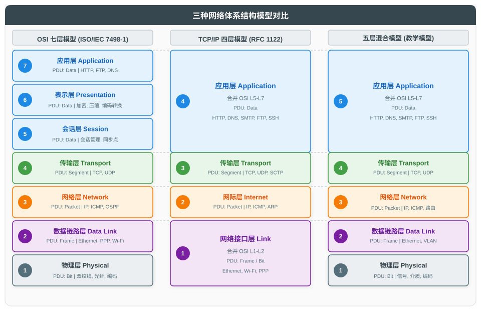
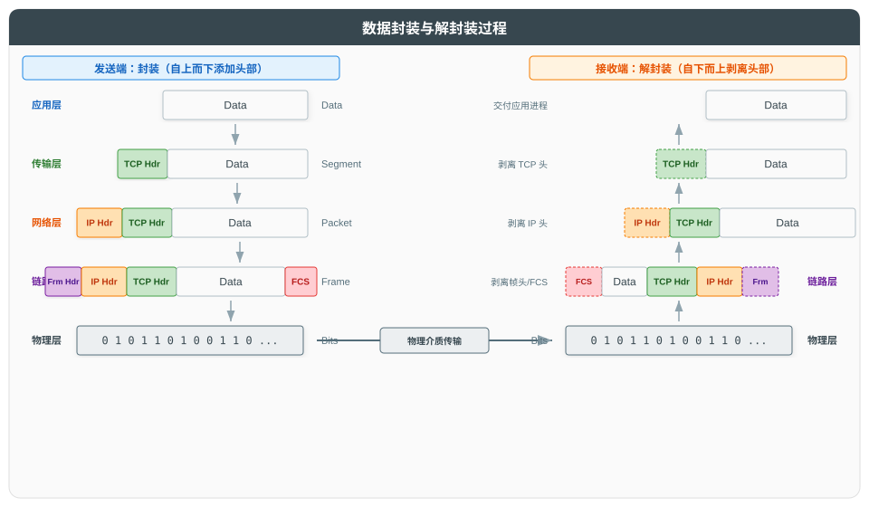

# 网络体系结构总论

## 一、概述

网络体系结构（Network Architecture）是描述网络通信功能如何分层组织、各层之间如何协作的抽象框架。它将复杂的网络通信问题分解为若干个可管理的子问题，每层解决特定范围内的功能，通过明确定义的接口向上层提供服务。

当前网络领域存在三种主要体系结构模型：

| 模型 | 层级数 | 标准来源 | 定位 |
|------|--------|----------|------|
| **OSI 七层模型** | 7 层 | ISO/IEC 7498-1:1994 | 理论参考模型 |
| **TCP/IP 四层模型** | 4 层 | RFC 1122 (1989) | 互联网事实标准 |
| **五层混合模型** | 5 层 | 教学综合 | 教学/工程讨论 |

本文以"总分"思想组织：首先定义 PDU、SAP 等核心概念，再概述三种模型的对应关系（总），随后逐层展开各模型的细节、数据封装过程、分层架构的利弊，以及 OSI 模型的历史启示（分）。

---

## 二、核心概念

理解网络体系结构前，需掌握以下贯穿全部分层模型的基础概念。

### 2.1 协议数据单元（PDU）

协议数据单元（Protocol Data Unit, PDU）是某层协议在对等层之间传输的数据单元，由本层协议控制信息（头部/尾部）与上层数据（载荷）组成。不同层的 PDU 有不同名称（Bit、Frame、Packet、Segment/Datagram、Data/Message），详见后续各层说明。

> **关于"IP 数据报"与"分组"的术语说明**
>
> 在 OSI 术语体系中，网络层 PDU 统称为 Packet（分组/包）。TCP/IP 体系（[RFC 1122](https://www.rfc-editor.org/rfc/rfc1122) Section 1.3.3）中，IP 协议端到端传输的完整逻辑单元称为 IP 数据报（IP Datagram），而 Packet 是网络层与链路层接口处传递的数据单元。两者的区别在于观察视角：Datagram 是端到端视角的完整单元，Packet 是层间接口视角的传递单元——当 IP 数据报长度超过链路层 MTU 时，会被分片为多个 Packet 传输，接收端再重组为完整的 Datagram。
>
> 为避免术语混淆，本文在网络层一律采用 Packet 作为 PDU 名称，"IP 数据报"仅作为 IP 协议特定语境下的补充概念。

### 2.2 服务数据单元（SDU）与封装

服务数据单元（Service Data Unit, SDU）是上层传递给本层的数据，即本层 PDU 中的载荷部分。本层为对等层通信而添加的控制信息称为协议控制信息（Protocol Control Information, PCI），通常表现为头部（Header），部分层还会追加尾部（Trailer，如链路层的 FCS）。本层将 PCI 添加到 SDU 之上，形成本层 PDU 后传递给下层：**PDU = PCI + SDU**。

这一逐层添加控制信息的过程称为封装（Encapsulation），接收端逐层剥离控制信息的逆过程称为解封装（Decapsulation），详见第七章。

### 2.3 服务访问点（SAP）

服务访问点（Service Access Point, SAP）是下层向上层提供服务时的接口标识，相当于上层访问下层服务的"入口地址"。上层通过指定 SAP 来选择并使用下层提供的某项服务实例。以传输层为例，其 SAP 即端口号（Port）——应用进程通过端口号定位并使用传输层提供的 TCP 或 UDP 服务。其他层的 SAP 名称见第四章 OSI 各层说明。

### 2.4 对等层通信

网络通信实际发生在两端相同层级之间——发送端某层添加的头部，仅被接收端相同层级读取和处理。

在 OSI 术语体系中，**协议（Protocol）** 严格指对等层（Peer Entity）之间通信的规则与格式，是"水平"方向的概念；而相邻层之间的交互规范属于**服务（Service）** 定义，通过 SAP 暴露给上层，是"垂直"方向的概念。两者分离的工程意义在于解耦：同一层内协议可自由替换（如 IPv4 → IPv6），只要对外服务不变，上层即不受影响。

---

## 三、三种模型总览

### 3.1 模型对比图

### 3.2 层级对应关系

三种模型并非互相替代，而是从不同角度描述同一套网络协议栈。它们的层级对应关系如下：

| OSI 七层 | TCP/IP 四层 | 五层混合 | PDU（协议数据单元） | 典型协议 |
|----------|-------------|----------|---------------------|----------|
| 应用层 (L7) | 应用层 | 应用层 | Data | HTTP, DNS, SMTP |
| 表示层 (L6) | 应用层 | 应用层 | Data | SSL/TLS, JPEG |
| 会话层 (L5) | 应用层 | 应用层 | Data | RPC, NetBIOS |
| 传输层 (L4) | 传输层 | 传输层 | Segment / Datagram | TCP, UDP |
| 网络层 (L3) | 网际层 | 网络层 | Packet | IP, ICMP, OSPF |
| 数据链路层 (L2) | 网络接口层 | 数据链路层 | Frame | Ethernet, Wi-Fi |
| 物理层 (L1) | 网络接口层 | 物理层 | Bit | 双绞线, 光纤 |

**关键观察**：

- TCP/IP 模型将 OSI 顶上三层（应用、表示、会话）合并为一个应用层，底层两层（物理、链路）合并为网络接口层。
- 五层混合模型取两者之长：上层沿用 TCP/IP 的合并，下层保留 OSI 的分离，便于独立讨论交换机（L2）与集线器（L1）等设备。

---

## 四、OSI 七层参考模型

OSI（Open Systems Interconnection，开放式系统互联）参考模型由 ISO/IEC JTC 1（信息技术联合技术委员会）与 ITU-T 协作制定，标准编号为 [ISO/IEC 7498-1:1994](https://www.iso.org/standard/20269.html)，等同标准为 [ITU-T X.200 (07/94)](https://www.itu.int/rec/T-REC-X.200-199407-I)。该标准目前仍为现行有效版本（2000 年复审确认）。

### 4.1 分层原则

依据 ISO/IEC 7498-1 Clause 5.2，OSI 分层遵循以下原则：

1. 每层为上层提供服务，并使用下层提供的服务
2. 对等层之间通过协议进行逻辑通信（虚拟通信）
3. 层数不应过多以免工程复杂化，每层应完成特定功能
4. 层间边界选择应使跨越边界的交互最少

### 4.2 通信端点与寻址

每一层都定义自己的通信端点，并通过特定寻址标识加以区分。这是理解分层体系的关键：

| 层级 | 通信端点 | 寻址标识 | 转发模式 |
|------|---------|---------|---------|
| 物理层 (L1) | 节点到节点 | 无（物理连接） | 逐跳 |
| 数据链路层 (L2) | 相邻节点到相邻节点 | MAC 地址 | 逐跳 |
| 网络层 (L3) | 主机到主机 | IP 地址 | 逻辑端到端 / 物理逐跳 |
| 传输层 (L4) | 进程到进程 | 端口号 | 端到端 |
| 应用层 (L7) | 应用到应用 | URL / 服务名 | 端到端 |

**"端到端"与"逐跳"的区别**：

- **逐跳（Hop-by-Hop）**：数据仅在相邻节点间传递，每跳依赖下一跳节点的转发。物理层、数据链路层工作于此模式。
- **端到端（End-to-End）**：数据从源端直接到达目的端，中间节点仅转发而不参与上层协议处理。网络层提供主机到主机的逻辑端到端通信，但其底层实现仍依赖逐跳转发；传输层通过端口号将通信端点精确到进程，是真正意义上的端到端通信层。

### 4.3 各层详解

#### 物理层（Physical Layer, L1）

| 属性 | 说明 |
|------|------|
| **PDU** | Bit（比特） |
| **SAP** | PhSAP |
| **核心功能** | 在物理介质上透明传输比特流 |
| **定义内容** | 机械特性（连接器形状）、电气特性（电压电平）、功能特性（引脚定义）、规程特性（时序） |
| **典型协议** | Ethernet PHY, DSL, USB PHY, Bluetooth PHY |

物理层是网络通信的物理基础，负责在物理介质上透明传输比特流，不关心比特所承载的语义内容。

该层定义四类特性：机械特性（连接器形状与尺寸）、电气特性（电压电平与范围）、功能特性（引脚功能定义）、规程特性（信号时序关系）。具体实现涉及信号编码方式（如曼彻斯特编码、NRZ）、传输介质选择（双绞线、光纤、同轴电缆）以及物理拓扑结构。

#### 数据链路层（Data Link Layer, L2）

| 属性 | 说明 |
|------|------|
| **PDU** | Frame（帧） |
| **SAP** | LSAP（LLC SAP） |
| **核心功能** | 相邻节点间成帧、物理寻址（MAC）、差错检测（CRC）、介质访问控制 |
| **子层划分** | LLC（逻辑链路控制）+ MAC（介质访问控制） |
| **典型协议** | Ethernet（802.3）, Wi-Fi（802.11）, PPP, HDLC |

数据链路层在相邻节点间提供可靠的数据帧传输服务，通过 MAC 地址寻址、CRC 差错检测和介质访问控制机制，将物理层可能出错的原始比特流改造为可靠的链路数据通道。

IEEE 802 LAN/MAN 标准委员会（LMSC）将该层进一步划分为两个子层：LLC（逻辑链路控制）子层统一向上层接口，MAC（介质访问控制）子层与物理层紧密相关，处理介质访问和成帧。需要注意的是，IEEE 802.2 标准文档已于 2011 年 1 月被 IEEE 标准协会正式撤回（状态为 Inactive-Withdrawn），但 LLC 子层本身并未随之废止——其等同采用的 ISO/IEC 8802-2 仍处于"stabilized"状态（有效但不再更新），且 LLC 地址（LSAP）仍被 IS-IS、RSTP、802.11 等协议广泛使用。

#### 网络层（Network Layer, L3）

| 属性 | 说明 |
|------|------|
| **PDU** | Packet（包） |
| **SAP** | NSAP |
| **核心功能** | 逻辑寻址（IP）、路由选择、拥塞控制、分片与重组、网络互联 |
| **典型协议** | IP（IPv4/IPv6）, ICMP, IPsec, OSPF, BGP, IS-IS |

网络层负责主机到主机的逻辑端到端通信，通过 IP 寻址和路由选择，将分组从源主机经若干路由器送达目的主机。

IP 是该层的核心协议，采用无连接的分组交换方式，独立路由每个分组。这种设计牺牲了可靠性（不保证可达、不保证顺序），换取了网络的可扩展性和异构互联能力——任何链路层技术只要能承载 IP 分组，即可接入互联网。可靠性保障由上层（传输层 TCP）或应用自身承担。

#### 传输层（Transport Layer, L4）

| 属性 | 说明 |
|------|------|
| **PDU** | Segment（TCP）/ Datagram（UDP） |
| **SAP** | TSAP（端口 Port） |
| **核心功能** | 端到端可靠传输、分段与重组、流量控制、差错恢复 |
| **典型协议** | TCP（可靠面向连接）, UDP（无连接）, SCTP, DCCP |

传输层提供进程到进程的端到端通信服务，是 OSI 体系中真正意义上的端到端通信层（通信端点的层级对比详见 4.2 节）。

该层通过端口号识别主机上的具体进程，并依据协议提供不同的服务语义：TCP 提供面向连接的可靠服务，包含流量控制、重传、序号与确认机制；UDP 提供无连接的轻量级传输服务，无握手、无重传，适用于对实时性要求高于可靠性的场景。

#### 会话层（Session Layer, L5）

| 属性 | 说明 |
|------|------|
| **PDU** | Data（SPDU） |
| **SAP** | SSAP |
| **核心功能** | 会话建立/管理/终止、同步点与恢复、对话控制（半双工/全双工） |
| **典型协议** | NetBIOS, RPC, SOCKS, PPTP |

会话层管理进程间会话的建立、维护与终止，提供同步点与恢复机制，以及对话控制（半双工/全双工切换）。

在实际工程实现中，该层功能往往由应用自身承担。TCP/IP 模型将其合并入应用层，因此现代网络协议栈中通常不单独实现会话层。

#### 表示层（Presentation Layer, L6）

| 属性 | 说明 |
|------|------|
| **PDU** | Data（PPDU） |
| **SAP** | PSAP |
| **核心功能** | 数据语法转换、加密/解密、压缩、字符编码转换（ASCII/EBCDIC、ASN.1） |
| **典型协议** | SSL/TLS, JPEG, MPEG, MIME |

表示层解决不同系统间的数据表示差异，确保发送方编码的数据能被接收方正确解释。

该层通过协商"传送语法"（Transfer Syntax）完成数据格式转换，具体功能包括：字符编码转换（ASCII/EBCDIC、ASN.1）、数据加密/解密、数据压缩。在 TCP/IP 模型中，这些功能同样合并入应用层，由具体应用协议自行实现（如 TLS 负责加密、MIME 负责内容类型协商）。

#### 应用层（Application Layer, L7）

| 属性 | 说明 |
|------|------|
| **PDU** | Data（APDU） |
| **SAP** | ASE/SASE |
| **核心功能** | 为网络应用提供接口 |
| **典型协议** | HTTP, FTP, SMTP, DNS, DHCP, SSH, SNMP |

应用层为网络应用提供接口，是用户程序直接交互的层级。

该层定义具体应用的报文格式与交互规则，每种应用协议解决特定的网络服务需求，如 Web 浏览（HTTP）、文件传输（FTP）、邮件传输（SMTP）、域名解析（DNS）等。

---

## 五、TCP/IP 四层模型

TCP/IP 模型由 [RFC 1122](https://www.rfc-editor.org/rfc/rfc1122)（R. Braden, 1989）Section 1.1.3 权威定义，是互联网协议栈的事实标准。该模型"先有协议，后有模型"（Descriptive，描述式），与 OSI 的"先有模型，后有协议"（Prescriptive，规范式）形成对比。

### 5.1 各层详解

#### 网络接口层（Link Layer）

| 属性 | 说明 |
|------|------|
| **PDU** | Frame（帧）/ Bits（比特） |
| **对应 OSI** | L1 + L2 |
| **核心功能** | 与物理网络媒介交互、封装 IP 分组为帧、MAC 寻址 |
| **典型协议** | Ethernet（802.3）, Wi-Fi（802.11）, PPP, ARP |

网络接口层合并了 OSI 的物理层与数据链路层，负责与物理网络媒介交互，将 IP 分组封装为帧并在链路上传输。

该层不进一步细分子层，对应不同类型的物理网络存在多种网络接口层协议（如 Ethernet、Wi-Fi、PPP）。RFC 1122 指出这种协议多样性是该层的固有特征，因此 TCP/IP 模型刻意保持该层的开放性，不对具体链路技术做统一规定。

#### 网际层（Internet Layer）

| 属性 | 说明 |
|------|------|
| **PDU** | Packet（包） |
| **对应 OSI** | L3 |
| **核心功能** | 路由转发、逻辑寻址、无连接分组传输 |
| **典型协议** | IP（IPv4/IPv6）, ICMP, IGMP, IPsec, ARP |

网际层提供主机到主机的逻辑端到端通信，通过 IP 寻址和路由选择将分组从源主机送达目的主机，是 TCP/IP 体系的核心。

IP 是该层的核心协议，采用无连接、不可靠、尽力而为（Best-Effort）的工作方式，独立路由每个分组。这种设计使任何网络接口层技术只要能承载 IP 分组即可接入互联网。ICMP 被视为 IP 不可分割的一部分，用于传递控制与差错信息。

关于 ARP 的归层存在争议：RFC 1122（Section 2.3.2）将其明确归入网络接口层，因其直接操作 MAC 地址且仅在同一物理网络内完成地址解析；但由于其解析的是 IP 地址，部分教材将其归入网际层与网络接口层的边界协议。

#### 传输层（Transport Layer）

| 属性 | 说明 |
|------|------|
| **PDU** | Segment（TCP）/ Datagram（UDP） |
| **对应 OSI** | L4 |
| **核心功能** | 端到端通信、可靠性保障 |
| **典型协议** | TCP, UDP, SCTP, DCCP |

传输层提供进程到进程的端到端通信服务，通过端口号识别主机上的具体进程，并依据协议提供不同的服务语义。

TCP 提供面向连接的可靠服务，包含流量控制、重传、序号与确认机制，适用于对数据完整性要求高的场景；UDP 提供无连接的轻量级传输服务，无握手、无重传，适用于对实时性要求高于可靠性的场景（如 DNS 查询、视频流）。

#### 应用层（Application Layer）

| 属性 | 说明 |
|------|------|
| **PDU** | Message（消息）/ Data（数据） |
| **对应 OSI** | L5 + L6 + L7 |
| **核心功能** | 用户接口与网络服务 |
| **典型协议** | HTTP, HTTPS, FTP, SMTP, DNS, DHCP, SSH, Telnet, SNMP |

应用层为网络应用提供接口，合并了 OSI 顶上三层的全部功能。

RFC 1122 Section 1.1.3 明确指出，TCP/IP 应用层"本质上合并了 OSI 参考模型顶上两层（表示层与应用层）的功能"。在实际实现中，会话层（L5）的会话管理、同步等功能也由应用层协议自身承担，因此业界通常认为 TCP/IP 应用层合并了 OSI 的 L5-L7 三层。具体应用协议解决各自的网络服务需求，如 Web 浏览（HTTP）、文件传输（FTP）、邮件传输（SMTP）、域名解析（DNS）等。

---

## 六、五层混合模型

五层混合模型非任何单一标准定义，是教学实践中综合 OSI 与 TCP/IP 的折中方案，被谢希仁《计算机网络》、Kurose & Ross《Computer Networking: A Top-Down Approach》等主流教材广泛采用。

### 6.1 综合方式

| 层级 | 名称 | 综合来源 | 综合理由 |
|------|------|----------|----------|
| 5 | 应用层 | OSI L7+L6+L5 合并 | TCP/IP 应用层已合并表示/会话功能，避免过于理论化 |
| 4 | 传输层 | OSI L4 / TCP/IP L3 | 两者完全一致 |
| 3 | 网络层 | OSI L3 / TCP/IP L2 | 两者完全一致 |
| 2 | 数据链路层 | OSI L2 | 独立出帧与 MAC 寻址，便于讨论交换机、ARP、VLAN |
| 1 | 物理层 | OSI L1 | 独立出比特传输与物理介质，便于讨论线缆、信号编码 |

### 6.2 为何综合两者

- **TCP/IP 过于简化底层**：无法清晰讨论交换机（L2）与集线器（L1）的区别、线缆规范、CSMA/CD 等细节。
- **OSI 过于理论化**：会话层与表示层在实际 TCP/IP 实现中往往合并于应用层。
- **五层模型兼顾理论与实践**：既保留了 TCP/IP 的实用性，又保留了 OSI 的清晰分层。

本文后续各篇即按五层模型自底向上展开：物理层与数据链路层（02）、网络层与 IP 协议（03）、传输层 UDP 与 TCP（04）、应用层核心协议（05）。

---

## 七、数据封装与解封装

### 7.1 封装过程

封装（Encapsulation）是发送端自上而下逐层添加头部（及尾部）的过程。每层将上层数据作为载荷，添加本层控制信息后形成本层 PDU，传递给下一层。

**封装步骤**：

| 步骤 | 层级 | 操作 | 结果 PDU |
|------|------|------|----------|
| 1 | 应用层 | 生成应用数据 | Data |
| 2 | 传输层 | 添加 TCP/UDP 头部（源端口、目的端口、序号、校验和等） | Segment / Datagram |
| 3 | 网络层 | 添加 IP 头部（源 IP、目的 IP、TTL、协议号等） | Packet |
| 4 | 数据链路层 | 添加帧头（源 MAC、目的 MAC、类型）+ 帧尾（FCS/CRC32） | Frame |
| 5 | 物理层 | 转换为比特流（电信号/光信号） | Bits |

### 7.2 解封装过程

解封装（Decapsulation）是接收端自下而上逐层剥离头部/尾部的过程，最终将原始数据交付应用层对应进程。

| 步骤 | 层级 | 操作 |
|------|------|------|
| 1 | 物理层 | 接收比特流，重组为帧 |
| 2 | 数据链路层 | 校验 FCS，剥离帧头/帧尾，提取 IP 包 |
| 3 | 网络层 | 检查目的 IP，剥离 IP 头，提取 TCP 段 |
| 4 | 传输层 | 根据目的端口，剥离 TCP 头，提取数据 |
| 5 | 应用层 | 交付对应应用进程 |

### 7.3 各层添加的关键字段

| 层级 | 添加内容 | 关键字段 |
|------|----------|----------|
| 传输层 | TCP/UDP 头部 | 源端口、目的端口、序号、确认号、校验和、窗口大小 |
| 网络层 | IP 头部 | 源 IP、目的 IP、TTL、协议号（6=TCP, 17=UDP）、标识、标志、片偏移 |
| 数据链路层 | 帧头 + 帧尾 | 源 MAC、目的 MAC、类型/长度、FCS（CRC32 校验） |
| 物理层 | 信号编码 | 前导码、帧起始定界符（以太网） |

### 7.4 跨路由器的重新封装

每经过一个路由器，承载 IP 分组的 L2 帧会被剥离帧头/帧尾，并重新封装为下一跳链路对应的帧格式；而 L3 的 IP 头（TTL 减 1）及上层 PDU 保持不变。这一机制使 IP 协议能跨越不同类型的物理网络（如从 Ethernet 到 PPP 到 Wi-Fi）。

---

## 八、分层架构的优缺点

### 8.1 优点

| 优点 | 说明 |
|------|------|
| **模块化** | 各层独立设计、实现、维护，复杂问题分而治之 |
| **独立演进** | 某层技术更替不影响其他层（如以太网升级到 Wi-Fi 不影响 HTTP） |
| **服务复用** | 同一下层服务可被多个上层服务实例调用（如多个 TCP 连接与 UDP socket 共享 IP 层服务），通过 SAP 实现多路复用 |
| **互操作性** | 对等层协议的标准化使不同厂商设备/软件互通（如不同厂商的 IP 路由器可互相转发分组） |
| **故障隔离** | 便于排障（"这是 L2 问题还是 L3 问题"） |
| **抽象** | 各层只关心本层功能，降低整体复杂度 |

### 8.2 缺点

| 缺点 | 说明 |
|------|------|
| **开销** | 每层都要添加头部/尾部，造成带宽与处理开销 |
| **跨层调优困难** | 分层严格隔离使跨层优化难以实现，性能可能次优 |
| **跨层功能归层困难** | 某些功能天然跨越多层（如 ARP 操作 MAC 与 IP 地址、ICMP 承载于 IP 之上），难以归入单一层级 |
| **状态冗余** | 每层可能各自维护相似状态信息 |

---

## 九、OSI 模型的历史与启示

### 9.1 OSI 协议族竞争失利的原因

OSI 协议族在市场竞争中败给 TCP/IP，核心原因如下：

| 原因 | 说明 |
|------|------|
| **标准制定官僚化** | ISO 的标准化流程涉及国家代表投票与政治妥协，制定周期长，难以跟上技术的快速迭代；IETF 奉行"Rough Consensus and Running Code"（粗略共识与可运行代码），以工程实践驱动，迭代迅速 |
| **协议设计过度复杂** | 七层划分过细，OSI 协议族（X.400 邮件、X.500 目录、CLNP、TP4）规范庞大臃肿，实现难度大、成本高 |
| **TCP/IP 先发优势** | 1974 年 Cerf & Kahn 发表 TCP 原型；1981 年 IPv4 发布；1983 年 ARPANET 切换到 TCP/IP（"flag day"）；1983 年 BSD UNIX 4.2 集成 TCP/IP 并免费提供源码 |
| **TCP/IP 生态成熟更快** | 1985 年 NSF 规定大学接入 Internet 必须使用 TCP/IP；Cisco 等厂商商用化推动；1990 年代 Web 爆发决定性胜出 |
| **理念差异** | TCP/IP 面向实用、迭代演进；OSI 面向标准、一次性完美设计 |

### 9.2 OSI 参考模型的遗留价值

尽管 OSI 协议族失败，其参考模型至今仍是网络领域的核心框架：

1. **共通语言**：网络工程师讨论"这是第几层问题"时使用 OSI 术语（如"L2 交换机"、"L3 路由器"、"L4-L7 负载均衡"）
2. **故障定位框架**：分层思路将复杂问题分解，便于排障
3. **教学价值**：概念清晰，是网络教育的标准框架
4. **协议设计参考**：新协议设计时仍参考其分层原则与服务/协议分离思想
5. **遗产延续**：X.500 演化为 LDAP；X.509 证书体系仍是 PKI 基础；ASN.1 仍广泛用于协议描述

---

## 十、参考资料

### 国际标准

| 标准编号 | 层次定位 | 全称 |
|----------|---------|------|
| [ISO/IEC 7498-1:1994](https://www.iso.org/standard/20269.html) | 体系结构总体 | Information technology — OSI — Basic Reference Model: The Basic Model |
| [ITU-T X.200 (07/94)](https://www.itu.int/rec/T-REC-X.200-199407-I) | 体系结构总体 | OSI Basic Reference Model（等同 ISO/IEC 7498-1） |

### RFC 文档

按层次自底向上排列：

| RFC | 层次定位 | 标题 |
|-----|---------|------|
| [RFC 826](https://www.rfc-editor.org/rfc/rfc826) | 数据链路层（ARP） | Ethernet Address Resolution Protocol |
| [RFC 791](https://www.rfc-editor.org/rfc/rfc791) | 网络层（IP） | Internet Protocol |
| [RFC 768](https://www.rfc-editor.org/rfc/rfc768) | 传输层（UDP） | User Datagram Protocol |
| [RFC 793](https://www.rfc-editor.org/rfc/rfc793) | 传输层（TCP） | Transmission Control Protocol（已被 RFC 9293 替代） |
| [RFC 1122](https://www.rfc-editor.org/rfc/rfc1122) | 通信层总体（L1-L4） | Requirements for Internet Hosts -- Communication Layers |
| [RFC 1123](https://www.rfc-editor.org/rfc/rfc1123) | 应用层总体（L5-L7） | Requirements for Internet Hosts -- Application and Support |

### IEEE 标准

| 标准 | 层次定位 | 内容 |
|------|---------|------|
| [IEEE 802.1](https://ieee802.org/1) | 数据链路层 | 体系结构、寻址、网络互联、VLAN（802.1Q） |
| [IEEE 802.2](https://standards.ieee.org/ieee/802.2/1048) | 数据链路层（LLC 子层） | 逻辑链路控制子层（2011 年 1 月撤回，状态为 Inactive-Withdrawn；等同标准 ISO/IEC 8802-2 仍处于 stabilized 状态） |
| [IEEE 802.3](https://ieee802.org/3) | 物理层 / 数据链路层 | 以太网 CSMA/CD、物理层规范 |
| [IEEE 802.11](https://ieee802.org/11) | 物理层 / 数据链路层 | 无线局域网（Wi-Fi）CSMA/CA |

### 教材参考

| 教材 | 作者 | 说明 |
|------|------|------|
| 《计算机网络》（第 8 版） | 谢希仁 | 国内主流教材，采用五层模型组织 |
| Computer Networking: A Top-Down Approach | Kurose & Ross | 国际主流教材，自顶向下方法 |
| TCP/IP Illustrated, Volume 1 | W. Richard Stevens | TCP/IP 协议详解经典 |
