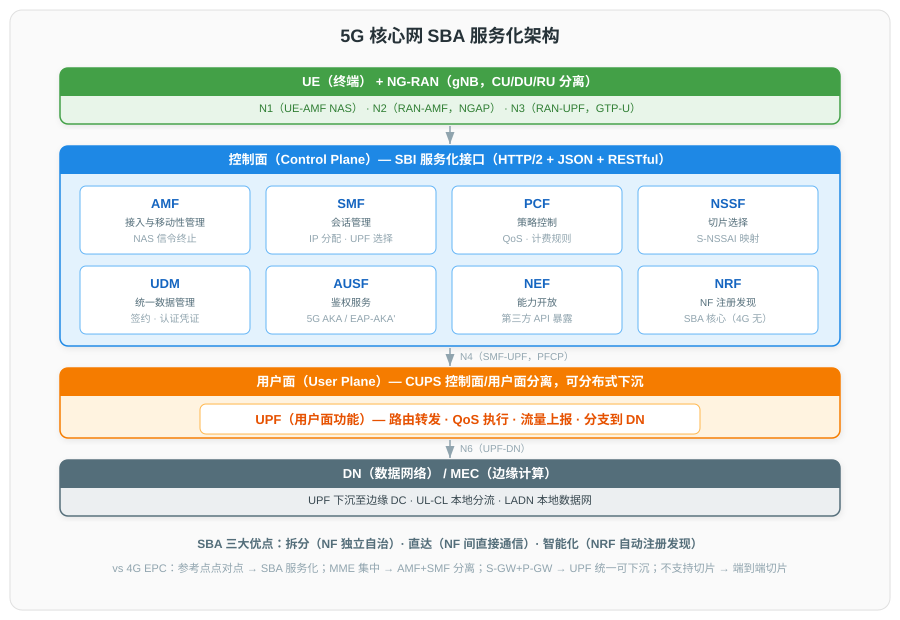
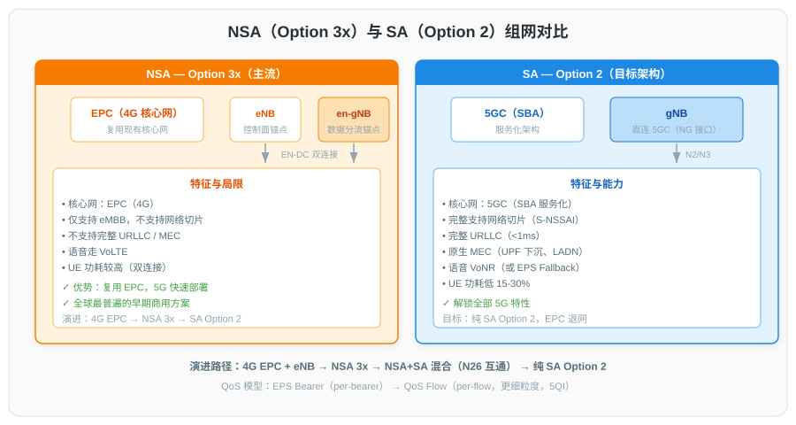
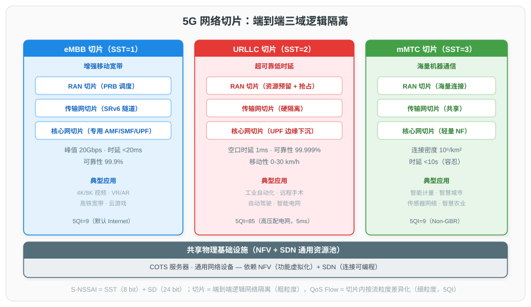

# 5G 网络架构与关键技术详解

## 一、概述

### 1.1 5G 定义与标准

5G 对应 ITU-R 命名的 **IMT-2020**，3GPP 从 **Release 15** 起定义 5G 系统（5GS），包含新空口 NR 与新核心网 5GC，功能冻结于 2018 年 6 月。5G 服务维度包括 eMBB、URLLC、mIoT、Flexible network operations（3GPP TS 22.261）。

### 1.2 ITU IMT-2020 三大应用场景

| 场景 | 全称 | 核心目标 | 典型应用 |
|------|------|---------|---------|
| **eMBB** | enhanced Mobile Broadband | 峰值 20 Gbps DL / 10 Gbps UL；用户体验速率 100 Mbps | 4K/8K 视频、VR/AR、高铁宽带 |
| **URLLC** | Ultra-Reliable Low Latency Communications | 空口时延 1 ms；可靠性 1−10⁻⁵ | 工业自动化、远程医疗、自动驾驶 |
| **mMTC** | massive Machine Type Communications | 连接密度 10⁶ 设备/km² | 智慧城市、智能计量、传感器网络 |

### 1.3 ITU IMT-2020 关键能力指标

| 指标 | IMT-Advanced (4G) | IMT-2020 (5G) |
|------|------|------|
| 峰值速率 | 1 Gbps | **20 Gbps（DL）/ 10 Gbps（UL）** |
| 用户体验速率 | 10 Mbps | 100 Mbps |
| 时延 | 10 ms | **1 ms（URLLC 空口）/ 4 ms（eMBB）** |
| 移动性 | 350 km/h | **500 km/h** |
| 连接密度 | 10⁴/km² | **10⁶/km²** |
| 区域流量容量 | 0.1 Mbit/s/m² | **10 Mbit/s/m²** |
| 网络能效 | — | 100×（相对 4G） |

### 1.4 3GPP 标准演进

| Release | 完成时间 | 定位 | 关键特性 |
|---------|---------|------|---------|
| **Rel-15** | 2018-06 | 5G Phase 1 | 5G NR 空口；NSA（Option 3x）+ SA（Option 2）；5GC SBA；聚焦 eMBB |
| **Rel-16** | 2020-07 | 5G 完善版 | 完整三大场景；增强 URLLC/IIoT；**TSN 集成**；NR-U；V2X；IAB；定位 |
| **Rel-17** | 2022-06 | 5G 扩展版 | **RedCap**（轻量化 NR）；**NTN**（卫星通信）；频谱扩展至 71 GHz；厘米级定位 |
| **Rel-18** | 2024-06 | **5G-Advanced 起步** | AI/ML 空口；eRedCap；NR 双工演进；XR 优化；网络节能 |
| **Rel-19** | 2025-12 | 5G-Advanced 延续 | XR 增强、能效增强；6G 前期研究 |

---

## 二、5G 核心网 SBA 服务化架构

### 2.1 SBA 核心理念

5GC 控制面采用**服务化架构**（3GPP TS 23.501）：网络功能（NF）以"服务"形式注册到 **NRF**，通过统一服务化接口（SBI）相互调用，实现松耦合、按需扩展、独立演进。

**SBA 三大优点**：拆分（NF 独立自治）、直达（NF 间直接通信免层级依赖）、智能化（自动注册、发现、状态检测）。**协议栈**：HTTP/2.0 + TCP + JSON + OpenAPI 3.0 + RESTful。服务化交互模式：Request-Response、Subscribe-Notify。

### 2.2 5GC 网络功能清单

| NF | 全称 | 主要职责 | 对应 4G EPC 网元 |
|------|------|---------|------|
| **AMF** | Access and Mobility Management Function | 接入与移动性管理、注册、NAS 信令终止 | MME（部分） |
| **SMF** | Session Management Function | 会话建立/释放、IP 地址分配、UPF 选择 | MME + P-GW-C |
| **UPF** | User Plane Function | 用户面路由转发、QoS 执行、流量上报 | S-GW + P-GW-U |
| **PCF** | Policy Control Function | 策略控制、QoS/计费规则下发 | PCRF |
| **UDM** | Unified Data Management | 用户签约数据、认证凭证 | HSS |
| **AUSF** | Authentication Server Function | 5G 主认证（5G AKA / EAP-AKA'） | HSS（部分） |
| **NSSF** | Network Slice Selection Function | 切片选择、AMF 重定向 | 4G 无 |
| **NEF** | Network Exposure Function | 能力开放（向第三方暴露 5G 能力） | SCEF（增强） |
| **NRF** | Network Repository Function | NF 服务注册、发现、状态维护 | 4G 无（SBA 新增） |
| **AF** | Application Function | 第三方应用与 5GC 交互（MEC、业务策略） | AF |

### 2.3 控制面与用户面分离（CUPS）

- **控制面**：AMF、SMF、PCF 等集中部署于云数据中心。
- **用户面**：UPF 可分布式下沉至边缘 DC（MEC 场景），独立扩缩容，支持按 PDU 会话选路。
- **优势**：用户面就近业务锚点降低时延；控制面集中化便于运维。

### 2.4 与 4G EPC 对比

| 维度 | 4G EPC | 5G 5GC |
|------|------|------|
| 架构 | 参考点（点对点） | **SBA 服务化** |
| 控制面网元 | MME 集中 | AMF + SMF 分离 |
| 用户面 | S-GW + P-GW | **UPF 统一，可下沉** |
| 接口协议 | GTP-C / Diameter | **HTTP/2 + JSON + RESTful** |
| 切片 | 不支持 | **端到端支持（S-NSSAI）** |
| QoS 模型 | EPS Bearer（per-bearer） | **QoS Flow（per-flow，更细粒度）** |
| NF 发现 | 静态配置 | **NRF 动态注册发现** |

---

## 三、NSA 与 SA 组网

### 3.1 部署选项

3GPP 定义多种部署选项，主流为 Option 3x（NSA）与 Option 2（SA）：

### 3.2 Option 3x（NSA 主流）

- **架构**：LTE eNB 为控制面锚点（RRC），5G en-gNB 为辅节点；**gNB 为数据分流锚点**，承载大部分用户面数据。
- **双连接**：EN-DC（E-UTRA–NR Dual Connectivity，TS 37.340）。
- **优势**：复用现有 EPC，5G 快速部署；不需 eNB 硬件大改。
- **局限**：仅支持 eMBB；不支持切片、URLLC 完整能力、SBA；语音仍走 VoLTE。

### 3.3 Option 2（SA 目标）

- **架构**：gNB 直连 5GC（N2 控制面到 AMF，N3 用户面到 UPF）。
- **支持全部 5G 特性**：网络切片、URLLC<1ms、MEC/LADN、NEF 能力开放、5QI per-flow QoS。
- **语音**：VoNR（或 EPS Fallback 初期）。

### 3.4 演进路径

4G EPC + eNB → Phase I：NSA Option 3x → Phase II：NSA + SA 混合（N26 互通） → Final：纯 SA Option 2（5GC + gNB），EPC 退网。

---

## 四、5G 无线接入网（NG-RAN）

### 4.1 gNB 与 CU-DU 分离架构

5G NR 将单体 gNB 拆解为三层（3GPP TS 38.401）：

| 单元 | 承载协议层 | 部署位置 | 角色 |
|------|---------|---------|------|
| **CU（Centralized Unit）** | RRC、PDCP | 区域数据中心 | 高层控制与汇聚 |
| — CU-CP | RRC + PDCP-C | — | 控制面 |
| — CU-UP | PDCP-U + SDAP | — | 用户面 |
| **DU（Distributed Unit）** | RLC、MAC、High-PHY | 基站现场 | 实时调度、HARQ |
| **RU（Radio Unit）** | Low-PHY、RF | 天线侧 | OFDM、波束赋形、功放 |

**关键接口**：F1（CU↔DU）、E1（CU-CP↔CU-UP）、NG（gNB↔5GC）、Xn（gNB↔gNB）。

### 4.2 5G 频谱

| 频段范围 | 频率 | 带宽 | 特点 |
|---------|------|------|------|
| **FR1（Sub-6GHz）** | 410 MHz – 7125 MHz | 单载波最大 100 MHz | 覆盖好、绕射强，5G 主用 |
| **FR2（mmWave）** | 24.25 GHz – 52.6 GHz（Rel-17 扩至 71 GHz） | 单载波最大 400 MHz | 超大带宽、峰值速率高、覆盖短 |

主要频段：FR1 含 n41（2.6G，中国移动）、n77/n78（3.3-3.8G，电信/联通）、n79（4.4-5.0G，移动）；FR2 含 n257/n258/n260/n261。

### 4.3 Massive MIMO 与波束赋形

- **Massive MIMO**：基站天线阵列远大于用户数（如 64T64R、128T128R），显著提升频谱效率、覆盖与容量。
- **波束赋形**：通过预编码将能量集中于目标用户方向；5G 引入 SSB 波束扫描（FR2 必需）和 CSI-RS 多波束。
- **Multi-TRP**（Rel-16）：多传输接收点协同，提升可靠性与覆盖。

### 4.4 Open RAN / O-RAN 架构

O-RAN Alliance 推动开放接口 + 智能化（RIC）+ 虚拟化（COTS 硬件），打破厂商锁定。逻辑组件：O-RU、O-DU、O-CU、**Near-RT RIC**（10 ms–1 s 控制环，xApps）、**Non-RT RIC**（>1 s，rApps，AI/ML）。关键接口：E2、A1、O1、O2、Open Fronthaul（7.2x，eCPRI over Ethernet）。

---

## 五、网络切片

### 5.1 定义与原理

网络切片在共享物理基础设施上构建多个**逻辑隔离的端到端网络**，每切片针对特定业务类型提供保障的端到端性能（3GPP TS 23.501 §5.15）。

**端到端三域切片**：RAN 切片 + 传输网切片 + 核心网切片。切片实例层级：Network Slice Instance（NSI）= 多个 Network Slice Subnet Instance（NSSI）。

### 5.2 切片标识 S-NSSAI

**S-NSSAI = SST（8 bit）+ SD（24 bit，可选）**。标准化 SST 值：

| SST | 类型 | 说明 |
|-----|------|------|
| 1 | eMBB | 增强移动宽带 |
| 2 | URLLC | 超可靠低时延 |
| 3 | MIoT | 海量 IoT |
| 4 | V2X | 车联网 |
| 5 | HMTC | 高性能机器通信（Rel-17） |
| 128-255 | 运营商自定义 | 私网、企业专用 |

UE 的 Allowed NSSAI 最多 8 个 S-NSSAI；可同时建立多个 PDU Session 至不同切片。

### 5.3 切片与 QoS 的关系

| 维度 | 切片 | QoS Flow |
|------|------|---------|
| 粒度 | 端到端逻辑网络隔离（粗粒度，业务级） | 切片内按流粒度差异化（细粒度，per-flow） |
| 标识 | S-NSSAI | QFI（由 5QI 决定 QoS 参数） |
| 关系 | 一个切片内可承载多个 QoS Flow | — |

**5QI** 决定 {资源类型、优先级、PDB、PER}。资源类型：GBR / Non-GBR / Delay-Critical GBR。示例：5QI=1（VoNR 语音，GBR，PDB 100ms）；5QI=85（高压配电网，Delay-Critical GBR，5ms，10⁻⁵）。

### 5.4 RAN 切片机制

MAC 调度器按切片分区 PRB（如 40% eMBB、10% URLLC 预留、50% 共享）；QoS Flow 映射到切片专用 DRB；URLLC 可抢占 eMBB 资源（TS 38.213 §11.2）。

---

## 六、MEC 多接入边缘计算

### 6.1 定义与演进

ETSI ISG MEC（2014 成立）将计算、存储、网络能力下沉到网络边缘。缩写从 Mobile Edge Computing（2014）扩展为 **Multi-access Edge Computing**（2017，覆盖蜂窝 + WLAN + 固定接入）。核心规范：**ETSI GS MEC 003**（Framework and Reference Architecture）。

### 6.2 ETSI MEC 参考架构

**两级结构**：

| 层级 | 组件 |
|------|------|
| MEC 系统级 | MEO（编排）、OSS、UALCMP（用户应用生命周期管理代理） |
| MEC 主机级 | MEP（服务注册发现、流量规则、DNS）、NFVI、VIM、MEC Apps |

### 6.3 MEC 与 5G 集成

- **UPF 下沉**：UPF 作为 5GC 与 MEC 的连接锚点，部署于边缘 DC 实现本地分流。
- **本地分流模式**：UL-CL（上行分类器分流）、LADN（本地数据网）、Edge App Routing。
- **EASDF**（Rel-17）：边缘应用服务器发现功能，增强 DNS 解析。
- **AF 与 5GC 交互**：MEC 应用经 NEF 或直接经 AF 影响流量路由、QoS、PCF 策略。

### 6.4 MEC 应用场景

工业 4.0（AGV 协同、机器视觉质检 <10ms）、车联网（V2X 实时路况）、AR/VR/XR（云化渲染）、视频分析（智慧城市监控本地处理）、企业专网（数据不出园区）。

---

## 七、5G 关键技术总览

| 技术 | 核心要点 |
|------|---------|
| **网络切片** | 端到端逻辑隔离，基于 NFV/SDN，S-NSSAI 标识（详见第五章） |
| **边缘计算 MEC** | UPF 下沉 + ETSI MEC 平台（详见第六章） |
| **Massive MIMO** | 64T64R 及以上，SSB/CSI-RS 波束扫描，Multi-TRP 协同 |
| **毫米波** | FR2 24.25-71 GHz，单载波 400 MHz，支持 20 Gbps 峰值，与 Sub-6G 互补 |
| **URLLC** | 空口 1ms，可靠性 99.9999%；mini-slot、两步 RACH、冗余传输、抢占调度 |
| **TSN 集成**（Rel-16） | 5G 作为 IEEE 802.1 TSN 网桥，时间感知调度，授时精度 20 ns 级 |
| **网络功能虚拟化** | 5GC NF 以 VNF/CNF 部署于 NFVi，支撑切片按需实例化，UPF 下沉 |
| **RedCap**（Rel-17） | 轻量化 NR 设备，填补 eMBB 与 mMTC 间"中端 IoT"空白 |
| **NTN**（Rel-17） | 卫星/HAPS 集成，扩展覆盖 |
| **Sidelink**（Rel-16/17） | 终端直连（V2X、公共安全） |

---

## 八、应用场景与演进趋势

### 8.1 垂直行业应用

- **汽车/交通**：V2X、自动驾驶、车队管理（URLLC + MEC + 切片）
- **工业 4.0**：IIoT、TSN 集成、AGV、机器视觉（URLLC + MEC + 私网）
- **能源**：智能电网（高压配网 5QI=85，5ms 时延）
- **医疗**：远程手术、远程问诊（URLLC + eMBB）
- **媒体娱乐**：4K/8K、VR/AR/XR、云游戏（eMBB + MEC）
- **智慧城市**：视频监控、智能计量（mMTC + MEC）

### 8.2 演进趋势

1. **NSA → SA 全面迁移**：运营商逐步部署 5GC，解锁切片、URLLC、MEC。
2. **5G-Advanced（Rel-18/19）**：AI/ML 空口、eRedCap、双工演进、XR 优化、网络节能。
3. **云原生 5GC**：VNF → CNF（K8s），CI/CD，Service Mesh。
4. **O-RAN 商用化**：多厂商互操作、RIC 智能化。
5. **5G + TSN 融合**：工业确定性网络。
6. **NTN 与地面网络融合**：立体覆盖（卫星 + 地面）。
7. **迈向 6G**（IMT-2030，ITU-R M.2160 框架 2023-12 发布）：AI 原生网络、ISAC（通信感知一体化）、太赫兹、空天地一体化。

---

## 九、参考资料

### ITU（国际电信联盟）

- [Recommendation ITU-R M.2083 — IMT-2020 愿景与三大场景](https://www.itu.int/rec/R-REC-M.2083)
- [Report ITU-R M.2410 — IMT-2020 无线接口最低技术性能要求](https://www.itu.int/pub/R-REP-M.2410)
- [IMT/IMT-2020/IMT-2030 常见问题](https://www.itu.int/en/itu-r/documents/itu-r-faq-imt.pdf)

### 3GPP（第三代合作伙伴计划）

- [5G 系统总览](https://www.3gpp.org/technologies/5g-system-overview)
- [Release 15（5G Phase 1）](https://www.3gpp.org/specifications-technologies/releases/release-15)
- [Release 16（URLLC/IIoT/TSN/V2X/NR-U）](https://www.3gpp.org/specifications-technologies/releases/release-16)
- [Release 17（RedCap/NTN/71GHz/定位）](https://www.3gpp.org/specifications-technologies/releases/release-17)
- [Release 18（5G-Advanced 起步）](https://www.3gpp.org/specifications-technologies/releases/release-18)
- [TS 23.501 — 5G 系统架构（SBA、NF、切片、QoS）](https://portal.3gpp.org/desktopmodules/Specifications/SpecificationDetails.aspx?specificationId=3144)
- [TS 38.401 — NG-RAN 架构（CU-DU 切分）](https://portal.3gpp.org/desktopmodules/Specifications/SpecificationDetails.aspx?specificationId=3219)
- [TS 37.340 — 多连接（EN-DC/NE-DC/NGEN-DC）](https://portal.3gpp.org/desktopmodules/Specifications/SpecificationDetails.aspx?specificationId=3398)

### ETSI（欧洲电信标准协会）

- [ETSI GS MEC 003 — MEC 框架与参考架构](https://www.etsi.org/deliver/etsi_gs/MEC/001_099/003/03.01.01_60/gs_MEC003v030101p.pdf)
- [ETSI ISG NFV：NFV 作为 5G 基础设施使能](https://docbox.etsi.org/workshop/2017/20170406_ETSI_SUMMIT_5G_NWK_INFRASTRUCTURE/02_SESSION_B_BEYOND_TODAYS_NWK_SERV_MANAGEM/5G_INFRASTRUCTURE_ENABLER_ETSI_NFV_TRIAY.pdf)

### O-RAN Alliance

- [O-RAN 白皮书：开放智能 RAN 愿景与架构](https://mediastorage.o-ran.org/white-papers/O-RAN.White-Paper-2018-10.pdf)
- [O-RAN 全部规范](https://www.o-ran.org/specifications)

### 厂商白皮书

- [Ericsson 白皮书：5G-Advanced 演进至 6G](https://www.ericsson.com/49ce19/assets/local/reports-papers/white-papers/5g-advanced-evolution-towards-6g-v2.pdf)
- [Qualcomm 白皮书：Rel-17 完成 5G 第一阶段演进](https://www.qualcomm.com/content/dam/qcomm-martech/dm-assets/documents/powerpoint_messaging_-_3gpp_release_17_completing_the_first_phase_of_5g_evolution.pdf)
- [Nokia 白皮书：Voice over 5G 部署选项](https://www.nokia.com/asset/f/207122/)
