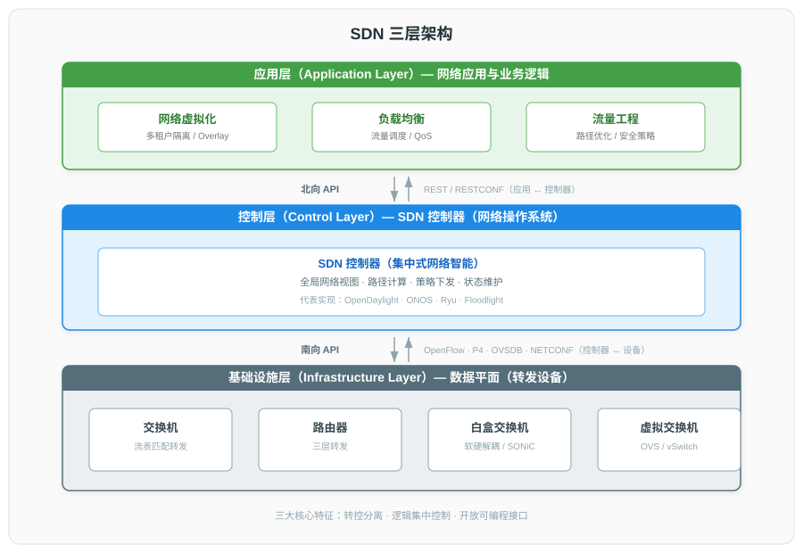
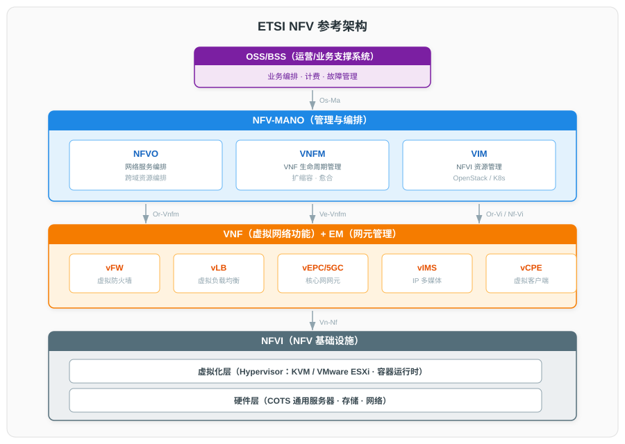
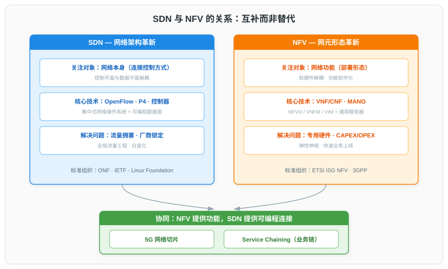

# SDN 与 NFV 网络架构演进详解

## 一、概述

### 1.1 传统网络架构的痛点

传统网络基于分布式控制模型，每台设备独立运行路由协议并独立决策，控制平面与数据平面垂直耦合于设备内部。该架构在云原生与 5G 时代暴露出以下核心问题：

| 问题类别 | 描述 |
|------|------|
| **流量易拥塞** | 基于固定最短路径算法（OSPF/IS-IS），无法全局优化；某链路拥塞时即使有空闲替代路径仍走最短路径，导致丢包 |
| **控制面耦合** | 控制平面与数据平面耦合于每台设备，缺乏全局视图；规模扩展时协议交互频繁、控制面负担加重 |
| **厂商锁定严重** | 软硬件垂直集成，设备商命令行超万条且持续增加，跨厂商互通困难 |
| **运维效率低下** | 故障依赖人工抓包定位，约 85% 故障由用户投诉才发现；数据中心故障平均定位 76 分钟 |
| **业务部署缓慢** | 网络策略基于 IP/物理位置，无法细化到用户/应用；新业务需逐台配置设备，无零配置部署能力 |

### 1.2 SDN 与 NFV 的定位

SDN（软件定义网络）与 NFV（网络功能虚拟化）从两个不同维度回应上述痛点：

- **SDN** 革新网络架构：将控制平面从设备中抽出并集中化，使数据平面成为可编程的转发引擎。
- **NFV** 革新网元形态：将网络功能从专用硬件解耦，以软件形式运行于通用服务器，实现功能的弹性部署。

二者**互补而非替代**：NFV 解决"功能形态"，SDN 解决"连接控制"，二者协同构成 5G/6G 云化网络的基石。

---

## 二、SDN 软件定义网络

### 2.1 定义与起源

**定义（ONF 官方）**：软件定义网络是一种网络架构，其核心特征为**控制平面与数据平面解耦**、**网络智能与状态逻辑上集中化**、**底层网络基础设施对应用抽象**，从而获得前所未有的可编程性、自动化与网络控制能力。

**起源脉络**：

| 时间 | 事件 |
|------|------|
| 2006 | 斯坦福大学 Clean Slate 课题，Martin Casado 主导 Ethane 项目（基于流的安全策略集中控制） |
| 2008 | Nick McKeown 等人发表 SIGCOMM 论文《OpenFlow: Enabling Innovation in Campus Networks》 |
| 2011-03 | Google、Facebook、Microsoft 等 7 家公司推动成立**开放网络基金会（ONF）**，推动 SDN 标准化 |
| 2012 | ONF 发布白皮书《Software-Defined Networking: The New Norm for Networks》，确立三层架构模型 |
| 2012 | Google 宣布 B4 主干网全面运行 OpenFlow，WAN 链路利用率从 30% 提升至接近饱和，标志 SDN 商用成熟 |

### 2.2 三层架构

ONF 白皮书定义的 SDN 三层架构是其被业界广泛认同的参考模型：

**ONF 三大核心特征**：转控分离（Separation of control and forwarding）、逻辑集中控制（Logically centralized control）、开放可编程接口（Open programmable interfaces）。

### 2.3 OpenFlow 协议

OpenFlow 是 SDN 架构中**控制器与交换机之间的首个标准化南向通信接口**，定义控制平面与数据平面间的通信协议。它是协议与 API，而非产品。

**消息类型**（三大类）：

| 类型 | 方向 | 说明 |
|------|------|------|
| Controller-to-Switch | 控制器→交换机 | 管理或查询交换机状态，含 Handshake、Flow-Mod、Multipart 等 |
| Asynchronous | 交换机→控制器 | 异步上报网络事件，含 Packet-In、Flow-Removed、Port-Status |
| Symmetric | 双向 | Hello、Echo、Barrier 等不请自发的消息 |

**流表机制**：每个流表由多个流表项组成，流表项 = Match Fields（匹配域）+ Priority（优先级）+ Counters（计数器）+ Instructions（指令）+ Timeouts（超时）+ Cookie。报文进入后从最小序号流表开始流水线匹配，支持多级流表（Multi-Table Pipeline）。

**版本演进**：

| 版本 | 发布时间 | 关键增强 |
|------|---------|---------|
| OpenFlow 1.0 | 2009-12 | 单流表，基本匹配（MAC/IP/TCP/UDP） |
| OpenFlow 1.1 | 2011-02 | **多级流表（Multi-Table Pipeline）**、Group Table、MPLS |
| OpenFlow 1.2 | 2011-12 | **OXM（TLV 编码匹配）**、IPv6、多控制器 |
| OpenFlow 1.3 | 2012-06 | **ONF 长期稳定版本**，匹配字段增至 40 个、Meter Table（QoS） |
| OpenFlow 1.4 | 2013-10 | 辅助连接、Bundling 消息 |
| OpenFlow 1.5 | 2014-12 | Egress Table、数据包编辑增强 |

目前广泛部署版本为 OpenFlow 1.0 与 1.3（1.3 为长期支持稳定版）。

### 2.4 SDN 控制器

| 控制器 | 主导方 | 语言 | 特点 | 适用场景 |
|------|------|------|------|---------|
| **OpenDaylight (ODL)** | Linux Foundation | Java | 模块化 OSGi，支持多种南向协议，Akka 分布式集群 | 企业/数据中心/运营商，多厂商环境 |
| **ONOS** | Linux Foundation | Java | 电信级高可用，Atomix 分布式集群，横向扩展强 | 运营商广域网/骨干网（高可靠场景） |
| **Ryu** | NTT | Python | 轻量、API 简洁、支持 OpenFlow 1.0/1.2/1.3 | 科研、原型开发、小型部署 |
| **Floodlight** | Big Switch | Java | 与商用 Controller 同核，Apache 许可 | 企业/学术 |
| **NOX/POX** | 斯坦福大学 | C++/Python | 第一款 OpenFlow 控制器（2008） | 学术研究 |

### 2.5 南向与北向接口

**南向接口（控制器 ↔ 设备）**：

| 协议 | 标准组织 | 用途 |
|------|---------|------|
| **OpenFlow** | ONF | 流表下发、转发行为控制 |
| **OF-Config** | ONF | OpenFlow 交换机设备级配置（基于 NETCONF） |
| **NETCONF** | IETF RFC 6241 | 通用网络设备配置管理（XML/SSH，事务化） |
| **OVSDB** | IETF RFC 7047 | 管理 Open vSwitch 配置（JSON-RPC） |
| **P4 / P4 Runtime** | P4.org | 可编程数据平面控制（gRPC + Protobuf） |
| **BGP-LS** | IETF RFC 7752 | 将 IGP 链路状态拓扑导出给控制器 |
| **PCEP** | IETF RFC 5440 | 路径计算与下发（与 SR/SRv6 协同） |

**北向接口（应用 ↔ 控制器）**：典型实现为 REST API / RESTCONF（基于 HTTP，JSON/XML）。应用层向控制器声明网络需求（带宽、QoS、隔离），控制器向应用暴露网络抽象（拓扑、流量统计）。北向接口尚未如 OpenFlow 般统一标准化，各控制器实现各异。

---

## 三、NFV 网络功能虚拟化

### 3.1 定义与标准组织

**定义**：网络功能虚拟化将网络功能（防火墙、路由器、负载均衡、EPC 节点、IMS 等）从专用硬件设备中**解耦**，以软件形式（VNF）运行于通用 x86/ARM 服务器（COTS）上，从而降低 CAPEX/OPEX、加速业务上线、提升弹性。

**标准组织**：**ETSI ISG NFV**（Industry Specification Group），2012 年由 AT&T、Verizon、德国电信、中国移动、NTT 等 7 家运营商发起成立，是 NFV 最权威的标准组织。

**Release 演进**：

| Release | 重点 |
|---------|------|
| Rel-1 | 可行性研究与基线规范，确立 NFV 架构三大块 |
| Rel-2 | 互操作性，规定接口与描述符（VNFD、NSD、VNF Package） |
| Rel-3 | 策略框架、VNF 快照、多站点、云原生雏形 |
| Rel-4 | **容器管理与编排（CISM、CIR、CCM）**、vRAN、Green NFV |
| Rel-5 | 整合与生态、云原生 VNF 可靠性、SBA 概念 |

### 3.2 ETSI NFV 参考架构

ETSI NFV 参考架构由三大功能块组成：

| 功能块 | 职责 |
|------|------|
| **VNF（虚拟网络功能）** | 网络功能的软件实现（vFW、vLB、vEPC、vIMS 等），由 EM（网元管理）管理 |
| **NFVI（NFV 基础设施）** | 计算/存储/网络资源 + 虚拟化层（Hypervisor 或容器运行时），为 VNF 提供运行环境 |
| **NFV-MANO（管理与编排）** | 管理与编排 VNF/NFVI 的全生命周期 |

### 3.3 MANO 三组件

| 组件 | 全称 | 职责 |
|------|------|------|
| **NFVO** | NFV Orchestrator | 端到端 NS 编排、跨 VNF/基础设施的资源编排、与 OSS/BSS 对接 |
| **VNFM** | VNF Manager | 单个或多个 VNF 的生命周期管理（实例化、扩缩容、愈合、终止） |
| **VIM** | Virtualised Infrastructure Manager | 管理 NFVI 的计算/存储/网络资源；典型实现：OpenStack（VM 场景）、Kubernetes（CNF 场景） |

**关键参考点**：`Vn-Nf`（VNF↔NFVI）、`Ve-Vnfm`（VNF/EM↔VNFM）、`Or-Vnfm`（NFVO↔VNFM）、`Or-Vi`（NFVO↔VIM）、`Vi-Vnfm`（VIM↔VNFM）、`Nf-Vi`（NFVI↔VIM）、`Os-Ma`（MANO↔OSS/BSS）。

### 3.4 VNF 与 CNF 演进

NFV 的网元形态经历三代演进：

| 维度 | PNF（物理网络功能） | VNF（虚拟网络功能） | CNF（云原生网络功能） |
|------|------|------|------|
| 部署形态 | 专用硬件设备 | VM + Hypervisor | 容器 + 微服务 + Kubernetes |
| 资源粒度 | 整机 | VM（较重） | 容器/Pod（毫秒级启动） |
| 弹性扩缩 | 几乎不可能 | 分钟级 | 秒级水平扩展 |
| 状态管理 | 状态内嵌 | 通常状态内嵌 | **无状态设计**（状态外置） |
| 与 5G 关系 | 传统网元 | 4G/5G NSA 主流 | **5G SA 核心网 NF 主流形态（SBA 微服务）** |
| CI/CD | 厂商硬件周期 | 较慢 | GitOps/Helm/Argo CD，敏捷 |

ETSI WP-65（2025-03）指出 NFV 正向 **Telco Cloud** 演进，原则为：简化、云原生、跨基础设施可移植、增强自动化、模块化与可扩展。技术使能器包括声明式管理 API、GitOps、控制器化平台、数字孪生、AI。

---

## 四、SDN 与 NFV 对比与协同

### 4.1 多维度对比

| 维度 | SDN | NFV |
|------|------|------|
| **核心目标** | 网络架构革新：转控分离、集中控制、可编程 | 网元形态革新：功能虚拟化、软硬件解耦、云化 |
| **变革对象** | 网络本身（交换机/路由器的控制方式） | 网络功能（防火墙/路由器/EPC 的部署形态） |
| **抽象层次** | 控制平面抽象（集中式网络操作系统） | 网元功能抽象（虚拟化/容器化） |
| **起源方** | 学术界（斯坦福 Clean Slate）+ ONF | 运营商（AT&T 等 7 家）+ ETSI ISG NFV |
| **主导标准组织** | ONF（OpenFlow）；IETF（PCEP、BGP-LS）；Linux Foundation | ETSI ISG NFV；3GPP（5GC SBA） |
| **关键技术** | OpenFlow、P4、OVSDB、控制器集群、白盒交换机 | Hypervisor/容器、VNF/CNF、MANO、描述符 |
| **核心架构** | 三层：应用层 / 控制层 / 基础设施层 | 三块：VNF / NFVI / MANO |
| **基础设施** | 物理交换机/路由器（含白盒） | 通用 x86/ARM 服务器 + 虚拟化层 |

### 4.2 互补关系

- **NFV 虚拟化网元功能**（AMF/SMF/防火墙），**SDN 提供这些虚拟化功能之间的可编程连接**。
- **协同场景一：5G 网络切片**——SDN 控制器为切片动态建立虚链路与带宽，NFV 提供切片专用 VNF/CNF 实例。
- **协同场景二：Service Chaining**——SDN 引导用户面流量穿越一串 VNF（防火墙→优化器→DPI），NFV 提供这些 VNF 的弹性部署。
- **架构层次**：NFV 关注网元层（VNF/NFVI/MANO），SDN 关注网络层（控制器+数据平面）。

---

## 五、关键技术演进

### 5.1 P4 可编程数据平面

P4 源自 2014 年 Bosshart 等人发表于 SIGCOMM 的论文《Programming Protocol-independent Packet Processors》。它是一种**协议无关**的数据平面编程语言，被视为"OpenFlow 2.0"候选——OpenFlow 是固定字段表 API，P4 让控制器先**定义交换机如何工作**，再下发表项。

**三大目标**：

| 目标 | 说明 |
|------|------|
| Reconfigurability（可重配置） | 解析器与处理逻辑可在部署后由控制器重新定义 |
| Protocol Independence（协议无关） | 交换机不绑定特定协议，由程序员定义解析器与表 |
| Target Independence（目标无关） | 编程与底层 ASIC/FPGA/NPU 解耦，编译器适配 |

**语言版本**：P4₁₄（v1.0.x, 2014）→ P4₁₆（v1.2.3, 2021+），由 P4.org 维护。**P4 Runtime** 基于 gRPC + Protocol Buffers，控制由 P4 程序定义的数据平面。应用场景包括 In-Band Network Telemetry（INT）、SmartNIC、5G UPF 加速。

### 5.2 白盒交换机

白盒交换机将硬件（ODM 制造，如 Edge-core、Delta、Quanta）与网络操作系统（NOS）解耦，参考"白盒服务器"模式，使能多厂商设备混用，摆脱厂商锁定。

| 项目/标准 | 主导方 | 说明 |
|---------|------|------|
| **SONiC** | 微软/Linux Foundation | Software for Open Networking in the Cloud，社区版 NOS |
| **STRATUM** | ONF | 实现可编程数据平面的开源项目 |
| **FRR** | 开源社区 | Free Range Routing，开源控制平面 |
| **Cumulus Linux** | NVIDIA | 商用 Linux NOS |

### 5.3 SD-WAN

SD-WAN 将 SDN 理念引入企业 WAN：控制平面集中、数据平面分布式，多链路（MPLS/Internet/LTE）混合承载。关键能力包括应用识别与智能选路、流量负载均衡、链路故障快速切换、IPsec 加密、vCPE。典型厂商有 VMware Velocloud、Cisco Viptela、华为 NetEngine AR。演进方向是与 SASE（Secure Access Service Edge）融合，叠加安全能力（SWG/CASB/ZTNA）。

### 5.4 Segment Routing 与 SRv6

Segment Routing（RFC 8402）采用源路由范式：源节点在报文中携带**有序指令列表（segments）**，流状态仅维护在 ingress 节点，中间节点无状态。两种数据平面：

- **SR-MPLS**（RFC 8660）：段编码为 MPLS 标签，段列表为标签栈。
- **SRv6**（RFC 8754）：段编码为 IPv6 地址（128 位 SID），段列表存放于 SRH（Segment Routing Header）。SRv6 SID 结构由 RFC 9602 定义，uSID（Micro-Segment）压缩编码降低开销。

**与 SDN 协同**：SDN 控制器作为 PCE（Path Computation Element），通过 PCEP 协议集中计算 SR Policy 与 SID 列表，下发至 ingress 节点；混合 SDN + 分布式控制平面（IGP 仍通告 Segment）。SRv6 正替代 MPLS 成为 WAN 主流。

### 5.5 数据中心 EVPN/VXLAN

现代数据中心采用 **Spine-Leaf（叶脊）** 拓扑替代传统三层树状，降低东西向流量延迟。

- **VXLAN（RFC 7348）**：MAC-in-UDP 封装，24 位 VNI 支持 1600 万隔离网络，解决 VLAN 4094 上限。
- **BGP EVPN（RFC 7432）**：基于 MP-BGP 的 EVPN 地址族，通过 RT-1/RT-2/RT-3/RT-5 路由同步 MAC/IP/VNI，**控制平面学习替代泛洪学习**，杜绝广播风暴。

---

## 六、应用场景

### 6.1 数据中心网络（SDN Fabric）

Spine-Leaf 拓扑 + VXLAN Overlay + BGP EVPN 控制平面，由 SDN 控制器（ODL/ONOS/Cisco ACI）下发隧道、BUM 表、安全策略。网关模式分集中式（Spine 集中三层网关）与分布式（Leaf 任播网关，推荐）。

### 6.2 SD-WAN

见 5.3 节。SDN 控制平面集中 + NFV vCPE，多链路混合承载，向 SASE 演进。

### 6.3 5G 核心网

5GC（3GPP TS 23.501）采用 **SBA（服务化架构）**：NF 拆分为微服务，通过 SBI（RESTful over HTTP/2 + JSON）通信，NRF 作为服务注册中心。控制面/用户面分离（CUPS）使 UPF 可分布式下沉至边缘。网络切片依赖 NFV（功能虚拟化）+ SDN（连接可编程）共同实现。

### 6.4 边缘计算 MEC

ETSI MEC（Multi-access Edge Computing）将计算/存储/业务能力下沉到网络边缘。MEC 平台运行于 NFVI 之上，SDN 控制器提供本地分流（Local Breakout）与连接；UPF 可与 MEC 同址部署，实现毫秒级低时延与本地化数据安全。

---

## 七、演进趋势

1. **SDN 与 NFV 深度融合**：5G/6G 核心网采用 SBA + NFV/SDN + Cloud Native，向 Telco Cloud 统一平台演进。
2. **VNF → CNF 迁移**：容器化、微服务化、无状态化、GitOps/CI-CD 化；VM 与容器混合运行是当前主流。
3. **数据平面可编程化**：P4 + P4 Runtime + SmartNIC + 白盒交换机，OpenFlow 向 P4 演进。
4. **SRv6 成为 WAN 主流**：替代 MPLS，与 SDN PCE 协同实现可编程 WAN。
5. **EVPN 成为数据中心标准控制平面**：BGP EVPN + VXLAN 替代泛洪学习。
6. **AI 驱动自治网络**：NFV-MANO 叠加 AI 用于故障检测、容量伸缩、配置漂移纠正。

---

## 八、参考资料

### SDN 标准与白皮书

- [ONF SDN 白皮书《Software-Defined Networking: The New Norm for Networks》](https://opennetworking.org/sdn-resources/whitepapers/software-defined-networking-the-new-norm-for-networks/)
- [IBM SDN 概念综述](https://www.ibm.com/think/topics/sdn)
- [华为百科：OpenFlow 起源与原理](https://info.support.huawei.com/info-finder/encyclopedia/en/OpenFlow.html)

### OpenFlow 协议规范

- [OpenFlow Switch Specification v1.3.5（长期稳定版）](https://opennetworking.org/wp-content/uploads/2014/10/openflow-switch-v1.3.5.pdf)

### SDN 控制器

- [OpenDaylight 项目](https://www.opendaylight.org/)
- [ONOS 项目](https://opennetworking.org/onos/)
- [Ryu 控制器](https://ryu-sdn.org/)

### NFV 标准（ETSI）

- [ETSI NFV INF 004（Hypervisor Domain）](https://etsi.org/deliver/etsi_gs/NFV-INF/001_099/004/01.01.01_60/gs_NFV-INF004v010101p.pdf)
- [ETSI WP-65 NFV 演进 Telco Cloud（2025-03）](https://www.etsi.org/images/files/ETSIWhitePapers/ETSI-WP-65-NFV-evolution-Towards_the_Telco_Cloud.pdf)
- [ETSI WP-67 NFV-MANO 价值（2025-05）](https://www.etsi.org/images/files/ETSIWhitePapers/ETSI-WP-67-The-Role-of-NFV-MANO-and-Its-Added-Value.pdf)

### P4 可编程数据平面

- [P4₁₆ Language Spec v1.2.3](https://p4.org/wp-content/uploads/sites/53/p4-spec/docs/P4-16-v1.2.3.pdf)
- [P4 原始论文（Bosshart 等, SIGCOMM 2014）](https://www.cs.princeton.edu/courses/archive/fall16/cos561/papers/P414.pdf)
- [P4 Runtime Spec](https://p4lang.github.io/p4runtime/spec/v1.4.0/P4Runtime-Spec.html)

### Segment Routing / SRv6 RFC

- [RFC 8402 — Segment Routing Architecture](https://www.rfc-editor.org/rfc/rfc8402)
- [RFC 8754 — IPv6 Segment Routing Header (SRH)](https://www.rfc-editor.org/rfc/rfc8754)
- [RFC 9602 — SRv6 SIDs in IPv6 Addressing](https://www.ietf.org/rfc/rfc9602.html)
- [RFC 9256 — Segment Routing Policy Architecture](https://www.rfc-editor.org/rfc/rfc9256)

### 数据中心 Fabric / VXLAN / EVPN

- [RFC 7348 — VXLAN](https://www.rfc-editor.org/rfc/rfc7348)
- [RFC 7432 — BGP MPLS-Based EVPN](https://www.rfc-editor.org/rfc/rfc7432)
- [RFC 7752 — BGP-LS（North-Bound Distribution of Link-State）](https://www.rfc-editor.org/rfc/rfc7752)

### 南向接口 RFC

- [RFC 6241 — NETCONF Configuration Protocol](https://www.rfc-editor.org/rfc/rfc6241)
- [RFC 7047 — The OVSDB Management Protocol](https://www.rfc-editor.org/rfc/rfc7047)

### NFV 演进与厂商白皮书

- [Ericsson NFV 与云原生演进](https://www.ericsson.com/en/nfv)
- [Red Hat：VNF vs CNF 区别](https://www.redhat.com/en/topics/cloud-native-apps/vnf-and-cnf-whats-the-difference)

### 5G 核心网与 SBA

- [3GPP TS 23.501 — 5G 系统架构（SBA、NF、切片、QoS）](https://portal.3gpp.org/desktopmodules/Specifications/SpecificationDetails.aspx?specificationId=3144)
- [3GPP OpenAPIs for Service-Based Architecture](https://www.3gpp.org/technologies/openapis-for-the-service-based-architecture)
