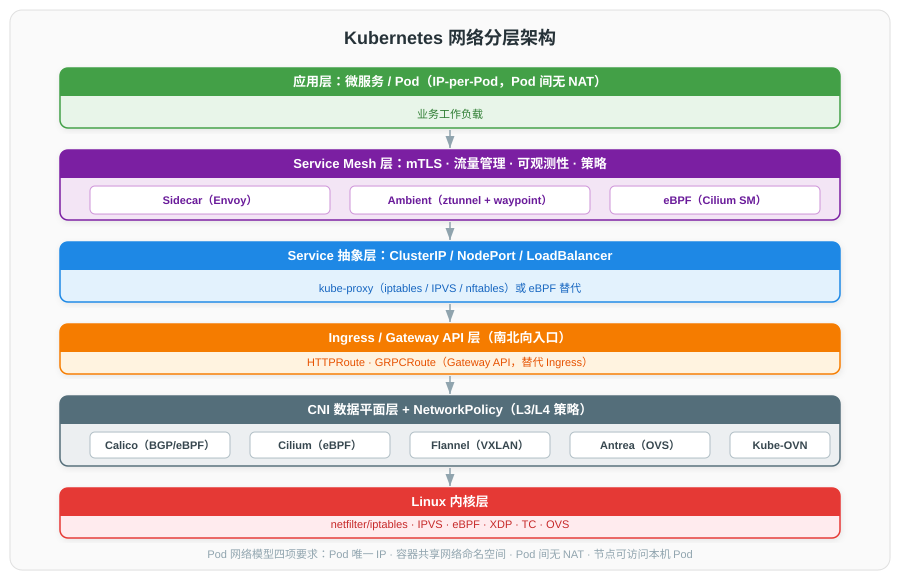
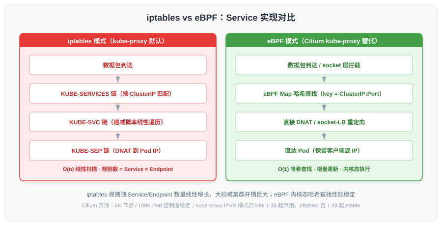
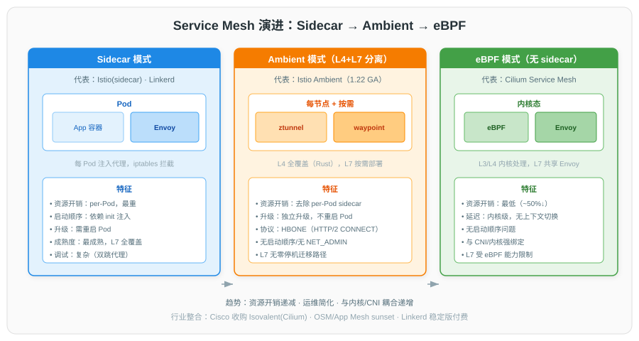

# 云原生网络技术详解

## 一、概述

云原生网络是 Kubernetes 与容器化工作负载的通信基础设施。它以 **IP-per-Pod** 模型为核心，向上为微服务提供 Service 抽象与 Service Mesh 治理，向下通过 CNI 插件构建 Pod 互连网络，并依托 Linux 内核能力（iptables、IPVS、eBPF、XDP）实现数据转发与策略控制。近年 eBPF 的崛起正在重塑数据平面，Service Mesh 也从 per-Pod sidecar 向无 sidecar 模式演进。

---

## 二、Kubernetes 网络模型与 CNI

### 2.1 Pod 网络模型（IP-per-Pod）

每个 Pod 拥有**集群唯一 IP**（而非 per-container），Pod 内所有容器共享同一个 network namespace（由 `pause` 容器持有），同 Pod 内容器通过 `localhost` 通信。

**Kubernetes 网络模型四项要求**（Kubernetes 官方）：

| 要求 | 说明 |
|------|------|
| Pod 唯一 IP | 集群中每个 Pod 获得集群范围内唯一 IP 地址 |
| 容器共享命名空间 | Pod 内容器共享 network namespace，可通过 localhost 互通 |
| Pod 间无 NAT | 所有 Pod 间（无论同节点/跨节点）可直接通信，无需代理或 NAT |
| 节点可达 Pod | 节点上的代理（kubelet、系统守护进程）可与该节点所有 Pod 通信 |

**NAT 边界**：NAT 只在节点对外（egress 到集群外）时发生；Pod↔Pod 间无 NAT，源 IP 端到端保留。该模型是 NetworkPolicy、服务网格身份、可观测性、调试的基础。

### 2.2 CNI 规范

**CNI（Container Network Interface）** 是 CNCF 项目，定义容器运行时与网络插件之间的最简接口规范，只关注容器网络连接。

- **工作原理**：运行时通过环境变量传参 + stdin JSON 配置调用插件，插件在 stdout 返回结果。
- **操作（verbs）**：`ADD`（加入网络）、`DEL`（移除）、`CHECK`（校验）、`STATUS`（v1.1 探活）、`GC`（v1.1 清理）、`VERSION`（版本协商）。
- **最新规范版本**：CNI spec **1.1.0**（与 CNI 库/插件版本独立）。
- **链式调用（Chaining）**：v0.5 引入，可配置插件列表依次调用，用于 portmap、bandwidth 等能力附加。

### 2.3 主流 CNI 插件对比

| 维度 | Calico | Cilium | Flannel | Antrea | Kube-OVN |
|------|------|------|------|------|------|
| 数据平面 | iptables / eBPF | eBPF | 内核（VXLAN/路由） | OVS | OVN/OVS |
| 默认网络模式 | BGP（L3） | native routing / VXLAN / Geneve | VXLAN | VXLAN/Geneve | OVN overlay |
| 封装支持 | IPIP / VXLAN | VXLAN / Geneve | VXLAN / UDP / host-gw | VXLAN / Geneve | STT/Geneve |
| BGP | 原生支持 | 不支持 | 不支持 | 不支持 | 不支持 |
| NetworkPolicy | 支持 + 扩展（L7） | 支持 + 扩展（L7 HTTP/Kafka/DNS） | 不支持（需 Calico） | 支持 + 扩展 | 支持 |
| kube-proxy 替代 | 支持（eBPF 模式） | 支持（eBPF） | 不支持 | 支持 | 不支持 |
| 加密 | WireGuard | WireGuard/IPsec | WireGuard | IPsec/WireGuard | 不支持 |
| 可观测性 | L7 Logs（企业版） | **Hubble**（强） | 无 | Flow Visibility | 一般 |
| Service Mesh | 通过 Istio 集成 | **Cilium Service Mesh** | 无 | 无 | 无 |
| CNCF 状态 | Incubating | Graduated | — | Sandbox | — |

**Calico**：纯三层 BGP 路由为标志特性，通过 BIRD 分发路由，无 overlay 开销；eBPF 模式要求内核 ≥ 5.10。

**Cilium**：基于 eBPF 的数据平面，CNCF Graduated 项目（2023 毕业），从底层重构 Kubernetes 网络，支持 5K 节点 / 100K Pod 规模。

**Flannel**：最简单，仅提供基础 Pod 互连，无网络策略；host-gw 模式性能最佳但要求节点同 L2 子网。

---

## 三、eBPF 网络技术

### 3.1 eBPF 定义

**eBPF（extended Berkeley Packet Filter）**：在 Linux 内核中运行**安全沙箱程序**的技术，无需修改内核源码或加载内核模块。核心特性包括事件驱动、内核态执行、Verifier 安全验证（无死循环、无内存越界）、JIT 编译、BPF Map（用户/内核态共享数据）。CO-RE（Compile Once – Run Everywhere）解决跨内核兼容。

### 3.2 XDP 与 TC 钩子

| 钩子 | 执行位置 | 特点 | 典型场景 |
|------|---------|------|---------|
| **XDP** | 网卡驱动接收路径最早期（早于 skb 分配） | 性能最高；返回 DROP/PASS/TX/REDIRECT | DDoS 防御、L4 负载均衡、快速 ACL |
| **TC** | 网络栈更高层（skb 已分配），ingress/egress 均可 | 业务逻辑处理 | DNAT、策略执行、负载均衡 |

XDP 三种模式：native XDP（驱动支持，性能最高）、skb mode（通用）、generic XDP（测试用）。AF_XDP（Linux 4.18）通过 XDP_REDIRECT 将包重定向到用户态 socket，实现内核旁路。

### 3.3 eBPF 替代 kube-proxy

**性能优势**：

| 维度 | iptables | eBPF |
|------|---------|------|
| 查找复杂度 | O(n) 线性扫描 | O(1) 哈希查找 |
| 更新方式 | 全量重写规则链 | 增量更新 Map |
| 执行位置 | 内核 netfilter | 内核态，无 user/kernel 切换 |
| 大规模表现 | 规则数随 Service×Endpoint 线性增长，开销巨大 | 5K 节点 / 100K Pod 控制面稳定 |

Cilium 的 kube-proxy replacement 用 eBPF hash map 实现 Service，支持 ClusterIP/NodePort/LoadBalancer，并支持 DSR（Direct Server Return）、Maglev 一致性哈希、客户端源 IP 保留。

---

## 四、Service 与 kube-proxy

### 4.1 Service 类型

| 类型 | 说明 |
|------|------|
| **ClusterIP**（默认） | 集群内虚拟 IP，仅集群内可达 |
| **NodePort** | 在每节点高位端口（默认 30000-32767）暴露 |
| **LoadBalancer** | 云厂商 LB 自动配置 |
| **ExternalName** | DNS CNAME 别名，无代理，不产生 VIP |

### 4.2 kube-proxy 工作模式

kube-proxy 每节点一个 DaemonSet，watch Service & EndpointSlice，同步转发规则。

| 模式 | 机制 | 复杂度 | 状态 |
|------|------|------|------|
| **iptables**（默认） | KUBE-SERVICES→KUBE-SVC→KUBE-SEP 三层链，递减概率遍历 | O(n) | 默认 |
| **IPVS** | 内核 L4 LB，哈希表查找，支持 rr/wrr/lc 等调度算法 | O(1) | **1.35 起弃用** |
| **nftables** | 单表 verdict map 按 destIP:port 派发，需内核 ≥ 5.13 | O(1) | 1.33 起 stable |

**为什么用代理而非 DNS 轮询**：DNS 实现历史上不遵守 TTL；部分应用单次查询后永久缓存；TTL=0 给 DNS 带来过大压力。

### 4.3 Ingress 与 Gateway API

**Ingress** 是老一代南北向 HTTP/HTTPS 入口 API，仅 7 层，功能依赖 annotations（实现特定），可移植性差。**ingress-nginx 项目 2026 年初归档**，社区迁移至 Gateway API。

**Gateway API**（CNCF / Kubernetes SIG-Network 新一代标准）采用角色导向设计（Infrastructure Provider / Cluster Operator / Application Developer），稳定 API kinds 包括 GatewayClass、Gateway、HTTPRoute、GRPCRoute，覆盖南北向 + 东西向 + 服务网格入口，实现丰富（Cilium、Envoy Gateway、Istio、Kong、Traefik 等）。

---

## 五、网络策略 NetworkPolicy

### 5.1 定义与默认行为

NetworkPolicy 是 Kubernetes 内置 API（`networking.k8s.io/v1`），控制 Pod 间及 Pod 与外部间的 **L3/L4** 流量。

| 行为规则 | 说明 |
|---------|------|
| 默认允许 | Pod 默认对 ingress/egress 均不隔离（所有连接允许） |
| 选中即隔离 | 被任何 NetworkPolicy 选中后只允许策略明确允许的连接 |
| 策略可叠加 | 多个策略效果取并集（OR），无冲突，顺序无关 |
| 双向控制 | 源 Pod egress 与目标 Pod ingress 都需允许，连接才建立 |
| 节点例外 | 到/来自 Pod 所在节点的流量始终允许 |

### 5.2 实现方式

NetworkPolicy **必须由 CNI 插件实现**，否则创建资源无效。支持：Calico、Cilium、Antrea、Weave、Kube-OVN；**不支持**：Flannel（需配合 Calico 形成 Canal）、kubenet、AWS VPC CNI（需 Calico/Cilium addon）。

扩展能力：Calico（CalicoNetworkPolicy，L7/全局）、Cilium（CiliumNetworkPolicy，L7 HTTP/Kafka/DNS）、Antrea（AntreaNetworkPolicy）。常用模式为 Default Deny All + 逐条 allow，实施零信任网络基线。

---

## 六、Service Mesh 服务网格

### 6.1 定义与基础架构

服务网格是处理服务间通信的**专用基础设施层**，提供可靠性（重试/超时/熔断）、安全（mTLS/授权）、可观测性，无需修改应用代码。采用 **Sidecar 模式**：每个 Pod 注入一个代理（通常 Envoy），透明拦截所有进出流量。数据平面（分布式代理）与控制平面（集中管理）分离。

### 6.2 Istio 架构

**数据平面：Envoy**（C++ 高性能代理），能力包括动态服务发现、负载均衡、TLS 终止、HTTP/2 & gRPC 代理、熔断、故障注入、丰富指标、WebAssembly 扩展。

**控制平面：Istiod**（1.5 起统一为单二进制）：

| 原组件 | 职责 |
|------|------|
| **Pilot** | 服务发现，将 VirtualService/DestinationRule 翻译为 Envoy 配置，通过 xDS API 下发 |
| **Citadel** | 内置 CA，签发 SPIFFE X.509 身份证书，自动轮换 |
| **Galley** | 配置校验（CRD 校验、Webhook 准入） |

**xDS 协议族**：LDS（Listener→Gateway）、RDS（Route→VirtualService）、CDS（Cluster→DestinationRule）、EDS（Endpoint→Endpoints）、SDS（Secret→mTLS 证书）。Delta xDS（1.22 起默认）增量推送，大规模集群收敛时间显著改善。

### 6.3 Service Mesh 演进

**Sidecar 模式**（最成熟、最重）：每 Pod 注入 Envoy，iptables 拦截；资源开销大、启动顺序依赖、升级需重启 Pod。

**Ambient 模式**（Istio 1.22 GA，2024）：L4/L7 分离。**ztunnel**（Rust，每节点 DaemonSet）处理 mTLS、认证、L4 授权；**waypoint proxy**（per-namespace/per-service Envoy）处理 HTTP 路由、L7 授权。采用 **HBONE**（HTTP/2 CONNECT 隧道，端口 15008）承载 mTLS。去除 per-Pod sidecar 资源开销，独立升级无需重启 Pod，无启动顺序问题。

**eBPF 模式**（Cilium Service Mesh）：用内核 eBPF 替代 per-Pod sidecar。L3/L4 由 eBPF 数据路径处理（路由、LB、mTLS via WireGuard/IPsec、L4 策略），L7 由 per-node 共享 Envoy（DaemonSet）按需处理。资源开销较 sidecar 降低约 50%，内核级延迟，无启动顺序问题；但与 Cilium CNI 强绑定，L7 受 eBPF 能力限制。

### 6.4 其他服务网格

| 网格 | 数据平面 | 特点 |
|------|---------|------|
| **Linkerd** | linkerd2-proxy（Rust，10-30MB/sidecar） | CNCF Graduated，延迟比 Istio 低 40%-400%；2024 起稳定版付费 |
| **Consul Connect** | Envoy / 内置代理 | 跨平台（K8s/VM/裸机），多数据中心；HashiCorp 被 IBM 收购 |
| **Kuma** | Envoy | Kong 主导，联邦多区域网格 |

---

## 七、演进趋势

1. **数据平面从 iptables → eBPF**：iptables 规则线性扫描与大规模动态环境不匹配；eBPF 提供 O(1) 查找、增量更新、内核态执行。
2. **kube-proxy 弃用 IPVS（1.35）**：推荐 nftables 或 eBPF 替代（Cilium）。
3. **Ingress → Gateway API**：ingress-nginx 归档，社区共识迁移至 Gateway API。
4. **Service Mesh：Sidecar → 无 sidecar**：Istio Ambient（ztunnel + waypoint）GA；Cilium Service Mesh（eBPF + per-node Envoy）。
5. **L4/L7 分离**：Ambient 模式核心思想——L4 全节点覆盖，L7 按需部署，降低无谓资源开销。
6. **eBPF 成为可观测性主流**：Hubble、Pixie 等基于 eBPF 透明采集，无需 sidecar/应用改动。
7. **行业整合**：Cisco 收购 Isovalent（Cilium）、IBM 收购 HashiCorp（Consul）、OSM/App Mesh sunset，格局向 Istio/Cilium/Linkerd 三足 + Ambient 收敛。

---

## 八、参考资料

### CNI（CNCF 项目）

- [CNI 官方文档与规范](https://www.cni.dev/docs/)
- [CNI Specification 1.1.0](https://www.cni.dev/docs/spec/)
- [CNCF Introduction to CNI（PDF）](https://www.cncf.io/wp-content/uploads/2020/08/Introduction-to-CNI-2.pdf)
- [CNI plugins 仓库](https://github.com/containernetworking/plugins)

### Kubernetes 网络模型

- [Kubernetes 服务、负载均衡和联网（中文）](https://kubernetes.io/zh-cn/docs/concepts/services-networking/)
- [虚拟 IP 和服务代理（中文）](https://kubernetes.io/zh-cn/docs/reference/networking/virtual-ips/)

### NetworkPolicy

- [Network Policies（官方）](https://kubernetes.io/docs/concepts/services-networking/network-policies/)

### Ingress / Gateway API

- [Gateway API（Kubernetes 官方概念）](https://kubernetes.io/docs/concepts/services-networking/gateway/)
- [Gateway API 项目站点](https://gateway-api.sigs.k8s.io/)
- [从 Ingress 迁移](https://gateway-api.sigs.k8s.io/guides/getting-started/migrating-from-ingress/)

### Calico

- [Calico 开源文档（eBPF 模式安装）](https://docs.tigera.io/calico/latest/operations/ebpf/install)

### Cilium

- [Cilium 官方文档](https://docs.cilium.io/en/latest/)
- [Cilium & Hubble 介绍](https://docs.cilium.io/en/stable/overview/intro/)
- [Kubernetes Without kube-proxy](https://docs.cilium.io/en/latest/network/kubernetes/kubeproxy-free/)
- [BPF and XDP Reference Guide](https://docs.cilium.io/en/latest/bpf/)

### eBPF / XDP

- [eBPF 文档 XDP 程序类型](https://docs.ebpf.io/linux/program-type/BPF_PROG_TYPE_XDP/)
- [eBPF.io 社区门户](https://ebpf.io/)
- [Linux Kernel BPF 文档](https://www.kernel.org/doc/html/latest/bpf/)

### Istio

- [Istio 架构](https://istio.io/latest/docs/ops/deployment/architecture/)
- [Istio 安全概念](https://istio.io/latest/docs/concepts/security/)
- [Ambient 概览](https://istio.io/latest/docs/ambient/overview/)
- [Ambient 数据平面架构](https://istio.io/latest/docs/ambient/architecture/data-plane/)

### Linkerd

- [Linkerd 官方](https://linkerd.io/)
- [Linkerd vs Istio（Buoyant）](https://www.buoyant.io/linkerd-vs-istio)

### RFC（标准协议）

- [RFC 7348 — VXLAN](https://www.ietf.org/rfc/inline-errata/rfc7348.html)
- [RFC 8926 — GENEVE](https://www.rfc-editor.org/rfc/rfc8926)
- [RFC 2003 — IP-in-IP 封装](https://www.rfc-editor.org/rfc/rfc2003)
