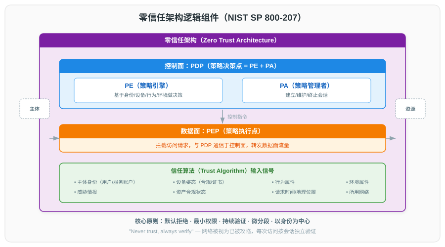
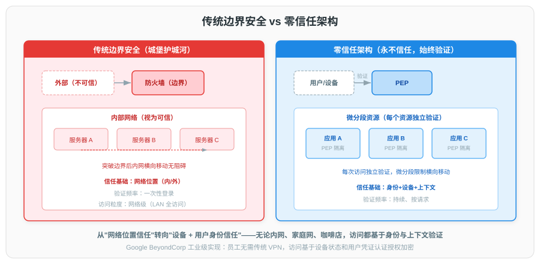
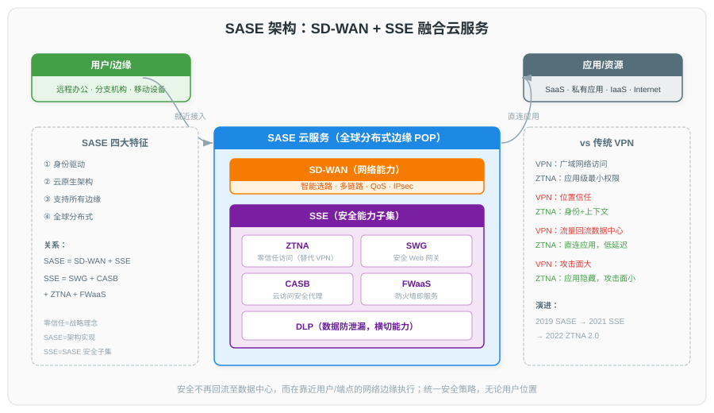

# 零信任与 SASE 安全架构详解

## 一、概述

### 1.1 传统边界安全模型的局限

传统网络安全采用"城堡与护城河"（Castle-and-Moat）模型：以防火墙、VPN 构建硬化的网络边界，内部网络默认可信，外部网络默认不可信。该模型在云计算、移动办公、SaaS 普及的背景下暴露出根本性缺陷：

| 问题类别 | 描述 |
|------|------|
| **边界模糊** | 业务上云、BYOD、远程办公使"内部网络"边界消失，边界设备无法覆盖所有访问路径 |
| **横向移动风险** | 一旦攻击者突破边界，内部网络扁平互通，可快速横向扩散至核心资产 |
| **过度信任内部** | 内部用户默认获得广泛网络访问权限，权限与身份、设备状态、行为上下文脱钩 |
| **VPN 暴露面大** | VPN 将远程用户整体接入内网，授予网络层而非应用层访问权限，违背最小权限原则 |
| **静态策略失效** | 基于 IP/网段的访问策略无法感知用户身份、设备健康度、行为风险等动态信号 |

### 1.2 零信任的定义与起源

**定义（NIST SP 800-207）**：零信任是一种网络安全范式，其核心假设是**不在任何隐式信任的基础上授予访问权限**，无论访问主体位于网络边界内外，都必须基于身份、设备状态与行为上下文进行持续验证与授权。

**起源脉络**：

| 时间 | 事件 |
|------|------|
| 2010 | Forrester 分析师 John Kindervag 提出"Zero Trust"概念，主张以身份为中心重新设计安全模型 |
| 2014 | Google 发表 BeyondCorp 系列论文（共 6 篇，2014–2019），公开其内部零信任实践 |
| 2017-08 | NIST 发布 SP 800-207 草案，零信任架构标准化工作启动 |
| 2020-02 | NIST 正式发布 SP 800-207《Zero Trust Architecture》，确立七大原则与逻辑组件模型 |
| 2021-05 | 美国总统行政令 14028《Improving the Nation's Cybersecurity》要求联邦机构推进零信任 |
| 2022-01 | CISA 发布《Zero Trust Maturity Model》v1.0，定义五大支柱与三大成熟度级别 |
| 2022-09 | 美国白宫发布 OMB M-22-17 与《Federal Zero Trust Strategy》，要求联邦机构 2024 财年前达成零信任目标 |
| 2023-04 | CISA 发布 ZTMM v2.0，引入"7 大支柱 + 3 个横切能力" |

### 1.3 NIST SP 800-207 七大原则

NIST SP 800-207 是零信任架构的权威基准，定义了七条核心原则（Tenets）：

| 编号 | 原则 | 说明 |
|------|------|------|
| T1 | 所有数据源与计算服务皆视为资源 | 网络中的设备、API、数据、算力等均纳入资源管理范畴，不区分内外 |
| T2 | 无论网络位置如何，所有通信均需安全加密 | 内部通信不因位置获得信任，必须使用 TLS/mTLS 等加密机制 |
| T3 | 资源访问授权基于单次会话动态进行 | 授权不长期固化，每次访问基于实时上下文重新评估 |
| T4 | 访问决策基于客户端身份、应用/服务、行为上下文 | 信号包括用户身份、设备健康度、地理位置、时间、行为模式等 |
| T5 | 企业持续监控并测量所有资产的完整性与安全姿态 | 设备合规性、漏洞状态、配置基线持续校验 |
| T6 | 所有资源认证与授权动态执行，严格在访问允许前完成 | 不存在隐式信任区，每次访问前必须完成完整认证授权链路 |
| T7 | 企业收集尽可能多的资产、网络、通信状态信息以改进安全态势 | 日志、遥测数据持续汇聚，反哺策略引擎优化 |

---

## 二、零信任架构

### 2.1 逻辑组件

NIST SP 800-207 定义零信任架构的三大逻辑组件：**策略引擎（PE）**、**策略管理员（PA）**、**策略执行点（PEP）**，配合身份源、设备数据库等辅助组件共同工作。



**组件职责**：

| 组件 | 全称 | 职责 | 部署位置 |
|------|------|------|----------|
| **PE** | Policy Engine | 决策大脑：基于信任算法综合各信号源，输出"允许/拒绝/需附加验证"策略决策 | 控制平面 |
| **PA** | Policy Administrator | 会话管理：根据 PE 决策向 PEP 下发令牌、建立/关闭会话、维持访问令牌生命周期 | 控制平面 |
| **PEP** | Policy Enforcement Point | 执行前端：位于客户端与资源之间，强制执行 PA 的策略决策，拦截、鉴权、转发流量 | 数据平面 |

**辅助信息源**：

| 信号源 | 提供信息 | 典型实现 |
|------|------|----------|
| **CDM（持续诊断与缓解）系统** | 设备清单、漏洞状态、配置基线 | Tenable、Qualys |
| **威胁情报源** | IOC、IP 信誉、攻击模式 | STIX/TAXII 订阅 |
| **SIEM/SOAR** | 安全事件、行为日志、关联分析 | Splunk、Microsoft Sentinel |
| **设备数据库** | 设备资产元数据、MDM 合规状态 | Jamf、Intune |
| **身份源** | 用户身份、组织结构、属性 | Okta、Azure AD、Active Directory |
| **行为分析** | 用户与实体行为分析（UEBA）异常评分 | Exabeam、Azure Identity Protection |

### 2.2 信任算法

信任算法（Trust Algorithm, TA）是 PE 的核心，将多源信号融合为单一的信任评分，与访问策略阈值比较后输出决策：

```
信任评分 = w1 × 身份置信度
         + w2 × 设备合规度
         + w3 × 行为风险评分
         + w4 × 上下文置信度（位置/时间/网络）
         - w5 × 威胁情报风险值

决策逻辑：
  if 信任评分 ≥ 授予阈值:        允许访问
  elif 信任评分 ≥ 附加验证阈值:  触发 MFA/步进验证
  else:                          拒绝访问
```

权重（w1…w5）由策略动态配置，不同资源可设置不同阈值（如核心财务系统要求评分 ≥ 0.9，普通文档系统 ≥ 0.6）。

### 2.3 部署模式

NIST SP 800-207 描述三种主流部署模式：

| 模式 | 工作机制 | 优势 | 劣势 | 典型场景 |
|------|---------|------|------|---------|
| **基于设备代理** | 终端 Agent 拦截流量，与 PE/PA 通信完成鉴权后直连资源 | 端到端加密、延迟低、用户体验好 | 终端需安装代理，覆盖度依赖 MDM | 全员 BYOD/托管设备 |
| **基于资源门户** | 用户通过统一门户登录，PEP 在资源前置反向代理 | 无需终端代理，跨平台兼容 | 资源需通过 HTTP/S 暴露，非 Web 协议支持有限 | SaaS 应用、内部 Web 系统 |
| **沙箱/隔离环境** | 资源运行在隔离环境（如 Browser Isolation），数据不落地终端 | 数据不落地，防泄密最强 | 性能损耗大，用户体验受限 | 高敏感数据访问、第三方协作 |

### 2.4 与传统边界模型对比



| 维度 | 传统边界模型 | 零信任模型 |
|------|------------|-----------|
| **信任基础** | 网络位置（内外网） | 身份 + 设备 + 上下文 |
| **认证频率** | 一次登录长期有效 | 每次会话动态评估 |
| **授权粒度** | 网络段（VLAN/子网） | 应用、API、数据级 |
| **内部通信** | 默认明文，内部互信 | 强制 mTLS，零信任内网 |
| **横向移动** | 一旦突破边界，内网畅通 | 微分段隔离，东向流量受控 |
| **远程访问** | VPN 接入内网，授予网络层权限 | ZTNA 应用级访问，最小权限 |
| **失效响应** | 依赖边界设备告警 | 持续监控，会话可即时撤销 |

---

## 三、Google BeyondCorp

### 3.1 论文系列

Google BeyondCorp 是业界首个大规模落地的零信任实践，其经验以 6 篇 USENIX ;login: 文章公开（2014–2019），构成零信任工程化的关键参考：

| 编号 | 标题 | 发表时间 | 核心贡献 |
|------|------|---------|---------|
| 1 | 《BeyondCorp: A New Approach to Enterprise Security》 | 2014-12 | 提出整体架构与设计理念 |
| 2 | 《BeyondCorp: Design to Deployment at Google》 | 2016-01 | 工程化落地经验与迭代历程 |
| 3 | 《BeyondCorp: The Access Proxy》 | 2016-08 | 访问代理（GAP）设计与实现 |
| 4 | 《Migrating to BeyondCorp: Maintaining Productivity While Increasing Security》 | 2017-08 | 迁移策略与用户体验平衡 |
| 5 | 《BeyondCorp: The User Experience》 | 2018-08 | 端用户视角的设计考量 |
| 6 | 《BeyondCorp 6: BeyondCorp at the Edge》 | 2019-08 | 边缘部署与全球分发 |

### 3.2 架构组件

BeyondCorp 的核心组件对应 NIST 模型的 PE/PA/PEP，并加入了设备与身份的精细化管理：

| 组件 | 功能 | 对应 NIST 角色 |
|------|------|---------------|
| **Device Inventory Database** | 持续采集设备资产元数据与安全状态 | 设备数据库 |
| **Device Trust** | 基于设备清单计算设备信任评分 | 信号源 |
| **Trust Broker** | 综合设备、用户、上下文信号生成最终决策 | PE + PA |
| **Access Proxy** | 前置反向代理，强制鉴权、转发流量至后端应用 | PEP |
| **User Authentication & Trust** | 基于 SSO 的用户身份与信任评估 | 身份源 |
| **Authorization Engine** | 应用级授权策略执行 | PA |

**关键设计要点**：

- 设备清单通过 MDM + 配置管理工具持续上报，设备信任分动态更新；
- 用户身份基于 Google SSO（基于 SAML/OAuth 2.0），与 MFA 紧密集成；
- 访问代理对每个 HTTP 请求执行设备/用户信任校验，授权后通过 mTLS 转发至后端；
- 所有访问决策与流量日志汇入 SIEM，支撑持续审计与策略优化。

---

## 四、SASE 架构

### 4.1 Gartner 定义与演进

**SASE（Secure Access Service Edge，安全访问服务边缘）** 由 Gartner 在 2019 年报告《The Future of Network Security in the Cloud》中首次提出，将广域网与网络安全能力融合为云原生服务。

**SASE 演进脉络**：

| 时间 | 事件 |
|------|------|
| 2019-08 | Gartner 提出 SASE 概念，定义 SD-WAN + SSE 融合架构 |
| 2021-03 | Gartner 发布《SSE Magic Quadrant》，将 SSE 从 SASE 中独立评估 |
| 2022 | 主要厂商（Zscaler、Palo Alto Prisma、Netskope、Cisco Umbrella）SSE 产品成熟 |
| 2023 | SASE 与 ZTNA、SSE 三者融合加速，单供应商平台成为主流 |

### 4.2 SD-WAN + SSE 融合



SASE 的核心是将**网络连接能力（SD-WAN）**与**安全服务能力（SSE）**融合为统一云服务，用户与边缘通过最近 PoP 接入，所有流量在 PoP 内完成安全检测后转发至应用：

| 能力层 | 子能力 | 说明 |
|------|------|------|
| **网络层（SD-WAN）** | 智能选路、链路聚合、QoS | 多链路动态选路，按应用 SLA 优化转发路径 |
| **安全层（SSE）** | ZTNA、SWG、CASB、FWaaS、DLP | 见 4.3 节 |
| **管理与策略层** | 统一策略编排、单一控制台 | 身份、设备、应用、网络策略统一管理 |

**对比传统 VPN + MPLS 模式**：

| 维度 | 传统 MPLS + VPN + 安全设备栈 | SASE |
|------|----------------------------|------|
| **回传路径** | 分支流量回传数据中心检测 | 就近 PoP 检测，直达云应用 |
| **部署周期** | 数周（专线、设备采购） | 数小时（PoP 接入） |
| **扩展性** | 设备堆叠，线性扩容 | 云原生弹性扩容 |
| **策略一致性** | 多设备分散配置 | 单一策略平面统一编排 |
| **TCO** | 高（专线 + 硬件 + 运维） | 低（订阅制） |

### 4.3 SSE 核心组件

SSE（Security Service Edge）是 SASE 的安全子集，由 Gartner 在 2021 年独立定义，包含五大核心能力：

| 组件 | 全称 | 核心功能 | 典型场景 |
|------|------|---------|---------|
| **ZTNA** | Zero Trust Network Access | 应用级零信任访问，替代 VPN | 远程办公、第三方协作、特权访问 |
| **SWG** | Secure Web Gateway | 出向 Web 流量过滤、URL 过滤、恶意软件检测 | 防钓鱼、防恶意下载、合规审计 |
| **CASB** | Cloud Access Security Broker | SaaS 应用影子 IT 发现、数据策略执行、API 风险控制 | SaaS 治理、数据防泄露、合规审计 |
| **FWaaS** | Firewall as a Service | 云原生防火墙，东西向与南北向流量访问控制 | 替代分支硬件防火墙、跨云流量过滤 |
| **DLP** | Data Loss Prevention | 数据指纹识别、敏感内容外发控制 | 客户信息、源代码、财务数据防泄露 |

---

## 五、ZTNA

### 5.1 与 VPN 的区别

ZTNA（Zero Trust Network Access）是 SSE/SASE 的核心组件，旨在以应用级、最小权限的访问模型替代传统 VPN：

| 维度 | 传统 VPN | ZTNA |
|------|---------|------|
| **授权粒度** | 网络层（接入内网即可访问整个子网） | 应用层（仅授权特定应用/端口） |
| **信任模型** | 接入后隐式信任 | 每会话动态验证身份、设备、上下文 |
| **暴露面** | 应用对内网开放，VPN 凭证成攻击目标 | 应用对外不可见，仅通过代理可达（隐藏攻击面） |
| **横向移动** | 一旦接入内网可扫描横向主机 | 默认拒绝所有横向流量 |
| **用户体验** | 连接重、断线频繁、跨地域延迟高 | 应用级连接，就近 PoP 接入，延迟低 |
| **管理复杂度** | 网络策略与防火墙规则耦合 | 基于身份的应用策略，集中编排 |

### 5.2 ZTNA 1.0 vs ZTNA 2.0

Gartner 在 2022 年提出 ZTNA 2.0 框架，弥补 1.0 的局限性：

| 维度 | ZTNA 1.0 | ZTNA 2.0 |
|------|---------|---------|
| **认证时机** | 连接建立时一次认证 | 持续评估，行为变化触发重认证 |
| **授权模型** | 应用级授权（二元允许/拒绝） | 应用 + 操作级（读/写/执行分别授权） |
| **流量检测** | 仅认证不检测应用层流量 | 集成 DLP、SWG 能力，检测应用层内容 |
| **设备合规** | 接入时检查 | 持续监控设备健康度，违规立即断开 |
| **第三方访问** | 需为第三方单独部署 | 统一身份平面，B2B 协作原生支持 |
| **典型代表** | 早期 ZTNA 产品（如 Zscaler Private Access 1.x） | Zscaler ZPA 2.x、Netskope ZTNA Next Gen、Cloudflare Access |

---

## 六、相关安全组件

### 6.1 mTLS（双向 TLS）

mTLS（mutual TLS）在 TLS 握手阶段要求**双方互相验证证书**，是零信任内部通信的基石：

| 阶段 | TLS 1.2 单向 | TLS 1.2 mTLS |
|------|------------|--------------|
| ClientHello | 客户端发起握手 | 同左 |
| Server Certificate | 服务器发送证书 | 同左 |
| ServerKeyExchange | 可选 | 同左 |
| **CertificateRequest** | 不发送 | 服务器请求客户端证书 |
| **Client Certificate** | 不发送 | 客户端发送证书 |
| ClientKeyExchange | 客户端协商密钥 | 同左 |
| Finished | 握手完成 | 握手完成 |

**在零信任中的应用**：
- 服务网格（Istio/Linkerd）默认对网格内通信启用 mTLS；
- SPIFFE/SPIRE 为工作负载签发 SVID 作为客户端身份；
- 零信任代理（如 Cloudflare Access、Google BeyondCorp Access Proxy）使用 mTLS 验证设备证书。

### 6.2 微分段

微分段（Microsegmentation）将网络划分为细粒度隔离区域，每个工作负载独立策略，是零信任"东向流量控制"的关键技术：

| 实现层级 | 机制 | 典型产品 |
|---------|------|---------|
| **网络层** | 基于 VLAN/ACL | 传统数据中心交换机 |
| **主机层** | 基于主机防火墙（iptables/eBPF） | Illumio、Guardicore（Akamai） |
| **云原生层** | 基于 K8s NetworkPolicy / Cilium | Cilium、Calico、Antrea |
| **服务网格层** | 基于 Sidecar mTLS + 授权策略 | Istio AuthorizationPolicy |

**与传统分段的对比**：

| 维度 | 传统分段 | 微分段 |
|------|---------|--------|
| 隔离粒度 | VLAN/子网级 | 工作负载/Pod/进程级 |
| 策略维度 | IP/端口 | 身份/标签/命名空间 |
| 跨云支持 | 受限 | 原生支持 |
| 动态性 | 静态配置 | 跟随工作负载动态生效 |

### 6.3 身份协议

零信任以身份为新边界，需依赖成熟的标准身份协议：

| 协议 | 定位 | 关键特性 | 典型场景 |
|------|------|---------|---------|
| **SAML 2.0** | 跨域 SSO 联邦 | 基于 XML 断言，浏览器重定向 | 企业 IdP → SaaS 应用 SSO |
| **OAuth 2.0** | 授权框架 | 授权码、客户端凭证、刷新令牌 | API 授权、第三方应用访问 |
| **OIDC** | OAuth 2.0 的身份层扩展 | 基于 JWT 的 ID Token | 现代 Web/移动应用 SSO |
| **JWT** | 令牌格式 | 紧凑、自包含、可签名 | 微服务间身份传递 |
| **SCIM 2.0** | 用户 provisioning 协议 | 跨系统用户/组同步 | IdP 与应用间账号自动同步 |

### 6.4 SPIFFE/SPIRE

**SPIFFE（Secure Production Identity Framework for Everyone）** 由 CNCF 于 2018 年发起，为云原生工作负载提供统一身份框架：

| 组件 | 角色 | 说明 |
|------|------|------|
| **SPIFFE ID** | 身份 URI | 形如 `spiffe://example.com/ns/default/sa/myapp` |
| **SVID** | 身份凭证 | SPIFFE ID 的可加密验证载体，支持 X.509 与 JWT 两种格式 |
| **SPIRE** | 实现参考 | SPIFFE 的开源实现，含 Server（签发）+ Agent（工作负载注册）|
| **Workload API** | 工作负载接口 | 工作负载通过 Unix socket 获取 SVID 与信任Bundle |

**与 K8s ServiceAccount 的区别**：

| 维度 | K8s ServiceAccount | SPIFFE |
|------|-------------------|--------|
| **身份作用域** | 命名空间内 | 跨集群、跨云、跨运行时 |
| **凭证形式** | JWT（API Server 签发） | X.509 SVID 或 JWT SVID |
| **自动轮转** | 长期有效 | 短期凭证，自动轮转（默认 1 小时） |
| **跨平台** | K8s 专属 | 容器、虚拟机、裸机统一支持 |

---

## 七、应用场景与演进趋势

### 7.1 典型应用场景

| 场景 | 痛点 | 零信任/SASE 解决方案 |
|------|------|--------------------|
| **远程办公** | VPN 性能瓶颈、暴露面大 | ZTNA 应用级访问，就近 PoP 接入 |
| **混合云/多云** | 跨云流量不可见、策略分散 | SASE 统一策略平面，FWaaS 跨云控制 |
| **SaaS 治理** | 影子 IT、数据外泄风险 | CASB 发现与管控、DLP 内容检测 |
| **第三方协作** | 第三方接入内网风险高 | ZTNA 2.0 B2B 协作，最小权限临时授权 |
| **特权访问** | 管理员凭证成攻击目标 | JIT（Just-In-Time）授权 + 全程会话录像 |
| **微服务间通信** | 内部服务默认互信 | mTLS + 服务网格授权策略 + SPIFFE 身份 |

### 7.2 成熟度模型

CISA ZTMM v2.0 定义五大支柱与三个成熟度级别：

| 支柱 | 传统 | 初始 | 高级 |
|------|------|------|------|
| **身份** | 静态 AD 账户 | 集中 IdP + MFA | 持续身份验证 + UEBA |
| **设备** | 手动盘点 | MDM 注册 | 持续合规校验 + 自动隔离 |
| **网络** | VPN + 防火墙 | ZTNA 试点 | 全 ZTNA + 微分段 |
| **应用与工作负载** | 应用对所有内网开放 | 应用前置代理 | 持续授权 + API 级管控 |
| **数据** | 静态加密 | DLP 部署 | 数据分类自动化 + 全链路管控 |

### 7.3 演进趋势

| 趋势 | 说明 |
|------|------|
| **平台化整合** | SASE/SSE/ZTNA 趋向单供应商平台，减少多产品集成复杂度 |
| **AI 驱动决策** | 信任算法引入 ML 模型，提升异常检测与策略自适应能力 |
| **DPU 加速** | NVIDIA BlueField 等 DPU 承担 mTLS 加解密、策略执行，CPU 卸载 |
| **eBPF 原生观测** | 基于 eBPF 的零信任代理实现无 Sidecar 的工作负载身份与策略执行 |
| **Zero Trust + 5G/边缘** | 5G 网络切片与 SASE PoP 结合，提供切片级零信任接入 |
| **标准互通** | SPIFFE、OpenZTNA、Gateway API 等开放标准推动跨厂商互通 |

---

## 八、参考资料

### 8.1 官方标准与白皮书

1. NIST. *SP 800-207 Zero Trust Architecture*. [https://nvlpubs.nist.gov/nistpubs/SpecialPublications/NIST.SP.800-207.pdf](https://nvlpubs.nist.gov/nistpubs/SpecialPublications/NIST.SP.800-207.pdf)
2. CISA. *Zero Trust Maturity Model v2.0*. [https://www.cisa.gov/sites/default/files/2023-04/zero_trust_maturity_model_v2_0_508.pdf](https://www.cisa.gov/sites/default/files/2023-04/zero_trust_maturity_model_v2_0_508.pdf)
3. The White House. *Executive Order 14028 on Improving the Nation's Cybersecurity*. [https://www.whitehouse.gov/briefing-room/presidential-actions/2021/05/12/executive-order-on-improving-the-nations-cybersecurity/](https://www.whitehouse.gov/briefing-room/presidential-actions/2021/05/12/executive-order-on-improving-the-nations-cybersecurity/)
4. OMB. *M-22-17 Federal Zero Trust Strategy*. [https://www.whitehouse.gov/wp-content/uploads/2022/01/M-22-17.pdf](https://www.whitehouse.gov/wp-content/uploads/2022/01/M-22-17.pdf)
5. Gartner. *Hype Cycle for Network Security, 2023*. [https://www.gartner.com/en/documents/4006523](https://www.gartner.com/en/documents/4006523)

### 8.2 Google BeyondCorp 系列

6. Ward, R., Beyer, B. *BeyondCorp: A New Approach to Enterprise Security*. USENIX ;login: Vol. 39 No. 6. [https://www.usenix.org/system/files/login/articles/login_dec14_02_ward.pdf](https://www.usenix.org/system/files/login/articles/login_dec14_02_ward.pdf)
7. Osborn, B. et al. *BeyondCorp: Design to Deployment at Google*. ;login: Vol. 41 No. 1. [https://www.usenix.org/system/files/login/articles/login_winter16_02_osborn.pdf](https://www.usenix.org/system/files/login/articles/login_winter16_02_osborn.pdf)
8. Beyer, B. et al. *BeyondCorp: The Access Proxy*. ;login: Vol. 41 No. 3. [https://www.usenix.org/system/files/login/articles/login_summer16_02_beyer.pdf](https://www.usenix.org/system/files/login/articles/login_summer16_02_beyer.pdf)
9. Peck, M. et al. *BeyondCorp 6: BeyondCorp at the Edge*. ;login: Vol. 44 No. 3. [https://www.usenix.org/system/files/login/articles/login_summer19_07_peck.pdf](https://www.usenix.org/system/files/login/articles/login_summer19_07_peck.pdf)

### 8.3 协议与开源规范

10. IETF. *RFC 6749 The OAuth 2.0 Authorization Framework*. [https://www.rfc-editor.org/rfc/rfc6749](https://www.rfc-editor.org/rfc/rfc6749)
11. IETF. *RFC 7519 JSON Web Token (JWT)*. [https://www.rfc-editor.org/rfc/rfc7519](https://www.rfc-editor.org/rfc/rfc7519)
12. OASIS. *SAML V2.0 Core Specification*. [https://docs.oasis-open.org/security/saml/v2.0/saml-core-2.0-os.pdf](https://docs.oasis-open.org/security/saml/v2.0/saml-core-2.0-os.pdf)
13. OpenID Foundation. *OpenID Connect Core 1.0*. [https://openid.net/specs/openid-connect-core-1_0.html](https://openid.net/specs/openid-connect-core-1_0.html)
14. IETF. *RFC 7644 System for Cross-domain Identity Management (SCIM) Protocol*. [https://www.rfc-editor.org/rfc/rfc7644](https://www.rfc-editor.org/rfc/rfc7644)
15. CNCF SPIFFE Project. *SPIFFE Specification*. [https://github.com/spiffe/spiffe/blob/main/standards/SPIFFE.md](https://github.com/spiffe/spiffe/blob/main/standards/SPIFFE.md)

### 8.4 厂商实践与产品文档

16. Zscaler. *ZTNA 2.0: The Next Generation of Zero Trust Network Access*. [https://www.zscaler.com/resources/industry-analyst-reports/ztna-2-next-generation-zero-trust-network-access.pdf](https://www.zscaler.com/resources/industry-analyst-reports/ztna-2-next-generation-zero-trust-network-access.pdf)
17. Cloudflare. *Cloudflare Access — Zero Trust Access for Your Applications*. [https://developers.cloudflare.com/cloudflare-one/](https://developers.cloudflare.com/cloudflare-one/)
18. Palo Alto Networks. *Prisma Access SASE Datasheet*. [https://www.paloaltonetworks.com/apps/pan/public/downloadResource?pagePath=/content/pan/en_US/resources/datasheets/prisma-access](https://www.paloaltonetworks.com/apps/pan/public/downloadResource?pagePath=/content/pan/en_US/resources/datasheets/prisma-access)
19. Istio. *Istio Security Best Practices*. [https://istio.io/latest/docs/ops/best-practices/security/](https://istio.io/latest/docs/ops/best-practices/security/)
20. Cilium. *Cilium NetworkPolicy & ClusterMesh*. [https://docs.cilium.io/](https://docs.cilium.io/)
