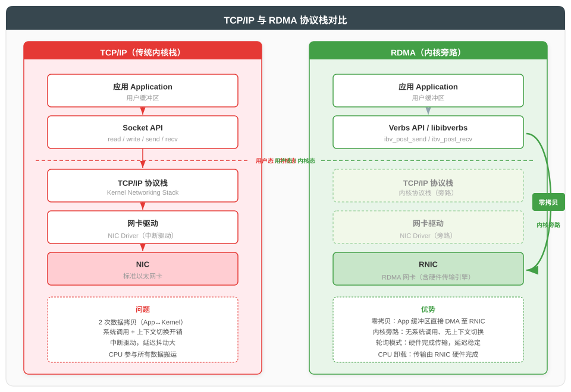
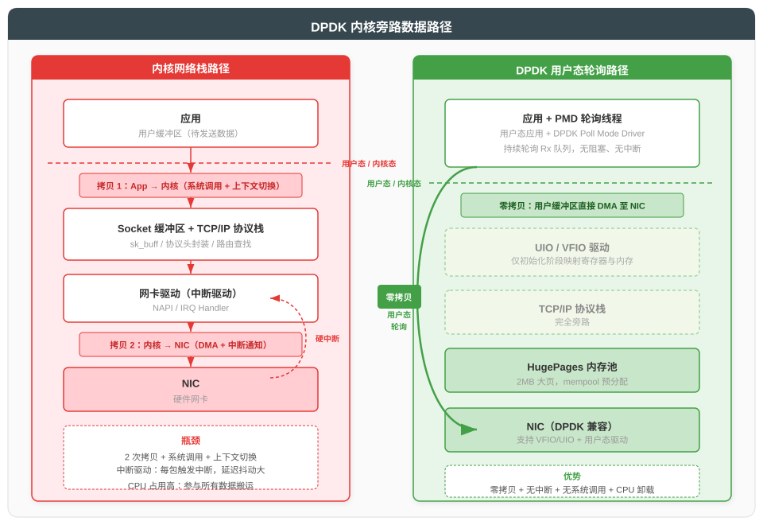
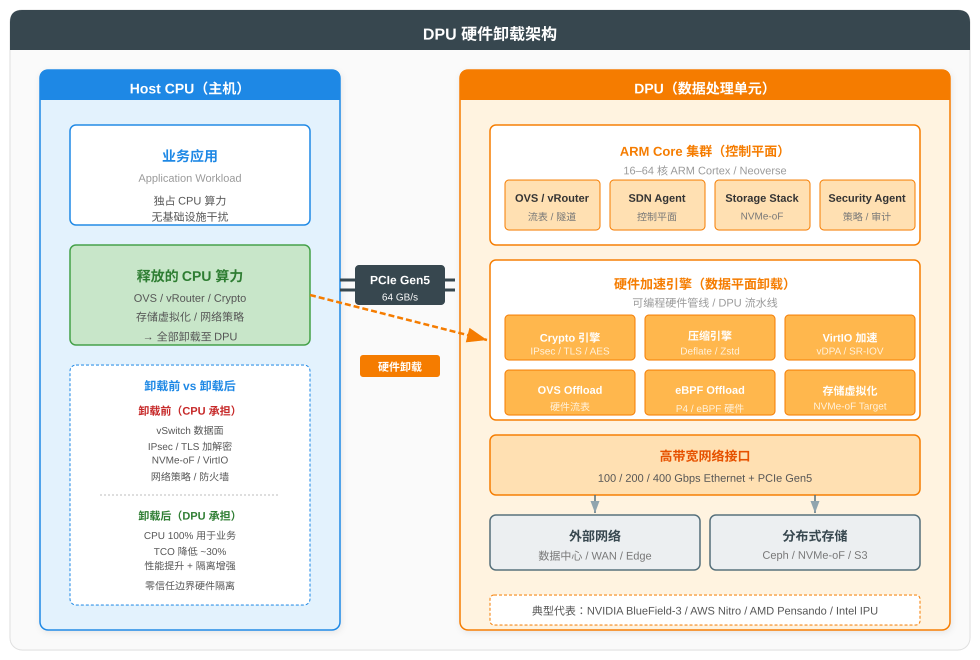

# 高性能网络技术详解

## 一、概述

### 1.1 内核网络栈的性能瓶颈

传统 Linux 内核网络栈以通用性为目标，在每秒千万级包（10–40 Gbps+）的高吞吐场景下暴露出固有瓶颈：

| 瓶颈类别 | 根因 | 表现 |
|---------|------|------|
| **数据拷贝** | App 与内核之间需两次拷贝（App↔Kernel、Kernel↔NIC） | CPU 占用高、内存带宽浪费 |
| **系统中断** | 每包触发硬中断 + 软中断（NET_RX） | 上下文切换开销大、延迟抖动 |
| **协议栈开销** | sk_buff 分配/释放、协议头封装、路由查找 | 每包微秒级处理延迟 |
| **缓存不友好** | sk_buff 频繁分配导致 cache miss | CPU 流水线停顿 |
| **锁竞争** | 多核并行收包时队列锁竞争 | 扩展性受限，核数增加性能不线性提升 |

### 1.2 高性能网络技术谱系

为突破上述瓶颈，业界发展出多条技术路线，可归为三大类：

| 类别 | 代表技术 | 核心思想 |
|------|---------|---------|
| **内核旁路（Bypass Kernel）** | RDMA、DPDK、AF_XDP | 数据不经过内核协议栈，直接在用户态与网卡间传输 |
| **协议栈优化（Optimize Stack）** | XDP、io_uring、VPP | 在内核中早期丢弃（early drop）或在用户态实现向量化协议栈 |
| **硬件卸载（Hardware Offload）** | SR-IOV、SmartNIC、DPU | 将网络/存储/安全任务卸载至专用硬件 |

---

## 二、RDMA 远程直接内存访问

### 2.1 核心思想：内核旁路与零拷贝

**RDMA（Remote Direct Memory Access，远程直接内存访问）** 允许一台计算机直接读写另一台计算机的内存，无需操作系统介入，实现**零拷贝**与**内核旁路**。



**三大核心特征**：

| 特征 | 说明 |
|------|------|
| **零拷贝（Zero-Copy）** | 应用缓冲区通过 DMA 直接与网卡交互，无 App↔Kernel 间的数据拷贝 |
| **内核旁路（Kernel Bypass）** | 应用通过 Verbs API 直接驱动网卡，无系统调用、无上下文切换 |
| **消息语义** | 直接以消息为单位传输，无需 TCP 的字节流拼接 |

**性能对比**：

| 指标 | TCP/IP（内核栈） | RDMA |
|------|-----------------|------|
| 延迟 | 50–100 μs | 1–3 μs（RDMA Write） |
| 吞吐 | ~10 Gbps（单核） | 100–400 Gbps |
| CPU 占用 | 高（每包参与搬运） | 极低（硬件完成） |
| 拷贝次数 | 2 次 | 0 次 |

### 2.2 三大协议：InfiniBand / RoCEv2 / iWARP

RDMA 有三种底层网络协议实现，由 IBTA（InfiniBand Trade Association）与 IETF 分别标准化：

| 协议 | 标准化组织 | 链路层 | 部署成本 | 互通性 | 典型场景 |
|------|-----------|--------|---------|--------|---------|
| **InfiniBand** | IBTA | 专用 IB 链路 | 高（专用交换机/线缆） | 仅 IB 网络互通 | HPC、AI 训练集群 |
| **RoCEv2** | IBTA | 以太网（UDP/IP 封装） | 中（支持现有以太网） | 跨 L3 网络互通 | AI/ML、存储、金融低延迟 |
| **iWARP** | IETF | 以太网（TCP 封装） | 中 | 跨 L3 网络互通 | 企业存储（部署较少） |

**RoCEv2 封装格式**：

```
+--------+--------+--------+--------+--------+
| 以太网 | IP     | UDP    | IB BTH | RDMA 载荷 |
| (L2)   | (L3)   | Dst=4791| (传输头)| (Payload)|
+--------+--------+--------+--------+--------+
```

- UDP 目的端口 **4791** 为 RoCEv2 标识；
- BTH（Base Transport Header）携带 QPN、PSN 等 IB 语义字段；
- 通过 PFC（Priority Flow Control）+ ECN 实现无损以太网，确保 RoCEv2 可靠性。

### 2.3 RDMA 操作类型

RDMA 提供四种基本数据传输操作，对应不同的语义与 CPU 参与程度：

| 操作 | 方向 | CPU 介入 | 语义 |
|------|------|---------|------|
| **SEND/RECV** | 双向 | 收方 CPU 介入 | 类似 Socket，收方需预先 post receive buffer |
| **WRITE** | 单向（写远端） | 零 CPU | 直接写入远端内存，远端 CPU 完全不感知 |
| **READ** | 单向（读远端） | 零 CPU | 直接读取远端内存，远端 CPU 完全不感知 |
| **ATOMIC** | 单向 | 零 CPU | 原子 CAS/Fetch-Add，用于分布式锁与同步 |

**性能排序**：WRITE（最优） > READ > SEND/RECV（最次）。AI 训练的梯度同步通常采用 RDMA WRITE + 通知机制。

### 2.4 Verbs API 编程模型

RDMA 应用通过 **Verbs API**（libibverbs）编程，核心抽象包括：

| 对象 | 说明 |
|------|------|
| **Context** | 设备上下文，对应一个 RNIC |
| **Protection Domain (PD)** | 隔离域，关联同一应用的资源 |
| **Memory Region (MR)** | 注册的内存区域，授予网卡 DMA 访问权限，含 L_Key/R_Key |
| **Queue Pair (QP)** | 队列对 = SQ（发送队列）+ RQ（接收队列），类似 Socket |
| **Completion Queue (CQ)** | 完成队列，QP 操作完成后产生 CQE 通知应用 |
| **Work Request (WR)** | 工作请求，应用通过 ibv_post_send 提交至 SQ |

**典型发送流程**：

```
1. ibv_reg_mr()      注册内存区，获取 L_Key/R_Key
2. ibv_post_send()   提交 WR 至 SQ，触发硬件 DMA
3. 轮询 CQ           等待 CQE，确认发送完成
```

---

## 三、DPDK 数据平面开发套件

### 3.1 核心机制：PMD 轮询 + 内核旁路

**DPDK（Data Plane Development Kit）** 是 Intel 于 2010 年开源、现由 Linux 基金会托管的高性能数据平面框架，通过**用户态轮询驱动（PMD）**与**内核旁路**实现线速包处理。



**三大核心机制**：

| 机制 | 说明 |
|------|------|
| **PMD（Poll Mode Driver）** | 用户态驱动持续轮询网卡 Rx 队列，无中断、无系统调用，CPU 100% 占用换取最低延迟 |
| **内核旁路** | 通过 UIO/VFIO 将网卡寄存器与内存映射至用户态，数据路径完全绕过内核 |
| **零拷贝** | 数据从网卡 DMA 直接至 HugePages 内存池，应用直接处理，无拷贝 |

### 3.2 关键技术组件

| 组件 | 作用 | 说明 |
|------|------|------|
| **HugePages** | 大页内存（默认 2MB） | 减少 TLB miss，提升内存访问效率 |
| **mempool** | 内存池预分配 | 避免运行时动态分配，固定对象大小 |
| **rte_ring** | 无锁环形队列 | 多核间无锁通信，基于 CAS 实现 |
| **VFIO** | 设备透传框架 | 将 PCIe 设备完整透传至用户态，支持 IOMMU 保护 |
| **UIO** | 用户态 I/O 框架 | 轻量级设备映射，不支持 IOMMU（早期方案） |
| **Flow Bifurcation** | 流量分流 | 部分流量走内核（控制面），部分走 DPDK（数据面） |

### 3.3 应用场景

| 场景 | 典型应用 | 说明 |
|------|---------|------|
| **NFV/vSwitch** | OVS-DPDK、VPP | 虚拟交换机数据面加速，单核 10–40 Gbps |
| **5G UPF** | FD.io VPP、OVS-DPDK | 用户面转发，5G 核心网关键组件 |
| **网络功能设备** | 防火墙、LB、IPS | 高吞吐安全设备数据面 |
| **高频交易** | 金融低延迟网络 | 微秒级延迟敏感场景 |
| **CDN/边缘** | 流量卸载 | 边缘节点高密度包处理 |

---

## 四、SmartNIC 与 DPU

### 4.1 概念辨析

| 概念 | 定义 | 侧重 |
|------|------|------|
| **SmartNIC** | 智能网卡，含可编程数据面（FPGA/ARM/P4） | 网络功能卸载 |
| **DPU** | Data Processing Unit，含 ARM 核心 + 硬件加速 + NIC | 网络+存储+安全综合卸载 |
| **IPU** | Intel 推出的 Infrastructure Processing Unit | 与 DPU 同义，Intel 品牌 |

**关系**：SmartNIC 是 DPU 的前身与子集。DPU 在 SmartNIC 基础上增加了通用 ARM 核心与完整软件栈，可独立运行控制平面。

### 4.2 DPU 架构



DPU 的典型架构包含三大层次：

| 层次 | 组件 | 职责 |
|------|------|------|
| **控制平面** | ARM Core 集群（16–64 核） | 运行 OVS/vRouter、SDN Agent、存储栈、安全 Agent |
| **数据平面（硬件加速）** | 可编程流水线 + 专用加速引擎 | Crypto、压缩、VirtIO、OVS Offload、eBPF、NVMe-oF |
| **网络接口** | 100/200/400 Gbps NIC | 高带宽以太网接口 |

**DPU 的核心价值**：将基础设施任务（vSwitch、IPsec、存储虚拟化、网络策略）从 Host CPU 卸载至 DPU，使 Host CPU 100% 用于业务应用。

### 4.3 典型产品对比

| 产品 | 厂商 | 架构特点 | 典型场景 |
|------|------|---------|---------|
| **BlueField-3** | NVIDIA | 16 核 ARM + 400Gbps + 可编程流水线 | 云计算、AI、零信任 |
| **Nitro** | AWS | 定制 ASIC + ARM，深度集成 EC2 | AWS 云原生（仅供 AWS 内部） |
| **Pensando DPU** | AMD | P4 可编程 ASIC + ARM | 智能交换、安全策略 |
| **Mount Evans** | Intel | 基于 FPGA 的 IPU | 灵活可编程场景 |
| **Fungible DPU** | Juniper | 定制 RISC-V + 数据处理单元 | 存储与网络统一卸载 |

### 4.4 应用场景

| 场景 | 卸载内容 | 收益 |
|------|---------|------|
| **云虚拟化** | OVS 数据面、VirtIO、存储后端 | CPU 释放 20–30% 给业务 VM |
| **零信任安全** | mTLS 加解密、网络策略、IDS/IPS | 安全与业务硬件隔离 |
| **分布式存储** | NVMe-oF Target、压缩、EC 计算 | 存储后端 CPU 卸载 |
| **5G UPF** | GTP-U 封装、QoS、流量分类 | 5G 用户面线速转发 |
| **Kubernetes 网络** | Cilium eBPF offload、网络策略 | Pod 间通信硬件加速 |

---

## 五、其他高性能网络技术

### 5.1 SR-IOV

**SR-IOV（Single Root I/O Virtualization）** 是 PCIe 标准的硬件虚拟化扩展，允许一块物理网卡呈现为多个虚拟功能（VF），每个 VF 可直接分配给虚拟机，绕过 vSwitch：

| 概念 | 说明 |
|------|------|
| **PF（Physical Function）** | 物理功能，完整的 PCIe 设备，由 Hypervisor 管理 |
| **VF（Virtual Function）** | 虚拟功能，轻量 PCIe 设备，分配给 VM，拥有独立队列 |
| **VF Driver** | VF 驱动，运行于 VM 内，直接访问 VF 硬件队列 |

**优势**：零 CPU 开销、线速性能、低延迟。
**劣势**：VF 数量有限（通常 64–256）、不支持 vSwitch 高级特性（如镜像、NetFlow）、热迁移困难。

### 5.2 XDP / AF_XDP

**XDP（eXpress Data Path）** 是 Linux 内核提供的高性能数据路径，允许 eBPF 程序在网卡驱动层（DMA 后、sk_buff 分配前）执行：

| 模式 | 说明 |
|------|------|
| **XDP native** | 网卡驱动原生支持，性能最优（10–20 Mpps/核） |
| **XDP generic** | 内核通用回退模式，性能较低 |
| **XDP offloaded** | 卸载至 SmartNIC 硬件执行（如 Netronome） |

**XDP 动作**：XDP_PASS、XDP_DROP、XDP_TX、XDP_REDIRECT、XDP_ABORTED。

**AF_XDP**：XDP 的用户态扩展，通过 XDP_REDIRECT 将包送至用户态 socket，性能接近 DPDK 但保留 Linux 内核生态。

**XDP vs DPDK**：

| 维度 | XDP | DPDK |
|------|-----|------|
| **依赖** | Linux 内核（≥4.8） | 独立用户态框架 |
| **网卡要求** | 支持驱动的网卡 | DPDK PMD 支持的网卡 |
| **性能** | 10–20 Mpps/核 | 30–50 Mpps/核 |
| **生态** | 与 Linux 内核无缝集成 | 完全旁路内核 |
| **适用场景** | DDoS 防护、负载均衡、防火墙 | NFV、vSwitch、UPF |

### 5.3 io_uring

**io_uring** 是 Linux 5.1+ 引入的异步 I/O 接口，通过共享内存的提交队列（SQ）与完成队列（CQ）实现零拷贝、无系统调用的异步 I/O：

| 特性 | 说明 |
|------|------|
| **共享内存环形队列** | SQ/CQ 位于内核与用户态共享内存，无需 syscall 提交请求 |
| **批量提交** | 一次 submit 一次 syscall 处理多个请求 |
| **Poll 模式** | 内核轮询模式（IORING_SETUP_SQPOLL），完全无 syscall |
| **网络支持** | Linux 5.7+ 支持 accept/recv/send 等网络操作 |

**性能对比**：相比传统 epoll，io_uring 在高并发短连接场景下 syscall 次数减少 80%+，延迟降低 30–50%。

### 5.4 VPP（Vector Packet Processor）

**VPP** 是 Cisco 开源、现由 FD.io 基金会托管的高性能用户态协议栈，采用**向量化处理**架构：

| 特性 | 说明 |
|------|------|
| **向量化处理** | 一次处理一批数据包（典型 256 个），充分利用 CPU cache 与流水线 |
| **图节点架构** | 包处理流程建模为有向图，节点间通过 next 指针连接 |
| **DPDK 集成** | 数据平面可基于 DPDK PMD 收包 |
| **可插件** | 支持运行时加载插件，扩展协议与功能 |

**典型场景**：5G UPF、vRouter、企业 vEdge、CNF（Cloud-native Network Function）。

---

## 六、性能对比与选型

### 6.1 技术性能对比

| 技术 | 延迟 | 吞吐（单核） | CPU 占用 | 开发复杂度 | 内核依赖 |
|------|------|------------|---------|-----------|---------|
| **内核网络栈** | 50–100 μs | 1–2 Mpps | 高 | 低 | 完全依赖 |
| **XDP** | 1–5 μs | 10–20 Mpps | 中 | 中 | 内核 eBPF |
| **AF_XDP** | 2–10 μs | 10–15 Mpps | 中 | 中 | 内核 + eBPF |
| **DPDK** | 0.5–2 μs | 30–50 Mpps | 高（PMD 100%） | 高 | 完全旁路 |
| **RDMA** | 1–3 μs | 100+ Gbps | 极低 | 高 | 完全旁路 |
| **io_uring** | 5–20 μs | 5–10 Mpps | 低 | 中 | Linux 5.1+ |
| **VPP** | 0.5–2 μs | 30–50 Mpps | 高 | 高 | 可选 DPDK |
| **DPU offload** | <1 μs | 200–400 Gbps | 零（Host CPU） | 中 | DPU 独立 |

### 6.2 选型矩阵

| 场景 | 推荐技术 | 理由 |
|------|---------|------|
| **AI 训练梯度同步** | RDMA（RoCEv2/IB） | 微秒级延迟、零 CPU 占用、GPU Direct RDMA |
| **5G UPF 用户面** | DPDK 或 VPP | 线速转发、灵活可编程 |
| **DDoS 防护** | XDP | 内核驱动层 early drop，无需旁路 |
| **vSwitch 数据面** | DPDK 或 DPU offload | 多租户高吞吐虚拟交换 |
| **金融高频交易** | RDMA + FPGA/DPU | 极致低延迟 |
| **K8s Pod 间通信** | Cilium eBPF/XDP | 与 K8s 生态深度集成 |
| **高并发短连接** | io_uring | 减少 syscall，异步 I/O |
| **零信任安全** | DPU offload | 硬件隔离 mTLS 与策略执行 |

---

## 七、应用场景与演进趋势

### 7.1 典型应用场景

| 场景 | 痛点 | 解决方案 |
|------|------|---------|
| **AI 大模型训练** | GPU 间梯度同步延迟敏感 | InfiniBand / RoCEv2 + GPU Direct RDMA |
| **5G 核心网** | UPF 用户面线速转发 | DPDK / VPP + SR-IOV |
| **云数据中心** | vSwitch 占用 Host CPU | DPU 卸载 OVS + VirtIO |
| **分布式存储** | NVMe-oF 后端 CPU 瓶颈 | DPU 卸载 NVMe-oF Target + EC 计算 |
| **零信任网络** | mTLS 加解密消耗 CPU | DPU 硬件加速 mTLS |
| **边缘计算** | 资源受限下高吞吐 | XDP 内核加速 + AF_XDP 用户态处理 |

### 7.2 演进趋势

| 趋势 | 说明 |
|------|------|
| **GPU Direct RDMA** | GPU 显存直接 RDMA，绕过 CPU，AI 训练标配 |
| **DPU 与零信任融合** | DPU 承担 mTLS、SPIFFE、网络策略，实现硬件级零信任 |
| **eBPF 与 DPU 协同** | eBPF 程序可卸载至 DPU 硬件执行，兼顾灵活性与性能 |
| **io_uring 网络化** | io_uring 网络栈持续完善，可能替代 epoll 成为默认网络 I/O |
| **CXL 与 RDMA 融合** | CXL.mem 提供缓存一致性的远程内存访问，与 RDMA 互补 |
| **P4 可编程数据面** | P4 程序运行于 DPU/Tofino，定义自定义协议处理流水线 |
| **云原生 NFV** | CNF（Cloud-native Network Function）基于 K8s + DPDK/VPP，替代传统 VNF |

---

## 八、参考资料

### 8.1 RDMA 与 InfiniBand

1. IBTA. *InfiniBand Architecture Specification Vol.1 Rev.1.5*. [https://www.infinibandta.org/ibta-specification-download/](https://www.infinibandta.org/ibta-specification-download/)
2. IBTA. *RoCEv2 Specification*. [https://infinibandta.org/wp-content/uploads/2019/07/RoCE-v2.0-1.2-2019.pdf](https://infinibandta.org/wp-content/uploads/2019/07/RoCE-v2.0-1.2-2019.pdf)
3. Linux RDMA Project. *libibverbs Verbs API Documentation*. [https://github.com/linux-rdma/rdma-core](https://github.com/linux-rdma/rdma-core)
4. NVIDIA. *RDMA Aware Networks Programming User Manual*. [https://docs.nvidia.com/networking/display/RDMAAwareProgrammingPuv220/RDMA+Aware+Networks+Programming+User+Manual](https://docs.nvidia.com/networking/display/RDMAAwareProgrammingPuv220/RDMA+Aware+Networks+Programming+User+Manual)
5. Linux Kernel. *Soft-RoCE (rxe) Documentation*. [https://docs.kernel.org/networking/device_drivers/ethernet/mellanox/mlx5.html](https://docs.kernel.org/networking/device_drivers/ethernet/mellanox/mlx5.html)

### 8.2 DPDK 与 VPP

6. DPDK Project. *DPDK Documentation*. [https://doc.dpdk.org/](https://doc.dpdk.org/)
7. DPDK Project. *DPDK Poll Mode Driver Architecture*. [https://doc.dpdk.org/guides/prog_guide/poll_mode_drv.html](https://doc.dpdk.org/guides/prog_guide/poll_mode_drv.html)
8. FD.io. *VPP Architecture Documentation*. [https://docs.fd.io/vpp/23.06/](https://docs.fd.io/vpp/23.06/)
9. Linux Kernel. *VFIO Documentation*. [https://docs.kernel.org/driver-api/vfio.html](https://docs.kernel.org/driver-api/vfio.html)

### 8.3 SmartNIC 与 DPU

10. NVIDIA. *BlueField-3 DPU Datasheet*. [https://www.nvidia.com/content/dam/en-zz/Solutions/Data-Center/documents/datasheet-nvidia-bluefield-3-dpu.pdf](https://www.nvidia.com/content/dam/en-zz/Solutions/Data-Center/documents/datasheet-nvidia-bluefield-3-dpu.pdf)
11. AWS. *AWS Nitro System*. [https://aws.amazon.com/ec2/nitro/](https://aws.amazon.com/ec2/nitro/)
12. AMD. *Pensando DPU Overview*. [https://www.amd.com/en/products/adaptive-socs-and-fpgas/pensando.html](https://www.amd.com/en/products/adaptive-socs-and-fpgas/pensando.html)
13. Intel. *Infrastructure Processing Unit (IPU)*. [https://www.intel.com/content/www/us/en/products/details/network-io/ipu.html](https://www.intel.com/content/www/us/en/products/details/network-io/ipu.html)
14. PCI-SIG. *SR-IOV Specification*. [https://pcisig.com/specifications/iov/](https://pcisig.com/specifications/iov/)

### 8.4 XDP / eBPF / io_uring

15. Linux Kernel. *XDP Documentation*. [https://docs.kernel.org/networking/xdp.html](https://docs.kernel.org/networking/xdp.html)
16. eBPF.io. *eBPF & XDP Developer Documentation*. [https://ebpf.io/](https://ebpf.io/)
17. Cilium Project. *Cilium eBPF Documentation*. [https://docs.cilium.io/](https://docs.cilium.io/)
18. Linux Kernel. *io_uring Documentation*. [https://docs.kernel.org/block/io_uring.html](https://docs.kernel.org/block/io_uring.html)
19. Jens Axboen. *io_uring Source Repository*. [https://github.com/axboe/liburing](https://github.com/axboe/liburing)

### 8.5 P4 与可编程数据面

20. P4 Language Consortium. *P4_16 Language Specification*. [https://p4.org/p4-spec/docs/P4-16-v1.2.2/spec.html](https://p4.org/p4-spec/docs/P4-16-v1.2.2/spec.html)
21. Intel. *Tofino Programmable Ethernet Switch ASIC*. [https://www.intel.com/content/www/us/en/products/network-io/programmable-ethernet-switch.html](https://www.intel.com/content/www/us/en/products/network-io/programmable-ethernet-switch.html)
